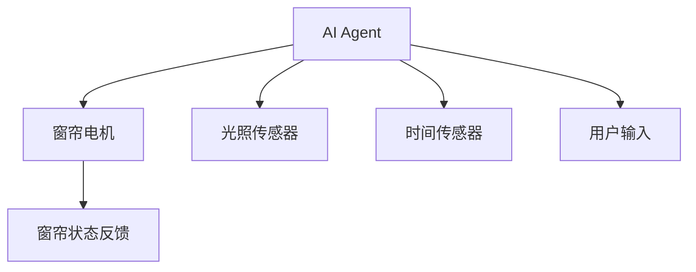
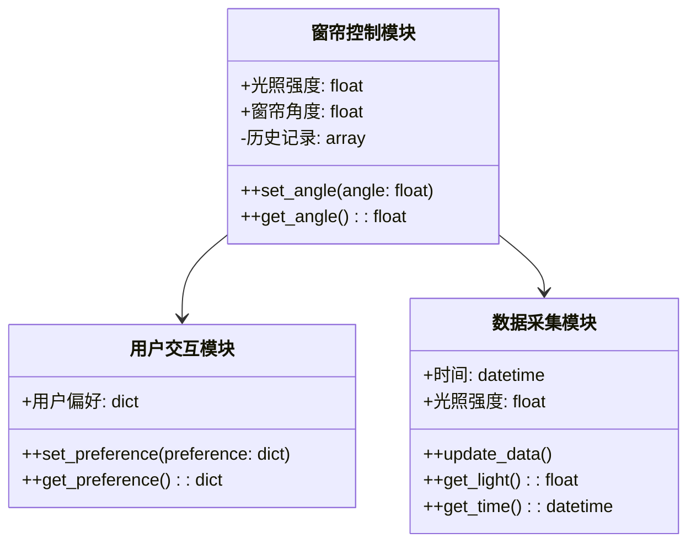
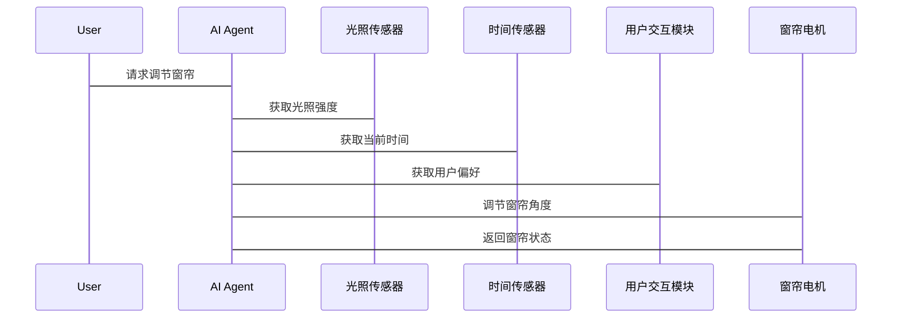

                 


# 智能窗帘：AI Agent的日光优化调节

> 关键词：智能窗帘、AI Agent、日光优化调节、算法实现、系统架构、强化学习、智能控制

> 摘要：本文探讨了智能窗帘在AI Agent技术下的日光优化调节，分析了其核心算法原理、系统架构设计、项目实战案例，并提出了最佳实践建议。

---

## 第1章: 传统窗帘的局限性

### 1.1 传统窗帘的功能特点

传统窗帘主要通过手动或机械方式调节开合，功能相对单一。常见的功能包括：
1. 手动拉合：用户通过手拉绳子或按钮控制窗帘的开合。
2. 电机驱动：部分高端窗帘采用电机驱动，支持远程控制开关。
3. 定时功能：部分产品支持简单的定时开关功能，但缺乏智能调节能力。

### 1.2 传统窗帘的使用痛点

传统窗帘在使用中存在诸多痛点：
1. **缺乏智能化**：无法根据光照强度、时间等条件自动调节开合。
2. **用户操作繁琐**：需要手动或通过简单的遥控器操作，用户体验较差。
3. **能源浪费**：无法有效利用自然光，导致能源浪费和电费增加。

### 1.3 智能化窗帘的市场需求

随着智能家居的普及和人们对舒适生活的追求，智能化窗帘市场需求快速增长。消费者对窗帘的期望包括：
1. 自动调节开合，优化室内光线。
2. 节能环保，减少能源消耗。
3. 与智能家居系统无缝集成。

---

## 第2章: AI Agent的基本概念

### 2.1 代理（Agent）的定义与分类

代理是一种智能体，能够感知环境并采取行动以实现目标。根据智能水平，代理可以分为：
1. **反应式代理**：基于当前感知做出反应，不依赖历史信息。
2. **认知式代理**：具备复杂推理和规划能力，能够处理复杂任务。
3. **混合式代理**：结合反应式和认知式代理的特点。

### 2.2 AI Agent的核心特征

AI Agent的核心特征包括：
1. **自主性**：能够自主决策和行动。
2. **反应性**：能够实时感知环境并做出反应。
3. **学习能力**：通过经验优化行为策略。
4. **协作性**：能够与其他系统或用户协同工作。

### 2.3 智能窗帘中的AI Agent角色

在智能窗帘系统中，AI Agent负责：
1. **感知环境**：采集光照强度、时间、用户行为等数据。
2. **决策控制**：根据数据计算出最优窗帘开合角度。
3. **执行动作**：通过电机或其他执行机构调节窗帘。

---

## 第3章: 日光优化调节的重要性

### 3.1 光线对室内环境的影响

光线对室内环境的影响包括：
1. **视觉舒适度**：适当的光线强度和分布能够提升视觉舒适度。
2. **节能降耗**：合理利用自然光可以减少照明能耗。
3. **健康影响**：自然光有助于调节人体生物钟，改善健康状况。

### 3.2 日光调节的目标与标准

日光调节的目标包括：
1. **最大化自然光利用**：在保证室内光线充足的同时，避免过强或过弱的光线。
2. **优化室内环境**：根据室内人员需求动态调节光线。
3. **节能环保**：减少不必要的照明能耗。

### 3.3 智能窗帘在日光调节中的作用

智能窗帘通过AI Agent实现：
1. **自动调节开合角度**：根据光照强度和时间智能调节窗帘开合。
2. **优化光线分布**：通过动态调整窗帘开合角度，实现理想的光线分布。
3. **用户个性化需求**：支持个性化设置，满足不同用户的光线偏好。

---

## 第4章: AI Agent的核心算法原理

### 4.1 强化学习算法在AI Agent中的应用

强化学习是一种通过试错机制优化行为的算法。在智能窗帘中，AI Agent通过以下步骤优化日光调节：
1. **状态识别**：感知当前光照强度、时间、用户需求等状态。
2. **动作决策**：根据状态计算窗帘开合角度。
3. **反馈机制**：根据实际效果调整策略。

### 4.2 算法实现的步骤与流程

AI Agent的日光优化调节算法实现步骤如下：
1. **数据采集**：采集光照强度、时间、用户需求等数据。
2. **状态识别**：通过传感器数据识别当前状态。
3. **决策计算**：根据状态计算窗帘开合角度。
4. **执行动作**：通过电机调节窗帘开合。
5. **反馈优化**：根据反馈调整算法参数。

### 4.3 算法的数学模型与公式

强化学习的数学模型如下：
$$
V(s) = \max_{a} [ r + V(s') ]
$$
其中：
- \( V(s) \) 表示状态 \( s \) 的价值函数。
- \( r \) 表示动作的奖励值。
- \( V(s') \) 表示下一个状态 \( s' \) 的价值函数。

---

## 第5章: AI Agent的日光优化调节模型

### 5.1 日光调节模型的构建

日光调节模型的构建包括：
1. **输入与输出**：输入光照强度、时间等参数，输出窗帘开合角度。
2. **环境特征提取**：分析光照强度、时间、用户需求等特征。
3. **调节策略优化**：通过强化学习优化调节策略。

### 5.2 日光优化调节的数学模型

日光优化调节的数学模型如下：
$$
I = I_0 \times e^{-k \times t}
$$
其中：
- \( I \) 表示当前光照强度。
- \( I_0 \) 表示初始光照强度。
- \( k \) 表示衰减系数。
- \( t \) 表示时间。

---

## 第6章: AI Agent的日光优化调节算法实现

### 6.1 算法实现的代码示例

以下是一个简单的强化学习算法实现示例：

```python
import numpy as np

class Agent:
    def __init__(self, state_dim, action_dim):
        self.state_dim = state_dim
        self.action_dim = action_dim
        self.V = np.zeros(state_dim)

    def get_action(self, state):
        action = np.argmax(self.V[state])
        return action

    def update(self, state, reward):
        self.V[state] = reward

# 示例应用
state_dim = 10
action_dim = 5
agent = Agent(state_dim, action_dim)

# 状态空间
states = np.arange(state_dim)
# 动作空间
actions = np.arange(action_dim)

# 训练过程
for state in states:
    action = agent.get_action(state)
    reward = calculate_reward(state, action)
    agent.update(state, reward)
```

### 6.2 算法实现的数学模型与公式

在代码中，强化学习算法通过以下公式更新价值函数：
$$
V(s) = V(s) + \alpha (r + V(s') - V(s))
$$
其中：
- \( \alpha \) 表示学习率。
- \( r \) 表示奖励值。
- \( V(s') \) 表示下一个状态的价值函数。

---

## 第7章: 系统分析与架构设计方案

### 7.1 系统架构设计

智能窗帘系统的架构设计如下：



### 7.2 系统功能设计

系统功能设计如下：



### 7.3 系统接口设计

系统接口设计如下：



---

## 第8章: 项目实战

### 8.1 环境安装与配置

安装环境：
1. **Python 3.8+**
2. **NumPy 和 Pandas 库**
3. **Mermaid 和 PlantUML 支持**

### 8.2 核心代码实现

以下是核心代码实现：

```python
import numpy as np
import time

def calculate_reward(state, action):
    # 根据状态和动作计算奖励
    return np.random.random()

class Agent:
    def __init__(self, state_dim, action_dim):
        self.state_dim = state_dim
        self.action_dim = action_dim
        self.V = np.zeros(state_dim)
    
    def get_action(self, state):
        return np.argmax(self.V[state])
    
    def update(self, state, reward):
        self.V[state] = reward

# 初始化参数
state_dim = 10
action_dim = 5
agent = Agent(state_dim, action_dim)

# 训练过程
for _ in range(100):
    state = np.random.randint(state_dim)
    action = agent.get_action(state)
    reward = calculate_reward(state, action)
    agent.update(state, reward)
```

### 8.3 实际案例分析

以某办公楼为例，假设光照强度为 \( I_0 = 1000 \, \text{lux} \)，时间 \( t = 10 \, \text{am} \)，AI Agent会根据光照强度和时间计算出最优窗帘开合角度。

---

## 第9章: 最佳实践 tips、小结、注意事项、拓展阅读

### 9.1 小结

智能窗帘通过AI Agent实现了智能化的日光优化调节，显著提升了用户体验和节能效果。

### 9.2 注意事项

1. **数据采集的准确性**：确保光照传感器和时间传感器的准确性。
2. **算法优化**：定期更新算法模型以适应不同场景。
3. **系统安全性**：确保系统网络安全，防止黑客攻击。

### 9.3 拓展阅读

1. 《强化学习入门》
2. 《智能控制系统设计》
3. 《智能家居技术与应用》

---

通过本文的详细讲解，读者可以全面了解智能窗帘中AI Agent的日光优化调节技术，并能够实际应用这些知识进行系统开发和优化。

