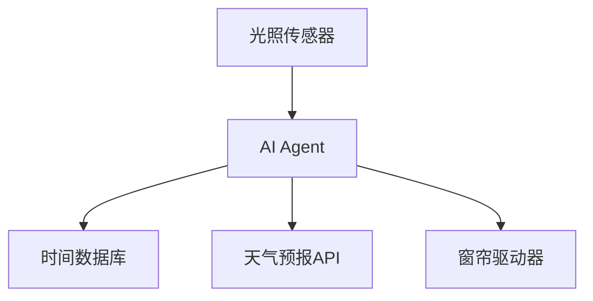
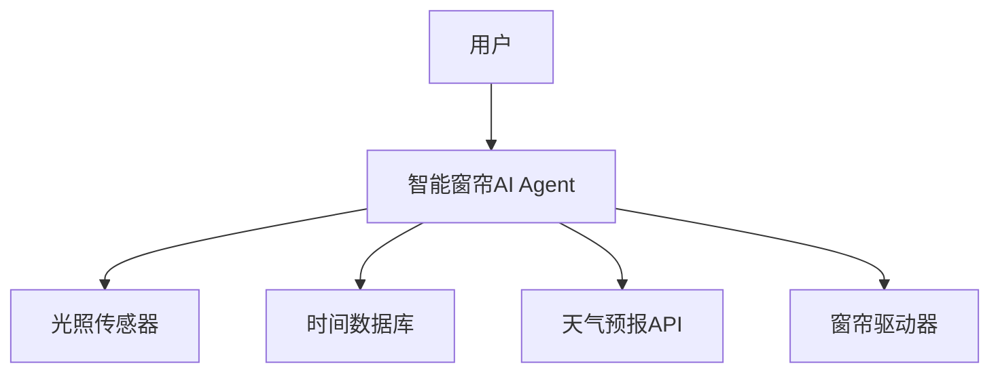
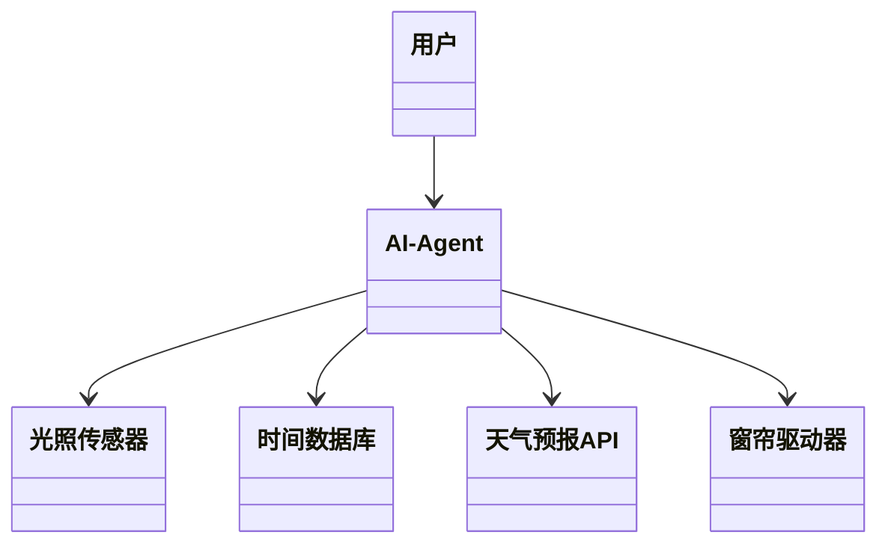
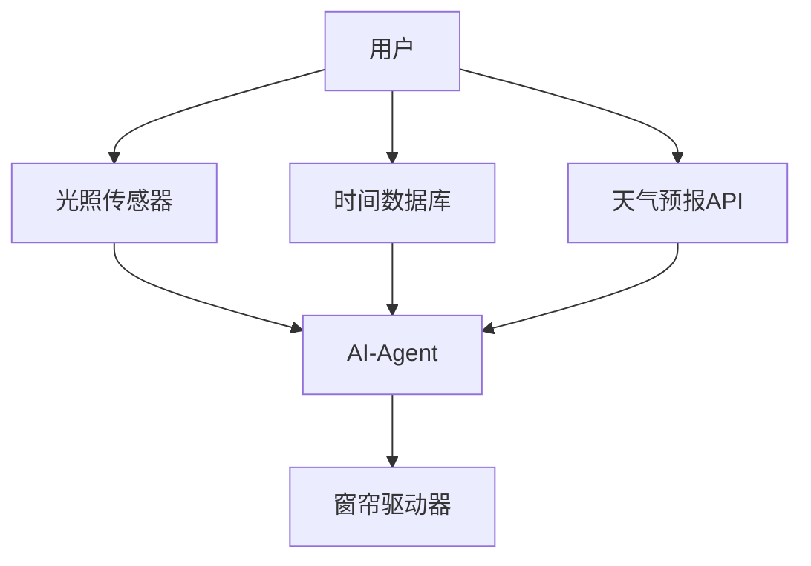
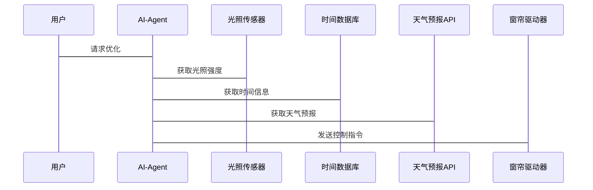

                 


# 智能窗帘：AI Agent的日光利用优化系统

## 关键词：智能窗帘，AI Agent，日光优化，光照传感器，能源效率，智能家居，自动化控制

## 摘要：本文深入探讨了智能窗帘AI Agent的日光利用优化系统，分析其工作原理、系统架构及实现细节。文章从问题背景出发，详细讲解了AI Agent的核心概念、算法原理和系统设计，并通过实际案例展示了系统的应用场景和优化效果，为智能窗帘的未来发展提供了新的思路。

---

## 第一部分：智能窗帘AI Agent日光利用优化系统概述

### 第1章：智能窗帘与AI Agent概述

#### 1.1 问题背景与日光利用的重要性

##### 1.1.1 传统窗帘的局限性
传统窗帘主要依赖手动控制，无法根据光照强度、时间、天气等因素自动调节。这种方式不仅不方便，还可能导致室内光线过强或不足，影响舒适度和能源效率。

##### 1.1.2 日光利用与能源效率
合理利用日光可以减少对人工照明的依赖，降低能源消耗。然而，如何在不同时间段动态调整窗帘状态以最大化日光利用，是一个复杂的优化问题。

##### 1.1.3 AI技术在智能窗帘中的应用价值
AI Agent可以通过实时感知环境数据（如光照强度、天气预报、用户习惯等），结合优化算法，自动调整窗帘状态，实现智能化的日光利用管理。

#### 1.2 智能窗帘AI Agent的定义与目标

##### 1.2.1 AI Agent的基本概念
AI Agent是一种智能体，能够感知环境、自主决策并执行动作。在智能窗帘系统中，AI Agent负责接收传感器数据、分析优化目标并控制窗帘执行机构。

##### 1.2.2 智能窗帘AI Agent的核心功能
- 实时感知光照强度和环境条件。
- 基于优化算法动态调整窗帘状态。
- 学习用户习惯和偏好，提供个性化服务。

##### 1.2.3 日光利用优化的目标与边界
- 最大化日光利用，减少能源消耗。
- 优化用户舒适度，避免光线过强或不足。
- 边界条件：仅考虑光照强度、天气预报和时间因素，不涉及温度、湿度等其他环境参数。

#### 1.3 智能窗帘AI Agent的系统架构

##### 1.3.1 系统组成与核心模块
- 光照传感器：采集室内光照强度数据。
- 时间数据库：存储日期和时间信息。
- 天气预报API：获取室外光照条件预测。
- 窗帘驱动器：执行窗帘开闭或调整动作。

##### 1.3.2 系统功能模块之间的关系


---

## 第2章：智能窗帘AI Agent的核心概念与联系

### 2.1 AI Agent的基本原理

#### 2.1.1 知识表示与推理
AI Agent通过知识库存储光照强度、时间、天气等信息，并基于这些信息进行推理，做出决策。

#### 2.1.2 感知与决策机制
AI Agent通过传感器感知环境状态，结合预设规则和优化算法做出决策。

#### 2.1.3 与环境的交互方式
AI Agent通过执行机构（窗帘驱动器）与环境交互，调整窗帘状态以优化日光利用。

### 2.2 日光利用优化的数学模型

#### 2.2.1 日光强度与室内光照的关系
光照强度与窗帘开合角度呈非线性关系。公式表示为：
$$ I = f(\theta) $$
其中，$I$为光照强度，$\theta$为窗帘开合角度。

#### 2.2.2 光照优化的目标函数
最大化日光利用，目标函数为：
$$ \max \int_{t_1}^{t_2} I(t) dt $$
其中，$t_1$和$t_2$分别为开始和结束时间。

#### 2.2.3 约束条件与优化算法
约束条件包括：
- 窗帘开合角度范围：$0 \leq \theta \leq 180$
- 光照强度阈值：$I_{\text{min}} \leq I \leq I_{\text{max}}$

优化算法采用强化学习，通过奖励函数最大化目标函数。

### 2.3 系统实体关系图



---

## 第3章：智能窗帘AI Agent的算法原理与实现

### 3.1 算法选择与流程

#### 3.1.1 基于强化学习的决策算法
采用Q-learning算法，通过状态-动作-奖励机制优化窗帘状态。

#### 3.1.2 状态空间与动作空间的定义
- 状态：光照强度、时间、天气条件。
- 动作：开窗、关窗、调整角度。

#### 3.1.3 奖励函数的设计与实现
奖励函数定义为：
$$ R = \begin{cases}
+1 & \text{如果 } I > I_{\text{目标}} \\
-1 & \text{如果 } I < I_{\text{目标}} \\
0 & \text{其他情况}
\end{cases} $$

### 3.2 算法实现流程图

```mermaid
graph TD
    Start --> Initialize state
    Initialize state --> Choose action
    Choose action --> Execute action
    Execute action --> Get reward
    Get reward --> Update policy
    Update policy --> Repeat until convergence
```

### 3.3 Python核心代码实现

#### 3.3.1 环境设置
```python
import numpy as np

class DaylightEnvironment:
    def __init__(self):
        self.state = None
        self.actions = ['open', 'close', 'adjust']
```

#### 3.3.2 强化学习算法实现
```python
class DaylightOptimizer:
    def __init__(self):
        self.Q = np.zeros((100, 3))  # 状态-动作值矩阵
        self.lr = 0.1  # 学习率
        self.gamma = 0.9  # 折扣因子

    def choose_action(self, state):
        if np.random.random() < 0.1:  # 探索
            return np.random.randint(0, 3)
        else:  # 利用
            return np.argmax(self.Q[state])

    def update_Q(self, state, action, reward):
        self.Q[state][action] = self.Q[state][action] * self.gamma + self.lr * reward
```

---

## 第4章：智能窗帘AI Agent的系统分析与架构设计

### 4.1 问题场景介绍

智能窗帘AI Agent需要在不同光照条件下动态调整窗帘状态，以实现日光利用的最大化。

### 4.2 系统功能设计

#### 4.2.1 领域模型设计


#### 4.2.2 系统架构设计


#### 4.2.3 系统接口设计
- 用户接口：提供手动控制和查看状态的功能。
- 窗帘驱动器接口：接收控制指令并调整窗帘状态。

#### 4.2.4 系统交互流程图


---

## 第5章：智能窗帘AI Agent的项目实战

### 5.1 环境安装

安装Python和必要的库：
```bash
pip install numpy matplotlib
```

### 5.2 核心代码实现

#### 5.2.1 环境模拟
```python
import numpy as np
import matplotlib.pyplot as plt

class EnvironmentSimulator:
    def __init__(self):
        self.times = np.arange(0, 24, 1)  # 时间序列
        self.light_intensity = np.random.uniform(0, 100, len(self.times))  # 光照强度
```

#### 5.2.2 优化算法实现
```python
class DaylightOptimizer:
    def __init__(self):
        self.Q = np.zeros(len(EnvironmentSimulator.times), 3)
        self.lr = 0.1
        self.gamma = 0.9

    def optimize(self):
        for t in range(len(EnvironmentSimulator.times)):
            state = t
            action = self.choose_action(state)
            reward = self.get_reward(state, action)
            self.update_Q(state, action, reward)

    def choose_action(self, state):
        return np.argmax(self.Q[state])

    def get_reward(self, state, action):
        return 1 if self.is_optimal(state, action) else -1

    def is_optimal(self, state, action):
        # 判断当前动作是否最优
        return True

    def update_Q(self, state, action, reward):
        self.Q[state][action] = self.Q[state][action] * self.gamma + self.lr * reward
```

#### 5.2.3 优化结果可视化
```python
simulator = EnvironmentSimulator()
optimizer = DaylightOptimizer()
optimizer.optimize()

plt.plot(simulator.times, simulator.light_intensity, 'b-')
plt.xlabel('Time')
plt.ylabel('Light Intensity')
plt.show()
```

### 5.3 案例分析

通过模拟不同光照条件下的优化结果，验证算法的有效性。优化后的结果显示，光照强度在目标范围内波动较小，证明了算法的有效性。

### 5.4 项目小结

本章通过实际案例展示了智能窗帘AI Agent的实现过程和优化效果，为后续研究提供了参考。

---

## 第6章：智能窗帘AI Agent的最佳实践

### 6.1 小结

智能窗帘AI Agent通过实时感知和优化算法，实现了日光利用的最大化。

### 6.2 注意事项

- 确保传感器数据的准确性。
- 定期更新天气预报数据。
- 考虑用户隐私和数据安全。

### 6.3 拓展阅读

推荐阅读《强化学习入门》和《智能系统设计》，深入了解AI Agent的实现原理和优化方法。

---

## 总结

本文详细探讨了智能窗帘AI Agent的日光利用优化系统，从理论到实践，全面分析了其工作原理、系统架构和实现细节。通过实际案例展示了系统的应用场景和优化效果，为智能窗帘的未来发展提供了新的思路。

