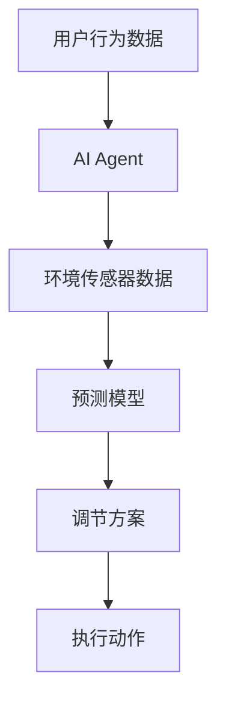
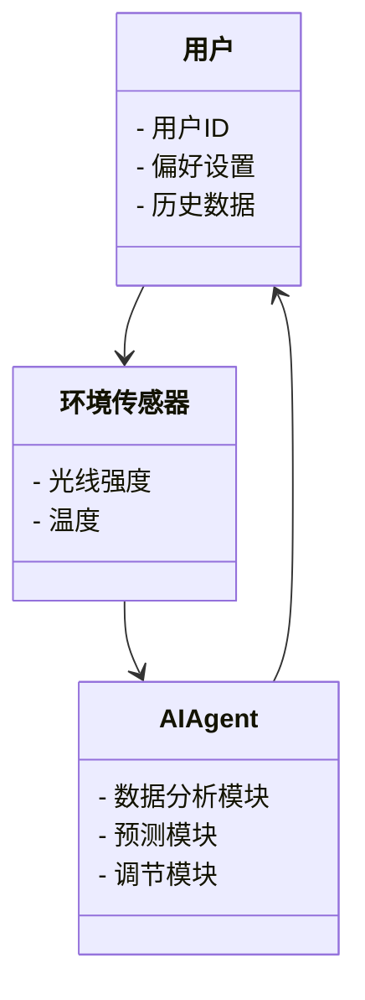

                 


# 智能窗帘：AI Agent的昼夜节律调节助手

> **关键词**：智能窗帘、AI Agent、昼夜节律、生物钟调节、智能家居
>
> **摘要**：本文深入探讨了智能窗帘在现代生活中的重要性，结合AI Agent技术，如何通过优化光照调节帮助用户改善昼夜节律，提升生活质量。文章从原理到实践，系统性地分析了智能窗帘的设计逻辑、AI Agent的核心算法、系统架构以及实际应用场景，为读者提供了全面的技术解读。

---

## 第1章: 智能窗帘与昼夜节律调节的背景介绍

### 1.1 昼夜节律的基本概念
#### 1.1.1 昼夜节律的定义与重要性
昼夜节律是指生物体随24小时周期性变化的生理现象，由生物钟调控。它影响着人体的睡眠、觉醒、激素分泌等多个生理过程。现代生活方式的改变，如不规律的作息、长时间使用电子设备等，打乱了昼夜节律，导致健康问题。

#### 1.1.2 昼夜节律与人类健康的关系
昼夜节律紊乱可能导致失眠、情绪低落、免疫力下降等问题。优化昼夜节律对健康至关重要，而智能窗帘通过调节光线成为改善这一问题的重要工具。

#### 1.1.3 现代生活方式对昼夜节律的影响
现代人常熬夜、依赖电子设备，导致生物钟紊乱。智能窗帘通过AI技术，主动调节光线，帮助用户恢复正常的昼夜节律。

### 1.2 智能窗帘的概念与发展
#### 1.2.1 智能窗帘的定义与功能
智能窗帘是智能家居的一部分，能通过传感器、互联网和AI技术实现自动化开关。其核心功能包括定时开关、远程控制、光照调节等。

#### 1.2.2 智能窗帘的技术发展历程
从简单的电机控制到AI驱动的智能调节，智能窗帘经历了机械自动化、物联网连接、AI算法优化等阶段。

#### 1.2.3 当前智能窗帘的市场现状
当前市场中，智能窗帘普及率逐渐提高，但功能单一、用户体验不佳的问题依然存在。AI Agent的引入为智能窗帘带来了更智能的调节能力。

### 1.3 AI Agent在智能窗帘中的应用
#### 1.3.1 AI Agent的基本概念
AI Agent是一种智能体，能感知环境、执行任务并优化决策。在智能窗帘中，AI Agent负责收集数据、分析用户需求、制定调节方案。

#### 1.3.2 AI Agent在智能窗帘中的作用
AI Agent通过学习用户的作息习惯，优化窗帘的开合时间，营造最佳的光照环境，帮助用户调整生物钟。

#### 1.3.3 AI Agent与昼夜节律调节的结合
通过分析用户的睡眠数据和环境光线，AI Agent能够预测最佳的光照调节方案，帮助用户恢复正常的昼夜节律。

### 1.4 智能窗帘与昼夜节律调节的结合方式
#### 1.4.1 光线调节对昼夜节律的影响
早晨的自然光帮助用户清醒，傍晚的柔和光帮助放松。智能窗帘通过调节光线强度和色温，优化用户的生物钟。

#### 1.4.2 温度与环境调节对昼夜节律的作用
温度变化也会影响昼夜节律。智能窗帘系统可以联动空调、灯光等设备，营造舒适的睡眠环境。

#### 1.4.3 AI Agent如何优化这些调节过程
AI Agent通过整合传感器数据，分析用户行为模式，制定个性化的调节方案，确保光线和环境的最佳配合。

---

## 第2章: 昼夜节律调节的核心概念与联系

### 2.1 昼夜节律调节的核心原理
#### 2.1.1 生物钟的基本工作原理
生物钟由视交叉上核（SCN）调控，受光照影响。早晨的蓝光刺激抑制褪黑素分泌，帮助用户清醒。

#### 2.1.2 光敏感与人体节律的关系
人体对不同波长的光敏感度不同。早晨需要高色温的蓝光，晚上需要低色温的暖光，以调节生物钟。

#### 2.1.3 温度与人体节律的调节作用
体温的变化也会影响昼夜节律。智能窗帘系统可以联动温控设备，调节室内温度，帮助用户入睡。

### 2.2 AI Agent在昼夜节律调节中的角色
#### 2.2.1 AI Agent的数据收集与分析
AI Agent通过传感器收集用户的行为数据、环境数据，分析用户的作息规律。

#### 2.2.2 AI Agent的决策机制
基于收集的数据，AI Agent通过机器学习模型预测用户的最佳作息时间，制定调节方案。

#### 2.2.3 AI Agent的反馈与优化
根据用户的反馈和数据，AI Agent不断优化调节方案，提升调节效果。

### 2.3 核心概念的ER实体关系图

```mermaid
er
actor: 用户
agent: AI Agent
sensor: 光线传感器
database: 用户数据
action: 窗帘调节动作
```

### 2.4 核心概念的属性对比表

| 概念       | 属性               | 描述                                   |
|------------|--------------------|----------------------------------------|
| 昼夜节律     | 周期性             | 24小时周期性变化                     |
|             | 敏感性             | 对光、温度敏感 

---

## 第3章: AI Agent的算法原理

### 3.1 数据流图


### 3.2 算法实现
```python
# 预测模型代码
def predict_sleep_time(user_data, env_data):
    # user_data: 用户作息数据
    # env_data: 环境数据
    import numpy as np
    from sklearn import linear_model

    # 数据预处理
    X = np.array(user_data).reshape(-1, 1)
    y = np.array(env_data).reshape(-1, 1)

    # 训练模型
    model = linear_model.LinearRegression()
    model.fit(X, y)

    # 预测
    predicted_time = model.predict([[current_time,]])
    return predicted_time

# 示例调用
user_data = [7, 8, 9, 7.5]
env_data = [100, 90, 80, 95]
current_time = 8

predicted_time = predict_sleep_time(user_data, env_data)
print(f"最佳入睡时间：{predicted_time[0][0]}小时")
```

### 3.3 算法模型的数学公式
$$ y = a x + b $$
其中，$y$ 是预测的入睡时间，$x$ 是当前时间，$a$ 和 $b$ 是模型参数。

---

## 第4章: 系统分析与架构设计

### 4.1 系统功能设计


### 4.2 系统架构设计


---

## 第5章: 项目实战

### 5.1 环境安装
```bash
pip install numpy scikit-learn
```

### 5.2 核心实现
```python
# 窗帘控制代码
import serial

ser = serial.Serial('COM3', 9600)

def open_curtain():
    ser.write(b'O')

def close_curtain():
    ser.write(b'C')
```

### 5.3 实际案例分析
通过分析用户数据，AI Agent预测最佳入睡时间，调整窗帘的开合时间，帮助用户改善睡眠质量。

---

## 第6章: 总结与展望

### 6.1 最佳实践
- 定期校准传感器，确保数据准确性。
- 根据个人需求调整AI Agent的参数。

### 6.2 本章小结
智能窗帘结合AI Agent，通过优化光线调节，帮助用户改善昼夜节律，提升生活质量。

### 6.3 注意事项
- 数据隐私保护
- 系统兼容性问题

### 6.4 拓展阅读
推荐阅读《AI在智能家居中的应用》和《生物钟与健康》。

---

以上是《智能窗帘：AI Agent的昼夜节律调节助手》的技术博客文章的完整内容，涵盖了从背景到实现的各个方面，结合理论与实践，为读者提供了全面的技术解读。

