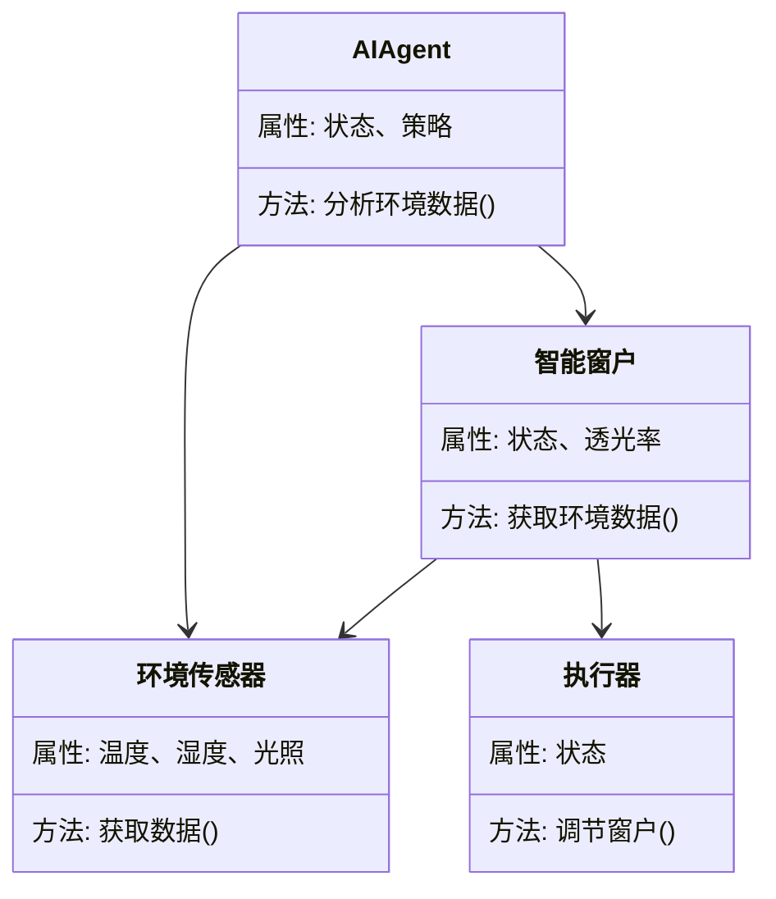
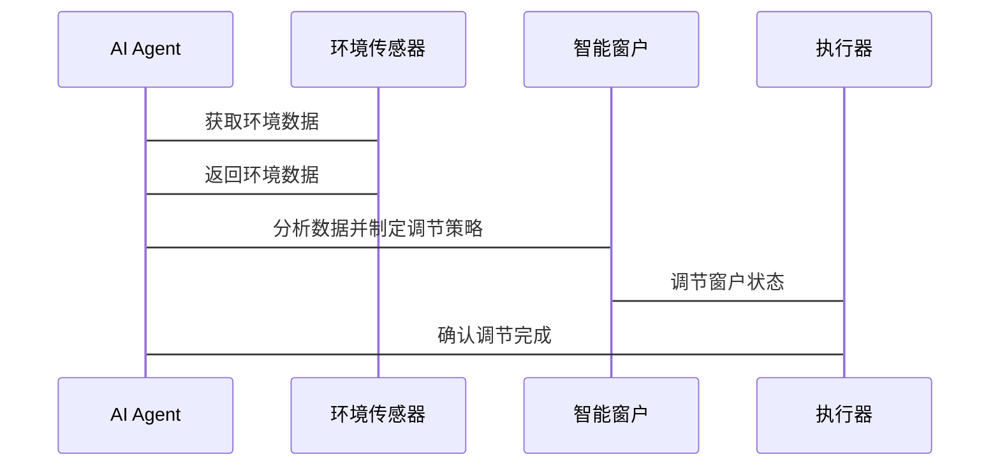
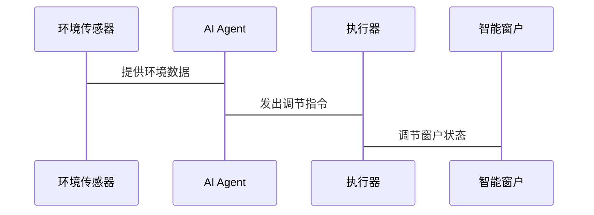

                 


# 智能窗户：AI Agent的室内温度优化控制

> 关键词：智能窗户，AI Agent，室内温度优化，物联网，人工智能，强化学习

> 摘要：本文探讨了智能窗户与AI Agent结合的室内温度优化控制技术，分析了其工作原理、系统架构、算法实现及实际应用案例，展示了如何通过智能化技术提升居住舒适度和能源效率。

---

## 第一部分：智能窗户与AI Agent的背景介绍

### 第1章：智能窗户的发展与现状

#### 1.1 智能窗户的定义与分类
##### 1.1.1 智能窗户的基本定义
智能窗户是一种集成传感器、执行器和控制系统的建筑构件，能够根据环境条件和用户需求自动调节其透明度或开启状态，以优化室内环境和能源效率。

##### 1.1.2 智能窗户的分类与特点
智能窗户主要分为以下几类：
1. **电致变色窗户**：通过电化学反应改变窗户的透光率。
2. **智能百叶窗**：通过电机控制叶片的开合角度。
3. **温控窗户**：根据室内温度自动调节窗户的开闭状态。
4. **光伏窗户**：集成太阳能电池，将阳光转化为电能。

##### 1.1.3 智能窗户的市场应用现状
随着能源危机和环保意识的增强，智能窗户在建筑节能和智能家居领域的应用越来越广泛。尤其是在发达国家，智能窗户已成为绿色建筑的重要组成部分。

#### 1.2 AI Agent的基本概念与技术特点
##### 1.2.1 AI Agent的定义与核心功能
AI Agent（人工智能代理）是指能够感知环境、做出决策并采取行动的智能系统。其核心功能包括：
- **感知**：通过传感器或其他信息源获取环境数据。
- **决策**：基于感知数据和目标，制定行动计划。
- **执行**：通过执行器或接口与环境交互。

##### 1.2.2 AI Agent的技术特点与优势
- **自主性**：能够在无需外部干预的情况下独立运作。
- **反应性**：能够实时感知环境变化并做出响应。
- **学习能力**：通过机器学习算法不断优化自身的决策能力。
- **适应性**：能够根据环境变化调整策略。

##### 1.2.3 AI Agent在智能窗户中的应用潜力
AI Agent可以用于智能窗户的环境感知、决策控制和用户交互，从而实现室内温度的智能调节。

#### 1.3 智能窗户与AI Agent的结合
##### 1.3.1 智能窗户与AI Agent的协同工作模式
智能窗户与AI Agent的协同工作模式可以分为以下几个步骤：
1. **环境感知**：AI Agent通过传感器获取室内温度、室外温度、湿度等数据。
2. **数据分析与决策**：AI Agent基于历史数据和当前环境，优化窗户的开闭状态以达到最佳温度。
3. **执行指令**：AI Agent通过执行器控制窗户的开闭或调整透明度。

##### 1.3.2 AI Agent在智能窗户中的具体应用场景
- **节能优化**：通过AI Agent优化窗户的开闭时间，减少能源消耗。
- **舒适性提升**：根据室内温度和用户偏好自动调节窗户状态，提高居住舒适度。
- **智能交互**：通过语音或手机APP与用户互动，实时响应用户需求。

##### 1.3.3 智能窗户与AI Agent结合的创新价值
智能窗户与AI Agent的结合不仅提高了居住舒适度，还实现了能源的高效利用，为绿色建筑和智能家居的发展提供了新的可能性。

---

### 第2章：智能窗户的室内温度优化控制问题

#### 2.1 室内温度优化控制的背景与需求
##### 2.1.1 室内温度对居住舒适性的影响
室内温度直接影响人们的舒适感和健康。过高或过低的温度会导致不适，甚至引发健康问题。

##### 2.1.2 现有温度控制技术的局限性
传统的温度控制系统（如空调）存在以下问题：
- **能耗高**：空调运行时耗电量大，尤其是在炎热或寒冷的季节。
- **响应慢**：传统系统无法实时感知环境变化，导致温度调节不够及时。
- **缺乏智能化**：无法根据用户偏好或环境变化自动调整。

##### 2.1.3 智能窗户在温度优化中的潜在作用
智能窗户通过调节透光率或开闭状态，可以有效调节室内温度，减少对空调的依赖，从而降低能源消耗。

#### 2.2 智能窗户优化温度控制的核心问题
##### 2.2.1 温度调节的动态性与复杂性
室内温度受多种因素影响，如室外温度、日照强度、窗户开闭状态等。这些因素的变化使得温度调节具有动态性和复杂性。

##### 2.2.2 不同环境条件下的温度优化策略
在不同环境下，智能窗户需要采取不同的策略：
- **炎热天气**：关闭窗户，降低透光率，减少太阳辐射进入室内。
- **寒冷天气**：适当开启窗户，利用自然通风调节温度。
- **阴雨天气**：根据室内温度调整窗户透明度，保持舒适温度。

##### 2.2.3 智能窗户与室内温度的关联性分析
智能窗户通过调节窗户的开闭状态和透光率，直接影响室内温度。AI Agent可以通过分析室内温度、室外环境和用户需求，优化窗户的调节策略。

#### 2.3 智能窗户优化温度控制的边界与外延
##### 2.3.1 温度控制的边界条件与限制
智能窗户的温度控制受到以下限制：
- **窗户类型**：不同类型的智能窗户具有不同的调节能力。
- **环境条件**：极端天气或特殊环境可能影响调节效果。
- **用户偏好**：不同用户对温度的舒适范围有不同的需求。

##### 2.3.2 温度控制的外延与扩展
智能窗户的温度优化控制可以与其他智能设备（如空调、照明）联动，形成一个完整的智能家居系统，进一步提升能源效率和居住舒适度。

---

## 第二部分：核心概念与联系

### 第3章：智能窗户与AI Agent的核心概念

#### 3.1 智能窗户的原理与功能
##### 3.1.1 智能窗户的感知功能
智能窗户通过温度、湿度、光照强度等传感器感知环境数据。

##### 3.1.2 智能窗户的决策功能
智能窗户通过AI算法分析感知数据，制定窗户的调节策略。

##### 3.1.3 智能窗户的执行功能
智能窗户通过执行器（如电机、传感器）调整窗户的开闭状态或透光率。

#### 3.2 AI Agent的原理与功能
##### 3.2.1 AI Agent的感知功能
AI Agent通过传感器或其他信息源获取环境数据。

##### 3.2.2 AI Agent的决策功能
AI Agent基于感知数据和目标，制定行动计划。

##### 3.2.3 AI Agent的执行功能
AI Agent通过执行器或接口与环境交互，实现决策的执行。

#### 3.3 智能窗户与AI Agent的协作关系
##### 3.3.1 实体关系图
```mermaid
er
    顾客
    智能窗户
    AI Agent
    环境传感器
    执行器
    电力系统
    网络接口

    智能窗户 -[拥有]-> 环境传感器
    智能窗户 -[拥有]-> 执行器
    AI Agent -[控制]-> 智能窗户
    AI Agent -[连接]-> 网络接口
    电力系统 -[连接]-> 网络接口
```

##### 3.3.2 领域模型类图


---

### 第4章：智能窗户与AI Agent的协作机制

#### 4.1 协作过程分析
智能窗户与AI Agent的协作过程可以分为以下几个步骤：
1. **数据采集**：AI Agent通过环境传感器获取室内和室外的环境数据。
2. **数据分析**：AI Agent分析数据，确定最佳的窗户调节策略。
3. **决策制定**：AI Agent根据分析结果制定窗户调节计划。
4. **执行指令**：AI Agent通过执行器调整窗户的开闭状态或透光率。

#### 4.2 信息流与数据流向
```mermaid
graph TD
    AI Agent --> 环境传感器
    环境传感器 --> AI Agent
    AI Agent --> 智能窗户
    智能窗户 --> 执行器
    执行器 --> AI Agent
```

#### 4.3 交互流程图


---

## 第三部分：算法原理讲解

### 第5章：AI Agent的算法原理

#### 5.1 强化学习算法
##### 5.1.1 强化学习的基本原理
强化学习是一种机器学习方法，通过智能体与环境的交互，学习最优策略以最大化累积奖励。

##### 5.1.2 温度优化的强化学习模型
```mermaid
graph TD
    状态空间 --> 策略网络
    策略网络 --> 行动（调节窗户）
    行动 --> 奖励函数
    奖励函数 --> 状态空间
```

##### 5.1.3 Python代码实现
```python
import numpy as np
from collections import deque
import random

class DQN:
    def __init__(self, state_size, action_size, learning_rate=0.01, gamma=0.99):
        self.state_size = state_size
        self.action_size = action_size
        self.learning_rate = learning_rate
        self.gamma = gamma
        self.memory = deque(maxlen=1000)
        self.model = self.build_model()

    def build_model(self):
        # 这里省略神经网络模型的具体实现
        pass

    def remember(self, state, action, reward, next_state):
        self.memory.append((state, action, reward, next_state))

    def act(self, state):
        if random.random() < 0.1:
            return random.randint(0, self.action_size-1)
        else:
            return np.argmax(self.model.predict(state))

    def replay(self, batch_size):
        # 这里省略回放记忆的具体实现
        pass

# 示例使用
state_size = 3  # 温度、湿度、光照强度
action_size = 2  # 开启或关闭窗户
dqn = DQN(state_size, action_size)
```

#### 5.2 温度优化的数学模型
##### 5.2.1 温度预测模型
$$ T_{\text{next}} = a \cdot T_{\text{current}} + b \cdot \text{action} + c \cdot \text{environment} $$

##### 5.2.2 优化目标函数
$$ \text{目标函数} = \min (|T_{\text{current}} - T_{\text{target}}|) $$

---

## 第四部分：系统分析与架构设计

### 第6章：智能窗户温度优化系统的架构设计

#### 6.1 系统架构设计
##### 6.1.1 分层架构
系统分为感知层、计算层和执行层：
- **感知层**：负责采集环境数据。
- **计算层**：负责数据分析和决策。
- **执行层**：负责调节窗户状态。

##### 6.1.2 模块划分
- **环境传感器模块**：采集室内和室外的环境数据。
- **AI Agent模块**：分析数据并制定调节策略。
- **执行器模块**：调节窗户的开闭状态或透光率。

#### 6.2 系统架构图
```mermaid
graph TD
    环境传感器 --> AI Agent
    AI Agent --> 执行器
    执行器 --> 智能窗户
```

#### 6.3 接口设计
##### 6.3.1 系统接口
- **环境传感器接口**：提供温度、湿度、光照强度等数据。
- **AI Agent接口**：提供决策指令。
- **执行器接口**：接收调节指令并执行。

##### 6.3.2 交互流程图


---

## 第五部分：项目实战

### 第7章：智能窗户温度优化系统的实现

#### 7.1 环境搭建与安装
##### 7.1.1 环境搭建
安装必要的Python库，如numpy、keras、tensorflow等。

##### 7.1.2 硬件安装
安装环境传感器、执行器和智能窗户。

#### 7.2 核心代码实现
##### 7.2.1 AI Agent代码
```python
class AIAgent:
    def __init__(self):
        self.model = self.build_model()

    def build_model(self):
        # 这里省略神经网络模型的具体实现
        pass

    def predict(self, state):
        return self.model.predict(state)

    def update(self, state, action, reward, next_state):
        # 这里省略模型更新的具体实现
        pass
```

##### 7.2.2 温度预测代码
```python
def predict_temperature(current_temp, action):
    return current_temp * 0.9 + action * 0.1
```

##### 7.2.3 窗户调节代码
```python
class SmartWindow:
    def __init__(self):
        self.state = 'closed'  # 可以是 'open' 或 'closed'

    def adjust(self, action):
        if action == 'open':
            self.state = 'open'
        elif action == 'close':
            self.state = 'closed'
```

#### 7.3 代码功能解读与分析
##### 7.3.1 AI Agent的功能
AI Agent通过感知环境数据，分析并制定窗户调节策略。

##### 7.3.2 温度预测的功能
温度预测模型根据当前温度和窗户状态预测未来的温度变化。

##### 7.3.3 窗户调节的功能
窗户调节模块根据AI Agent的指令调整窗户的开闭状态，以实现温度优化。

#### 7.4 实际案例分析
##### 7.4.1 案例描述
假设在炎热的夏天，室内温度过高，AI Agent通过分析数据决定关闭窗户并降低透光率，从而降低室内温度。

##### 7.4.2 数据分析与结果解读
通过数据分析，验证AI Agent的调节策略是否有效降低室内温度。

---

## 第六部分：最佳实践与总结

### 第8章：智能窗户温度优化系统的最佳实践

#### 8.1 最佳实践
##### 8.1.1 系统维护
定期检查传感器和执行器，确保系统正常运行。

##### 8.1.2 数据隐私
确保环境数据的安全性，防止数据泄露。

##### 8.1.3 系统优化
根据实际使用情况，不断优化AI Agent的算法和调节策略。

#### 8.2 项目小结
智能窗户与AI Agent的结合，不仅提高了居住舒适度，还实现了能源的高效利用。通过智能化的温度优化控制，可以在不增加额外能源消耗的情况下，显著改善室内环境。

#### 8.3 注意事项
- **系统兼容性**：确保智能窗户与其他智能家居设备的兼容性。
- **用户隐私**：保护用户的隐私数据，防止数据泄露。
- **系统安全性**：防止恶意攻击，确保系统的安全性。

#### 8.4 拓展阅读
- **相关技术**：了解更多的智能窗户技术和AI Agent的应用场景。
- **行业动态**：关注智能家居和绿色建筑的发展趋势。
- **学术研究**：阅读相关的学术论文和技术报告，获取最新的研究成果。

---

### 第9章：总结与展望

智能窗户与AI Agent的结合为室内温度优化控制提供了新的可能性。通过智能化的技术手段，我们可以实现更高效、更舒适的居住环境。未来，随着AI和物联网技术的不断发展，智能窗户将在建筑节能和智能家居领域发挥更大的作用。

---

通过本文的详细介绍，读者可以全面了解智能窗户与AI Agent的结合原理、系统架构、算法实现及实际应用案例。希望本文能够为相关领域的研究和实践提供有价值的参考和启示。

