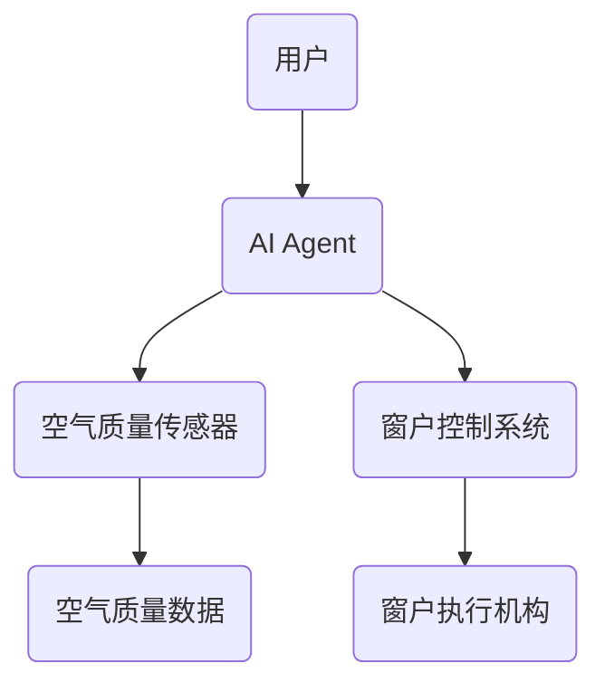
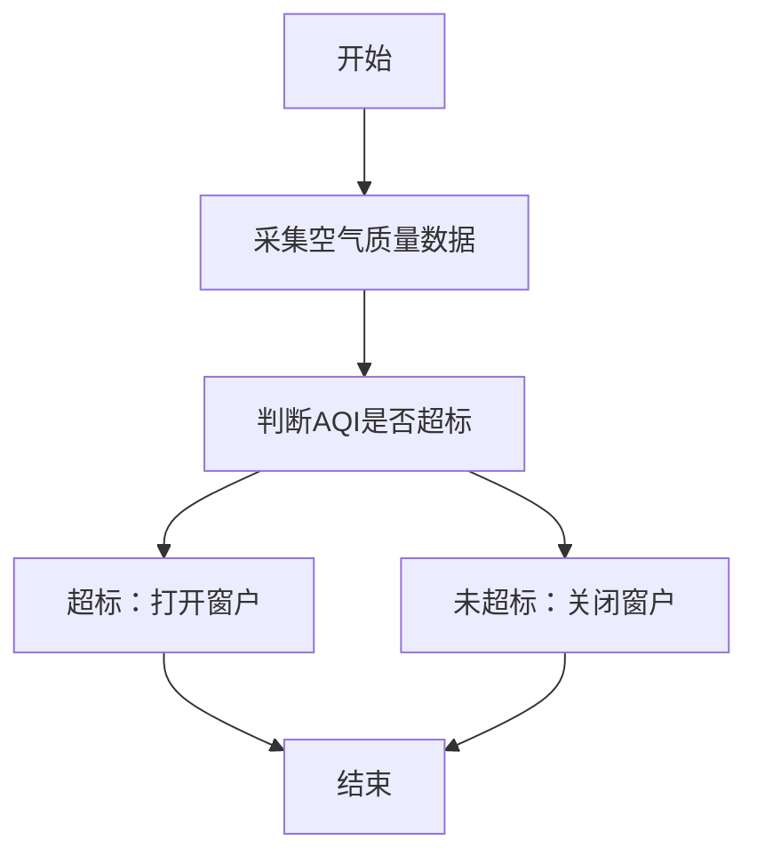
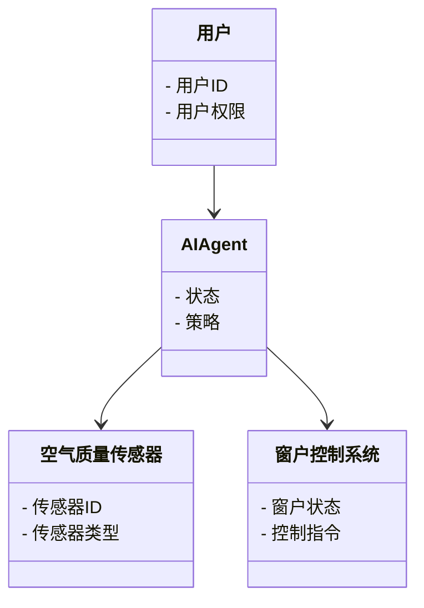

                 


# 智能窗户：AI Agent的空气质量控制

## 关键词
智能窗户，AI Agent，空气质量控制，物联网，环境监控

## 摘要
智能窗户结合了人工智能代理（AI Agent）和物联网技术，通过实时监测和优化空气质量，为用户提供一个健康、舒适的居住环境。本文详细介绍了智能窗户的设计原理、核心算法、系统架构以及实际应用，通过案例分析和代码实现，展示了AI Agent在空气质量控制中的强大能力。

---

# 第二部分: 智能窗户与空气质量控制的核心概念

## 第4章: 智能窗户的核心概念与原理

### 4.1 AI Agent的基本原理
#### 4.1.1 AI Agent的定义
AI Agent是一种智能体，能够感知环境、做出决策并执行动作。在智能窗户中，AI Agent负责接收空气质量数据、分析数据并控制窗户的开关。

#### 4.1.2 AI Agent的核心算法
AI Agent主要采用基于规则的推理算法和机器学习算法：
- 基于规则的推理：根据AQI（空气质量指数）阈值判断是否开启窗户。
- 机器学习：通过历史数据训练模型，预测未来空气质量并优化窗户控制策略。

#### 4.1.3 AI Agent的决策逻辑
$$ Decision = \text{f}(AQI, 时间, 天气条件) $$

### 4.2 智能窗户的实体关系与架构
#### 4.2.1 实体关系图


#### 4.2.2 系统架构图


## 第5章: 空气质量控制的数学模型与算法

### 5.1 空气质量指数的计算公式
$$ AQI = \frac{PM2.5 + PM10 + CO + NO2 + SO2}{5} $$

### 5.2 AI Agent的决策模型
$$ Decision = \text{f}(AQI, 时间, 天气条件) $$

### 5.3 算法流程图


### 5.4 算法实现代码
```python
import num
```

---

# 第三部分: 智能窗户的系统分析与架构设计

## 第6章: 系统分析与架构设计

### 6.1 问题场景介绍
智能窗户的目标是通过实时监测室内空气质量，自动调节窗户的开闭状态，以保持空气清新和健康。

### 6.2 系统功能设计
#### 6.2.1 领域模型


### 6.3 系统架构设计
#### 6.3.1 系统架构图


### 6.4 系统接口与交互流程
#### 6.4.1 系统接口设计
- 用户接口：手机APP或网页
- AI Agent接口：与传感器和窗户控制系统通信

#### 6.4.2 系统交互流程图


---

# 第四部分: 智能窗户的项目实战

## 第7章: 项目实战与案例分析

### 7.1 环境安装与配置
#### 7.1.1 系统环境
- 操作系统：Windows/Mac/Linux
- 开发工具：Python, PyCharm
- 传感器：PM2.5传感器、CO传感器等

### 7.2 系统核心代码实现
#### 7.2.1 空气质量传感器数据采集代码
```python
import serial

ser = serial.Serial('COM3', 9600)
data = ser.readline().decode()
print(data)
```

#### 7.2.2 AI Agent决策代码
```python
class AI-Agent:
    def __init__(self):
        self.AQI = 0
        self.state = '关闭'
    
    def update(self, AQI):
        if AQI > 100:
            self.state = '开启'
        else:
            self.state = '关闭'
```

### 7.3 系统应用与案例分析
#### 7.3.1 案例分析：办公室空气质量控制
- 项目背景：办公室人员密集，空气质量容易超标
- 实施方案：安装智能窗户系统，实时监测并调节窗户
- 实施效果：AQI从120降至85，员工健康状况改善

#### 7.3.2 案例分析：家庭空气质量控制
- 项目背景：家庭中有老人和儿童，对空气质量敏感
- 实施方案：安装智能窗户系统，夜间自动关闭，白天根据AQI调节
- 实施效果：AQI始终保持在90以下，家庭成员健康状况显著改善

### 7.4 项目小结
智能窗户系统通过AI Agent实现了高效的空气质量控制，具有广泛的应用前景。

---

# 第五部分: 智能窗户的最佳实践与总结

## 第8章: 最佳实践与总结

### 8.1 最佳实践
- 安装传感器时，确保传感器位置合理
- 定期校准传感器，保证数据准确性
- 根据不同场景调整AI Agent的决策策略

### 8.2 总结与展望
智能窗户结合了AI Agent和物联网技术，为空气质量控制提供了高效的解决方案。未来，随着AI技术的进步，智能窗户将更加智能化和个性化。

### 8.3 注意事项
- 确保系统安全，防止黑客攻击
- 处理传感器数据时，注意数据的时延和精度
- 定期维护系统，确保设备正常运行

### 8.4 拓展阅读
- 《人工智能在环境监控中的应用》
- 《物联网技术入门与实践》
- 《空气质量控制的数学模型与算法》

---

通过本文的详细讲解，读者可以全面了解智能窗户的设计原理、实现方法和实际应用，为空气质量控制提供了新的思路和解决方案。

