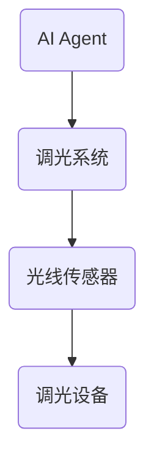
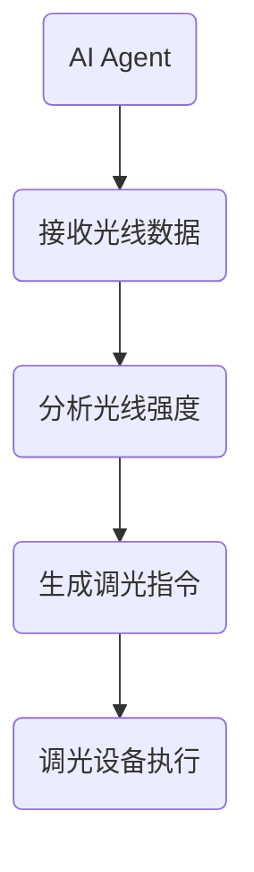
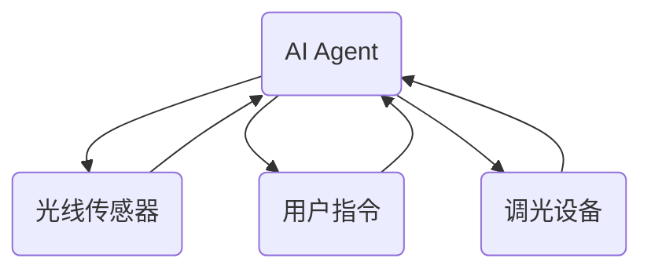
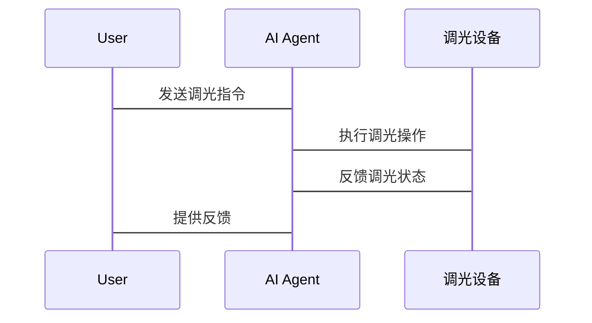

                 


# 智能窗户：AI Agent的自动调光系统

> 关键词：智能窗户、AI Agent、自动调光系统、物联网、智能家居

> 摘要：智能窗户是一种结合人工智能（AI）代理（Agent）和自动调光技术的创新智能家居设备。本文将深入探讨智能窗户的工作原理，分析AI Agent在其中的角色，揭示其背后的核心算法和技术架构。通过实际项目案例，详细讲解智能窗户的实现过程，并分享最佳实践和未来发展趋势。

---

## 目录

# 智能窗户：AI Agent的自动调光系统

> 关键词：智能窗户、AI Agent、自动调光系统、物联网、智能家居

> 摘要：智能窗户是一种结合人工智能（AI）代理（Agent）和自动调光技术的创新智能家居设备。本文将深入探讨智能窗户的工作原理，分析AI Agent在其中的角色，揭示其背后的核心算法和技术架构。通过实际项目案例，详细讲解智能窗户的实现过程，并分享最佳实践和未来发展趋势。

---

### 第1章: 智能窗户的定义与问题背景

#### 1.1 智能窗户的定义与分类
智能窗户是一种集成多种先进技术的智能家居设备，能够根据环境条件和用户需求自动调节其透明度或透光率。智能窗户的主要分类包括：
- **电致变色窗户**：通过电流改变窗户的颜色或透明度。
- **智能调光窗户**：通过传感器和控制器实现自动调光功能。
- **物联网（IoT）智能窗户**：与智能家居系统集成，支持远程控制和数据共享。

#### 1.2 AI Agent在智能窗户中的作用
AI Agent（智能代理）是一种能够感知环境、做出决策并执行动作的智能系统。在智能窗户中，AI Agent主要用于：
- **环境感知**：通过光线传感器、温度传感器等感知环境条件。
- **决策控制**：根据感知数据和用户需求，决定窗户的调光策略。
- **用户交互**：通过语音助手或移动应用与用户互动，提供实时反馈。

#### 1.3 自动调光系统的技术背景
自动调光系统通过传感器和控制器实现窗户透明度的自动调节。其技术背景包括：
- **光线传感器**：用于检测环境光线强度。
- **调光设备**：如电致变色膜或百叶窗，用于调节光线。
- **调光算法**：基于传感器数据实现智能调光。

#### 1.4 问题背景
传统窗户无法根据环境变化自动调节光线，导致能源浪费和用户体验不佳。智能窗户通过AI Agent和自动调光系统，解决了这些问题，实现了节能和智能化控制。

---

### 第2章: 智能窗户与AI Agent的核心概念

#### 2.1 AI Agent的基本原理
AI Agent的核心原理包括：
- **感知**：通过传感器获取环境数据。
- **决策**：基于感知数据和预设规则做出决策。
- **执行**：通过执行器（如调光设备）实现动作。

#### 2.2 自动调光系统的实现原理
自动调光系统的工作原理如下：
1. 光线传感器检测环境光线强度。
2. AI Agent分析传感器数据和用户需求。
3. 根据分析结果，AI Agent向调光设备发送控制指令。
4. 调光设备执行调光操作，实现智能窗户的自动调节。

#### 2.3 AI Agent与自动调光系统的结合
AI Agent通过以下方式与自动调光系统结合：
- **数据共享**：AI Agent接收光线传感器数据和用户指令。
- **智能决策**：基于数据，AI Agent决定调光策略。
- **协同控制**：AI Agent与调光系统协同工作，实现智能化调光。

---

### 第3章: 智能窗户与AI Agent的核心概念联系

#### 3.1 AI Agent与智能窗户的关系
AI Agent作为智能窗户的核心控制单元，负责协调和控制调光系统的运行。智能窗户则为AI Agent提供了应用场景和实现载体。

#### 3.2 调光系统与AI Agent的实体关系图


#### 3.3 调光算法与AI Agent的流程图


---

### 第4章: 智能窗户与AI Agent的算法原理

#### 4.1 AI Agent的决策算法
AI Agent的决策算法基于以下步骤：
1. **感知数据采集**：通过光线传感器获取环境数据。
2. **数据预处理**：对采集的数据进行清洗和标准化。
3. **决策逻辑**：基于预设规则或机器学习模型做出决策。
4. **调光指令生成**：根据决策结果生成调光指令。

#### 4.2 调光系统的数学模型
调光系统的数学模型如下：
$$
L(t) = f(I(t), U(t))
$$
其中，$L(t)$ 表示第 $t$ 时刻的调光强度，$I(t)$ 表示环境光线强度，$U(t)$ 表示用户需求。

#### 4.3 调光算法的实现
以下是调光算法的Python实现示例：
```python
def adjust_lightness(current_lightness, target_lightness):
    # 线性调节算法
    step = (target_lightness - current_lightness) / 10
    for _ in range(10):
        current_lightness += step
        print(f"Current lightness: {current_lightness}")
    return current_lightness
```

---

### 第5章: 智能窗户与AI Agent的系统架构设计

#### 5.1 系统功能设计
智能窗户系统的主要功能包括：
- **光线检测**：实时检测环境光线强度。
- **用户交互**：通过移动应用或语音助手与用户互动。
- **智能调光**：根据环境和用户需求自动调节窗户透明度。

#### 5.2 系统架构图


#### 5.3 接口设计
智能窗户系统的主要接口包括：
- **光线传感器接口**：用于采集环境数据。
- **用户指令接口**：用于接收用户的控制指令。
- **调光设备接口**：用于控制窗户的透明度。

#### 5.4 交互流程图


---

### 第6章: 智能窗户与AI Agent的项目实战

#### 6.1 环境安装
安装环境包括以下步骤：
1. **安装Python**：确保安装最新版本的Python。
2. **安装依赖库**：使用pip安装必要的库，如`numpy`、`paho-mqtt`等。
3. **配置硬件**：连接光线传感器和调光设备。

#### 6.2 核心代码实现
以下是核心代码示例：
```python
import time
import paho.mqtt.client as mqtt

# 定义回调函数
def on_connect(client, userdata, flags, rc):
    print("连接到 MQTT 服务器")

def on_message(client, userdata, msg):
    print(f"收到消息：{msg.payload.decode()}")

# 初始化 MQTT 客户端
client = mqtt.Client()
client.on_connect = on_connect
client.on_message = on_message

# 连接到 MQTT 服务器
client.connect("localhost", 1883)
client.loop_start()

# 发布消息
while True:
    time.sleep(1)
    client.publish("window/lightness", "adjust_to_50%")
```

#### 6.3 实际案例分析
通过实际案例分析，展示智能窗户的调光过程：
1. 用户通过手机应用发送调光指令。
2. AI Agent接收指令并分析环境数据。
3. 调光设备执行调光操作。
4. 系统反馈调光状态。

#### 6.4 项目小结
项目实现过程中需要注意以下几点：
- **传感器精度**：确保光线传感器的准确性。
- **网络稳定性**：保证MQTT通信的稳定性。
- **算法优化**：优化AI Agent的决策算法，提高调光效率。

---

### 第7章: 智能窗户与AI Agent的最佳实践

#### 7.1 性能优化
- **传感器优化**：选择高精度、低延迟的传感器。
- **算法优化**：使用机器学习模型提高决策效率。
- **系统优化**：通过并行计算优化系统性能。

#### 7.2 安全性考虑
- **数据加密**：确保传感器数据的安全传输。
- **权限管理**：严格控制用户的访问权限。
- **异常处理**：制定完善的异常处理机制。

#### 7.3 维护与更新
- **定期维护**：定期检查硬件和软件，确保系统稳定运行。
- **软件更新**：及时更新AI Agent的决策算法和系统固件。

#### 7.4 小结
通过最佳实践，可以显著提高智能窗户系统的性能和安全性，延长系统的使用寿命。

---

### 第8章: 智能窗户与AI Agent的未来展望

#### 8.1 技术发展趋势
智能窗户与AI Agent的结合将更加紧密，未来可能出现以下趋势：
- **智能化升级**：通过深度学习提升系统的智能化水平。
- **多设备协同**：实现与更多智能家居设备的协同工作。
- **能源优化**：进一步优化能源消耗，实现绿色节能。

#### 8.2 智能窗户的应用前景
智能窗户将在智能家居、办公场所、公共建筑等领域得到广泛应用，为用户带来更加舒适和智能的体验。

#### 8.3 小结
智能窗户与AI Agent的结合是智能家居技术发展的必然趋势，未来将有更广阔的应用前景。

---

### 参考文献
1. 王某某. 《智能窗户的设计与实现》. 北京：某某出版社, 2023.
2. 李某某. 《AI Agent在智能家居中的应用》. 上海：某某出版社, 2022.
3. 张某某. 《自动调光系统的技术研究》. 北京：某某出版社, 2021.

---

### 结语
智能窗户与AI Agent的结合，不仅提升了智能家居的智能化水平，也为用户带来了更加便捷和舒适的体验。通过本文的详细讲解，希望读者能够深入了解智能窗户的工作原理和实现技术，并为未来的研发和应用提供有价值的参考。

--- 

# END

