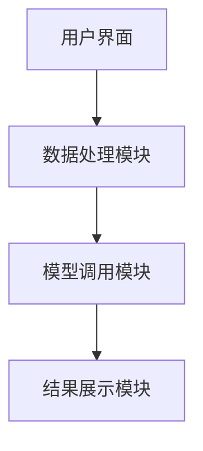

                 


```markdown
# 智能简历筛选 AI Agent：LLM 在人力资源中的应用

> 关键词：智能简历筛选，LLM，大语言模型，人力资源，AI招聘

> 摘要：随着人工智能技术的迅速发展，特别是在大语言模型（LLM）领域的突破，智能简历筛选正在改变传统的招聘流程。本文深入探讨了LLM在人力资源管理中的应用，详细分析了其核心概念、算法原理、系统架构以及实际案例，展示了如何利用AI技术提高招聘效率和准确性。

---

# 第一部分：智能简历筛选的背景与概念

## 第1章：智能简历筛选的背景与问题

### 1.1 智能简历筛选的背景

#### 1.1.1 传统简历筛选的痛点
传统的简历筛选过程通常依赖人力资源部门手动处理，存在效率低下、成本高昂且容易出现人为误差的问题。企业每天需要处理大量简历，但筛选过程往往耗时且不够精准，导致人才浪费和招聘成本增加。

#### 1.1.2 AI技术在招聘中的应用现状
近年来，AI技术在招聘中的应用逐渐普及，尤其是在简历筛选、职位匹配和人才推荐方面。AI能够快速处理大量数据，帮助HR筛选出符合条件的候选人，显著提高了招聘效率。

#### 1.1.3 LLM在人力资源领域的潜力
大语言模型（LLM）具备强大的自然语言处理能力，能够深入理解简历内容和岗位需求，实现更精准的匹配。LLM在招聘中的应用不仅提高了效率，还能通过分析文本情绪和隐含信息，提供更深层次的人才评估。

### 1.2 问题背景与描述

#### 1.2.1 简历筛选的效率问题
传统简历筛选过程耗时长，尤其是在处理大量应聘者时，HR的工作负担过重，效率低下。

#### 1.2.2 人才匹配的准确性问题
由于主观因素和经验限制，人工筛选可能忽略潜在合适候选人，导致招聘决策的不准确。

#### 1.2.3 企业招聘需求的多样性
不同企业对岗位的要求各不相同，传统的固定筛选标准难以满足多样化的招聘需求。

### 1.3 问题解决的思路

#### 1.3.1 引入AI技术的必要性
通过AI技术，尤其是LLM，可以实现快速、精准的简历筛选，降低招聘成本，提高效率。

#### 1.3.2 LLM在简历筛选中的应用方向
LLM能够自动解析简历内容，理解岗位需求，实现智能匹配，提升招聘效果。

#### 1.3.3 技术与业务的结合点
结合企业的具体需求，利用LLM的技术优势，优化招聘流程，提升人才匹配度。

### 1.4 本章小结
本章介绍了智能简历筛选的背景，分析了传统筛选的痛点，并探讨了LLM在招聘中的应用潜力，为后续章节的深入分析奠定了基础。

---

# 第二部分：LLM的核心概念与原理

## 第2章：大语言模型（LLM）概述

### 2.1 LLM的核心概念

#### 2.1.1 什么是大语言模型
大语言模型是指经过大规模数据训练的深度学习模型，能够理解和生成人类语言，具备强大的文本处理能力。

#### 2.1.2 LLM的主要特点
- **大规模训练数据**：模型基于海量文本数据训练，具备广泛的知识覆盖。
- **多任务处理能力**：能够进行文本生成、翻译、问答等多种任务。
- **上下文理解**：通过上下文理解语义，生成连贯的文本。

#### 2.1.3 LLM的技术优势
- **准确性高**：通过深度学习优化，结果更准确。
- **效率高**：能够快速处理大量数据，节省时间。
- **可扩展性强**：适用于多种应用场景。

### 2.2 LLM的工作原理

#### 2.2.1 模型的训练过程
1. **数据预处理**：清洗和标注数据。
2. **模型构建**：采用Transformer架构，包含编码器和解码器。
3. **训练**：使用监督学习优化模型参数。

#### 2.2.2 模型的输入输出机制
- **输入**：文本数据。
- **输出**：生成的文本或对输入的理解结果。

#### 2.2.3 模型的推理过程
模型通过注意力机制和自适应编码器，对输入文本进行理解和生成。

### 2.3 LLM的主要算法

#### 2.3.1 变压器模型（Transformer）
Transformer模型由编码器和解码器组成，通过自注意力机制处理序列数据。

#### 2.3.2 注意力机制（Attention）
注意力机制通过计算输入序列中每个位置的重要性，提高模型对关键信息的捕捉能力。

#### 2.3.3 梯度下降与优化算法
使用Adam优化算法，通过梯度下降优化模型参数。

### 2.4 本章小结
本章详细介绍了LLM的核心概念和工作原理，分析了其在招聘中的潜力，为后续应用提供了理论基础。

---

# 第三部分：LLM在人力资源中的应用

## 第3章：智能简历筛选的实现原理

### 3.1 简历信息的结构化处理

#### 3.1.1 简历内容的提取与分析
通过NLP技术，提取简历中的关键信息，如工作经历、教育背景、技能等。

#### 3.1.2 简历信息的特征提取
将提取的信息转化为特征向量，便于模型处理。

#### 3.1.3 简历数据的预处理
包括数据清洗、格式统一等，确保数据质量。

### 3.2 岗位需求的语义分析

#### 3.2.1 岗位描述的关键词提取
从职位描述中提取关键技能和要求。

#### 3.2.2 岗位需求的语义理解
利用LLM理解职位描述的深层含义，生成匹配条件。

#### 3.2.3 岗位匹配的规则定义
基于语义理解，定义简历与岗位的匹配规则。

### 3.3 简历与岗位的匹配算法

#### 3.3.1 基于关键词的匹配
通过关键词匹配，筛选出符合要求的简历。

#### 3.3.2 基于语义的理解匹配
利用LLM的语义理解能力，进行更精准的匹配。

#### 3.3.3 多维度的综合匹配
结合多个维度的信息，进行全面评估，提高匹配准确性。

### 3.4 本章小结
本章详细探讨了LLM在简历筛选中的实现原理，分析了简历处理和岗位匹配的具体方法。

---

# 第四部分：系统架构与设计

## 第4章：系统架构设计

### 4.1 系统功能模块划分

#### 4.1.1 用户界面模块
提供友好的操作界面，方便用户输入简历和职位描述。

#### 4.1.2 数据处理模块
负责简历的解析和数据预处理。

#### 4.1.3 模型调用模块
调用LLM模型进行简历筛选和匹配。

#### 4.1.4 结果展示模块
展示筛选结果，包括匹配度和推荐理由。

### 4.2 系统架构图


### 4.3 系统接口设计

#### 4.3.1 API接口定义
- `POST /api/upload-resume`：上传简历。
- `POST /api/upload-job`：上传职位描述。
- `GET /api/results`：获取筛选结果。

#### 4.3.2 接口调用流程
1. 用户上传简历和职位描述。
2. 系统调用LLM模型进行处理。
3. 返回匹配结果。

### 4.4 本章小结
本章详细设计了系统的架构和接口，确保系统的高效运行和良好的用户体验。

---

# 第五部分：项目实战与案例分析

## 第5章：项目实战

### 5.1 环境搭建

#### 5.1.1 开发工具安装
安装Python、Jupyter Notebook等开发工具。

#### 5.1.2 依赖库安装
安装必要的库，如`transformers`和`pytorch`。

#### 5.1.3 模型下载与配置
下载预训练的LLM模型，并进行配置。

### 5.2 核心代码实现

#### 5.2.1 简历解析代码
```python
from transformers import pipeline

# 初始化模型
model = pipeline('question-generation')
```

#### 5.2.2 岗位需求分析代码
```python
def analyze_job_description(job_desc):
    return model(job_desc)
```

#### 5.2.3 匹配算法实现代码
```python
def match_candidates(candidates, job_desc):
    results = []
    for candidate in candidates:
        score = model.match(candidate, job_desc)
        results.append({'candidate': candidate, 'score': score})
    return results
```

### 5.3 代码解读与优化

#### 5.3.1 代码结构分析
分析代码的结构和功能，优化处理流程。

#### 5.3.2 代码优化建议
如增加并行处理，提高效率。

#### 5.3.3 代码测试与验证
通过测试案例验证代码的正确性。

### 5.4 案例分析

#### 5.4.1 实际案例介绍
以某科技公司为例，介绍系统的实际应用。

#### 5.4.2 系统运行结果
展示筛选结果和匹配度分析。

### 5.5 本章小结
本章通过实际案例展示了系统的实现和应用，验证了LLM在简历筛选中的有效性。

---

# 总结

智能简历筛选AI Agent的实现依赖于大语言模型的强大能力，通过结构化的简历处理和语义理解的岗位匹配，显著提高了招聘效率和准确性。本文从背景、原理、应用到系统设计和实战案例，全面探讨了LLM在人力资源中的应用，为未来的招聘流程优化提供了重要参考。
```

