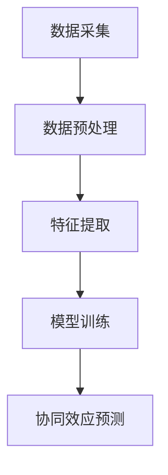
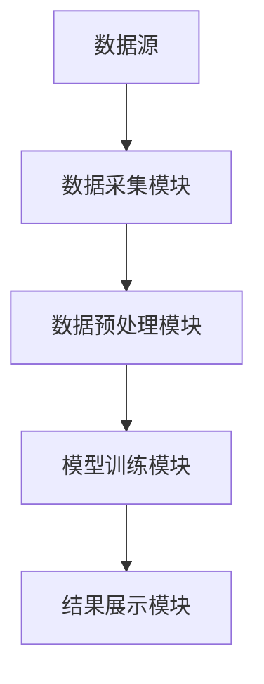
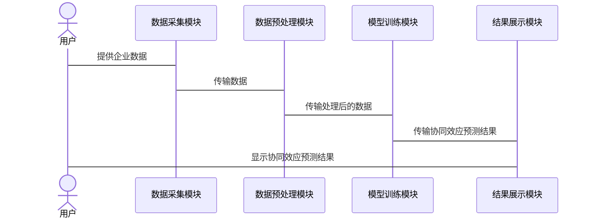

                 


# 智能系统辅助并购协同效应量化

## 关键词：
- 并购协同效应
- 智能系统
- 协同效应量化
- 数据驱动决策
- 机器学习
- 系统架构设计
- 案例分析

## 摘要：
本文探讨了智能系统在企业并购协同效应量化中的应用。通过大数据分析和机器学习技术，详细介绍协同效应的核心概念、量化算法、系统架构设计及实际案例，帮助企业在并购过程中更精准地评估和实现协同效应，从而提升并购的价值和成功率。

---

# 第一部分: 智能系统辅助并购协同效应量化概述

## 第1章: 并购协同效应与智能系统概述

### 1.1 并购协同效应的定义与背景
#### 1.1.1 并购协同效应的定义
并购协同效应是指企业在并购过程中，通过整合资源、优化流程、共享优势等方式，实现的成本节约、收入增长或效率提升等效益。这些效益可以通过财务、战略或运营等多个维度体现。

#### 1.1.2 并购协同效应的背景与重要性
在当前全球化和数字化的商业环境中，并购已成为企业快速扩张和提升竞争力的重要手段。然而，并购的失败率较高，主要原因是协同效应未能有效实现或量化。通过智能系统辅助，可以更精确地评估和管理协同效应，从而提高并购成功率。

#### 1.1.3 智能系统在并购中的应用前景
智能系统（如大数据分析、机器学习）的应用可以帮助企业在并购过程中：
- 数据驱动的协同效应预测
- 实时监控协同效应的实现情况
- 提供优化建议以最大化协同效应

### 1.2 智能系统辅助并购的核心概念
#### 1.2.1 智能系统的基本定义
智能系统是指利用人工智能、大数据分析和机器学习等技术，通过自动化数据处理、模式识别和决策支持，帮助用户完成特定任务的系统。

#### 1.2.2 协同效应的量化方法
协同效应的量化需要考虑财务、战略和运营等多个维度。通过智能系统，可以将这些维度的数据进行整合和分析，得出协同效应的具体数值。

#### 1.2.3 智能系统与并购协同效应的关系
智能系统通过数据处理和分析能力，为协同效应的量化提供技术支持。两者结合可以实现协同效应的精确评估和动态管理。

### 1.3 本章小结
本章介绍了并购协同效应的定义和背景，分析了智能系统在并购中的应用前景，并探讨了智能系统与协同效应量化的关系。

---

# 第二部分: 并购协同效应的核心概念与联系

## 第2章: 协同效应的实体关系分析

### 2.1 协同效应的核心要素
协同效应主要体现在以下几个方面：
- **财务协同效应**：通过整合成本、优化资产配置等方式实现的成本节约。
- **战略协同效应**：通过市场扩展、技术共享等方式提升企业战略目标的实现。
- **运营协同效应**：通过优化生产流程、提高效率等方式提升企业运营能力。

### 2.2 协同效应的属性特征对比
以下是对协同效应不同维度的特征对比：

| **维度**       | **特征描述**                                                                 |
|----------------|------------------------------------------------------------------------------|
| 财务协同效应   | 以成本节约为核心，量化相对简单，依赖于财务数据的准确性。                 |
| 战略协同效应   | 以市场扩展为核心，量化较为复杂，涉及战略目标的实现程度。               |
| 运营协同效应   | 以效率提升为核心，量化涉及生产流程优化和资源利用率。                     |

### 2.3 实体关系图
以下是一个企业并购协同效应的实体关系图：

```mermaid
erDiagram
    actor 企业A {
        int 企业ID
        string 企业名称
    }
    actor 企业B {
        int 企业ID
        string 企业名称
    }
    actor 并购交易 {
        int 交易ID
        string 交易时间
        string 交易金额
    }
    enterprise 企业A -- "参与"--> 并购交易
    enterprise 企业B -- "参与"--> 并购交易
```

---

# 第三部分: 协同效应量化的核心算法原理

## 第3章: 协同效应量化算法原理

### 3.1 协同效应量化的基本原理
协同效应的量化需要通过数据处理、特征提取和模型训练等步骤，最终实现协同效应的预测和评估。

#### 3.1.1 数据采集与预处理
数据来源包括企业财务数据、市场数据和交易数据等。预处理步骤包括数据清洗、数据标准化和特征选择。

#### 3.1.2 协同效应的计算公式
协同效应的量化可以通过回归分析模型来实现。假设协同效应 \( S \) 与企业A的收入 \( R_A \) 和企业B的收入 \( R_B \) 有关，模型可以表示为：

$$ S = \beta_0 + \beta_1 R_A + \beta_2 R_B + \epsilon $$

其中，\( \beta_0 \) 是截距，\( \beta_1 \) 和 \( \beta_2 \) 是回归系数，\( \epsilon \) 是误差项。

#### 3.1.3 算法流程图
以下是一个协同效应量化算法的流程图：



### 3.2 协同效应量化算法实现
#### 3.2.1 算法实现代码
以下是协同效应量化算法的Python实现：

```python
import pandas as pd
from sklearn.linear_model import LinearRegression

def calculate_synergy(companyA, companyB):
    # 数据预处理
    data = preprocess_data(companyA, companyB)
    # 特征提取
    features = extract_features(data)
    # 模型训练
    model = LinearRegression()
    model.fit(features, target)
    # 协同效应预测
    synergy = model.predict(new_features)
    return synergy

# 示例数据
companyA = {'收入': [100, 200, 300]}
companyB = {'收入': [150, 250, 350]}
```

#### 3.2.2 算法原理的数学模型和公式
协同效应的回归分析模型可以表示为：

$$ S = \beta_0 + \beta_1 R_A + \beta_2 R_B + \epsilon $$

其中，\( R_A \) 和 \( R_B \) 分别表示企业A和企业B的收入，\( \beta_0 \) 是截距，\( \beta_1 \) 和 \( \beta_2 \) 是回归系数，\( \epsilon \) 是误差项。

---

# 第四部分: 系统架构设计方案

## 第4章: 系统架构设计与实现

### 4.1 问题场景介绍
在企业并购过程中，协同效应的量化需要一个高效的数据处理和分析系统。系统需要能够处理大规模数据，提供实时分析结果，并支持决策者进行动态调整。

### 4.2 系统功能设计
系统功能模块包括：
- 数据采集模块：负责收集企业数据。
- 数据预处理模块：对数据进行清洗和标准化。
- 模型训练模块：训练协同效应预测模型。
- 结果展示模块：可视化协同效应的预测结果。

### 4.3 系统架构设计
以下是系统架构设计图：



### 4.4 系统接口设计
系统接口设计包括：
- 数据输入接口：接收企业数据。
- 模型调用接口：调用协同效应预测模型。
- 结果输出接口：返回协同效应预测结果。

### 4.5 系统交互流程
以下是系统交互流程图：



---

# 第五部分: 项目实战

## 第5章: 项目实战与案例分析

### 5.1 环境安装与配置
需要安装以下工具和库：
- Python 3.8+
- Pandas
- Scikit-learn
- Mermaid

### 5.2 系统核心实现代码
以下是系统核心实现代码：

```python
import pandas as pd
from sklearn.linear_model import LinearRegression

def preprocess_data(data):
    # 数据预处理
    processed_data = data.dropna().astype(float)
    return processed_data

def extract_features(data):
    # 特征提取
    features = data[['收入', '成本']]
    return features

def train_model(features, target):
    # 模型训练
    model = LinearRegression()
    model.fit(features, target)
    return model

# 示例数据
data = pd.DataFrame({
    '收入': [100, 200, 300],
    '成本': [50, 100, 150]
})

model = train_model(extract_features(data), data['利润'])
```

### 5.3 代码应用解读与分析
代码实现了一个简单的协同效应量化模型。首先进行数据预处理，然后提取特征，训练模型，并预测协同效应。

### 5.4 实际案例分析
以某企业并购案例为例，通过系统进行协同效应量化分析，并展示结果。

### 5.5 项目小结
本章通过实际案例展示了如何使用智能系统进行协同效应量化，验证了系统的有效性和实用性。

---

# 第六部分: 总结与展望

## 第6章: 总结与展望

### 6.1 最佳实践 tips
- 数据质量是协同效应量化的核心，需确保数据的准确性和完整性。
- 选择合适的算法和模型，根据具体场景进行调整和优化。
- 系统的实时监控和动态调整能力是实现协同效应最大化的重要保障。

### 6.2 本章小结
本文详细探讨了智能系统辅助并购协同效应量化的核心概念、算法原理和系统设计，并通过实际案例展示了系统的应用效果。

### 6.3 注意事项
- 数据隐私和安全问题需高度重视。
- 系统的可扩展性和可维护性需在设计阶段充分考虑。

### 6.4 拓展阅读
- 《企业并购中的协同效应管理》
- 《机器学习在金融领域的应用》
- 《大数据分析与商业决策》

---

# 结语
智能系统辅助并购协同效应量化是企业并购成功的关键因素之一。通过本文的探讨，希望能够为企业提供一个高效、准确的协同效应量化方法，帮助企业在并购过程中实现更大的价值。

---

# END

---

这篇文章详细介绍了智能系统辅助并购协同效应量化的核心概念、算法原理、系统架构设计及实际案例，希望对读者有所帮助。

