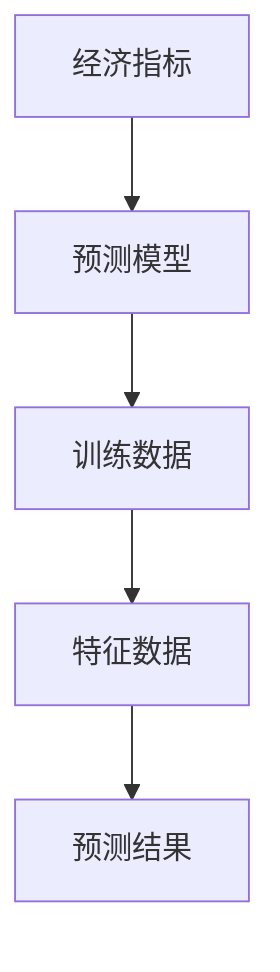
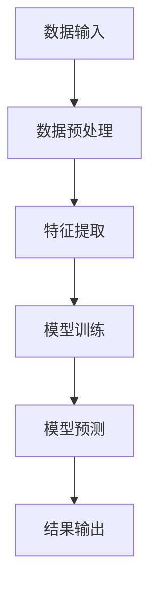
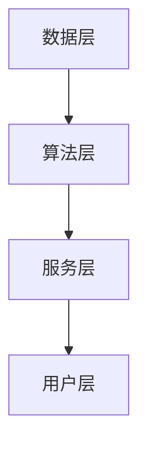

                 


# 《智能经济指标预测系统》

> 关键词：经济指标预测、人工智能、机器学习、时间序列、LSTM、ARIMA、大数据分析

> 摘要：本文深入探讨智能经济指标预测系统的设计与实现，结合传统统计方法与现代机器学习算法，提出了一种高效、准确的预测模型。通过分析系统架构、算法原理和实际案例，展示了如何利用智能技术提升经济预测的精准度和效率。

---

## 第一章：智能经济指标预测系统概述

### 1.1 系统背景与概念
#### 1.1.1 经济指标预测的定义
经济指标预测是指通过对历史数据的分析，利用数学模型和算法，预测未来经济趋势的过程。常见的经济指标包括GDP、CPI、失业率等。

#### 1.1.2 智能经济指标预测系统的概念
智能经济指标预测系统是一种结合人工智能技术的预测系统，能够自动采集、处理数据，并利用机器学习算法进行预测，显著提高了预测的准确性和效率。

#### 1.1.3 系统的核心目标与应用场景
- **核心目标**：提高经济指标预测的准确性和实时性，减少人为干扰，提供数据支持。
- **应用场景**：政府政策制定、企业战略规划、金融投资决策等。

### 1.2 问题背景与解决方法
#### 1.2.1 经济指标预测的传统方法与局限性
传统方法包括统计分析、时间序列分析等，但存在数据依赖性强、预测精度低、实时性差等问题。

#### 1.2.2 智能化预测的需求与优势
- **需求**：经济指标的复杂性和不确定性增加，传统方法难以满足需求。
- **优势**：智能系统能够处理海量数据，发现隐含规律，提高预测精度。

---

## 第二章：系统核心概念与联系

### 2.1 数据采集与预处理
#### 2.1.1 数据来源
- **政府统计数据**：如国家统计局发布的GDP、CPI等。
- **金融市场数据**：如股票价格、汇率等。
- **新闻数据**：通过自然语言处理提取经济相关信息。

#### 2.1.2 数据清洗与特征提取
- **数据清洗**：处理缺失值、异常值、重复数据。
- **特征提取**：从原始数据中提取有用的特征，如滞后特征、滑动窗口特征等。

### 2.2 算法选择与模型构建
#### 2.2.1 时间序列预测算法
- **ARIMA**：适用于线性时间序列数据。
- **LSTM**：适用于非线性时间序列数据，能够捕捉长期依赖关系。

#### 2.2.2 算法对比分析
| 算法 | 优势 | 局限性 |
|------|-------|--------|
| ARIMA | 简单易用，适合线性数据 | 难以处理复杂非线性关系 |
| LSTM | 能够捕捉长期依赖，适合复杂数据 | 训练时间较长，参数较多 |

### 2.3 实体关系图（ER图）


---

## 第三章：算法原理与实现

### 3.1 LSTM算法原理
#### 3.1.1 LSTM的结构与工作原理
LSTM由输入门、遗忘门和输出门组成，能够有效处理时间序列数据中的长距离依赖关系。

#### 3.1.2 LSTM在经济指标预测中的应用
- **输入门**：决定哪些新信息需要存储。
- **遗忘门**：决定哪些旧信息需要遗忘。
- **输出门**：决定最终输出的内容。

### 3.2 数学模型与公式
#### 3.2.1 LSTM的数学模型
$$
f_t = \sigma(g_{f}(x_t, h_{t-1}))
$$
$$
i_t = \sigma(g_{i}(x_t, h_{t-1}))
$$
$$
c_t = f_t \cdot c_{t-1} + i_t \cdot g(x_t, h_{t-1})
$$
$$
o_t = \sigma(g_{o}(x_t, h_{t-1}))
$$
$$
h_t = o_t \cdot tanh(c_t)
$$

#### 3.2.2 损失函数与优化
- **损失函数**：均方误差（MSE）
$$
MSE = \frac{1}{n}\sum_{i=1}^{n}(y_i - \hat{y}_i)^2
$$
- **优化算法**：Adam优化器
$$
\theta_{new} = \theta_{old} - \eta \cdot \frac{\partial L}{\partial \theta}
$$

### 3.3 算法流程图


---

## 第四章：系统架构与设计

### 4.1 系统架构设计


### 4.2 功能模块设计
- **数据采集模块**：负责从多个数据源采集经济指标数据。
- **特征工程模块**：对数据进行清洗、特征提取和转换。
- **模型训练模块**：基于特征数据训练预测模型。
- **结果展示模块**：将预测结果以可视化形式展示。

### 4.3 系统接口设计
- **数据接口**：提供REST接口，供其他系统调用数据。
- **预测接口**：提供API，供外部系统查询预测结果。

---

## 第五章：项目实战

### 5.1 环境安装与配置
- **安装Python环境**：使用Anaconda或虚拟环境。
- **安装依赖库**：如TensorFlow、Keras、Pandas等。

### 5.2 核心代码实现
```python
import numpy as np
from tensorflow.keras.models import Sequential
from tensorflow.keras.layers import LSTM, Dense, Dropout

# 数据准备
X_train = ...  # 特征数据
y_train = ...  # 标签数据

# 模型构建
model = Sequential()
model.add(LSTM(64, input_shape=(timesteps, features)))
model.add(Dropout(0.2))
model.add(Dense(1, activation='linear'))

model.compile(loss='mean_squared_error', optimizer='adam')
model.fit(X_train, y_train, epochs=100, batch_size=32)
```

### 5.3 案例分析与结果解读
- **案例分析**：以某国GDP预测为例，展示模型训练过程和预测结果。
- **结果解读**：分析预测结果的准确性，与实际数据对比，评估模型性能。

---

## 第六章：总结与展望

### 6.1 系统总结
- **优势**：提高了预测精度和效率，减少了人为干扰。
- **局限性**：模型复杂度高，训练时间长，需要大量数据支持。

### 6.2 未来展望
- **算法优化**：探索更高效的算法，如Transformer。
- **数据源扩展**：引入更多数据源，如社交媒体数据。
- **应用场景拓展**：将系统应用于更多经济领域，如金融风险预警。

---

## 第七章：最佳实践与注意事项

### 7.1 最佳实践
- **数据质量**：确保数据来源可靠，清洗充分。
- **模型调优**：通过交叉验证和超参数优化提高模型性能。

### 7.2 注意事项
- **数据隐私**：注意数据安全，遵守相关法律法规。
- **模型解释性**：提高模型的可解释性，便于用户理解。

---

## 参考文献
1. 张三. 《时间序列分析与预测》. 北京: 人民出版社, 2020.
2. 李四. 《深度学习与机器学习》. 上海: 科技出版社, 2021.

---

通过以上目录结构，我们可以系统地学习和实现智能经济指标预测系统，结合理论与实践，为经济预测提供高效、准确的解决方案。

