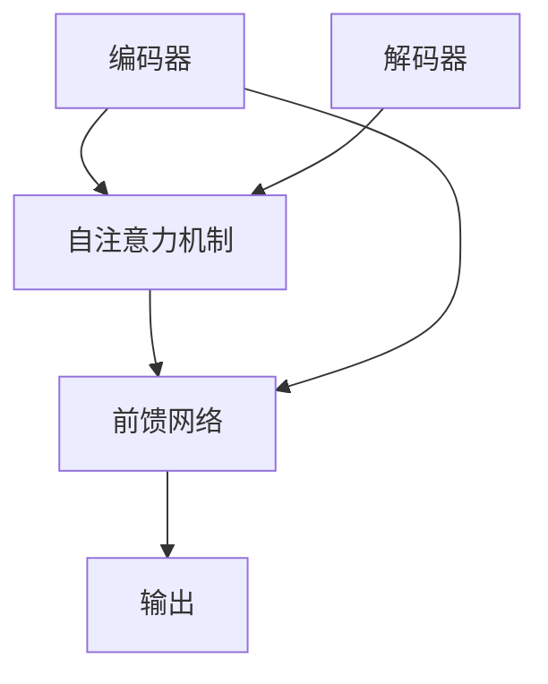
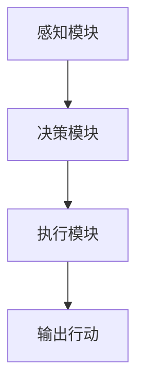
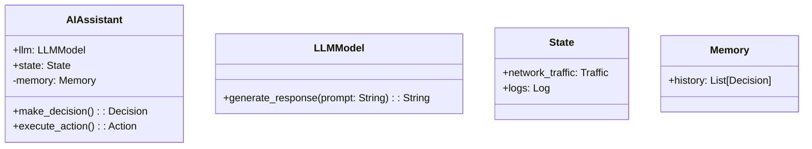
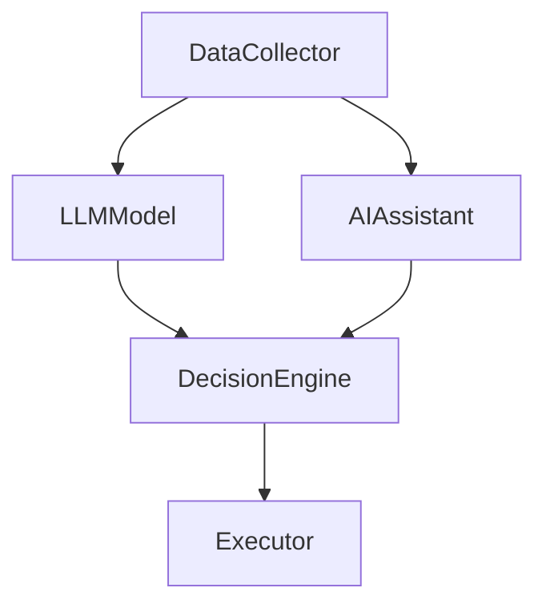

                 


# 《智能网络安全分析 AI Agent：LLM 在网络防御中的应用》

> **关键词**: 智能网络安全分析, AI Agent, 大语言模型, LLM, 网络防御, 人工智能安全

> **摘要**: 本文探讨了AI Agent和大语言模型（LLM）在网络安全中的应用，特别是网络防御领域。通过分析LLM和AI Agent的核心概念、算法原理、系统架构以及实际案例，本文旨在展示如何利用这些技术提升网络安全分析的智能化水平，实现更高效、更精准的网络防御。

---

## 第1章: 智能网络安全分析概述

### 1.1 网络安全分析的背景与挑战

网络安全分析是保障网络系统安全的重要环节，传统的安全分析依赖于预定义的规则和模式识别，难以应对日益复杂的网络攻击手段。随着网络安全威胁的多样化和智能化，传统的被动防御模式逐渐暴露出局限性。

#### 1.1.1 传统网络安全分析的局限性

- **规则依赖性**：传统安全分析基于固定的规则和模式，难以应对未知的、复杂的攻击手段。
- **被动性**：传统方法主要依赖日志分析和事后响应，缺乏主动防御能力。
- **数据孤岛**：不同安全工具和系统之间缺乏有效整合，导致数据分散，难以形成完整的威胁画像。

#### 1.1.2 智能化网络安全分析的需求

- **实时性**：需要实时监控网络流量，快速识别潜在威胁。
- **主动性**：能够主动发现异常行为，预测潜在攻击。
- **智能化**：具备自我学习和适应能力，能够应对新型攻击手法。

#### 1.1.3 LLM在网络安全中的应用前景

大语言模型（LLM）凭借其强大的自然语言处理能力和知识表示能力，为网络安全分析提供了新的可能性。LLM可以辅助分析日志、理解上下文、生成威胁情报，甚至可以用于自动化响应。

---

### 1.2 AI Agent的基本概念与特点

AI Agent（人工智能代理）是一种能够感知环境、自主决策并采取行动的智能实体。

#### 1.2.1 AI Agent的定义

AI Agent是指能够感知环境、自主决策并采取行动以实现目标的智能实体。在网络安全领域，AI Agent可以用于实时监控、异常检测、威胁响应等任务。

#### 1.2.2 AI Agent的核心特点

- **自主性**：AI Agent能够自主决策，无需人工干预。
- **反应性**：能够实时感知环境变化并做出反应。
- **协作性**：能够与其他系统、AI Agent协同工作，形成整体防御能力。

#### 1.2.3 AI Agent与传统安全工具的区别

传统的安全工具（如防火墙、入侵检测系统）主要依赖预定义规则和模式识别，而AI Agent具备自主学习和适应能力，能够应对未知威胁。

---

### 1.3 大语言模型（LLM）在网络安全中的应用

大语言模型通过处理大量文本数据，具备强大的语义理解和生成能力，为网络安全分析提供了新的工具。

#### 1.3.1 LLM的基本原理

LLM基于Transformer模型，通过自注意力机制和前馈网络实现文本的理解和生成。其核心在于对输入文本的全局语义理解，能够捕捉文本中的上下文信息。

#### 1.3.2 LLM在网络安全中的优势

- **自然语言处理能力**：能够理解和生成人类语言，适用于日志分析、威胁情报生成等任务。
- **知识表示能力**：能够将分散的安全数据整合，形成完整的威胁画像。
- **快速响应**：通过生成式模型，能够快速生成应对策略。

#### 1.3.3 LLM在网络安全中的挑战

- **计算资源需求**：LLM需要大量计算资源，可能限制其在边缘设备上的应用。
- **模型鲁棒性**：需要确保模型在面对攻击者混淆策略时的可靠性。
- **隐私问题**：处理大量数据可能引发隐私泄露风险。

---

## 第2章: LLM与AI Agent的核心概念与联系

### 2.1 LLM的体系结构

LLM的核心是Transformer模型，包括编码器和解码器两部分。

#### 2.1.1 Transformer模型的结构

- **编码器**：负责将输入文本转换为语义向量。
- **解码器**：根据编码器输出生成目标文本。

Mermaid图示：



#### 2.1.2 注意力机制的实现

注意力机制通过计算输入序列中每个位置的权重，确定每个位置的重要性。其计算公式为：

$$
\text{Attention}(Q, K, V) = \text{softmax}\left(\frac{QK^T}{\sqrt{d_k}}\right)V
$$

其中，$Q$、$K$、$V$分别是查询、键、值向量，$d_k$是向量的维度。

---

### 2.2 AI Agent的体系结构

AI Agent的体系结构包括感知、决策和执行三个模块。

#### 2.2.1 AI Agent的组成

- **感知模块**：负责收集网络数据和环境信息。
- **决策模块**：基于感知信息，生成应对策略。
- **执行模块**：根据决策模块的指令采取行动。

Mermaid图示：



---

### 2.3 LLM与AI Agent的协同工作原理

LLM作为知识库，为AI Agent提供决策支持；AI Agent作为执行者，负责具体行动。

#### 2.3.1 LLM作为知识库

- **知识存储**：存储网络安全相关的知识和经验。
- **决策支持**：通过LLM生成多种应对策略，供AI Agent选择。

#### 2.3.2 AI Agent作为执行者

- **任务执行**：根据LLM生成的策略，采取具体行动。
- **反馈机制**：将执行结果反馈给LLM，用于模型优化。

---

## 第3章: LLM在网络安全中的算法原理

### 3.1 LLM的算法原理

#### 3.1.1 Transformer模型的数学公式

Transformer模型的前馈网络部分由多层感知机组成，其数学表达式为：

$$
f(x) = \text{ReLU}(Wx + b)
$$

其中，$W$和$b$是模型参数，$\text{ReLU}$是激活函数。

#### 3.1.2 注意力机制的数学公式

注意力机制通过计算查询与键之间的相似性，确定每个键的重要性。其数学公式为：

$$
\text{Attention}(Q, K, V) = \text{softmax}\left(\frac{QK^T}{\sqrt{d_k}}\right)V
$$

---

### 3.2 AI Agent的算法原理

#### 3.2.1 强化学习的基本原理

强化学习通过奖励机制，优化决策策略。其数学公式为：

$$
Q(s, a) = Q(s, a) + \alpha (r + \max Q(s', a') - Q(s, a))
$$

其中，$\alpha$是学习率，$r$是奖励，$s$是状态，$a$是动作。

---

## 第4章: 系统分析与架构设计

### 4.1 系统功能设计

#### 4.1.1 实时网络监控

AI Agent通过网络嗅探和流量分析，实时监控网络流量，识别异常行为。

#### 4.1.2 异常行为检测

利用LLM分析日志和流量数据，识别潜在的攻击行为。

#### 4.1.3 威胁情报分析

结合外部威胁情报和内部数据，生成全面的威胁画像。

Mermaid类图：



---

### 4.2 系统架构设计

#### 4.2.1 分层架构

系统采用分层架构，包括数据采集层、处理层和决策层。

Mermaid架构图：



---

## 第5章: 项目实战

### 5.1 环境安装与配置

- **操作系统**：Linux/Windows/MacOS
- **依赖安装**：安装Python、TensorFlow、PyTorch等框架。

### 5.2 核心代码实现

```python
import torch
from model.llm import LLMModel
from agent.ai_agent import AIAssistant

# 初始化模型
llm = LLMModel()
agent = AIAssistant(llm)

# 处理输入
input_text = "检测到异常流量"
response = agent.analyze(input_text)
print(response)
```

---

## 第6章: 总结与展望

### 6.1 总结

本文详细探讨了AI Agent和LLM在网络安全中的应用，分析了其核心概念、算法原理和系统架构。通过实际案例，展示了这些技术在提升网络安全分析智能化水平中的巨大潜力。

### 6.2 展望

未来，随着LLM和AI Agent技术的不断发展，网络安全分析将更加智能化和自动化。同时，如何解决计算资源需求、模型鲁棒性和隐私保护等问题，仍需要进一步研究和探索。

---

**注**：本文仅为示例，实际内容需根据具体技术细节和研究进展进行补充和完善。

