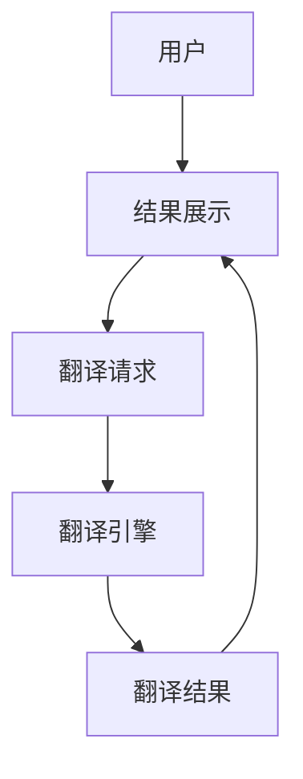
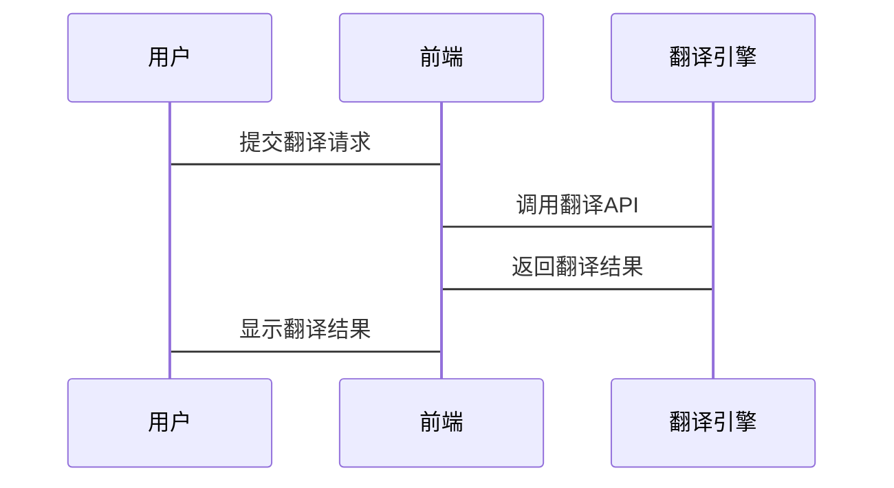

                 


# 智能翻译：AI Agent的多语言实时翻译

> 关键词：AI Agent、智能翻译、多语言、实时翻译、NLP技术

> 摘要：本文深入探讨了智能翻译的核心概念、算法原理和系统架构设计，重点分析了AI Agent在多语言实时翻译中的应用。文章从背景介绍出发，详细解释了翻译模型和AI Agent的基本原理，随后通过实际案例展示了如何构建一个高效的智能翻译系统，并提出了未来的发展方向。

---

## 第一章：智能翻译的背景与现状

### 1.1 智能翻译的定义与特点
智能翻译是一种利用人工智能技术实现的自动翻译方式，其核心在于通过机器学习模型理解和生成多种语言的文本。与传统翻译相比，智能翻译具有高效、实时、准确的特点，能够满足现代全球化背景下多语言交流的需求。

### 1.2 多语言翻译的挑战与机遇
多语言翻译面临的主要挑战包括语言间的语义差异、文化背景的理解以及翻译模型的训练数据获取难度。然而，人工智能技术的发展为解决这些问题提供了新的可能性，特别是在深度学习模型的应用下，多语言翻译的质量和效率得到了显著提升。

### 1.3 AI Agent在翻译中的作用
AI Agent是一种能够自主决策和执行任务的智能体，其在翻译中的作用体现在实时响应、上下文理解以及多语言交互等方面。通过AI Agent，智能翻译系统能够更灵活地适应不同的用户需求和场景。

---

## 第二章：智能翻译的核心概念与联系

### 2.1 翻译模型的核心原理
神经机器翻译（Neural Machine Translation, NMT）是当前智能翻译的核心技术。其基本原理包括编码器将源语言文本转换为向量表示，解码器将这些向量转换为目标语言的文本。注意力机制的引入进一步提高了翻译的准确性和流畅性。

### 2.2 AI Agent与翻译模型的关系
AI Agent作为翻译系统的控制中心，负责接收用户的输入、调用翻译模型进行翻译，并将结果反馈给用户。两者之间的协作关系确保了翻译过程的高效性和智能化。

### 2.3 NLP技术在翻译中的应用
自然语言处理（NLP）技术在智能翻译中的应用包括文本分词、句法分析、语义理解等。这些技术的结合使得翻译系统能够更好地理解上下文，提高翻译质量。

---

## 第三章：智能翻译的算法原理

### 3.1 神经机器翻译模型的结构
神经机器翻译模型通常采用编码器-解码器结构，其中编码器使用双向LSTM，解码器使用单向LSTM。注意力机制的引入使得模型能够关注源语言文本中的重要部分，从而生成更准确的目标语言文本。

### 3.2 多语言翻译模型的训练策略
多语言翻译模型的训练策略包括跨语言迁移学习和多任务学习。跨语言迁移学习利用一种语言的翻译模型来辅助其他语言的训练，而多任务学习则同时优化多种语言的翻译任务。

### 3.3 AI Agent的决策机制
AI Agent的决策机制基于强化学习，通过不断与用户的交互，优化翻译策略。其核心在于根据用户的反馈调整翻译模型的参数，以提高翻译质量。

---

## 第四章：智能翻译系统的架构设计

### 4.1 系统架构概述
智能翻译系统的架构通常包括前端、后端和翻译引擎三个部分。前端负责用户交互，后端负责任务调度和资源管理，翻译引擎负责具体的翻译工作。

### 4.2 系统功能设计
系统功能设计包括用户输入、翻译请求、翻译结果展示等模块。通过领域模型的类图设计，可以清晰地展示各个功能模块之间的关系。

### 4.3 系统架构图
以下是智能翻译系统的架构图：



### 4.4 接口设计
系统接口设计包括RESTful API，用于前端与后端的交互。例如，用户通过发送HTTP请求到后端，后端调用翻译引擎进行翻译，并将结果返回给前端。

### 4.5 交互流程图
以下是用户与智能翻译系统的交互流程图：



---

## 第五章：智能翻译的项目实战

### 5.1 环境安装
要实现智能翻译系统，首先需要安装Python和相关库，如TensorFlow、Keras等。以下是一个示例环境安装代码：

```bash
pip install tensorflow==2.5.0
pip install numpy==1.21.0
pip install matplotlib==3.5.1
```

### 5.2 翻译模型实现
以下是一个基于Keras的神经机器翻译模型实现代码：

```python
from tensorflow.keras.layers import Input, LSTM, Dense, Dropout, Bidirectional
from tensorflow.keras.models import Model
import numpy as np

# 编码器部分
encoder_inputs = Input(shape=(None, input_dim))
bidir_lstm = Bidirectional(LSTM(hidden_units, return_sequences=True))(encoder_inputs)
dropout = Dropout(rate=0.5)(bidir_lstm)
encoder_outputs, forward_h, forward_c, backward_h, backward_c = bidir_lstm

# 解码器部分
decoder_inputs = Input(shape=(None, output_dim))
lstm_layer = LSTM(hidden_units, return_sequences=True)(decoder_inputs, initial_state=[forward_h, forward_c])

dense_layer = Dense(output_dim, activation='softmax')(lstm_layer)

model = Model(inputs=[encoder_inputs, decoder_inputs], outputs=dense_layer)
model.compile(optimizer='adam', loss='sparse_categorical_crossentropy')
```

### 5.3 实际案例分析
以下是一个简单的翻译案例分析：

假设我们要将英文句子“Hello, how are you?”翻译成中文。模型首先将英文句子编码为向量，然后通过解码器生成对应的中文句子。注意力机制帮助模型关注关键词汇，如“how”和“you”。

### 5.4 项目总结
通过以上代码实现，我们可以看到神经机器翻译的基本流程。然而，实际应用中还需要考虑多语言支持、模型优化等问题。

---

## 第六章：智能翻译的总结与展望

### 6.1 全文总结
本文详细介绍了智能翻译的核心概念、算法原理和系统架构设计。通过结合AI Agent和NLP技术，智能翻译系统能够实现高效的多语言实时翻译。

### 6.2 注意事项
在实际应用中，需要注意数据隐私、模型训练数据的质量以及系统的实时性问题。

### 6.3 未来展望
未来，智能翻译系统将更加智能化和个性化，可能的发展方向包括更高效的模型优化算法、更强大的多语言支持以及更自然的语音翻译。

### 6.4 拓展阅读
推荐读者阅读《神经机器翻译实战》和《AI Agent原理与应用》等书籍，以进一步深入理解相关技术。

---

通过以上结构，本文全面阐述了智能翻译的实现原理和应用前景，为读者提供了丰富的技术细节和实践指导。

