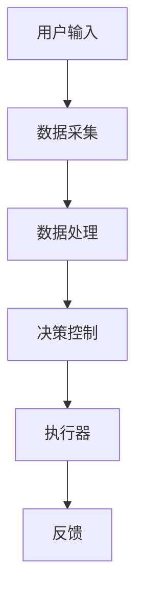
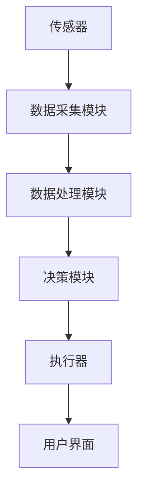
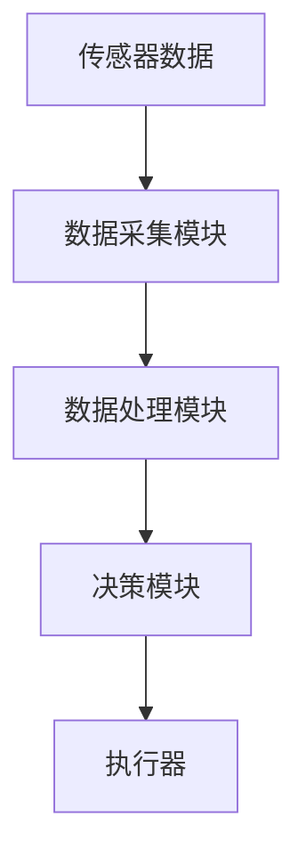

                 


# 智能花园系统：AI Agent的生态平衡维护

> 关键词：智能花园系统、AI Agent、生态平衡、系统架构、算法原理

> 摘要：本文探讨了智能花园系统中AI Agent如何实现生态平衡的维护。通过详细分析AI Agent的核心原理、算法设计、系统架构以及实际项目案例，本文为读者提供了一个全面的理解框架，展示了如何通过技术创新实现智能 gardening 的目标。

---

# 第一部分: 智能花园系统与AI Agent概述

## 第1章: 智能花园系统与AI Agent概述

### 1.1 智能花园系统的基本概念

#### 1.1.1 智能花园系统的定义
智能花园系统是一种利用人工智能、物联网和自动化技术实现花园管理的智能化系统。它通过传感器、摄像头等设备实时监测花园环境，并利用AI算法优化植物生长、水分管理、病虫害防治等过程。

#### 1.1.2 AI Agent在智能花园中的作用
AI Agent（智能体）是智能花园系统的核心，负责接收传感器数据、分析环境信息、制定决策并执行操作。AI Agent能够自主学习和优化，以实现更高效的花园管理。

#### 1.1.3 智能花园系统的背景与意义
随着城市化的发展，土地资源有限，人们对高效利用空间的需求增加。智能花园系统通过AI Agent实现精准管理，不仅提高了植物生长效率，还能节水节电，减少人工成本。

### 1.2 智能花园系统的生态平衡

#### 1.2.1 生态平衡的定义与重要性
生态平衡是指花园系统中各组成部分（如植物、土壤、水、空气）之间的动态平衡。维持生态平衡对于植物健康生长和系统长期稳定至关重要。

#### 1.2.2 AI Agent在生态平衡中的角色
AI Agent通过实时监测环境数据，分析植物需求，调整灌溉、施肥和光照等参数，从而维持花园生态平衡。例如，当土壤湿度低于阈值时，AI Agent会触发灌溉系统。

#### 1.2.3 智能花园系统的边界与外延
智能花园系统的边界包括花园的物理空间和传感器覆盖范围。外延则涉及与外部数据源（如天气预报）的集成，以及与其他智能设备（如智能家居）的联动。

### 1.3 智能花园系统的组成部分

#### 1.3.1 系统的核心要素
智能花园系统主要由以下部分组成：
1. **传感器**：监测土壤湿度、温度、光照强度、空气质量等。
2. **执行器**：如灌溉系统、LED灯、喷雾装置等。
3. **AI Agent**：负责数据处理、决策和系统控制。
4. **用户界面**：供用户查看数据和控制系统。

#### 1.3.2 各要素之间的关系
传感器提供数据，AI Agent分析数据并制定决策，执行器根据决策执行操作，用户界面则为用户提供交互入口。

#### 1.3.3 系统的结构与功能
智能花园系统的结构分为感知层、决策层和执行层。感知层由传感器构成，决策层由AI Agent负责，执行层由执行器构成。

---

# 第二部分: AI Agent的核心概念与原理

## 第2章: AI Agent的基本原理

### 2.1 AI Agent的定义与特点

#### 2.1.1 AI Agent的定义
AI Agent是一种能够感知环境、自主决策并执行任务的智能实体。它能够通过学习和适应优化其行为。

#### 2.1.2 AI Agent的核心特点
1. **自主性**：能够在没有外部干预的情况下运行。
2. **反应性**：能够实时感知环境变化并做出反应。
3. **学习能力**：通过机器学习算法不断优化其决策能力。

### 2.2 AI Agent的感知与决策机制

#### 2.2.1 感知机制的实现
AI Agent通过传感器获取环境数据，如土壤湿度、光照强度等。这些数据经过预处理后，输入到感知模型中。

#### 2.2.2 决策机制的原理
基于感知到的数据，AI Agent利用决策算法（如强化学习）制定最优决策，例如决定是否开启灌溉系统。

#### 2.2.3 感知与决策的协同作用
感知和决策是AI Agent的核心环节，它们协同工作以确保系统能够实时响应环境变化。

### 2.3 AI Agent的执行与反馈机制

#### 2.3.1 执行机制的实现
AI Agent通过执行器（如灌溉系统）执行决策。执行过程需要考虑系统的延迟和可靠性。

#### 2.3.2 反馈机制的作用
执行后的反馈（如灌溉后的土壤湿度变化）会被AI Agent用于优化未来的决策。

#### 2.3.3 执行与反馈的闭环系统
感知-决策-执行-反馈形成闭环，确保系统能够持续优化。

---

# 第三部分: AI Agent的算法与系统架构

## 第3章: AI Agent的算法原理

### 3.1 感知算法

#### 3.1.1 数据采集与处理
传感器数据需要经过清洗、归一化等预处理步骤，以便更好地用于后续分析。

#### 3.1.2 感知模型的构建
感知模型可以是基于机器学习的回归模型，用于预测土壤湿度或光照强度。

#### 3.1.3 感知算法的实现
以下是感知算法的伪代码示例：

```python
def感知算法(传感器数据):
    预处理数据
    输入模型
    返回预测结果
```

### 3.2 决策算法

#### 3.2.1 决策模型的构建
决策模型可以基于强化学习，通过奖励机制优化决策策略。

#### 3.2.2 决策算法的实现
以下是决策算法的伪代码示例：

```python
def决策算法(感知结果):
    状态识别
    选择动作
    返回决策结果
```

### 3.3 执行与反馈算法

#### 3.3.1 执行机制的实现
执行器根据决策结果启动相应的操作。

#### 3.3.2 反馈机制的作用
反馈数据用于优化AI Agent的模型参数，提升未来决策的准确性。

---

## 第4章: 系统架构设计

### 4.1 系统功能设计

#### 4.1.1 系统功能模块
智能花园系统主要包括数据采集、数据处理、决策控制和用户交互四大模块。

#### 4.1.2 系统功能流程图
以下是系统功能流程图的Mermaid图：



### 4.2 系统架构设计

#### 4.2.1 系统架构图
以下是系统架构图的Mermaid图：



### 4.3 系统接口设计

#### 4.3.1 系统接口
主要接口包括传感器接口、执行器接口和用户界面接口。

#### 4.3.2 接口交互流程
以下是接口交互流程的Mermaid图：



### 4.4 系统交互设计

#### 4.4.1 用户与系统的交互
用户可以通过手机APP或网页界面查看花园状态并控制系统。

#### 4.4.2 系统与环境的交互
系统通过传感器感知环境变化，并通过执行器改变环境状态。

---

# 第四部分: 项目实战

## 第5章: 项目实战

### 5.1 环境配置

#### 5.1.1 硬件配置
需要配置土壤湿度传感器、光照强度传感器、LED灯、灌溉系统等硬件设备。

#### 5.1.2 软件配置
安装必要的Python库（如numpy、pandas、scikit-learn）和系统框架（如Flask或Django）。

### 5.2 系统核心代码实现

#### 5.2.1 数据采集模块
以下是数据采集模块的代码示例：

```python
import numpy as np

def采集数据():
    土壤湿度 = np.random.uniform(0, 100)
    光照强度 = np.random.uniform(0, 1000)
    return 土壤湿度, 光照强度
```

#### 5.2.2 决策模块
以下是决策模块的代码示例：

```python
def决策算法(土壤湿度, 光照强度):
    if 土壤湿度 < 30:
        return '开启灌溉'
    elif 光照强度 > 700:
        return '关闭LED灯'
    else:
        return '无操作'
```

### 5.3 功能测试

#### 5.3.1 测试用例设计
设计测试用例，验证系统在不同条件下的响应。

#### 5.3.2 测试结果分析
分析测试结果，优化算法和系统架构。

### 5.4 案例分析

#### 5.4.1 案例背景
假设某天土壤湿度为25%，光照强度为800。

#### 5.4.2 系统响应
AI Agent会触发灌溉系统开启。

#### 5.4.3 测试结果
灌溉后土壤湿度上升至70%，系统恢复正常。

---

# 第五部分: 最佳实践与总结

## 第6章: 最佳实践

### 6.1 设计与实现经验总结

#### 6.1.1 设计原则
1. **模块化设计**：确保系统各模块独立，便于维护和扩展。
2. **实时性优化**：减少系统延迟，提升响应速度。

#### 6.1.2 实现技巧
1. **数据预处理**：确保数据的准确性和一致性。
2. **算法优化**：通过调参和模型优化提升决策准确率。

### 6.2 系统维护与优化

#### 6.2.1 维护方法
定期检查传感器和执行器，更新系统软件，优化算法参数。

#### 6.2.2 注意事项
注意数据隐私和系统安全，避免恶意攻击。

### 6.3 拓展阅读

#### 6.3.1 相关领域
探索AI在农业、环保等领域的应用。

#### 6.3.2 推荐资源
推荐阅读《机器学习实战》和《智能控制系统设计》等书籍。

---

## 第7章: 总结与展望

### 7.1 全文总结
本文详细介绍了智能花园系统中AI Agent的设计与实现，探讨了其在生态平衡维护中的重要作用。

### 7.2 未来展望
未来，随着AI和物联网技术的进步，智能花园系统将更加智能化和自动化，为人们创造更美好的生活环境。

---

通过以上结构，您可以逐步完成《智能花园系统：AI Agent的生态平衡维护》的完整内容撰写。

