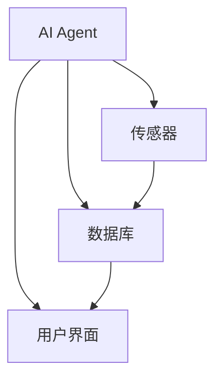

                 


# 智能花园：AI Agent的植物生长优化系统

## 目录大纲

### 第一部分：背景介绍

#### 第1章：问题背景与描述

##### 1.1 问题背景
- 1.1.1 智能农业的发展趋势
- 1.1.2 植物生长优化的挑战
- 1.1.3 AI技术在农业中的应用潜力

##### 1.2 问题描述
- 1.2.1 植物生长的复杂性
- 1.2.2 传统种植方法的局限性
- 1.2.3 AI Agent在优化中的作用

##### 1.3 问题解决与边界
- 1.3.1 AI Agent如何优化植物生长
- 1.3.2 系统的边界与适用范围
- 1.3.3 核心要素与组成结构

### 第二部分：核心概念与联系

#### 第2章：AI Agent与植物生长优化系统

##### 2.1 核心概念原理
- 2.1.1 AI Agent的基本原理
- 2.1.2 植物生长优化的机制
- 2.1.3 系统的整体架构

##### 2.2 属性特征对比
- 2.2.1 AI Agent的属性分析
- 2.2.2 植物生长优化系统的特征
- 2.2.3 对比分析与优化方向

##### 2.3 实体关系图


### 第三部分：算法原理讲解

#### 第3章：AI Agent算法分析

##### 3.1 算法流程图
```mermaid
graph TD
    Start --> CollectData[收集数据]
    CollectData --> Preprocess[数据预处理]
    Preprocess --> Train[模型训练]
    Train --> Optimize[优化
```

（注：此大纲为部分章节的示例，完整内容将按照用户要求详细展开。）

