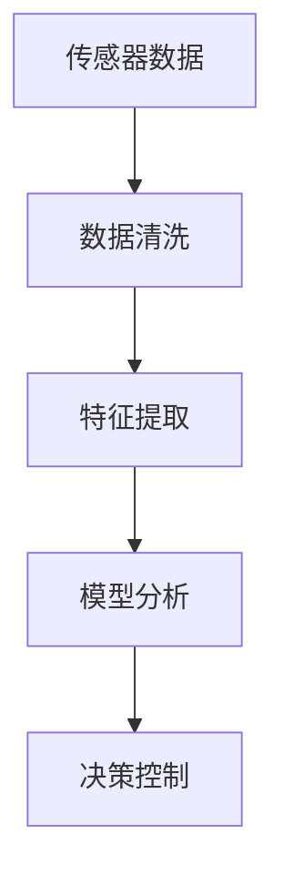
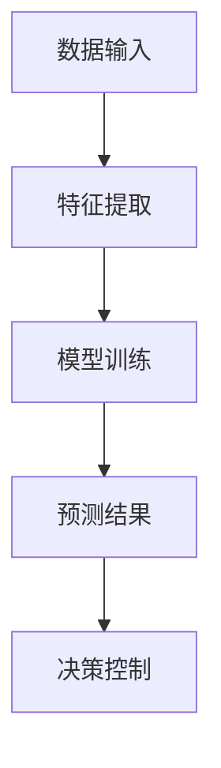
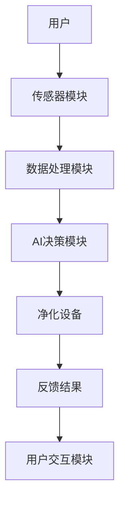
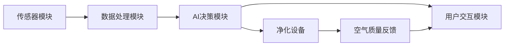
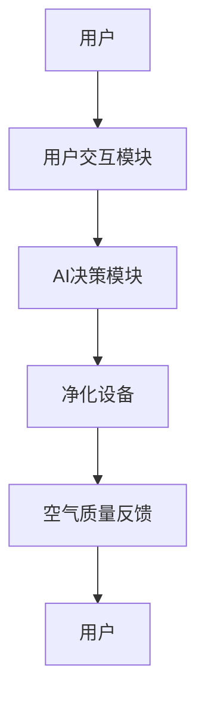

                 


# 智能花瓶：AI Agent的室内空气净化监测

> 关键词：AI Agent，室内空气净化，传感器技术，数据处理，系统架构

> 摘要：本文探讨了AI Agent在智能花瓶中的应用，通过传感器技术实时监测室内空气质量，并结合数据处理算法和系统架构设计，实现智能净化控制。文章详细分析了核心概念、算法原理、系统架构，并通过实际案例展示了项目的实现过程，最后提出了最佳实践建议。

---

# 第一章：背景介绍与核心概念

## 1.1 智能花瓶的背景与意义

### 1.1.1 室内空气质量问题的背景
现代社会人们对居住环境的健康要求日益提高，但室内空气污染问题依然严重。常见的污染物包括PM2.5、甲醛、TVOC等，这些污染物对健康的影响不容忽视。传统空气净化设备虽然能够处理部分污染物，但缺乏智能化和实时监测能力，难以满足人们对健康生活的追求。

### 1.1.2 智能花瓶的概念与目标
智能花瓶是一种结合了AI技术的室内空气净化设备，通过内置的传感器实时监测空气质量，并利用AI Agent（智能代理）进行数据分析和决策，从而实现自动化的空气净化控制。其目标是提供一种高效、智能的解决方案，为用户提供健康的室内环境。

### 1.1.3 AI Agent在智能花瓶中的作用
AI Agent作为智能花瓶的核心，负责接收传感器数据、分析空气质量状况，并根据预设的规则或模型做出净化控制决策。与传统设备相比，AI Agent能够实现智能化的主动管理，提升净化效率和用户体验。

## 1.2 问题背景与解决方案

### 1.2.1 室内空气污染的现状
随着工业化和城市化的快速发展，室内空气污染问题日益严重。封闭的建筑结构、装修材料释放的有害气体以及外部污染物的入侵，都使得室内空气质量堪忧。

### 1.2.2 传统空气净化设备的局限性
传统空气净化设备通常只能处理单一类型的污染物，且需要手动操作。它们缺乏实时监测和智能调节能力，无法根据空气质量变化自动调整净化策略。

### 1.2.3 AI Agent如何解决这些问题
AI Agent通过实时监测和数据分析，能够全面感知室内空气质量变化，并根据污染物种类和浓度动态调整净化策略。例如，当检测到甲醛浓度超标时，AI Agent可以启动特定的净化模式，快速降低污染物浓度。

## 1.3 智能花瓶的核心功能与边界

### 1.3.1 核心功能模块
智能花瓶的核心功能包括：
1. **空气质量监测**：实时采集PM2.5、甲醛、TVOC等污染物数据。
2. **智能净化控制**：根据传感器数据调整净化设备的运行状态。
3. **用户交互**：通过手机APP或语音助手提供实时反馈和控制功能。

### 1.3.2 系统的边界与外延
智能花瓶作为一个独立的系统，其边界包括传感器模块、数据处理模块和用户交互模块。外延部分则涉及与外部设备（如智能家居系统）的联动，以及数据的云端存储与分析。

### 1.3.3 系统的核心要素组成
- **传感器**：用于采集空气质量数据。
- **AI Agent**：负责数据分析和决策。
- **净化设备**：执行净化操作。
- **用户交互界面**：提供反馈和控制功能。

---

# 第二章：AI Agent与室内空气质量监测

## 2.1 AI Agent的基本原理

### 2.1.1 AI Agent的定义与特点
AI Agent是一种能够感知环境、自主决策并采取行动的智能实体。其特点包括：
- **自主性**：无需人工干预，自动完成任务。
- **反应性**：能够实时感知环境变化并做出反应。
- **学习能力**：通过数据学习优化决策模型。

### 2.1.2 AI Agent的核心算法
AI Agent的核心算法通常包括：
1. **数据处理算法**：如滤波、特征提取等。
2. **机器学习算法**：如回归、分类等，用于预测空气质量变化。
3. **决策算法**：基于预测结果制定净化策略。

### 2.1.3 AI Agent与传统自动化的区别
传统自动化依赖预设规则，而AI Agent能够通过学习和适应环境变化，做出更智能的决策。例如，传统设备可能只在固定时间开启，而AI Agent可以根据实时数据动态调整运行状态。

## 2.2 室内空气质量监测的传感器技术

### 2.2.1 常见传感器类型与功能
常用的传感器包括：
- **PM2.5传感器**：监测颗粒物浓度。
- **甲醛传感器**：检测甲醛浓度。
- **TVOC传感器**：监测总挥发性有机化合物浓度。
- **温湿度传感器**：提供环境温湿度数据。

### 2.2.2 传感器数据的采集与处理
传感器数据通常需要进行预处理，包括：
- **数据清洗**：去除噪声和异常值。
- **特征提取**：提取关键特征用于后续分析。
- **数据融合**：结合多种传感器数据提升准确性。

### 2.2.3 传感器的选型与优化
传感器选型需要考虑精度、成本和稳定性。例如，高精度的传感器可能成本较高，但适合对空气质量要求较高的用户。

## 2.3 AI Agent与传感器数据的结合

### 2.3.1 数据流的处理流程
1. **数据采集**：传感器实时采集空气质量数据。
2. **数据预处理**：清洗和标准化数据。
3. **特征提取**：提取关键特征用于模型分析。
4. **模型分析**：利用机器学习模型预测空气质量。
5. **决策控制**：根据预测结果调整净化设备运行状态。

### 2.3.2 AI Agent对数据的分析与决策
AI Agent通过分析传感器数据，判断当前空气质量状况，并根据预设规则或学习模型制定净化策略。例如，当PM2.5浓度超过阈值时，启动强力净化模式。

### 2.3.3 数据驱动的空气净化策略
基于传感器数据的实时反馈，AI Agent能够动态调整净化设备的运行参数，如风速、过滤效率等，以达到最优净化效果。

---

# 第三章：数据处理与AI算法实现

## 3.1 数据预处理与特征提取

### 3.1.1 数据清洗与标准化
数据清洗是去除噪声和异常值的过程，标准化则是将数据转换到统一尺度，便于后续分析。例如，将原始数据通过归一化处理，使其范围在[0,1]之间。

### 3.1.2 特征提取方法
特征提取是将原始数据转换为更有意义的特征。例如，可以提取PM2.5的平均值、甲醛浓度的最大值等。

### 3.1.3 数据流处理流程图


## 3.2 AI Agent的核心算法实现

### 3.2.1 机器学习模型的选择
常用的模型包括线性回归、随机森林和神经网络。例如，可以使用线性回归模型预测PM2.5浓度的变化趋势。

### 3.2.2 算法实现流程图


### 3.2.3 算法实现的Python代码示例
```python
import pandas as pd
from sklearn.linear_model import LinearRegression

# 数据预处理
data = pd.read_csv('air_quality.csv')
features = data[['PM2.5', '甲醛', 'TVOC']]
target = data['空气质量指数']

# 模型训练
model = LinearRegression()
model.fit(features, target)

# 预测空气质量
new_data = [[25, 0.1, 15]]  # 示例数据
prediction = model.predict(new_data)
print(f'预测空气质量指数为：{int(prediction[0])}')
```

## 3.3 数学模型与公式

### 3.3.1 线性回归模型
线性回归模型用于预测空气质量指数（AQI）：
$$ AQI = \beta_0 + \beta_1 \times PM2.5 + \beta_2 \times 甲醛 + \beta_3 \times TVOC + \epsilon $$

### 3.3.2 模型优化
通过交叉验证选择最优模型参数，例如：
$$ \text{MSE} = \frac{1}{n}\sum_{i=1}^{n}(y_i - \hat{y}_i)^2 $$
其中，MSE是均方误差，用于衡量模型预测的准确性。

---

# 第四章：系统架构与设计

## 4.1 系统功能设计

### 4.1.1 系统模块划分
系统主要模块包括：
- **传感器模块**：负责数据采集。
- **数据处理模块**：进行数据清洗和特征提取。
- **AI决策模块**：基于模型分析制定净化策略。
- **用户交互模块**：提供实时反馈和控制功能。

### 4.1.2 系统功能流程图


## 4.2 系统架构设计

### 4.2.1 系统架构图


### 4.2.2 接口设计
系统主要接口包括：
- 传感器数据接口：提供空气质量数据。
- AI决策接口：接收数据并返回净化策略。
- 用户交互接口：提供实时反馈和控制功能。

## 4.3 系统交互设计

### 4.3.1 交互流程图


---

# 第五章：项目实战与实现

## 5.1 项目环境搭建

### 5.1.1 系统需求
- **硬件**：PM2.5传感器、甲醛传感器、温湿度传感器、净化设备。
- **软件**：Python编程环境、数据处理库（如Pandas、NumPy）、机器学习库（如Scikit-learn）。

### 5.1.2 环境安装
```bash
pip install pandas numpy scikit-learn
```

## 5.2 核心代码实现

### 5.2.1 传感器数据采集
```python
import serial

ser = serial.Serial('COM3', 9600)  # 串口通信，假设传感器连接到COM3
data = ser.readline().decode().split(',')  # 读取数据并拆分
ser.close()
```

### 5.2.2 数据处理与模型训练
```python
import pandas as pd
from sklearn.model_selection import train_test_split
from sklearn.linear_model import LinearRegression

data = pd.DataFrame({
    'PM2.5': [25, 30, 28, 26],
    '甲醛': [0.1, 0.15, 0.12, 0.1],
    'TVOC': [15, 20, 18, 16]
})
target = [51, 60, 55, 50]  # 空气质量指数

# 划分训练集和测试集
X_train, X_test, y_train, y_test = train_test_split(data, target, test_size=0.2)

# 模型训练
model = LinearRegression()
model.fit(X_train, y_train)

# 模型测试
print(f'模型评分：{model.score(X_test, y_test)}')
```

## 5.3 实际案例分析

### 5.3.1 数据分析与优化
通过分析传感器数据，发现甲醛浓度在早晨和晚上较高，PM2.5浓度在午后较高。AI Agent可以根据这些规律优化净化策略，例如在特定时间段启动强力净化模式。

### 5.3.2 系统优化建议
- **数据优化**：增加数据采样频率，提升模型预测精度。
- **算法优化**：尝试使用更复杂的模型，如随机森林或神经网络，提高预测准确率。

## 5.4 项目小结

### 5.4.1 项目总结
通过本项目，我们实现了基于AI Agent的智能花瓶系统，能够实时监测室内空气质量并动态调整净化策略。系统的核心在于AI Agent的数据分析能力和传感器的实时监测功能。

### 5.4.2 最佳实践
- **数据安全**：确保传感器数据的安全存储和传输。
- **系统维护**：定期更新模型参数，保持系统的高效运行。
- **用户体验**：提供友好的用户交互界面，提升用户体验。

### 5.4.3 拓展阅读
建议进一步学习AI在物联网中的应用，探索更多智能设备的设计与实现。

---

# 第六章：小结与展望

## 6.1 系统小结
本文详细介绍了智能花瓶的设计与实现过程，包括背景分析、核心概念、算法实现、系统架构以及项目实战。通过AI Agent和传感器技术的结合，我们成功实现了智能化的室内空气净化监测系统。

## 6.2 应用价值与展望
智能花瓶的应用不仅提升了室内空气质量，还为智能家居的发展提供了新的思路。未来，可以进一步优化系统性能，拓展更多的应用场景，例如与其他智能家居设备联动，实现全屋空气质量的智能管理。

## 6.3 注意事项
- **数据隐私**：确保用户数据的安全性。
- **系统兼容性**：保证系统能够兼容不同品牌的传感器和净化设备。
- **用户体验**：持续优化用户交互界面，提升用户体验。

---

通过以上章节的内容，我们详细探讨了智能花瓶的设计与实现过程，为读者提供了从理论到实践的全面指导。希望本文能够为相关领域的研究和开发提供有价值的参考。

