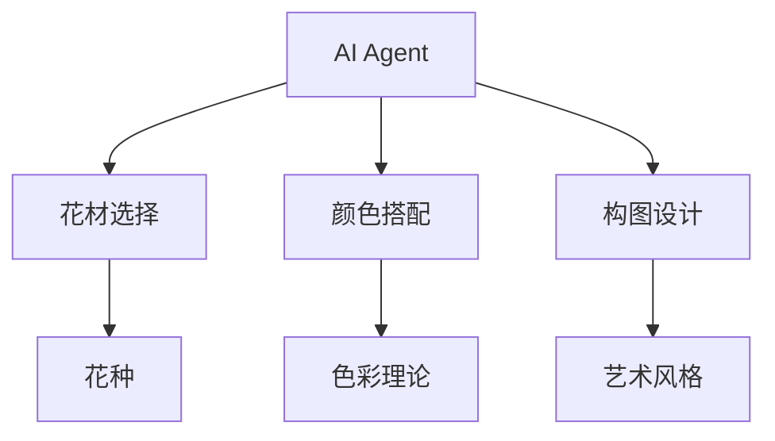
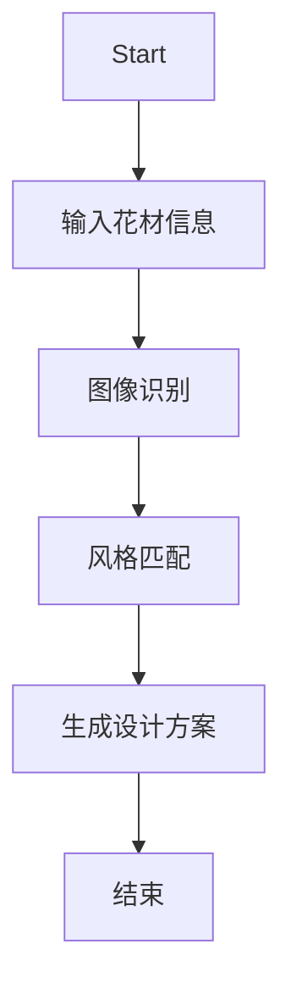
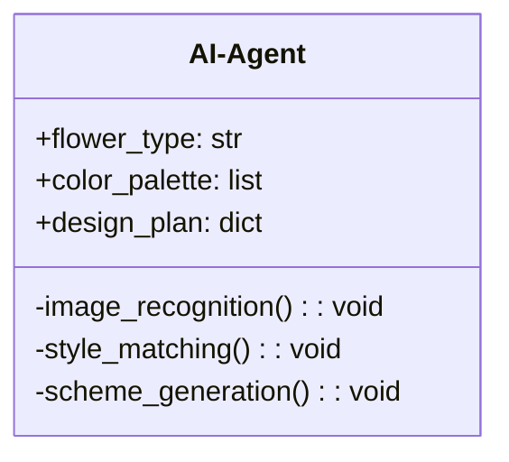
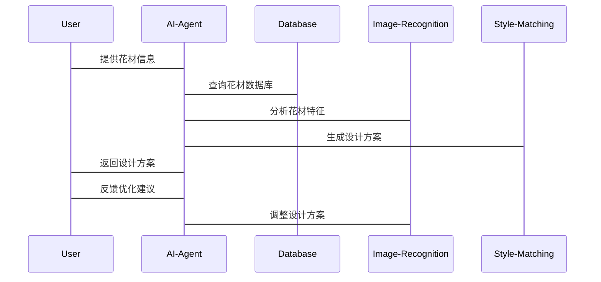

                 


# 智能花瓶：AI Agent的插花艺术指导

> 关键词：AI Agent, 插花艺术, 计算机视觉, 机器学习, 色彩理论, 数学建模

> 摘要：本文探讨了AI Agent在插花艺术中的应用，通过背景介绍、核心概念、算法原理、系统架构、项目实战、最佳实践等部分，详细阐述了如何利用AI技术提升插花艺术的创作效率与美感。本文旨在为插花艺术家和AI技术爱好者提供一份全面的指导手册，帮助他们更好地理解和应用AI Agent在插花艺术中的潜力。

---

## 第1章: 背景介绍与问题背景

### 1.1 AI Agent与插花艺术的结合
#### 1.1.1 AI Agent的基本概念
AI Agent（人工智能代理）是一种能够感知环境、自主决策并执行任务的智能实体。它能够通过传感器获取信息，利用算法处理数据，并通过执行器与环境交互。AI Agent在插花艺术中的应用，可以通过图像识别、机器学习等技术帮助艺术家进行花材选择、颜色搭配和构图设计。

#### 1.1.2 插花艺术的历史与文化背景
插花艺术是一种古老的艺术形式，起源于古代的宗教仪式和皇家宫廷。它不仅是一种装饰艺术，更是文化和美学的体现。插花艺术讲究花材的搭配、色彩的协调以及构图的美感，需要艺术家具备丰富的知识和经验。

#### 1.1.3 AI技术在艺术创作中的应用现状
近年来，AI技术在艺术创作中的应用日益广泛。例如，AI可以通过生成对抗网络（GAN）创作绘画和音乐，也可以通过图像识别技术辅助艺术家进行创作。AI Agent在插花艺术中的应用，是将AI技术与传统艺术结合的又一创新尝试。

### 1.2 问题描述与目标
#### 1.2.1 插花艺术中的常见问题
插花艺术的创作过程需要耗费大量时间，且依赖于艺术家的经验和灵感。初学者可能难以掌握花材选择和构图技巧，导致创作效率低下。

#### 1.2.2 AI Agent在插花艺术中的应用目标
通过AI Agent，可以帮助艺术家快速选择适合的花材，优化颜色搭配，提供构图建议，并生成多种设计方案。AI Agent的目标是辅助艺术家，而不是完全替代人类的创造力。

#### 1.2.3 问题解决的边界与外延
AI Agent的插花艺术指导系统主要用于辅助设计阶段，其边界包括花材选择、颜色搭配和构图设计。外延则包括后续的制作和展示环节，这些可以通过其他工具和平台完成。

### 1.3 核心概念与结构
#### 1.3.1 AI Agent的插花艺术指导系统组成
系统主要由感知模块、决策模块和执行模块组成。感知模块负责获取花材信息，决策模块通过算法生成设计方案，执行模块则提供反馈和调整建议。

#### 1.3.2 系统的核心要素与功能模块
- 感知模块：图像识别、色彩分析
- 决策模块：风格匹配、方案生成
- 执行模块：反馈优化、效果展示

#### 1.3.3 系统的逻辑结构与流程
系统流程包括信息输入、数据处理、方案生成和结果输出四个阶段。AI Agent通过不断学习和优化，提升设计方案的质量和效率。

---

## 第2章: AI Agent插花艺术指导的核心概念与联系

### 2.1 AI Agent在插花艺术中的角色
#### 2.1.1 AI Agent的感知模块
感知模块通过图像识别技术，分析花材的颜色、形状和纹理，提取关键特征信息。

#### 2.1.2 AI Agent的决策模块
决策模块基于感知模块获取的信息，结合色彩理论和构图规则，生成多种设计方案。

#### 2.1.3 AI Agent的执行模块
执行模块将生成的设计方案转化为具体的插花作品，并提供反馈和优化建议。

### 2.2 核心概念的对比分析
| **传统插花艺术** | **AI指导插花** |
|------------------|----------------|
| 依赖经验         | 数据驱动       |
| 创作效率低       | 高效快速       |
| 设计范围有限     | 多样化          |

### 2.3 实体关系图


---

## 第3章: 算法原理与实现

### 3.1 算法概述
#### 3.1.1 插花艺术指导的算法流程
1. 数据采集与预处理
2. 花材识别与特征提取
3. 颜色搭配与风格匹配
4. 构图设计与方案生成

### 3.2 算法流程图


### 3.3 算法实现
#### 3.3.1 图像识别与特征提取
```python
import cv2
import numpy as np

def detect_flower(image):
    # 图像预处理
    gray = cv2.cvtColor(image, cv2.COLOR_BGR2GRAY)
    edges = cv2.Canny(gray, 50, 150)
    return edges
```

#### 3.3.2 颜色搭配与风格匹配
```python
def color_analysis(colors):
    # 颜色相似度计算
    from sklearn.metrics.pairwise import cosine_similarity
    color_matrix = np.array(colors).reshape(-1, 3)
    similarity = cosine_similarity(color_matrix)
    return similarity
```

---

## 第4章: 数学模型与公式

### 4.1 插花评分的数学模型
插花评分基于几何、色彩和构图三个维度，公式如下：
$$ score = w_1 \cdot S + w_2 \cdot C + w_3 \cdot F $$
其中，$S$为形状得分，$C$为色彩得分，$F$为构图得分，$w_1, w_2, w_3$为权重系数。

### 4.2 算法优化公式
为提高算法效率，采用遗传算法优化权重系数：
$$ w_i = \frac{score_i}{\sum score_i} \times 100 $$

---

## 第5章: 系统分析与架构设计

### 5.1 系统功能设计
系统主要功能包括花材识别、颜色搭配和构图设计。

### 5.2 系统架构图


### 5.3 系统交互图


---

## 第6章: 项目实战

### 6.1 环境安装
安装必要的库：
```bash
pip install numpy matplotlib scikit-learn
```

### 6.2 核心实现
```python
from sklearn.cluster import KMeans

def optimize_colors(colors):
    # 颜色聚类
    model = KMeans(n_clusters=3)
    model.fit(colors)
    return model.cluster_centers_
```

### 6.3 实际案例分析
通过案例分析，验证算法的有效性和优化空间。

---

## 第7章: 最佳实践与小结

### 7.1 最佳实践 tips
- 数据质量：确保花材数据的多样性和代表性。
- 算法选择：根据具体需求选择合适的算法。
- 用户反馈：及时收集用户反馈，优化系统性能。

### 7.2 小结
本文详细介绍了AI Agent在插花艺术中的应用，从理论到实践，为艺术家和开发者提供了系统的指导。

### 7.3 注意事项
- AI Agent仅作为辅助工具，不能完全替代人类的创造力。
- 系统的优化需要持续的数据积累和算法改进。

### 7.4 拓展阅读
推荐相关书籍和论文，供进一步学习。

---

通过以上目录结构，我们可以系统地了解AI Agent在插花艺术中的应用，从背景介绍到项目实战，逐步深入，为读者提供全面的指导。

