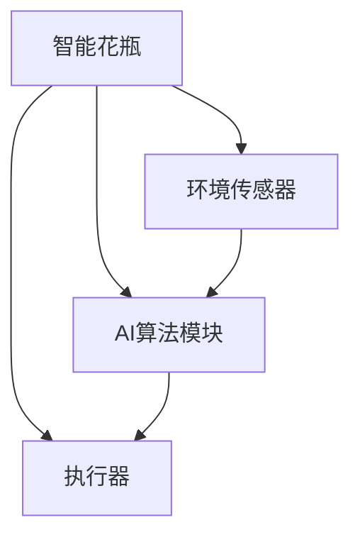

                 


# 智能花瓶：AI Agent的花卉保鲜技巧指导

> 关键词：AI Agent, 花卉保鲜, 智能花瓶, 机器学习, 数学模型, 系统架构

> 摘要：本文详细探讨了AI Agent在花卉保鲜领域的应用，从背景介绍、核心原理、数学模型到系统架构设计，再到项目实战和最佳实践，全面解析了智能花瓶如何通过AI技术实现高效的花卉保鲜管理。

---

## 第一部分: 背景介绍

### 第1章: 花卉保鲜的重要性

#### 1.1 花卉保鲜的基本概念
花卉保鲜是指通过控制环境条件（如温度、湿度、光照等）来延长花卉的生命周期和美观度。传统的保鲜方法依赖人工经验，存在效率低、成本高等问题。

#### 1.2 花卉保鲜的常见挑战
- 环境条件不稳定：温度、湿度和光照的变化会影响花卉的生长状态。
- 病虫害的威胁：病虫害会导致花卉快速枯萎。
- 人工管理的局限性：依赖人工经验，难以实现大规模高效管理。

#### 1.3 智能花瓶的应用场景
智能花瓶是一种结合了AI技术的花卉管理设备，能够实时监测环境参数，并通过AI算法优化花卉生长条件。

---

### 第2章: AI Agent的核心概念

#### 2.1 AI Agent的定义
AI Agent是一种能够感知环境、自主决策并执行任务的智能实体。它能够通过传感器获取信息，利用算法进行分析，并通过执行器采取行动。

#### 2.2 AI Agent的基本特征
| 特征 | 描述 |
|------|------|
| 感知能力 | 通过传感器获取环境信息 |
| 决策能力 | 基于算法做出最优决策 |
| 执行能力 | 通过执行器实现决策 |
| 自适应能力 | 根据环境变化动态调整 |

#### 2.3 AI Agent与传统花卉保鲜技术的对比
| 对比维度 | AI Agent | 传统技术 |
|----------|----------|-----------|
| 管理效率 | 高 | 低 |
| 决策方式 | 数据驱动 | 经验驱动 |
| 可扩展性 | 高 | 低 |

---

## 第二部分: AI Agent的核心原理

### 第3章: AI Agent的核心算法

#### 3.1 机器学习算法在AI Agent中的应用
机器学习算法用于分析环境数据，预测花卉的生长状态。例如，使用随机森林算法对环境参数进行分类。

#### 3.2 神经网络在AI Agent中的作用
神经网络可以模拟花卉生长的复杂关系，例如使用卷积神经网络（CNN）分析花卉的健康状态。

#### 3.3 强化学习在AI Agent中的实践
强化学习用于优化AI Agent的决策策略，例如通过Q-learning算法选择最优的环境参数。

---

### 第4章: 保鲜技术的数学模型

#### 4.1 花卉保鲜的核心影响因素
- 温度（$T$）
- 湿度（$H$）
- 光照（$L$）
- 营养供给（$N$）

#### 4.2 花卉保鲜的数学模型构建
花卉保鲜效果 $E$ 可以表示为：

$$ E = f(T, H, L, N) $$

其中，$f$ 是一个非线性函数，可以通过神经网络进行逼近。

---

## 第三部分: 系统架构设计

### 第5章: 系统功能设计

#### 5.1 系统整体架构


#### 5.2 系统功能模块
- 环境监测模块：采集温度、湿度、光照等数据。
- 数据处理模块：对环境数据进行预处理和特征提取。
- 决策模块：基于AI算法生成最优决策。
- 执行模块：根据决策调整环境参数。

---

### 第6章: 系统架构设计

#### 6.1 系统架构图


---

## 第四部分: 项目实战

### 第7章: 项目实战

#### 7.1 环境安装
安装Python、TensorFlow、Mermaid等工具。

#### 7.2 核心代码实现
```python
import numpy as np
from sklearn.ensemble import RandomForestClassifier

# 示例数据
X = np.array([[20, 60, 80],  # 温度、湿度、光照
              [22, 55, 75]])
y = np.array([1, 0])  # 1表示良好，0表示不佳

# 训练模型
model = RandomForestClassifier(n_estimators=100)
model.fit(X, y)

# 预测新数据
new_data = np.array([[21, 65, 78]])
prediction = model.predict(new_data)
print("预测结果:", prediction)
```

#### 7.3 案例分析
通过实际案例分析AI Agent在不同环境下的决策过程，并解释模型的输出结果。

---

## 第五部分: 最佳实践

### 第8章: 最佳实践与小结

#### 8.1 最佳实践
- 定期校准传感器以保证数据准确性。
- 更新AI模型以适应新的环境变化。
- 监控系统运行状态，及时处理异常情况。

#### 8.2 注意事项
- 避免过度依赖AI技术，结合人工经验。
- 确保系统的安全性，防止数据泄露。

#### 8.3 未来趋势
随着AI技术的不断发展，智能花瓶将更加智能化，能够实现更复杂的花卉管理任务。

---

### 总结
通过本文的详细讲解，读者可以全面了解AI Agent在花卉保鲜中的应用，从理论到实践，掌握智能花瓶的核心原理和实现方法。希望本文能够为相关领域的研究和实践提供有价值的参考。

