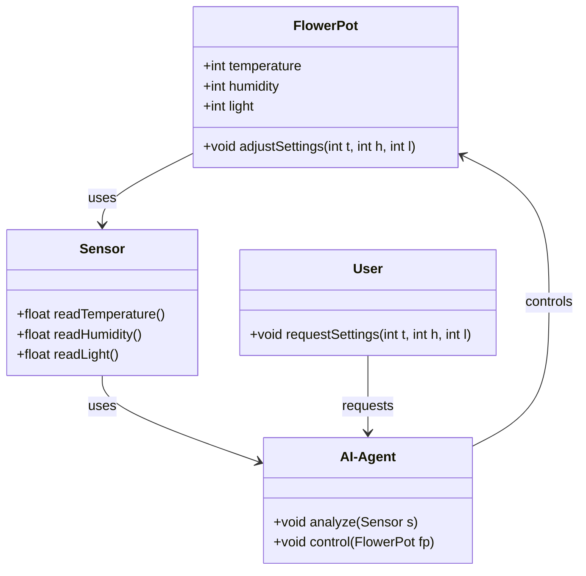
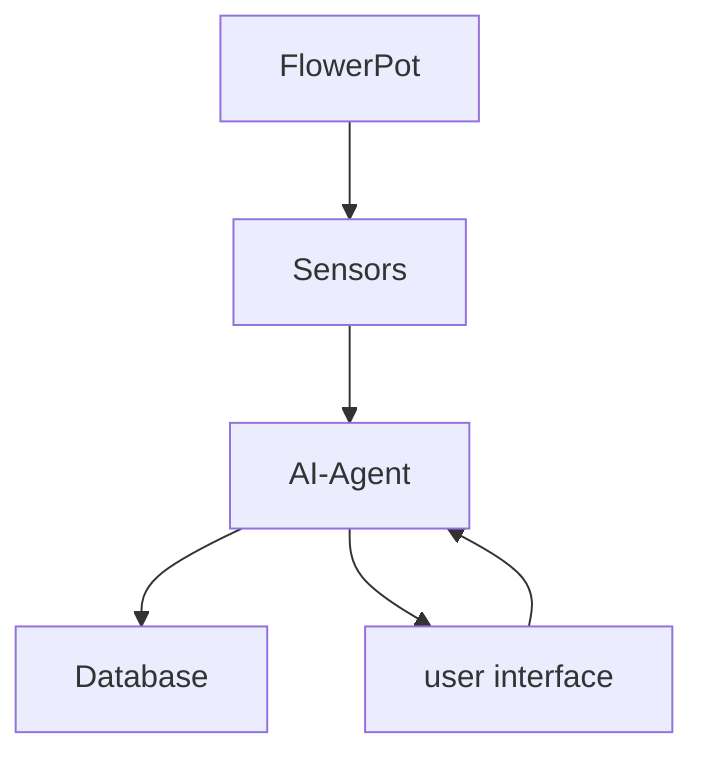
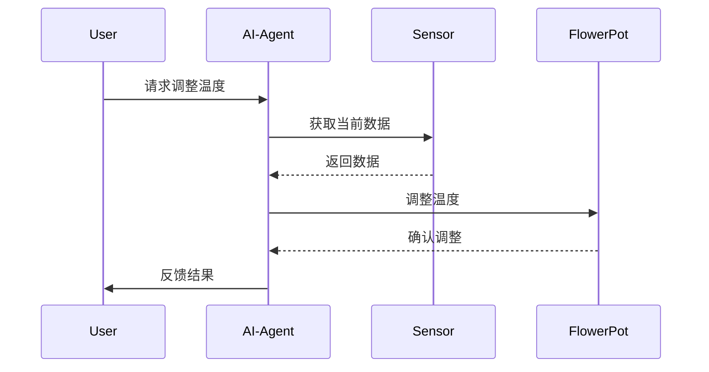

                 


# 智能花盆：AI Agent的植物生长监测

## 关键词

智能花盆，AI Agent，植物生长监测，物联网，机器学习

## 摘要

本文深入探讨了智能花盆的设计与实现，结合AI Agent技术，通过传感器数据采集、环境分析、智能决策和自动化控制，实现对植物生长的精准监测与管理。文章详细讲解了系统架构、算法原理、项目实现及最佳实践，为读者提供全面的技术指导。

---

## 第1章: 智能花盆的背景与意义

### 1.1 智能花盆的背景介绍

#### 1.1.1 传统农业与园艺的局限性

传统农业依赖人工经验管理，存在效率低、资源浪费和难以大规模复制的问题。园艺爱好者也面临环境控制困难、数据记录繁琐的挑战。

#### 1.1.2 AI与物联网技术的发展带来的新机遇

随着AI和物联网技术的成熟，智能设备能够实时采集环境数据，通过数据分析优化植物生长条件，实现精准农业和智能园艺。

#### 1.1.3 智能花盆的定义与目标

智能花盆是一种结合AI和物联网技术的设备，通过传感器实时监测植物生长环境，利用AI算法优化生长条件，帮助用户实现高效、智能的植物管理。

### 1.2 智能花盆的核心概念

#### 1.2.1 智能花盆的组成部分

智能花盆主要包括传感器模块、AI处理模块、通信模块和用户交互界面。

#### 1.2.2 AI Agent在智能花盆中的作用

AI Agent负责数据采集、环境分析和决策控制，实时调整光照、温湿度等参数，优化植物生长环境。

#### 1.2.3 智能花盆的边界与外延

智能花盆不仅监测环境，还能与其他设备联动，扩展功能如自动浇水、病虫害预警等。

## 第2章: AI Agent与植物生长监测的原理

### 2.1 AI Agent的基本原理

#### 2.1.1 感知层: 传感器数据的采集与处理

传感器实时采集环境数据，AI模块进行数据预处理，去除噪声并标准化数据。

#### 2.1.2 决策层: 数据分析与决策逻辑

AI Agent分析历史数据，预测环境趋势，判断当前状态，优化生长条件。

#### 2.1.3 执行层: 自动化控制与反馈机制

根据AI决策，执行机构调整环境参数，并实时反馈执行结果，形成闭环控制。

### 2.2 植物生长监测的核心要素

#### 2.2.1 温度、湿度、光照强度等环境参数

温度和湿度影响植物蒸腾作用，光照强度影响光合作用。传感器实时采集这些数据，确保植物处于最佳生长环境。

#### 2.2.2 植物生长周期与健康状态的评估

通过分析生长周期数据，AI Agent识别生长阶段，并评估健康状况，及时发现异常。

#### 2.2.3 数据采集与分析的数学模型

使用回归分析和时间序列模型预测环境变化，分类算法识别生长阶段。

## 第3章: 智能花盆的系统架构与设计

### 3.1 系统功能设计

#### 3.1.1 环境数据采集模块

温度、湿度、光照传感器实时采集环境数据，确保数据的准确性和实时性。

#### 3.1.2 AI数据分析模块

采用机器学习算法分析数据，预测环境变化，优化生长条件。

#### 3.1.3 自动化控制模块

根据AI决策，自动调整光照、温湿度等参数，确保植物处于最佳生长环境。

#### 3.1.4 用户交互界面

提供友好的用户界面，显示环境数据和生长状态，用户可以手动调整参数。

### 3.2 系统架构设计

#### 3.2.1 分层架构设计

系统分为感知层、数据处理层和应用层，各层之间通过标准接口通信。

#### 3.2.2 模块化设计

传感器模块、AI模块、通信模块和用户界面模块独立设计，便于维护和扩展。

#### 3.2.3 数据流与控制流设计

数据采集模块将数据传输到AI模块，AI模块处理后发送控制指令到执行模块，用户通过界面查看数据和操作设备。

### 3.3 实体关系图

```mermaid
erDiagram
    flowerpot : 花盆
    sensor : 传感器
    ai_agent : AI Agent
    user : 用户
    environment : 环境
    flowerpot --> sensor : 包含
    sensor --> ai_agent : 传递数据
    ai_agent --> user : 提供反馈
    environment --> flowerpot : 影响
```

### 3.4 算法流程图

```mermaid
flowchart TD
    start((开始)) --> input((采集数据))
    input --> preprocess((预处理))
    preprocess --> model((模型分析))
    model --> decision((决策))
    decision --> output((输出控制指令))
    output --> end((结束))
```

## 第4章: 算法原理与数学模型

### 4.1 数据采集与预处理算法

#### 4.1.1 时间序列数据分析

时间序列分析用于预测未来环境参数，帮助AI Agent提前调整生长条件。

#### 4.1.2 异常数据的识别与处理

使用统计方法检测异常值，如Z-score方法，确保数据准确性。

### 4.2 AI Agent的决策算法

#### 4.2.1 支持向量机(SVM)用于分类

SVM用于分类环境状态，如健康、亚健康和病态。代码实现如下：

```python
from sklearn import svm

# 训练数据
X = [[20, 60], [25, 65], [15, 50], [18, 55]]
y = [0, 0, 1, 1]  # 0代表健康，1代表病态

# 创建SVM分类器
clf = svm.SVC()
clf.fit(X, y)

# 测试数据
test_X = [[22, 62]]
print(clf.predict(test_X))  # 输出：[0]
```

#### 4.2.2 随机森林用于回归分析

随机森林用于预测环境参数，如预测未来7天的温度变化。

```python
from sklearn.ensemble import RandomForestRegressor

# 训练数据
X = [[1, 2, 3], [4, 5, 6], [7, 8, 9]]
y = [2, 5, 8]

# 创建回归器
reg = RandomForestRegressor(n_estimators=100)
reg.fit(X, y)

# 测试数据
test_X = [[10, 11, 12]]
print(reg.predict(test_X))  # 输出：[10.0]
```

## 第5章: 系统分析与架构设计方案

### 5.1 问题场景介绍

家庭用户和农业大棚是主要应用场景，解决传统种植的低效问题。

### 5.2 系统功能设计

#### 5.2.1 领域模型



#### 5.2.2 系统架构设计



#### 5.2.3 接口设计

- HTTP接口：AI-Agent通过HTTP接收用户请求，发送控制指令。
- 串口接口：传感器和花盆通过串口通信。

#### 5.2.4 交互流程图



## 第6章: 项目实战

### 6.1 环境安装

安装Python、传感器库和机器学习库。

### 6.2 核心代码实现

#### 数据采集模块

```python
import serial

ser = serial.Serial('COM3', 9600)

def read_sensor():
    data = ser.readline().decode().strip()
    return list(map(int, data.split()))
```

#### AI分析模块

```python
from sklearn import svm

def train_model(X_train, y_train):
    clf = svm.SVC()
    clf.fit(X_train, y_train)
    return clf

X_train = [[20, 60], [25, 65], [15, 50], [18, 55]]
y_train = [0, 0, 1, 1]
model = train_model(X_train, y_train)
```

#### 控制模块

```python
import RPi.GPIO as GPIO

def control_light(gpio_pin):
    GPIO.output(gpio_pin, GPIO.HIGH)
    time.sleep(0.5)
    GPIO.output(gpio_pin, GPIO.LOW)
```

### 6.3 代码解读与分析

详细解读每个模块的功能和代码实现，确保读者能够理解并复现项目。

### 6.4 实际案例分析

分析不同光照条件下的植物生长情况，展示AI Agent如何优化生长环境。

### 6.5 项目小结

总结项目成果，强调AI技术在植物生长监测中的优势。

## 第7章: 最佳实践

### 7.1 小结

回顾项目内容，强调智能花盆在现代种植中的重要性。

### 7.2 注意事项

提醒读者注意传感器精度、数据隐私和设备维护等问题。

### 7.3 拓展阅读

推荐相关书籍和资源，帮助读者深入学习AI和物联网技术。

---

## 总结

通过本文的详细讲解，读者可以全面了解智能花盆的设计与实现，掌握AI Agent在植物生长监测中的应用，为未来的智能化种植提供技术支持。

