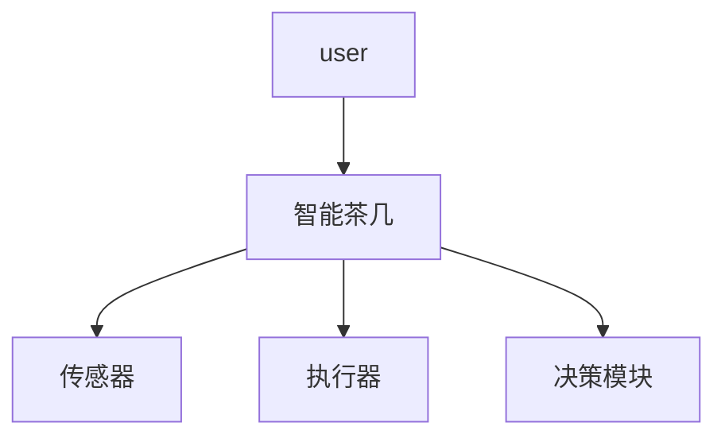
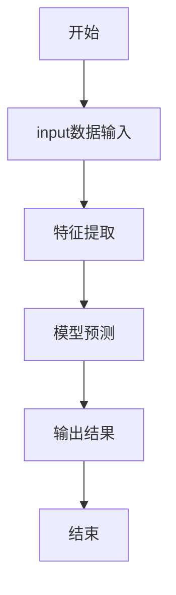
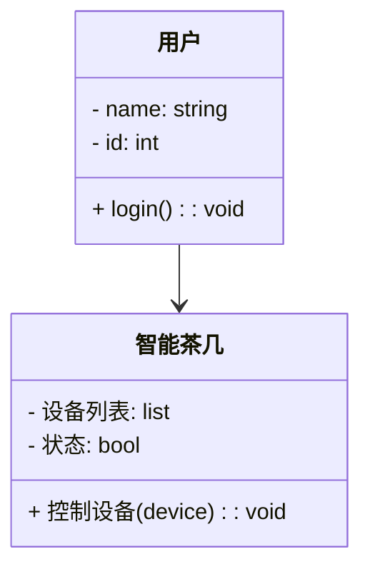
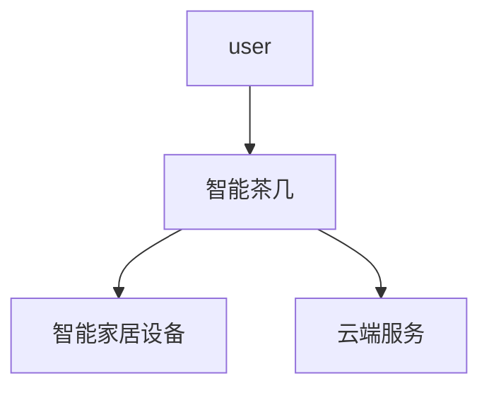
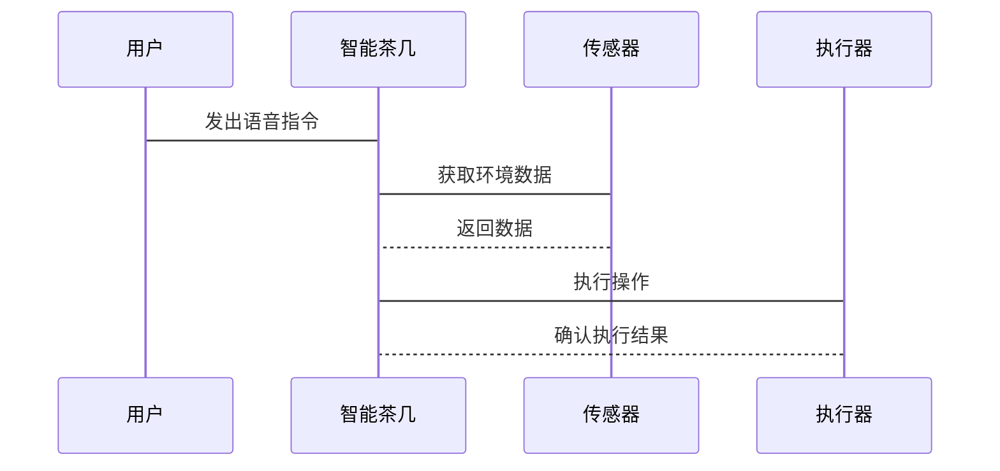

                 


# 智能茶几：AI Agent的客厅使用模式分析

## 关键词：智能茶几，AI Agent，客厅交互，智能家居，人机交互，系统架构

## 摘要：本文详细分析了智能茶几在AI Agent技术下的客厅使用模式，探讨了其核心概念、算法原理、系统架构及实际应用，为读者提供了全面的技术解读。

---

## 第一部分：智能茶几与AI Agent的背景介绍

### 第1章：智能茶几与AI Agent概述

#### 1.1 智能茶几的概念与定义

- **1.1.1 智能茶几的定义**  
  智能茶几是一种集成AI Agent技术的智能家居设备，具备智能交互、环境感知和自动化控制功能。

- **1.1.2 AI Agent的基本概念**  
  AI Agent是指能够感知环境、自主决策并执行任务的智能体，广泛应用于智能家居、机器人等领域。

- **1.1.3 智能茶几与AI Agent的结合**  
  智能茶几通过AI Agent实现与用户的智能交互，能够理解用户的意图并执行相应的操作。

#### 1.2 智能茶几的应用场景

- **1.2.1 客厅使用场景的多样性**  
  智能茶几可应用于影音娱乐、智能家居控制、信息查询等多种场景。

- **1.2.2 用户需求的分析**  
  用户希望茶几具备智能化、便捷性和互动性，能够提升生活品质。

- **1.2.3 智能茶几的功能定位**  
  智能茶几不仅是家居装饰，更是家庭中枢，连接多种智能设备，提供便捷的交互体验。

#### 1.3 智能茶几的交互模式

- **1.3.1 传统茶几的功能分析**  
  传统茶几主要用于摆放物品，不具备智能交互功能。

- **1.3.2 智能茶几的交互方式**  
  支持语音交互、触控操作和远程控制等多种方式。

- **1.3.3 客厅交互模式的演变**  
  从被动操作到主动交互，智能茶几的出现推动了家居交互方式的革新。

---

## 第二部分：智能茶几的核心概念与联系

### 第2章：AI Agent的核心原理

#### 2.1 AI Agent的基本原理

- **2.1.1 感知模块**  
  通过传感器和摄像头感知环境信息，如温度、光线和用户动作。

- **2.1.2 决策模块**  
  利用机器学习算法分析感知数据，生成决策指令。

- **2.1.3 执行模块**  
  根据决策指令，驱动机械臂或灯光等设备执行操作。

#### 2.2 智能茶几的AI Agent架构

- **2.2.1 智能茶几的感知系统**  
  集成多种传感器，实时监测周围环境的变化。

- **2.2.2 决策系统的实现**  
  采用强化学习算法优化决策过程，提升交互的准确性。

- **2.2.3 执行系统的集成**  
  通过物联网协议与智能家居设备连接，实现联动控制。

#### 2.3 智能茶几与传统茶几的对比

| 特性                | 传统茶几                | 智能茶几                |
|---------------------|-------------------------|-------------------------|
| 功能                | 简单摆放功能            | 多功能智能交互          |
| 交互方式            | 被动式操作              | 主动式交互              |
| 连接性              | 无网络连接              | 集成物联网，支持Wi-Fi/蓝牙|

#### 2.4 智能茶几的系统架构图



---

## 第三部分：智能茶几的算法原理

### 第3章：AI Agent的算法实现

#### 3.1 智能茶几的核心算法

- **3.1.1 基于规则的AI Agent**  
  通过预设规则进行决策，适用于简单场景。

- **3.1.2 基于机器学习的AI Agent**  
  使用深度学习模型，如DQN，进行自主学习和优化。

#### 3.2 算法实现流程图



#### 3.3 强化学习算法示例

```python
import numpy as np
from collections import deque
import random

class DQN:
    def __init__(self, state_size, action_size):
        self.state_size = state_size
        self.action_size = action_size
        self.memory = deque(maxlen=1000)
        self.gamma = 0.95
        self.epsilon = 1.0
        self.epsilon_min = 0.01
        self.batch_size = 32
        # 省略网络构建代码
```

公式：  
$$ Q(s,a) = r + \gamma \max_{a'} Q(s',a') $$

---

## 第四部分：系统分析与架构设计

### 第4章：系统分析与架构设计

#### 4.1 问题场景介绍

- 智能茶几需要在客厅中实现多种功能，如影音控制、智能照明和环境监测。

#### 4.2 项目介绍

- 开发一个支持语音交互的智能茶几，集成AI Agent实现智能家居控制。

#### 4.3 系统功能设计

- **领域模型类图**



- **系统架构图**



#### 4.4 接口设计与交互序列图

- **接口设计**

| 接口名称       | 描述                     |
|----------------|--------------------------|
| 控制设备       | 发送指令控制智能家居设备 |
| 获取状态       | 获取设备当前状态         |

- **交互序列图**



---

## 第五部分：项目实战

### 第5章：项目实战

#### 5.1 环境安装

- 安装Python、TensorFlow、Keras和必要的传感器库。

#### 5.2 核心代码实现

```python
import tensorflow as tf
from tensorflow.keras import layers

# 定义DQN网络
class DQN(tf.keras.Model):
    def __init__(self, state_size, action_size):
        super(DQN, self).__init__()
        self.fc1 = layers.Dense(64, activation='relu')
        self.fc2 = layers.Dense(32, activation='relu')
        self.fc3 = layers.Dense(action_size, activation='linear')

    def call(self, x):
        x = self.fc1(x)
        x = self.fc2(x)
        x = self.fc3(x)
        return x

# 初始化网络
state_size = 4
action_size = 3
dqn = DQN(state_size, action_size)
dqn.compile(optimizer=tf.keras.optimizers.Adam(lr=0.001), loss='mean_squared_error')
```

#### 5.3 代码解读与分析

- 上述代码定义了一个深度Q网络，用于智能茶几的决策模块，通过强化学习优化控制策略。

#### 5.4 实际案例分析

- 案例：用户通过语音指令控制智能茶几调节室温，系统通过传感器获取当前温度，AI Agent根据预设算法选择最优操作，驱动空调调节温度。

#### 5.5 项目小结

- 本项目展示了如何将AI Agent技术应用于智能茶几，实现智能化家居控制。

---

## 第六部分：最佳实践

### 第6章：最佳实践

#### 6.1 关键点总结

- **算法选择**：根据场景选择合适的AI算法，如DQN适用于连续决策任务。
- **系统架构**：采用模块化设计，便于功能扩展和维护。
- **用户体验**：注重交互设计，提升用户使用体验。

#### 6.2 小结

智能茶几作为AI Agent在智能家居中的重要应用，通过技术创新和场景优化，能够显著提升家庭生活的智能化水平。

#### 6.3 注意事项

- 确保系统安全性，防止数据泄露和网络攻击。
- 定期更新算法模型，提升系统适应性。

#### 6.4 拓展阅读

- 建议深入学习强化学习算法，探索更多智能家居应用场景。

---

## 结语

通过本文的详细分析，读者可以全面了解智能茶几在AI Agent技术下的客厅使用模式，掌握其核心原理和实际应用。希望本文能为智能家居领域的技术研究和产品开发提供有益的参考和启示。

