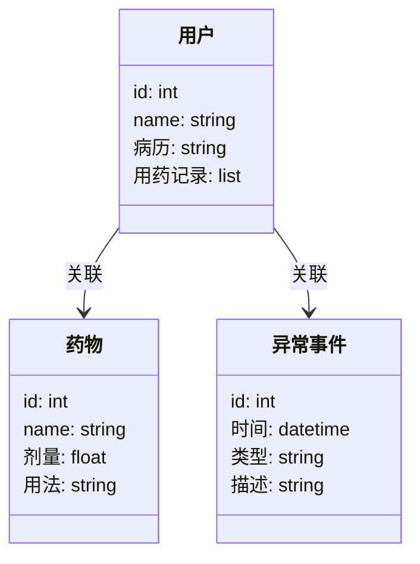
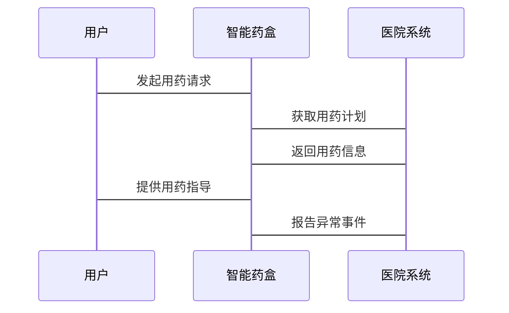

                 


```markdown
# 智能药盒：AI Agent的用药安全监督助手

> 关键词：AI Agent, 用药安全, 智能药盒, 异常检测, 监督学习, 加强学习

> 摘要：本文将详细介绍智能药盒的AI Agent设计，涵盖背景介绍、核心概念、算法原理、系统架构和项目实战。通过深入分析，探讨如何利用AI Agent确保用药安全，避免医疗事故，提升患者生活质量。

---

## 第一部分: 背景介绍与核心概念

### 第1章: AI Agent与智能药盒概述

#### 1.1 问题背景与用药安全的重要性
- **1.1.1 用药安全问题的现状**：当前医疗体系中，用药错误导致的医疗事故频发，严重威胁患者健康。
- **1.1.2 AI Agent在用药安全中的作用**：AI Agent通过实时监控和分析，有效预防用药错误。
- **1.1.3 智能药盒的核心目标与价值**：设计智能药盒的目标是提高用药安全性，减少医疗事故，提升患者生活质量。

#### 1.2 问题描述与解决思路
- **1.2.1 用药安全监督的痛点分析**：用药错误的主要原因包括医生疏忽、患者误用、药品标识不清等。
- **1.2.2 AI Agent如何解决用药安全问题**：AI Agent通过监督学习和强化学习，实时识别和纠正错误。
- **1.2.3 智能药盒的实现路径与方法**：采用多模态数据融合、知识图谱构建和深度学习算法。

#### 1.3 边界与外延
- **1.3.1 智能药盒的功能边界**：仅关注用药过程中的异常检测，不涉及诊断和治疗建议。
- **1.3.2 与医疗系统的交互边界**：智能药盒与医院系统交互，获取患者病历和用药计划。
- **1.3.3 与其他AI Agent的协同边界**：与其他医疗AI系统协同，共享数据和结果。

### 第2章: AI Agent的核心原理与智能药盒的功能设计

#### 2.1 AI Agent的核心原理
- **2.1.1 AI Agent的基本概念**：AI Agent是具有感知、决策和执行能力的智能体。
- **2.1.2 AI Agent的感知、决策与执行机制**：通过传感器和API获取数据，利用算法进行决策，通过执行器采取行动。
- **2.1.3 AI Agent的学习与优化能力**：采用监督学习和强化学习，持续优化识别准确率。

#### 2.2 智能药盒的功能设计
- **2.2.1 药物信息的智能识别**：利用图像识别和自然语言处理，识别药品名称和剂量。
- **2.2.2 用药行为的实时监督**：通过传感器和摄像头，实时监测患者用药行为。
- **2.2.3 异常情况的智能预警**：识别异常用药行为，立即发出预警。

#### 2.3 AI Agent与智能药盒的协同工作
- **2.3.1 AI Agent在用药监督中的角色**：作为智能药盒的核心模块，负责异常检测和决策。
- **2.3.2 智能药盒的交互设计**：提供友好的人机交互界面，方便用户操作。
- **2.3.3 系统的可扩展性与灵活性**：支持模块化设计，便于功能扩展和升级。

---

## 第二部分: 算法原理与数学模型

### 第3章: 监督学习与强化学习算法

#### 3.1 监督学习算法
- **3.1.1 线性回归模型**：用于预测患者的用药时间。
- **3.1.2 支持向量机（SVM）**：用于分类异常用药行为。
- **3.1.3 随机森林**：用于识别异常用药模式。

#### 3.2 强化学习算法
- **3.2.1 Q-Learning算法**：用于训练AI Agent的决策策略。
- **3.2.2 Deep Q-Network（DQN）**：结合深度学习，提升决策能力。

#### 3.3 算法实现
- **3.3.1 监督学习实现步骤**：
  1. 数据收集与预处理。
  2. 模型训练与调参。
  3. 模型评估与部署。
- **3.3.2 强化学习实现步骤**：
  1. 状态空间定义。
  2. 动作空间定义。
  3. 奖励函数设计。
  4. 策略训练与优化。

#### 3.4 数学公式
- **3.4.1 线性回归**：
  $$ y = \beta_0 + \beta_1 x + \epsilon $$
- **3.4.2 SVM分类器**：
  $$ \text{maximize} \quad \sum_{i=1}^{n} [y_i - y_j - \gamma (x_i - x_j)] + \xi $$
- **3.4.3 DQN网络结构**：
  $$ Q(s, a) = \delta W_2 \sigma(\delta W_1 s + b_1) + b_2 $$

---

## 第三部分: 系统分析与架构设计

### 第4章: 系统架构与功能模块

#### 4.1 系统架构设计
- **4.1.1 分层架构**：包括数据层、算法层和应用层。
- **4.1.2 模块划分**：数据采集模块、异常检测模块、预警模块和用户界面模块。

#### 4.2 领域模型


#### 4.3 系统接口设计
- **4.3.1 数据接口**：与医院系统的数据对接。
- **4.3.2 用户接口**：提供友好的人机交互界面。
- **4.3.3 API接口**：供第三方应用调用。

#### 4.4 交互流程


---

## 第四部分: 项目实战

### 第5章: 环境安装与核心实现

#### 5.1 环境安装
- **5.1.1 安装Python**：使用Anaconda或虚拟环境。
- **5.1.2 安装依赖库**：包括TensorFlow、Keras、Scikit-learn等。

#### 5.2 核心代码实现
- **5.2.1 异常检测模块**：
  ```python
  import tensorflow as tf
  from tensorflow import keras
  
  model = keras.Sequential([
      keras.layers.Dense(64, activation='relu'),
      keras.layers.Dense(1, activation='sigmoid')
  ])
  
  model.compile(optimizer='adam', loss='binary_crossentropy', metrics=['accuracy'])
  ```

- **5.2.2 预警模块**：
  ```python
  def alert_system():
      while True:
          data = read_sensor_data()
          prediction = model.predict(data)
          if prediction[0][0] > 0.9:
              send_alert()
  ```

### 第5.3 代码解读与分析
- **5.3.1 模型训练**：使用医院提供的历史数据，进行监督学习训练。
- **5.3.2 模型部署**：将训练好的模型部署到智能药盒中，实时检测异常。

### 第5.4 实际案例分析
- **5.4.1 案例背景**：患者A按照错误剂量用药，系统发出预警。
- **5.4.2 系统响应**：AI Agent识别异常，立即通知医护人员干预。

### 第5.5 项目小结
- **5.5.1 成功经验**：AI Agent有效降低用药错误率，提升医疗安全性。
- **5.5.2 改进方向**：优化算法性能，增加更多异常检测场景。

---

## 第五部分: 最佳实践与小结

### 第6章: 最佳实践与注意事项

#### 6.1 最佳实践
- **6.1.1 数据质量管理**：确保数据的准确性和完整性。
- **6.1.2 系统安全性**：保障患者隐私和数据安全。
- **6.1.3 持续优化**：定期更新模型，适应新的用药模式。

#### 6.2 小结
- **6.2.1 核心内容回顾**：AI Agent在智能药盒中的应用，算法原理和系统设计。
- **6.2.2 未来展望**：AI技术在医疗领域的发展潜力，智能药盒的未来方向。

### 第7章: 注意事项与拓展阅读

#### 7.1 注意事项
- **7.1.1 系统稳定性**：确保AI Agent的高可用性。
- **7.1.2 用户教育**：培训患者和医护人员正确使用智能药盒。
- **7.1.3 法律法规**：遵守相关医疗法律法规，确保系统合规性。

#### 7.2 拓展阅读
- **7.2.1 相关书籍**：推荐《人工智能在医疗中的应用》。
- **7.2.2 网站资源**：推荐访问医疗AI技术社区和论坛。
- **7.2.3 开源项目**：参与医疗AI开源项目，获取更多实践经验。

---

## 结语

通过本文的详细讲解，我们深入探讨了AI Agent在智能药盒中的应用，从算法原理到系统设计，再到项目实战，为读者提供了全面的技术指导。希望本文能为医疗AI领域的发展提供有价值的参考。
```

