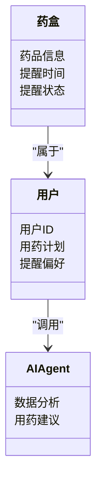
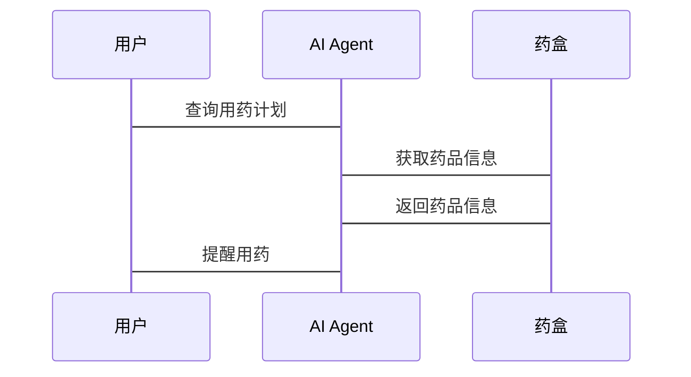

                 


# 智能药盒：AI Agent的用药提醒与管理系统

> 关键词：AI Agent，智能药盒，用药提醒，医疗管理，系统设计

> 摘要：本文将详细介绍智能药盒的设计与实现，重点分析AI Agent在用药提醒与管理系统中的应用。从问题背景到系统架构，从算法原理到项目实战，全面解析智能药盒的构建过程，探讨其在医疗健康领域的潜力与挑战。

---

# 第1章: 智能药盒与AI Agent的背景介绍

## 1.1 问题背景

### 1.1.1 老年人用药管理的痛点
老年人群体中，慢性病患者数量庞大，用药管理成为一大难题。许多老年人因记忆力减退或行动不便，常常忘记按时服药，导致病情加重。此外，药品种类繁多、服药时间复杂，增加了管理难度。

### 1.1.2 智能药盒的出现背景
传统药盒功能单一，仅能存储药品，无法提醒或管理用药计划。随着智能技术的发展，智能药盒应运而生，结合物联网和人工智能技术，为老年人提供智能化的用药管理解决方案。

### 1.1.3 AI Agent在医疗健康中的应用潜力
AI Agent（智能体）是一种能够感知环境并采取行动以实现目标的实体。在医疗健康领域，AI Agent可以用于疾病预测、用药提醒、健康监测等，具有广阔的应用前景。

---

## 1.2 问题描述

### 1.2.1 药盒管理的常见问题
- 药品分类混乱，难以快速找到所需药品。
- 用药时间复杂，难以准确提醒。
- 缺乏数据分析能力，无法提供个性化用药建议。

### 1.2.2 用药提醒的必要性
按时用药是治疗慢性病的关键，用药提醒能够有效提高患者依从性，减少病情加重的风险。

### 1.2.3 系统化用药管理的需求
通过系统化管理，可以实现用药计划的制定、提醒、记录和分析，帮助患者和医护人员更好地管理用药过程。

---

## 1.3 核心概念与联系

### 1.3.1 AI Agent的基本原理
AI Agent通过感知环境、分析数据并采取行动来实现目标。在智能药盒中，AI Agent主要用于数据分析、用药提醒和与用户交互。

### 1.3.2 智能药盒的系统架构
智能药盒由硬件和软件两部分组成。硬件包括药盒、传感器和通信模块，软件包括AI Agent、用药管理模块和用户界面。

### 1.3.3 实体关系图（ER图）

```mermaid
erDiagram
    class 药盒 {
        id : 整数
        药品名称 : 字符串
        用药时间 : 时间
        提醒状态 : 布尔值
    }
    class 用户 {
        id : 整数
        用户名 : 字符串
        密码 : 字符串
    }
    class AI Agent {
        id : 整数
        名称 : 字符串
        功能 : 文本
    }
    class 医疗数据 {
        id : 整数
        数据类型 : 字符串
        数据值 : 文本
    }
    药盒 --> 用户 : "属于"
    药盒 --> AI Agent : "由...管理"
    药盒 --> 医疗数据 : "关联"
```

---

# 第2章: AI Agent的核心算法与实现

## 2.1 AI Agent的核心算法

### 2.1.1 基于规则的AI Agent
基于规则的AI Agent通过预设的规则和条件来执行任务。例如，当时间到达指定用药时间时，触发提醒。

### 2.1.2 基于机器学习的AI Agent
基于机器学习的AI Agent能够通过数据分析和模型训练，预测患者的用药需求。例如，使用贝叶斯模型预测患者是否按时服药。

---

## 2.2 算法原理与实现

### 2.2.1 贝叶斯定理的应用
贝叶斯定理用于计算患者按时服药的概率。假设患者的用药记录、健康状况和提醒状态为已知条件，可以预测患者是否需要用药提醒。

$$ P(按时服药 | 提醒状态 = 真) = \frac{P(提醒状态 = 真 | 按时服药) \cdot P(按时服药)}{P(提醒状态 = 真)} $$

---

## 2.3 系统实现

### 2.3.1 环境安装
```bash
pip install flask numpy tensorflow
```

### 2.3.2 核心代码实现

```python
import numpy as np
from flask import Flask, request, jsonify

app = Flask(__name__)

# 示例：基于规则的用药提醒
@app.route('/reminder', methods=['POST'])
def reminder():
    data = request.json
    if data['time'] == data['schedule_time']:
        return jsonify({'status': 'reminder_triggered'})
    else:
        return jsonify({'status': 'no_reminder'})

if __name__ == '__main__':
    app.run(debug=True)
```

---

# 第3章: 系统分析与架构设计

## 3.1 问题场景介绍
智能药盒的目标用户是老年人和慢性病患者，主要解决用药提醒和用药管理问题。

## 3.2 系统功能设计

### 3.2.1 领域模型设计



---

## 3.3 系统架构设计

### 3.3.1 分层架构


---

## 3.4 系统接口设计

### 3.4.1 HTTP接口设计
```http
POST /api/reminder
Content-Type: application/json

{
    "user_id": 1,
    "schedule_time": "08:00",
    "current_time": "08:00"
}
```

---

## 3.5 系统交互设计



---

# 第4章: 项目实战

## 4.1 实际案例分析
以一位患有高血压的老年人为例，展示智能药盒如何帮助其管理用药计划。

---

# 第5章: 最佳实践与总结

## 5.1 最佳实践
- 数据隐私保护：确保用户数据的安全性。
- 系统稳定性：确保AI Agent的高可用性。
- 用户交互优化：提供友好的用户界面和语音提醒功能。

## 5.2 小结
智能药盒结合AI Agent，能够有效解决老年人用药管理的问题，具有广阔的应用前景。

---

# 总结

智能药盒与AI Agent的结合，不仅提高了用药管理的效率，还为医疗健康领域带来了新的可能性。通过系统的分析与实现，我们可以看到，AI技术在医疗领域的应用潜力巨大。

--- 

**注意事项**：本文中的代码和系统设计仅为示例，实际应用中需根据具体需求进行调整和优化。

