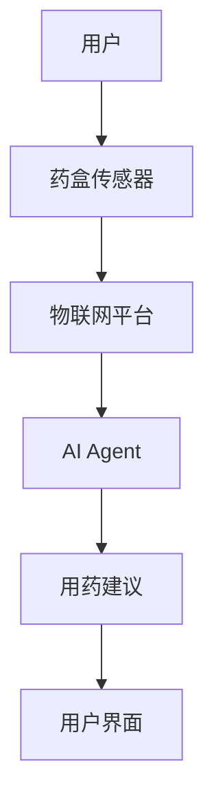
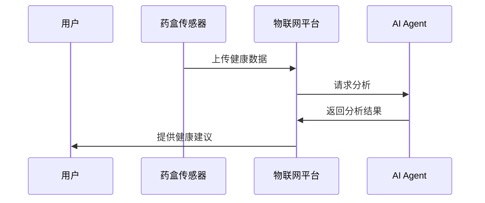

                 


# 智能药盒：AI Agent的用药提醒系统

---

## 关键词：智能药盒，AI Agent，物联网，用药提醒，医疗健康

---

## 摘要：智能药盒是一种结合AI Agent和物联网技术的智能设备，用于辅助用户进行用药提醒和管理。本文将从背景、核心概念、算法原理、系统架构到项目实战，详细讲解智能药盒的设计与实现。

---

## 第一部分：智能药盒与AI Agent的背景介绍

### 第1章：智能药盒的背景与问题背景

#### 1.1 问题背景与问题描述

**1.1.1 老年人用药管理问题**

随着人口老龄化加剧，慢性病患者数量迅速增长。老年人记忆力减退，容易忘记服药，导致病情加重或并发症。传统的用药提醒方式（如闹钟）存在诸多不足，例如提醒时间固定、缺乏个性化、无法与用户交互等。

**1.1.2 现有用药提醒系统的局限性**

目前市面上的用药提醒系统大多基于简单的定时提醒功能，无法根据用户的健康状况动态调整提醒策略，也无法与医疗机构或其他设备联动。此外，现有系统缺乏智能性，无法主动判断用户是否按时用药，也无法提供个性化的用药建议。

**1.1.3 智能药盒的提出与目标**

智能药盒通过结合AI Agent和物联网技术，能够实现智能化的用药提醒、用药记录管理、健康数据分析等功能，帮助用户更好地管理用药，提升用药依从性。

#### 1.2 智能药盒的核心概念

**1.2.1 AI Agent的基本定义**

AI Agent（智能体）是一种能够感知环境、自主决策并执行任务的智能系统。在智能药盒中，AI Agent负责接收用户的健康数据，分析用药情况，并根据结果提供个性化的用药建议。

**1.2.2 智能药盒的功能定位**

智能药盒是一个集硬件、软件和AI技术于一体的智能设备，主要用于提醒用户按时用药、记录用药数据、监测健康状况并提供健康建议。

**1.2.3 系统的边界与外延**

智能药盒的边界包括硬件设备（药盒、传感器）、软件系统（AI Agent、物联网平台）和用户交互界面。外延则包括与医疗机构、健康管理平台的数据对接。

#### 1.3 系统的核心要素组成

**1.3.1 硬件部分**

智能药盒的硬件部分包括药盒、传感器、通信模块（如Wi-Fi、蓝牙）等。传感器用于监测药盒的状态（如药品剩余量、药盒开启时间等），通信模块用于与手机或其他设备连接。

**1.3.2 软件部分**

软件部分包括AI Agent、物联网平台和用户应用程序。AI Agent负责数据分析和决策，物联网平台负责数据传输和存储，用户应用程序负责与用户交互。

**1.3.3 用户交互界面**

用户交互界面是用户与智能药盒的桥梁，包括手机APP、网页端等。用户可以通过界面查看用药记录、设置提醒、接收健康建议等。

---

### 第2章：AI Agent与物联网技术的核心概念与联系

#### 2.1 AI Agent的核心原理

**2.1.1 AI Agent的基本原理**

AI Agent通过感知环境、分析数据、做出决策并执行任务。在智能药盒中，AI Agent接收用户的健康数据，分析用药情况，并根据结果提供用药建议。

**2.1.2 AI Agent的分类与特点**

AI Agent可以分为基于规则的AI Agent和基于机器学习的AI Agent。基于规则的AI Agent通过预设规则进行决策，而基于机器学习的AI Agent通过学习数据进行决策。

**2.1.3 AI Agent在智能药盒中的应用**

在智能药盒中，AI Agent用于分析用户的健康数据（如心率、血压等），判断用户的健康状况，并根据结果调整用药提醒策略。

#### 2.2 物联网技术的核心原理

**2.2.1 物联网的基本概念**

物联网是指通过信息传感设备，按照约定的协议，把任何物品与互联网连接起来，进行信息交换和通信。

**2.2.2 物联网的关键技术**

物联网的关键技术包括传感器技术、通信技术、数据传输技术等。

**2.2.3 物联网在智能药盒中的应用**

在智能药盒中，物联网技术用于连接药盒、传感器和用户设备，实现数据的实时传输和共享。

#### 2.3 AI Agent与物联网技术的联系

**2.3.1 AI Agent与物联网的协同工作**

AI Agent通过物联网技术获取用户的健康数据，分析后做出决策，并通过物联网技术将决策结果反馈给用户。

**2.3.2 AI Agent在物联网数据处理中的作用**

AI Agent可以对物联网传来的海量数据进行分析，提取有用信息，帮助用户做出决策。

**2.3.3 物联网技术对AI Agent的支持**

物联网技术为AI Agent提供了数据来源和执行环境，使得AI Agent能够更好地感知环境并做出决策。

---

### 第3章：AI Agent的算法原理与实现

#### 3.1 AI Agent的决策算法

**3.1.1 基于规则的决策算法**

基于规则的决策算法是通过预设的规则进行决策。例如，当用户的健康数据达到某个阈值时，触发用药提醒。

**3.1.2 基于机器学习的决策算法**

基于机器学习的决策算法是通过学习数据，自动生成决策规则。例如，使用支持向量机（SVM）或随机森林（Random Forest）算法对用户的健康数据进行分类，预测用户的健康状况。

**3.1.3 基于强化学习的决策算法**

基于强化学习的决策算法是通过与环境的交互，逐步优化决策策略。例如，AI Agent通过与用户的交互，不断优化用药提醒的时间和方式。

#### 3.2 算法实现的数学模型

**3.2.1 基于规则的决策模型**

基于规则的决策模型可以通过简单的条件语句实现。例如：

如果用户的血压 > 140，那么触发用药提醒。

**3.2.2 基于机器学习的分类模型**

基于机器学习的分类模型可以使用支持向量机（SVM）或随机森林（Random Forest）算法。例如：

使用SVM算法对用户的健康数据进行分类，判断用户的健康状况。

**3.2.3 基于强化学习的策略模型**

基于强化学习的策略模型可以通过Q-learning算法实现。例如：

定义状态、动作和奖励，通过不断试错，优化用药提醒的策略。

#### 3.3 算法实现的Python代码示例

**3.3.1 基于规则的决策代码**

```python
def rule_based_decision(blood_pressure, heart_rate):
    if blood_pressure > 140 or heart_rate > 100:
        return True
    else:
        return False
```

**3.3.2 基于机器学习的分类代码**

```python
from sklearn.svm import SVC

# 假设X是用户健康数据，y是标签
model = SVC()
model.fit(X, y)

# 预测新用户健康数据
new_data = [[130, 90]]  # 示例数据
prediction = model.predict(new_data)
```

**3.3.3 基于强化学习的策略代码**

```python
import numpy as np

# Q-learning参数
alpha = 0.1
gamma = 0.9

# 状态和动作空间
states = ['low', 'medium', 'high']
actions = ['remind', 'not_remind']

# 初始化Q值表
Q = np.zeros((len(states), len(actions)))

# 状态转移概率
# 假设状态转移是确定的
```

---

### 第4章：智能药盒的系统分析与架构设计

#### 4.1 系统功能分析

**4.1.1 系统功能模块划分**

智能药盒的功能模块包括：

1. **用户管理模块**：用户注册、登录、个人信息管理。
2. **用药提醒模块**：设置提醒时间、提醒方式。
3. **用药记录模块**：记录用药时间、剂量。
4. **健康数据管理模块**：采集和管理用户的健康数据。
5. **健康建议模块**：根据健康数据，提供个性化的用药建议。

**4.1.2 系统功能流程图**



**4.1.3 系统功能的优先级排序**

优先级从高到低依次为：用药提醒、用药记录、健康建议、健康数据管理。

#### 4.2 系统架构设计

**4.2.1 系统架构的分层设计**

智能药盒的系统架构可以分为以下三层：

1. **感知层**：包括药盒传感器、用户设备。
2. **网络层**：包括物联网平台、通信模块。
3. **应用层**：包括AI Agent、用户应用程序。

**4.2.2 系统架构的模块化设计**

系统架构的模块化设计包括：

1. **数据采集模块**：负责采集用户的健康数据。
2. **数据传输模块**：负责数据的上传和下载。
3. **数据分析模块**：负责分析数据并生成建议。
4. **用户交互模块**：负责与用户的交互。

**4.2.3 系统架构的可扩展性设计**

系统架构设计时，需要预留接口，方便后续功能的扩展和升级。

#### 4.3 系统接口设计

**4.3.1 系统内部接口设计**

系统内部接口包括：

1. 药盒传感器与物联网平台的接口。
2. 物联网平台与AI Agent的接口。

**4.3.2 系统外部接口设计**

系统外部接口包括：

1. 用户与智能药盒的接口。
2. 智能药盒与医疗机构的接口。

**4.3.3 接口的交互流程设计**



---

### 第5章：智能药盒的项目实战

#### 5.1 环境安装与配置

**5.1.1 开发环境的选择**

推荐使用Python 3.8及以上版本，安装Jupyter Notebook进行开发。

**5.1.2 开发工具的安装**

安装必要的开发工具，如Python、Jupyter Notebook、pip、virtualenv等。

**5.1.3 依赖库的安装与配置**

安装必要的依赖库，例如：

```bash
pip install numpy
pip install scikit-learn
pip install mermaid
```

#### 5.2 系统核心功能实现

**5.2.1 AI Agent的实现**

实现一个简单的AI Agent，能够根据用户的健康数据做出决策。

```python
def ai_agent(blood_pressure, heart_rate):
    if blood_pressure > 140 or heart_rate > 100:
        return "remind"
    else:
        return "not_remind"
```

**5.2.2 物联网模块的实现**

实现一个简单的物联网模块，能够接收传感器数据并上传到云端。

```python
import serial

ser = serial.Serial('COM3', 9600)
data = ser.readline().decode().strip()
print(data)
```

**5.2.3 用户交互界面的实现**

实现一个简单的用户交互界面，使用Tkinter库。

```python
import tkinter as tk

root = tk.Tk()
root.title("智能药盒")
# 添加更多组件
root.mainloop()
```

#### 5.3 代码实现与解读

**5.3.1 基于规则的决策代码**

```python
def rule_based_decision(blood_pressure, heart_rate):
    if blood_pressure > 140 or heart_rate > 100:
        return True
    else:
        return False
```

**5.3.2 基于机器学习的分类代码**

```python
from sklearn.svm import SVC

X = [[130, 90], [150, 110], [120, 95]]
y = [0, 1, 0]

model = SVC()
model.fit(X, y)

new_data = [[140, 98]]
prediction = model.predict(new_data)
print(prediction)
```

**5.3.3 基于强化学习的策略代码**

```python
import numpy as np

alpha = 0.1
gamma = 0.9

states = ['low', 'medium', 'high']
actions = ['remind', 'not_remind']

Q = np.zeros((len(states), len(actions)))

# 状态转移概率矩阵
# 假设状态转移是确定的
```

#### 5.4 项目小结

通过本次项目实战，我们实现了智能药盒的核心功能，包括AI Agent的决策算法、物联网模块的实现以及用户交互界面的设计。系统能够根据用户的健康数据，提供个性化的用药提醒和健康建议。

---

## 总结

智能药盒通过结合AI Agent和物联网技术，能够为用户提供智能化的用药管理服务。本文从背景、核心概念、算法原理、系统架构到项目实战，详细讲解了智能药盒的设计与实现。通过本文的介绍，读者可以深入了解智能药盒的技术细节，并能够动手实现类似的功能。

---

## 最佳实践 Tips

1. **安全性**：在实际应用中，需要确保用户的健康数据的安全性，防止数据泄露。
2. **可扩展性**：系统设计时，需要预留接口，方便后续功能的扩展和升级。
3. **用户体验**：在设计用户交互界面时，需要注重用户体验，确保界面简洁易用。

---

## 小结

智能药盒是一个结合AI Agent和物联网技术的智能设备，能够帮助用户更好地管理用药。通过本文的介绍，读者可以深入了解智能药盒的技术细节，并能够动手实现类似的功能。

---

## 注意事项

1. **数据隐私**：在实际应用中，需要遵守相关法律法规，保护用户的隐私。
2. **系统稳定性**：在实际应用中，需要确保系统的稳定性，防止系统崩溃。
3. **用户体验**：在设计用户交互界面时，需要注重用户体验，确保界面简洁易用。

---

## 拓展阅读

1. **AI Agent的更多应用场景**：AI Agent不仅可以在智能药盒中应用，还可以应用于智能家居、自动驾驶等领域。
2. **物联网技术的更多应用**：物联网技术可以应用于智慧城市、工业自动化等领域。
3. **机器学习的更多算法**：机器学习的算法种类繁多，可以应用于分类、回归、聚类等多种任务。

