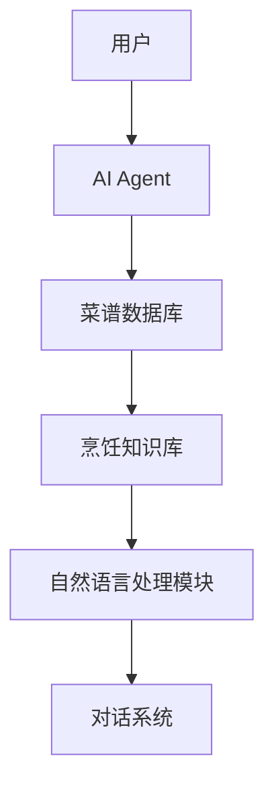
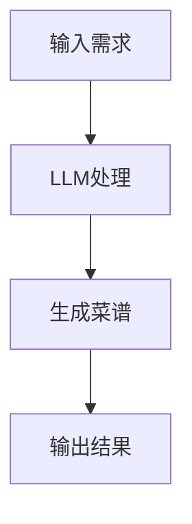
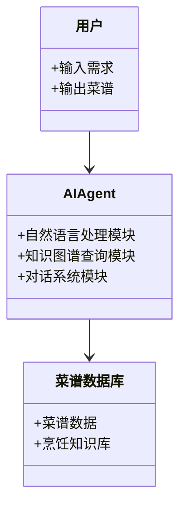
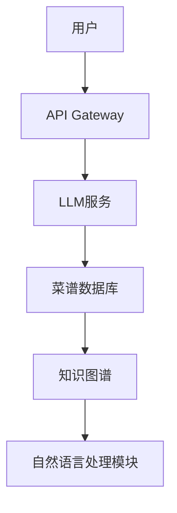
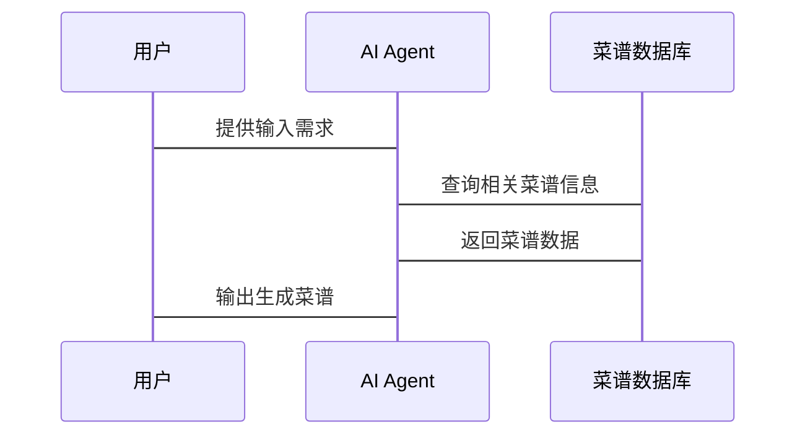

                 


# 智能菜谱生成 AI Agent：LLM 辅助烹饪创新

## 关键词：
- AI Agent
- LLM
- 智能菜谱生成
- 烹饪创新
- 自然语言处理

## 摘要：
本文探讨了利用大语言模型（LLM）生成智能菜谱的AI Agent技术，重点分析其在烹饪创新中的应用。文章从背景、原理、算法、系统架构到实战项目，全面解析了智能菜谱生成的实现过程，展示了AI技术如何革新传统烹饪方式。

---

## 目录大纲

### 第一部分：智能菜谱生成 AI Agent 的背景与概念

#### 第1章：智能菜谱生成的背景与问题背景

##### 1.1 智能菜谱生成的背景
- 1.1.1 烹饪与菜谱的数字化趋势
- 1.1.2 AI技术在烹饪领域的应用现状
- 1.1.3 智能菜谱生成的定义与目标

##### 1.2 问题背景与需求分析
- 1.2.1 烹饪过程中的痛点分析
- 1.2.2 用户需求与菜谱生成的挑战
- 1.2.3 智能菜谱生成的边界与外延

##### 1.3 AI Agent 在烹饪创新中的作用
- 1.3.1 AI Agent 的定义与特点
- 1.3.2 AI Agent 在烹饪中的应用场景
- 1.3.3 智能菜谱生成的创新价值

#### 第2章：智能菜谱生成的核心概念与联系

##### 2.1 智能菜谱生成的原理
- 2.1.1 自然语言处理在菜谱生成中的应用
- 2.1.2 知识图谱与烹饪知识的关联
- 2.1.3 对话系统在菜谱生成中的作用

##### 2.2 核心概念对比分析
- 2.2.1 不同菜谱生成模型的特点对比
- 2.2.2 AI Agent 与传统菜谱生成工具的对比
- 2.2.3 烹饪知识库与菜谱生成的关系

##### 2.3 实体关系图架构


---

### 第二部分：智能菜谱生成的算法原理

#### 第3章：智能菜谱生成的算法原理

##### 3.1 基于LLM的菜谱生成流程


##### 3.2 算法实现代码示例
```python
def generate_recipe(user_input):
    # 输入处理
    input_text = user_input
    # 调用LLM模型
    response = model.generate(input_text)
    # 解析输出
    recipe = parse_response(response)
    return recipe
```

##### 3.3 数学模型与公式
- 3.3.1 概率分布模型
$$ P(\text{菜谱生成} | \text{输入需求}) = \prod_{i=1}^{n} P(r_i | r_{i-1}) $$
- 3.3.2 损失函数
$$ \text{Loss} = -\sum_{i=1}^{n} \log P(r_i | r_{i-1}) $$

---

### 第三部分：智能菜谱生成的系统分析与架构设计

#### 第4章：系统分析与架构设计方案

##### 4.1 问题场景介绍
- 4.1.1 用户需求分析
- 4.1.2 系统目标设定
- 4.1.3 系统边界与接口

##### 4.2 系统功能设计


##### 4.3 系统架构设计


##### 4.4 系统交互流程


---

### 第四部分：智能菜谱生成的项目实战

#### 第5章：项目实战与案例分析

##### 5.1 项目环境安装
- Python 3.8+
- PyTorch 1.9+
- Hugging Face Transformers库

##### 5.2 核心代码实现
```python
from transformers import AutoTokenizer, AutoModelForCausalLM

class RecipeGenerator:
    def __init__(self):
        self.tokenizer = AutoTokenizer.from_pretrained("gpt2")
        self.model = AutoModelForCausalLM.from_pretrained("gpt2")

    def generate_recipe(self, input_text):
        inputs = self.tokenizer.encode(input_text, return_tensors="pt")
        outputs = self.model.generate(inputs, max_length=500, num_beams=5)
        return self.tokenizer.decode(outputs[0], skip_special_tokens=True)
```

##### 5.3 案例分析与实现解读
- 案例：生成一道“麻婆豆腐”的菜谱
- 代码实现与结果分析
- 案例总结与优化建议

##### 5.4 项目小结
- 项目实现的关键点总结
- 系统性能优化建议
- 可能遇到的问题及解决方案

---

### 第五部分：智能菜谱生成的优化与展望

#### 第6章：最佳实践与优化建议

##### 6.1 最佳实践
- 数据质量的重要性
- 模型调优技巧
- 系统性能优化

##### 6.2 小结
- 文章核心内容总结
- 未来研究方向展望

##### 6.3 注意事项
- 数据隐私保护
- 模型泛化能力的提升
- 用户体验优化

##### 6.4 拓展阅读
- 推荐相关技术书籍与论文
- 开源项目与工具推荐

---

## 总结
本文系统地介绍了智能菜谱生成AI Agent的实现过程，从背景分析到算法实现，再到系统设计与实战项目，为读者提供了全面的技术视角。通过本文的学习，读者可以深入了解AI技术在烹饪创新中的应用，并掌握智能菜谱生成的核心技术与实现方法。

