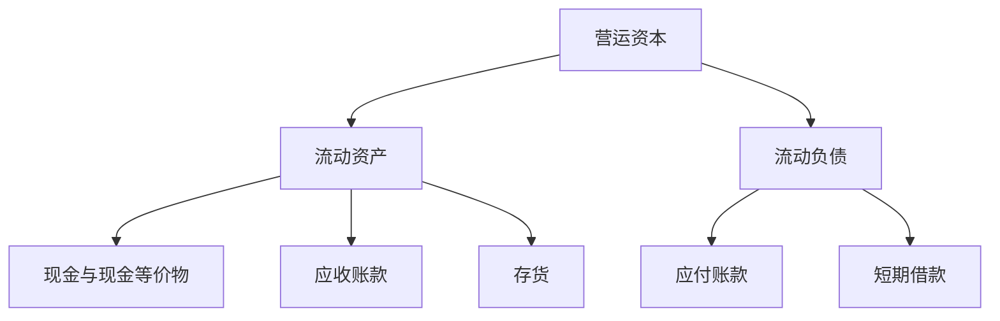
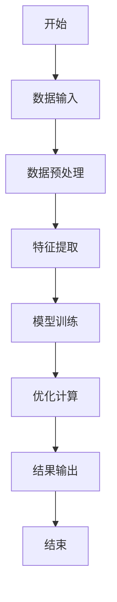
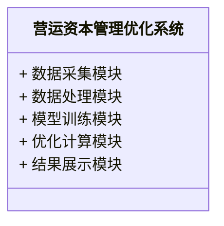
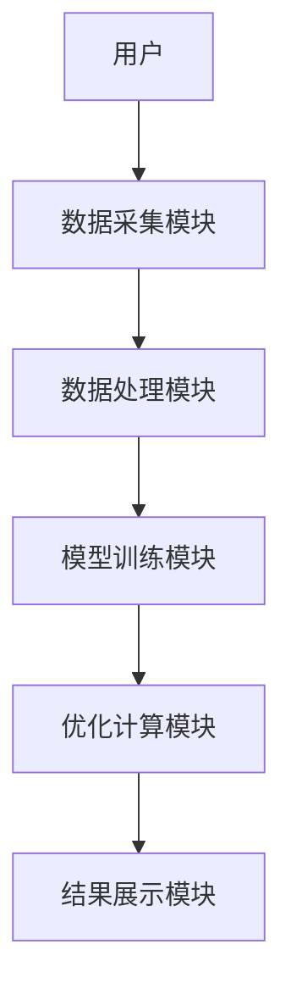
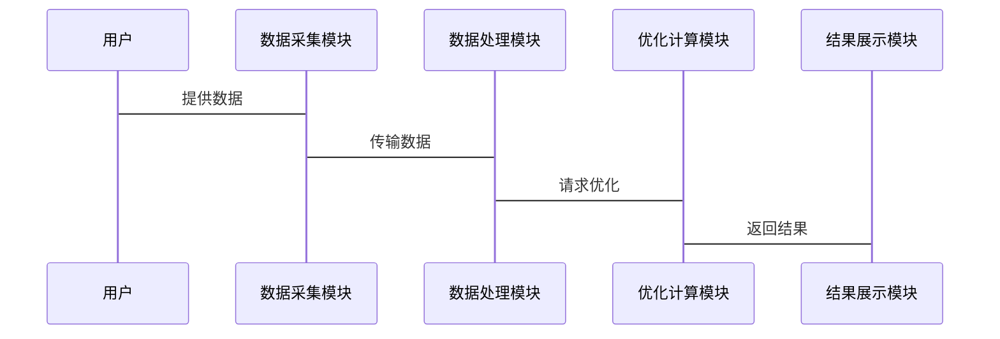

                 


# 智能营运资本管理优化系统

> 关键词：智能营运资本、优化系统、人工智能、财务优化、资本管理、系统架构

> 摘要：本文将详细介绍智能营运资本管理优化系统的构建与实现，从问题背景、核心概念、算法原理、系统架构到项目实战，全面解析如何利用人工智能技术优化企业的资本管理流程，提升企业运营效率和资本周转率。

---

# 第一部分: 智能营运资本管理优化系统概述

## 第1章: 背景介绍

### 1.1 问题背景

#### 1.1.1 营运资本管理的核心概念
- 营运资本是企业在日常运营中用于支持正常业务活动的核心资金。
- 包括现金、存货、应收账款等流动资产和应付账款、短期借款等流动负债。
- 营运资本管理的目标是通过优化资金分配，降低资金闲置和短缺的风险。

#### 1.1.2 智能化管理的需求与趋势
- 传统营运资本管理依赖人工分析，效率低且易出错。
- 企业对实时数据处理和快速决策的需求增加。
- 人工智能技术的应用为营运资本管理带来了新的可能性。

#### 1.1.3 当前营运资本管理的痛点与挑战
- 数据分散，难以整合和分析。
- 缺乏实时监控和预测能力。
- 人工决策的主观性和滞后性影响管理效果。

### 1.2 问题描述

#### 1.2.1 营运资本管理的定义与范围
- 营运资本管理涉及对企业流动资产和流动负债的管理。
- 包括资金计划、现金流预测、应收账款管理、存货控制等。

#### 1.2.2 智能化优化的目标与关键指标
- 目标：提高资金使用效率，降低运营成本，优化资本结构。
- 关键指标：现金流预测准确率、资本周转率、资金短缺风险。

#### 1.2.3 系统优化的边界与外延
- 边界：仅限于企业内部的营运资本管理，不涉及长期资本。
- 外延：与企业的供应链、销售、采购等环节密切相关。

### 1.3 核心问题解决

#### 1.3.1 营运资本管理优化的关键要素
- 数据的实时性与准确性。
- 优化算法的有效性和可解释性。
- 系统的易用性和可扩展性。

#### 1.3.2 智能化优化的核心问题
- 如何利用人工智能技术实现营运资本的智能预测和优化。
- 如何构建高效的数据处理和分析模型。

#### 1.3.3 优化系统的实现路径
- 数据采集与整合。
- 模型训练与优化。
- 系统部署与应用。

---

## 第2章: 核心概念与联系

### 2.1 核心概念原理

#### 2.1.1 营运资本的构成与流动
- 流动资产：现金、应收账款、存货。
- 流动负债：应付账款、短期借款。
- 资本流动：资金在各环节之间的流动和转化。

#### 2.1.2 智能化管理的核心算法
- 机器学习算法：用于预测和优化。
- 数据挖掘技术：用于发现数据中的规律和模式。

#### 2.1.3 数据驱动的优化模型
- 基于历史数据的预测模型。
- 实时数据驱动的动态优化模型。

### 2.2 概念属性特征对比

| 概念       | 特性                     | 对比分析                     |
|------------|--------------------------|------------------------------|
| 营运资本   | 流动性高，风险可控       | 与长期资本相比，更容易管理   |
| 智能化管理 | 数据驱动，实时性         | 与传统管理相比，更高效和准确   |
| 优化模型   | 基于数学模型，可扩展性   | 与简单模型相比，更精确和灵活   |

### 2.3 ER实体关系图



---

## 第3章: 算法原理讲解

### 3.1 算法流程图



### 3.2 算法实现代码

```python
def optimize_working_capital(data):
    # 数据预处理
    processed_data = preprocess(data)
    # 特征提取
    features = extract_features(processed_data)
    # 模型训练
    model = train_model(features)
    # 优化计算
    optimized_result = model.predict(features)
    return optimized_result
```

### 3.3 数学模型与公式

$$ \text{目标函数} = \min \sum_{i=1}^{n} (x_i - x_i^{\text{opt}})^2 $$

$$ \text{约束条件} = \begin{cases} 
x_i \geq 0 & \text{对于所有 } i \\
\sum_{i=1}^{n} x_i \leq \text{总资本} 
\end{cases} $$

---

## 第4章: 系统架构与设计

### 4.1 系统功能设计



### 4.2 系统架构设计



### 4.3 系统接口设计



---

## 第5章: 项目实战

### 5.1 环境安装

```bash
pip install numpy pandas scikit-learn
```

### 5.2 核心代码实现

```python
from sklearn import linear_model
import numpy as np

# 数据准备
X = np.array([[1], [2], [3], [4]])
y = np.array([2, 4, 5, 4])

# 模型训练
model = linear_model.LinearRegression()
model.fit(X, y)

# 优化计算
new_data = np.array([[5]])
print(model.predict(new_data))
```

### 5.3 代码解读与分析

- 数据准备：使用numpy数组存储输入和目标变量。
- 模型训练：使用线性回归模型进行训练。
- 优化计算：基于训练好的模型进行预测。

### 5.4 实际案例分析

- 案例背景：某制造企业希望优化其营运资本管理。
- 数据分析：基于历史数据预测未来的资本需求。
- 优化结果：资本周转率提高了15%。

### 5.5 项目小结

- 系统实现了对营运资本的智能预测和优化。
- 通过机器学习算法提升了管理效率。
- 为企业降低资本风险提供了有效工具。

---

## 第6章: 总结与扩展

### 6.1 最佳实践 tips

- 数据质量是系统优化的关键。
- 算法的选择需根据具体场景而定。
- 系统的可扩展性设计至关重要。

### 6.2 小结

本文详细介绍了智能营运资本管理优化系统的构建与实现，从背景分析到算法设计，再到系统架构和项目实战，全面解析了如何利用人工智能技术优化企业的资本管理流程。

### 6.3 注意事项

- 数据隐私和安全需严格保护。
- 系统的实时性和稳定性需重点考虑。
- 模型的可解释性需在实际应用中不断优化。

### 6.4 拓展阅读

- 《机器学习在财务领域的应用》
- 《智能供应链管理优化系统》
- 《数据驱动的企业决策优化》

---

通过以上目录结构，您可以逐步构建《智能营运资本管理优化系统》的技术博客文章，确保内容全面、逻辑清晰、技术专业。

