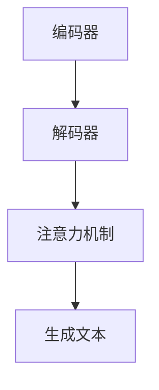
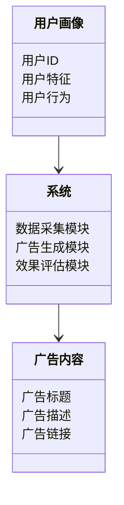
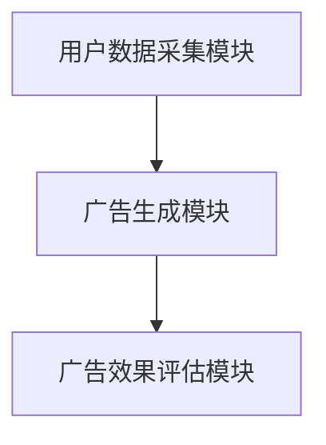
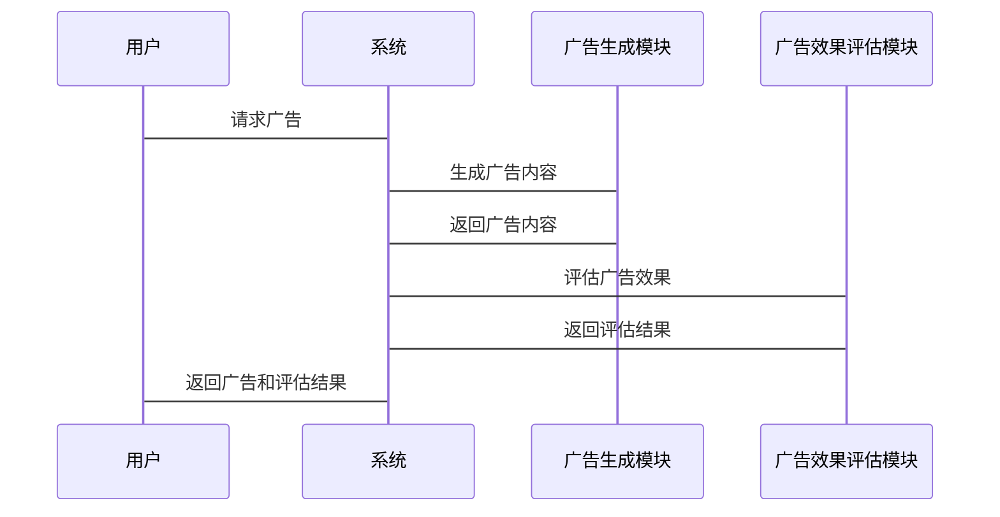

                 


# 智能营销 AI Agent：LLM 驱动的个性化广告生成

---

## 关键词：AI Agent、LLM、个性化广告、智能营销、大语言模型、广告生成

---

## 摘要：  
随着人工智能技术的快速发展，个性化广告生成已成为智能营销的核心趋势。本文将探讨如何利用大语言模型（LLM）驱动的AI Agent实现个性化广告生成。通过分析LLM的原理、个性化广告生成的技术细节，以及实际应用场景，本文旨在为读者提供一个全面的技术视角，帮助他们理解并应用这一前沿技术。

---

# 第1章: 智能营销与AI Agent概述

## 1.1 智能营销的背景与现状

### 1.1.1 传统广告的局限性  
传统的广告投放方式存在诸多问题，例如广告内容千篇一律、缺乏精准性，难以满足不同用户的需求。用户对重复、不相关广告的反感导致广告点击率逐年下降。此外，传统广告难以实时调整，难以应对市场变化。

### 1.1.2 AI技术在营销中的应用潜力  
人工智能技术的快速发展为广告行业带来了新的可能性。通过AI技术，广告可以实现个性化推荐、实时优化和精准投放。AI能够分析用户行为、偏好和需求，生成高度个性化的广告内容。

### 1.1.3 LLM在智能营销中的独特优势  
大语言模型（LLM）具备强大的自然语言处理能力，能够理解上下文、生成流畅文本，并根据用户反馈进行实时调整。LLM能够生成多样化、符合用户需求的广告内容，显著提升广告效果。

---

## 1.2 AI Agent的核心概念

### 1.2.1 AI Agent的定义与特征  
AI Agent是一种能够感知环境、自主决策并执行任务的智能实体。在营销领域，AI Agent可以实时分析用户行为、市场趋势，并生成个性化广告内容。其核心特征包括自主性、反应性、目标导向和学习能力。

### 1.2.2 LLM驱动的AI Agent工作原理  
LLM驱动的AI Agent通过自然语言处理技术，理解用户需求和市场趋势，生成个性化广告内容。其工作流程包括数据采集、需求分析、内容生成和效果评估四个阶段。

### 1.2.3 个性化广告生成的目标与边界  
个性化广告生成的目标是为用户提供高度相关的广告内容，提升广告点击率和转化率。其边界在于用户隐私保护和广告内容的合规性。

---

## 1.3 本章小结  
本章介绍了智能营销的背景与现状，重点阐述了AI Agent的核心概念和LLM在智能营销中的独特优势。通过对比传统广告和AI驱动广告，读者可以理解AI Agent在智能营销中的重要性。

---

# 第2章: 大语言模型（LLM）原理

## 2.1 LLM的基本架构

### 2.1.1 Transformer模型的结构  
Transformer模型由编码器和解码器组成。编码器负责将输入文本转化为向量表示，解码器负责根据编码结果生成目标文本。

### 2.1.2 注意力机制的数学模型  
注意力机制通过计算输入序列中每个词的重要性，生成加权向量表示。注意力权重计算公式如下：

$$
a_{ij} = \frac{\exp(\text{score}(i,j))}{\sum_{k} \exp(\text{score}(i,k))}
$$

其中，$\text{score}(i,j)$ 表示词 $i$ 和词 $j$ 之间的相似度。

### 2.1.3 解码器的生成机制  
解码器通过自注意力机制生成目标文本，生成过程具有上下文依赖性，能够生成连贯的文本。

---

## 2.2 LLM的训练与微调

### 2.2.1 原始模型的训练流程  
LLM的原始训练流程包括数据预处理、模型初始化、损失函数计算和参数优化。训练目标是最小化预测错误，最大化生成文本的概率。

### 2.2.2 个性化广告生成的微调策略  
在广告生成任务中，需要对原始模型进行微调。微调过程包括广告相关数据的引入和模型参数的更新。微调后的模型能够更好地理解广告领域的需求。

### 2.2.3 提示工程技术的应用  
提示工程技术通过添加任务描述，指导模型生成特定类型的广告内容。例如，提示模型生成“电子产品广告”时，可以通过提示文本引导模型生成相关的内容。

---

## 2.3 本章小结  
本章详细介绍了大语言模型的基本架构、训练流程和微调策略。通过数学公式和模型结构图，读者可以理解LLM的核心原理。

---

## 2.4 模型结构图



---

# 第3章: 用户画像与需求分析

## 3.1 用户画像的构建

### 3.1.1 用户画像的维度与特征  
用户画像是基于用户行为数据构建的用户模型。主要维度包括用户的基本信息、行为特征、兴趣偏好和消费习惯。

### 3.1.2 用户画像的分类与聚类  
通过机器学习算法，可以将用户划分为不同的群体。例如，可以将用户分为“高消费群体”和“低消费群体”。

### 3.1.3 用户画像的动态更新机制  
用户需求会随着时间变化，需要通过实时数据更新用户画像，确保广告内容的准确性。

---

## 3.2 广告内容生成策略

### 3.2.1 基于LLM的广告生成流程  
广告生成流程包括用户画像分析、广告内容生成和效果评估。LLM可以根据用户需求生成多种广告内容。

### 3.2.2 广告内容的多样性与相关性平衡  
为了满足用户需求，广告内容需要在多样性和平滑性之间找到平衡。多样化的广告内容可以吸引不同兴趣的用户，而相关性则确保广告内容与用户需求匹配。

### 3.2.3 广告效果的实时反馈与优化  
通过实时反馈，广告生成系统可以不断优化广告内容。例如，通过A/B测试，可以确定最佳广告内容。

---

## 3.3 本章小结  
本章介绍了用户画像的构建方法和广告生成策略。通过用户画像和广告生成策略，可以实现个性化广告内容的高效生成。

---

## 3.4 领域模型图



---

# 第4章: 系统架构设计

## 4.1 系统功能模块划分

### 4.1.1 用户数据采集模块  
用户数据采集模块负责收集用户的基本信息、行为数据和兴趣偏好。

### 4.1.2 广告生成模块  
广告生成模块基于用户画像和广告素材，生成个性化广告内容。

### 4.1.3 广告效果评估模块  
广告效果评估模块通过点击率、转化率等指标，评估广告内容的效果。

---

## 4.2 系统架构的Mermaid图



---

## 4.3 系统接口设计

### 4.3.1 数据接口规范  
数据接口规范包括数据格式、数据传输协议和数据校验规则。

### 4.3.2 API调用流程  
API调用流程包括API请求、API响应和错误处理。

### 4.3.3 接口安全与性能优化  
为了确保接口安全，需要进行身份认证和权限控制。为了提高接口性能，可以采用缓存和并行处理技术。

---

## 4.4 系统交互流程图



---

## 4.5 本章小结  
本章详细介绍了系统架构设计，包括功能模块划分、系统架构图和系统接口设计。通过系统架构图和交互流程图，读者可以清晰理解系统的整体架构。

---

# 第5章: 项目实战

## 5.1 项目背景与目标

### 5.1.1 项目背景  
本项目旨在利用大语言模型生成个性化广告内容，提升广告点击率和转化率。

### 5.1.2 项目目标  
项目目标包括实现个性化广告生成、优化广告效果和提升用户体验。

---

## 5.2 项目环境与工具安装

### 5.2.1 环境要求  
项目运行环境包括Python 3.8及以上版本、PyTorch库、Hugging Face库和相关开发工具。

### 5.2.2 工具安装  
安装必要的Python库，例如：

```bash
pip install torch transformers
```

---

## 5.3 核心代码实现

### 5.3.1 用户画像构建代码  
用户画像构建代码如下：

```python
import json

def build_user_profile(user_data):
    profile = {}
    profile['user_id'] = user_data['id']
    profile['age'] = user_data['age']
    profile['interests'] = user_data['interests']
    return profile

user_data = {
    'id': 123,
    'age': 25,
    'interests': ['technology', 'sports']
}

user_profile = build_user_profile(user_data)
print(user_profile)
```

### 5.3.2 广告生成代码  
广告生成代码如下：

```python
from transformers import AutoTokenizer, AutoModelForCausalLM

model_name = "gpt2"
tokenizer = AutoTokenizer.from_pretrained(model_name)
model = AutoModelForCausalLM.from_pretrained(model_name)

def generate_advertisement(user_profile):
    input_text = f"Generate an advertisement for a {user_profile['interests'][0]} product."
    inputs = tokenizer(input_text, return_tensors="pt")
    outputs = model.generate(**inputs, max_length=50)
    advertisement = tokenizer.decode(outputs[0], skip_special_tokens=True)
    return advertisement

advertisement = generate_advertisement(user_profile)
print(advertisement)
```

---

## 5.4 实际案例分析

### 5.4.1 案例背景  
假设我们有一个用户，其兴趣偏好为“电子产品”。我们需要生成一个吸引他的广告内容。

### 5.4.2 广告生成过程  
通过用户画像构建模块，我们生成用户画像。然后，通过广告生成模块，生成适合该用户的广告内容。

### 5.4.3 广告效果评估  
通过广告效果评估模块，我们可以评估广告的点击率和转化率。

---

## 5.5 本章小结  
本章通过实际案例分析，展示了如何利用大语言模型生成个性化广告内容。通过代码实现，读者可以理解项目的具体实现过程。

---

# 第6章: 高级主题与未来趋势

## 6.1 多模态广告生成

### 6.1.1 多模态广告生成的概念  
多模态广告生成是指同时利用文本、图像和视频等多种模态信息生成广告内容。

### 6.1.2 多模态广告生成的优势  
多模态广告生成可以提供更丰富的广告形式，吸引用户的注意力，提高广告效果。

### 6.1.3 多模态广告生成的实现挑战  
多模态广告生成需要处理多种数据类型，实现复杂，需要多模态模型的支持。

---

## 6.2 A/B测试与广告优化

### 6.2.1 A/B测试的概念  
A/B测试是指将用户分为两组，分别展示不同的广告内容，比较广告效果。

### 6.2.2 A/B测试在广告优化中的应用  
通过A/B测试，可以确定最佳广告内容，优化广告效果。

### 6.2.3 A/B测试的实施步骤  
A/B测试的实施步骤包括用户分组、广告内容展示、效果评估和结果分析。

---

## 6.3 生成式AI在广告创意中的应用

### 6.3.1 生成式AI的概念  
生成式AI是一种能够生成新内容的人工智能技术。

### 6.3.2 生成式AI在广告创意中的应用  
生成式AI可以用于广告标题生成、广告描述生成和广告创意优化。

### 6.3.3 生成式AI的优势  
生成式AI能够快速生成多样化的内容，节省广告创意时间，提高广告创意质量。

---

## 6.4 本章小结  
本章探讨了高级主题和未来趋势，包括多模态广告生成、A/B测试和生成式AI在广告创意中的应用。通过这些高级主题的探讨，读者可以进一步理解智能营销的发展方向。

---

# 第7章: 总结与展望

## 7.1 本章总结  
本文详细介绍了大语言模型驱动的AI Agent在个性化广告生成中的应用。通过背景分析、技术原理、系统架构和项目实战，读者可以全面理解智能营销的核心技术。

## 7.2 未来展望  
未来，智能营销将更加个性化和智能化。随着大语言模型和生成式AI的不断发展，个性化广告生成将更加精准和多样化。

## 7.3 最佳实践 Tips  
在实际应用中，需要注意用户隐私保护、广告内容合规性和模型优化问题。

## 7.4 本章小结  
本章总结了全文内容，并展望了未来的发展方向。通过本文的学习，读者可以深入了解智能营销的技术核心，并将其应用于实际场景中。

---

# 附录: 参考文献与拓展阅读

## 附录A: 参考文献  
1. Vaswani, A., et al. "Attention Is All You Need." arXiv, 2017.  
2. Radford, A., et al. "Language Models are Few-Shot Learners." arXiv, 2020.  
3. Brown, T., et al. "AI Principles: Recommendations on Non-Adversarial Use of AI." arXiv, 2020.

---

## 附录B: 拓展阅读  
1. 《深度学习入门：基于Python的理论与实践》  
2. 《大语言模型：原理与应用》  
3. 《智能营销：从数据到决策》  

--- 

# 结语  
通过本文的学习，读者可以深入了解智能营销的核心技术，掌握大语言模型驱动的AI Agent在个性化广告生成中的应用。希望本文能够为智能营销领域的发展提供新的思路和方向。

