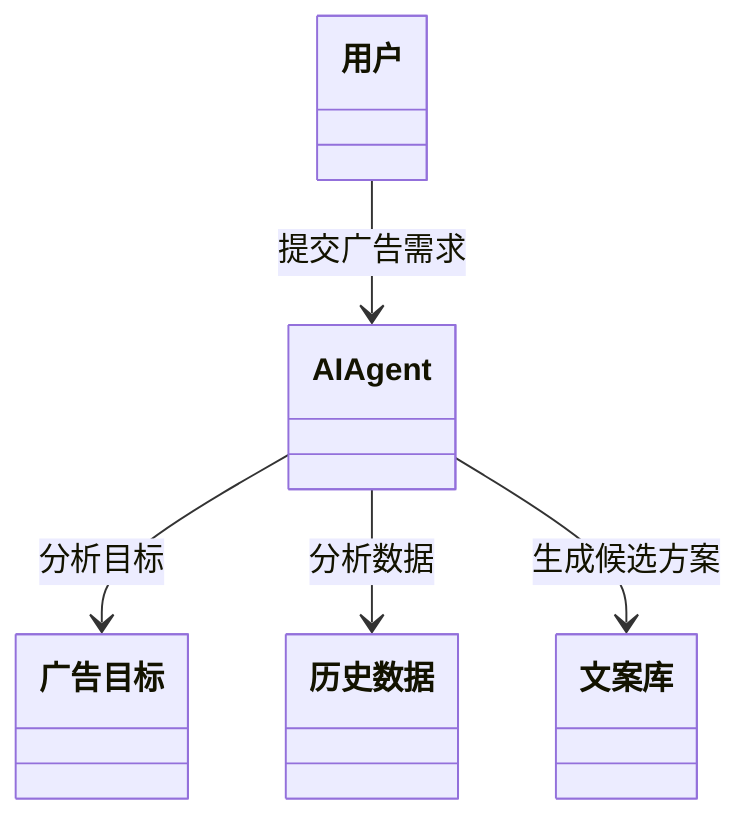

                 


# 智能营销文案AI Agent：LLM辅助的广告创意生成

## 关键词：AI Agent，LLM，广告创意生成，智能营销，大语言模型

## 摘要：本文探讨了如何利用大语言模型（LLM）辅助生成广告创意，分析了LLM在营销文案创作中的应用潜力和优势，详细讲解了其算法原理、系统架构设计以及实际项目中的实现方案，最后给出了最佳实践和未来展望。

---

## 第一部分: 智能营销文案AI Agent的背景与核心概念

### 第1章: 智能营销文案与AI Agent的背景介绍

#### 1.1 问题背景与描述
##### 1.1.1 数字营销的挑战与痛点
在数字营销领域，企业面临着以下主要挑战：
- **创意枯竭**：传统营销手段逐渐失去吸引力，用户对重复的内容缺乏兴趣。
- **效率低下**：营销团队需要不断尝试不同的创意，耗费大量时间和资源。
- **个性化需求**：消费者行为日益多样化，企业需要更精准的营销策略。
- **数据驱动**：现代营销依赖数据，但手动分析数据效率低下。

##### 1.1.2 AI技术在营销中的应用现状
AI技术已经渗透到营销的各个领域，包括：
- **客户画像**：通过机器学习分析用户行为，构建精准的客户画像。
- **内容推荐**：基于用户兴趣推荐个性化内容。
- **广告投放优化**：通过AI优化广告投放策略，提高转化率。

##### 1.1.3 大语言模型（LLM）的崛起与潜力
大语言模型，如GPT系列和BERT系列，凭借其强大的文本生成和理解能力，正在成为营销领域的新兴工具。

#### 1.2 问题解决与边界
##### 1.2.1 传统营销文案创作的局限性
传统文案创作依赖人工经验，存在以下问题：
- **效率低**：需要大量时间和资源。
- **创意受限**：创意可能缺乏新意，难以吸引目标受众。
- **数据驱动不足**：难以充分利用数据进行优化。

##### 1.2.2 AI辅助文案创作的优势与边界
AI辅助文案创作的优势：
- **高效生成**：AI可以在短时间内生成大量创意，显著提高效率。
- **多样性**：AI可以提供多种不同的创意，拓宽思路。
- **数据驱动**：利用AI分析数据，生成更精准的文案。

AI辅助文案创作的边界：
- **创意质量**：AI生成的文案可能缺乏人类的创意深度。
- **可解释性**：AI的决策过程可能不够透明，影响信任度。

#### 1.3 核心概念与外延
##### 1.3.1 智能营销文案的定义与特征
智能营销文案是指利用AI技术生成和优化的广告文案，具有以下特征：
- **数据驱动**：基于用户数据生成个性化文案。
- **动态优化**：能够根据实时数据调整内容。
- **高效迭代**：快速生成和测试多个创意方案。

##### 1.3.2 AI Agent在营销中的角色与功能
AI Agent在营销中的角色：
- **内容生成**：生成广告文案、标题、描述等。
- **策略优化**：优化广告投放策略，提高转化率。
- **数据分析**：分析用户行为，提供数据支持。

##### 1.3.3 LLM在广告创意生成中的实现机制
LLM通过以下机制实现广告创意生成：
1. **输入处理**：接收用户输入的广告目标、目标受众等信息。
2. **文本生成**：利用预训练的语言模型生成多个候选文案。
3. **优化调整**：根据反馈或数据进一步优化文案内容。

#### 1.4 本章小结
本章介绍了数字营销面临的挑战，分析了AI技术在营销中的应用现状，重点探讨了大语言模型在广告创意生成中的潜力和优势。

---

### 第2章: 大语言模型（LLM）的核心概念与原理

#### 2.1 LLM的基本原理
##### 2.1.1 语言模型的定义与工作原理
语言模型是一种能够理解和生成人类语言的AI系统，其工作原理基于概率分布，预测下一个词的概率。

##### 2.1.2 大模型的训练与优化
大语言模型的训练过程包括：
1. **预训练**：利用大规模的文本数据进行无监督学习，目标是预测句子中的缺失词。
2. **微调**：在特定任务上进行有监督学习，优化模型在广告创意生成中的表现。

##### 2.1.3 LLM的文本生成机制
LLM通过解码器结构生成文本，生成过程基于概率预测，逐步生成每个词。

#### 2.2 LLM与其他AI技术的对比
##### 2.2.1 与传统NLP技术的区别
传统NLP技术依赖规则和特征工程，而LLM基于深度学习，能够自动生成复杂语义。

##### 2.2.2 与小模型（如BERT）的对比
小模型适用于需要理解上下文的任务，而LLM更适合生成任务，能够生成更长的文本。

##### 2.2.3 与图像生成模型的对比
图像生成模型处理视觉数据，而LLM处理文本数据，应用场景不同。

#### 2.3 LLM在营销文案中的应用
##### 2.3.1 文案生成的流程与步骤
1. **输入广告目标**：明确广告的目标受众、产品特点等。
2. **生成多个候选方案**：利用LLM生成多个文案。
3. **优化调整**：根据数据反馈优化文案。

##### 2.3.2 LLM在广告创意中的优势
- **高效性**：快速生成大量创意。
- **多样性**：提供多种风格的文案。
- **数据驱动**：能够结合用户数据进行优化。

##### 2.3.3 LLM生成文案的质量评估
评估指标包括创意新颖性、用户点击率、转化率等。

#### 2.4 本章小结
本章详细介绍了大语言模型的基本原理，对比了其他AI技术，并探讨了LLM在营销文案中的应用。

---

## 第二部分: LLM辅助广告创意生成的算法原理

### 第3章: LLM辅助广告创意生成的算法原理

#### 3.1 模型结构与训练过程
##### 3.1.1 解码器的结构与作用
解码器负责生成文本，通常采用自回归的方式逐词生成。

##### 3.1.2 预训练任务与目标函数
预训练任务包括语言建模，目标函数是最大化条件概率。

##### 3.1.3 微调（Fine-tuning）过程
微调过程包括：
1. **任务特定数据**：收集广告文案相关的数据。
2. **有监督学习**：在特定任务上进行优化。

#### 3.2 LLM的文本生成算法
##### 3.2.1 解码策略
- **贪心解码**：每次选择概率最高的词。
- **随机采样**：随机选择词，增加多样性。

##### 3.2.2 基于概率的生成模型
生成模型通过计算每个词的概率，生成最可能的序列。

#### 3.3 损失函数与优化
##### 3.3.1 交叉熵损失函数
交叉熵损失函数用于衡量生成与真实数据的差异。

##### 3.3.2 优化算法
通常使用Adam优化算法，结合学习率衰减策略。

#### 3.4 本章小结
本章详细讲解了LLM辅助广告创意生成的算法原理，包括模型结构、训练过程和解码策略。

---

## 第三部分: 系统分析与架构设计

### 第4章: LLM辅助广告创意生成的系统架构

#### 4.1 问题场景介绍
广告创意生成系统需要满足以下需求：
- **快速生成**：能够快速生成多个创意。
- **个性化定制**：根据目标受众生成个性化文案。
- **数据驱动**：结合用户行为数据进行优化。

#### 4.2 系统功能设计
##### 4.2.1 领域模型设计


##### 4.2.2 系统架构设计


#### 4.3 系统接口设计
##### 4.3.1 API接口
- **输入**：广告目标、目标受众、预算。
- **输出**：多个候选文案。

##### 4.3.2 数据接口
- **输入**：用户行为数据、历史广告数据。
- **输出**：优化建议。

#### 4.4 本章小结
本章设计了系统的功能模块和架构，展示了系统的整体流程。

---

## 第四部分: 项目实战与实现

### 第5章: 项目实战与实现

#### 5.1 环境安装与配置
##### 5.1.1 安装Python环境
```bash
python -m pip install --upgrade pip
pip install torch transformers
```

##### 5.1.2 安装LLM模型
```bash
pip install llama
```

#### 5.2 核心功能实现
##### 5.2.1 文案生成代码
```python
from llama import Llama

def generate_ad_copy(prompt, max_tokens=50):
    with Llama(prompt=prompt) as model:
        response = model.generate(max_tokens=max_tokens)
        return response
```

##### 5.2.2 数据分析代码
```python
import pandas as pd

def analyze_data(dataframe):
    # 统计点击率
    click_rate = dataframe['click'].mean()
    # 统计转化率
    conversion_rate = dataframe['conversion'].mean()
    return click_rate, conversion_rate
```

#### 5.3 代码解读与分析
##### 5.3.1 文案生成过程
1. **输入提示**：用户提供广告目标。
2. **生成文案**：LLM生成多个候选方案。
3. **优化调整**：根据数据分析结果优化文案。

##### 5.3.2 数据分析过程
1. **数据加载**：读取用户行为数据。
2. **计算指标**：分析点击率和转化率。
3. **优化建议**：根据数据结果优化文案。

#### 5.4 实际案例分析
##### 5.4.1 案例背景
某电商企业希望推广新产品，目标受众为25-35岁的年轻女性。

##### 5.4.2 生成文案
根据输入的广告目标，生成多个候选文案，包括标题和描述。

##### 5.4.3 数据优化
根据用户点击数据，优化文案内容，提高转化率。

#### 5.5 本章小结
本章通过实际案例展示了LLM辅助广告创意生成的实现过程，包括环境配置、代码实现和数据优化。

---

## 第五部分: 总结与展望

### 第6章: 总结与展望

#### 6.1 最佳实践
- **数据质量**：确保数据的准确性和完整性。
- **模型优化**：定期更新模型，保持生成能力。
- **用户反馈**：根据用户反馈不断优化系统。

#### 6.2 本章总结
本文详细探讨了LLM在广告创意生成中的应用，分析了其算法原理和系统架构，展示了实际项目的实现过程。

#### 6.3 未来展望
- **可解释性**：提高AI决策的透明度。
- **多模态生成**：结合图像和文本生成更丰富的广告内容。
- **实时优化**：根据实时数据动态调整文案。

#### 6.4 拓展阅读
建议读者进一步阅读以下内容：
- 大语言模型的优化方法。
- 多模态生成技术的研究进展。
- AI在营销领域的最新应用。

---

## 第六部分: 附录

### 附录A: 术语表
- **LLM**：Large Language Model，大语言模型。
- **API**：Application Programming Interface，应用程序编程接口。
- **NLP**：Natural Language Processing，自然语言处理。

### 附录B: 参考文献
- [1] Radford, A., et al. "Language models are few-shot learners." arXiv preprint arXiv:1909.01037 (2019).
- [2] Vaswani, A., et al. "Attention is all you need." arXiv preprint arXiv:1706.03798 (2017).

---

通过以上结构，本文系统地介绍了智能营销文案AI Agent的核心概念、算法原理、系统设计和实际应用，为读者提供了全面的技术视角。

