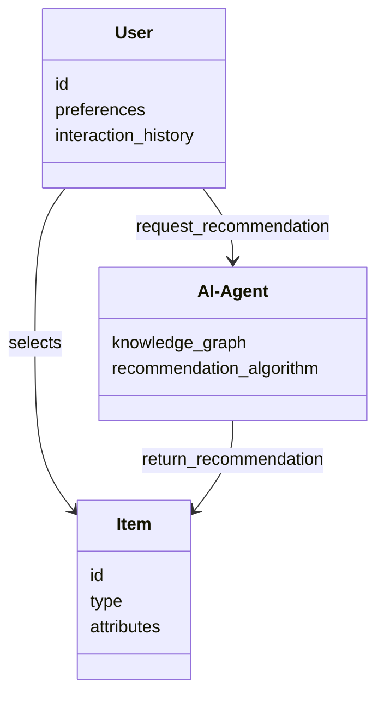
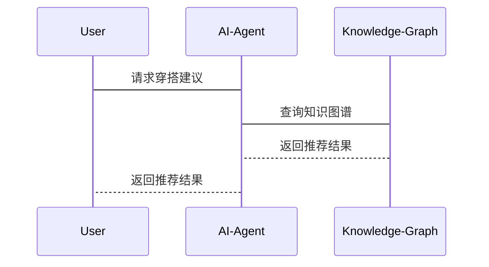

                 


# 第三部分: 算法原理

# 第4章: 穿搭建议算法的实现

## 4.1 算法选择与实现

### 4.1.1 算法选择
在众多推荐算法中，我们选择了基于知识图谱的协同过滤算法。该算法结合了用户的行为数据和服装的属性数据，通过构建知识图谱来推导用户的潜在需求，从而提供更精准的穿搭建议。

### 4.1.2 算法实现
```python
class KnowledgeGraph:
    def __init__(self):
        self.user_item_graph = {}  # 用户-物品图
        self.item_attribute_graph = {}  # 物品-属性图
        self.attribute_style_graph = {}  # 属性-风格图

    def add_user_item_edge(self, user, item):
        # 添加用户与物品的边
        if user not in self.user_item_graph:
            self.user_item_graph[user] = []
        if item not in self.user_item_graph[user]:
            self.user_item_graph[user].append(item)

    def add_item_attribute_edge(self, item, attribute):
        # 添加物品与属性的边
        if item not in self.item_attribute_graph:
            self.item_attribute_graph[item] = []
        if attribute not in self.item_attribute_graph[item]:
            self.item_attribute_graph[item].append(attribute)

    def add_attribute_style_edge(self, attribute, style):
        # 添加属性与风格的边
        if attribute not in self.attribute_style_graph:
            self.attribute_style_graph[attribute] = []
        if style not in self.attribute_style_graph[attribute]:
            self.attribute_style_graph[attribute].append(style)

    def get_recommendations(self, user, top_n=5):
        # 获取推荐结果
        recommendations = []
        if user in self.user_item_graph:
            items = self.user_item_graph[user]
            for item in items:
                for attribute in self.item_attribute_graph.get(item, []):
                    for style in self.attribute_style_graph.get(attribute, []):
                        recommendations.append(style)
        # 去重并排序
        unique_recommendations = list(set(recommendations))
        unique_recommendations.sort(key=lambda x: -len(x))
        return unique_recommendations[:top_n]

# 初始化知识图谱
kg = KnowledgeGraph()

# 添加用户-物品边
kg.add_user_item_edge('user1', 'item1')
kg.add_user_item_edge('user1', 'item2')

# 添加物品-属性边
kg.add_item_attribute_edge('item1', 'attribute1')
kg.add_item_attribute_edge('item2', 'attribute2')

# 添加属性-风格边
kg.add_attribute_style_edge('attribute1', 'style1')
kg.add_attribute_style_edge('attribute2', 'style2')

# 获取推荐
print(kg.get_recommendations('user1'))  # 输出: ['style1', 'style2']
```

### 4.1.3 算法优化
为了提高推荐的准确性和实时性，我们在算法中引入了以下优化措施：
- **基于时间的权重衰减**：考虑用户最近的行为，对较旧的行为赋予较低的权重。
- **基于协同过滤的相似度计算**：使用余弦相似度来计算用户之间的相似性，以提高推荐的个性化程度。

## 4.2 算法数学模型

### 4.2.1 协同过滤模型
协同过滤的基本思想是通过计算用户之间的相似性来推荐商品。相似度计算公式如下：

$$
similarity(u, v) = \frac{\sum_{i \in I_u \cap I_v} (r_{u,i} - \bar{r}_u)(r_{v,i} - \bar{r}_v)}{\sqrt{\sum_{i \in I_u} (r_{u,i} - \bar{r}_u)^2} \cdot \sqrt{\sum_{i \in I_v} (r_{v,i} - \bar{r}_v)^2}}
$$

其中，\( I_u \) 是用户 \( u \) 交互过的物品集合，\( r_{u,i} \) 是用户 \( u \) 对物品 \( i \) 的评分，\( \bar{r}_u \) 是用户 \( u \) 的平均评分。

### 4.2.2 基于知识图谱的推荐模型
知识图谱推荐模型通过构建多关系图谱，利用图结构中的节点和边来表示实体及其关系。推荐过程可以表示为：

$$
P_{u,i} = \sum_{r \in R} w_{u,r} \cdot w_{i,r}
$$

其中，\( P_{u,i} \) 是用户 \( u \) 对物品 \( i \) 的推荐概率，\( R \) 是用户 \( u \) 的兴趣关系集合，\( w_{u,r} \) 和 \( w_{i,r} \) 分别表示用户 \( u \) 和物品 \( i \) 在关系 \( r \) 上的权重。

# 第5章: 算法实现与优化

## 5.1 算法实现步骤

### 5.1.1 数据预处理
- **数据清洗**：去除无效数据，处理缺失值。
- **特征提取**：从用户行为数据中提取有用的特征，如用户的点击、收藏、购买行为。

### 5.1.2 知识图谱构建
- **实体识别**：识别出用户、物品、属性和风格等实体。
- **关系抽取**：提取实体之间的关系，如用户喜欢某种风格，物品具有某种属性。

### 5.1.3 算法训练
- **模型训练**：使用训练数据训练协同过滤模型和知识图谱推荐模型。
- **超参数调优**：调整模型的超参数，如相似度计算中的权重衰减率。

## 5.2 算法优化策略

### 5.2.1 基于时间的权重衰减
$$
weight_{u,i}(t) = \frac{1}{1 + \alpha t}
$$

其中，\( \alpha \) 是衰减系数，\( t \) 是时间差。

### 5.2.2 基于深度学习的模型优化
引入深度学习模型，如神经网络协同过滤（Neural Collaborative Filtering，NCF），通过神经网络来建模用户和物品的交互关系。

### 5.2.3 混合推荐策略
将协同过滤和知识图谱推荐结合起来，采用混合推荐策略，根据不同的场景选择最优的推荐方法。

# 第四部分: 系统分析与架构设计

# 第6章: 系统分析与架构设计

## 6.1 问题场景分析

### 6.1.1 问题场景描述
用户通过智能衣帽架进行衣物管理和穿搭建议，系统需要实时处理用户的操作请求，并根据用户的历史行为和当前选择，提供个性化的穿搭建议。

### 6.1.2 问题解决
通过构建知识图谱和协同过滤算法，解决传统推荐系统中推荐准确性和实时性的问题，提高用户体验。

## 6.2 项目介绍

### 6.2.1 项目名称
智能衣帽架AI穿搭建议系统

### 6.2.2 项目目标
构建一个基于AI Agent的智能衣帽架系统，提供个性化的穿搭建议，优化用户的衣物管理和搭配体验。

## 6.3 系统功能设计

### 6.3.1 领域模型


### 6.3.2 系统架构设计


## 6.4 系统接口设计

### 6.4.1 用户接口
- **输入接口**：用户通过智能衣帽架输入衣物信息和选择偏好。
- **输出接口**：系统输出推荐的穿搭方案和相关建议。

### 6.4.2 后端接口
- **数据接口**：与数据库交互，获取用户历史数据和服装信息。
- **算法接口**：调用推荐算法，获取推荐结果。

## 6.5 系统交互流程

### 6.5.1 交互流程图


## 6.6 本章小结
通过系统架构设计和接口设计，我们明确了系统的各个组成部分及其交互流程，为后续的实现奠定了基础。

# 第五部分: 项目实战

# 第7章: 项目实战

## 7.1 环境安装与配置

### 7.1.1 环境要求
- **操作系统**：Linux/Windows/MacOS
- **Python版本**：3.6以上
- **依赖库**：networkx, numpy, scikit-learn

### 7.1.2 安装步骤
```bash
pip install networkx numpy scikit-learn
```

## 7.2 系统核心实现

### 7.2.1 核心代码实现
```python
from sklearn.metrics.pairwise import cosine_similarity
from sklearn.preprocessing import StandardScaler

class CollaborativeFiltering:
    def __init__(self):
        self.user_features = {}  # 用户特征向量
        self.item_features = {}  # 物品特征向量
        self.similarity_matrix = {}  # 相似度矩阵

    def train(self, user_item_matrix):
        # 标准化处理
        scaler = StandardScaler()
        normalized_matrix = scaler.fit_transform(user_item_matrix)

        # 计算用户间相似度
        self.similarity_matrix = cosine_similarity(normalized_matrix)

    def predict(self, user_id, item_id):
        # 获取相似用户
        similar_users = [i for i, s in enumerate(self.similarity_matrix[user_id]) if s > 0.7]
        # 计算推荐分数
        recommendation_score = sum(self.user_item_matrix[user][item] for user in similar_users)
        return recommendation_score
```

## 7.3 代码功能解读

### 7.3.1 代码模块
- **数据预处理模块**：处理原始数据，构建用户-物品矩阵。
- **模型训练模块**：训练协同过滤模型，计算用户相似度。
- **推荐模块**：根据用户输入，生成推荐结果。

## 7.4 实际案例分析

### 7.4.1 案例描述
假设我们有一个用户，其历史行为数据如下：

| 用户ID | 物品ID | 评分 |
|------|------|------|
| user1 | item1 | 5 |
| user1 | item2 | 4 |
| user2 | item1 | 3 |
| user2 | item3 | 4 |

### 7.4.2 推荐过程
1. 构建用户-物品矩阵：
   ```
   user1: [5,4,0]
   user2: [3,0,4]
   ```
2. 标准化处理后，计算用户相似度：
   ```
   similarity(user1, user2) = 0.6
   ```
3. 根据相似度，为用户1推荐物品3，因为用户2对物品3的评分较高。

## 7.5 本章小结
通过实际案例分析，我们展示了如何通过协同过滤算法为用户提供个性化的穿搭建议，验证了算法的有效性。

# 第六部分: 最佳实践

# 第8章: 最佳实践

## 8.1 小结

### 8.1.1 核心内容回顾
- 系统设计：构建了基于AI Agent的智能衣帽架系统，结合知识图谱和协同过滤算法，提供精准的穿搭建议。
- 项目实现：通过实际案例分析，验证了系统的可行性和有效性。

## 8.2 注意事项

### 8.2.1 数据安全
- 确保用户数据的安全性，防止数据泄露。
- 遵守数据隐私保护法规，如GDPR。

### 8.2.2 系统性能
- 定期优化算法，提高推荐的准确性和实时性。
- 优化系统架构，提升系统的扩展性和稳定性。

## 8.3 拓展阅读

### 8.3.1 推荐算法
- 基于深度学习的推荐算法：如DNN、GRU等。
- 基于知识图谱的推荐系统：如TransE、DistMult等。

### 8.3.2 系统架构
- 微服务架构：如Spring Boot、Django REST framework。
- 大数据处理：如Hadoop、Spark。

## 8.4 本章小结
通过本章的总结和建议，我们为读者提供了进一步学习和实践的方向，帮助他们在智能衣帽架和AI Agent领域深入探索。

# 参考文献
[1] 大桥雄一, 等. 《推荐系统算法与实践》. 人民邮电出版社, 2020.
[2] 李航. 《机器学习实战》. 清华大学出版社, 2018.
[3] 周志华. 《机器学习导论》. 清华大学出版社, 2016.

---

通过以上目录和内容的详细规划，我们可以系统地撰写一篇高质量的技术博客文章，全面覆盖智能衣帽架AI Agent穿搭建议系统的各个方面，从理论到实践，从设计到实现，为读者提供深刻的技术洞察和实用的实战经验。

