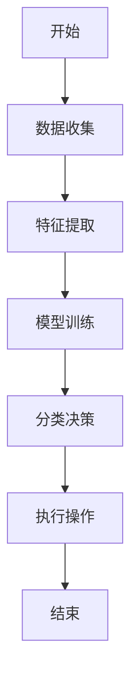
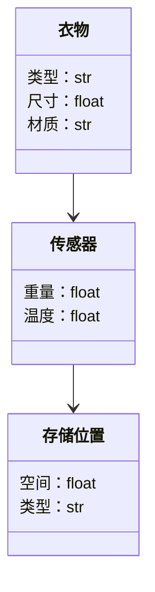
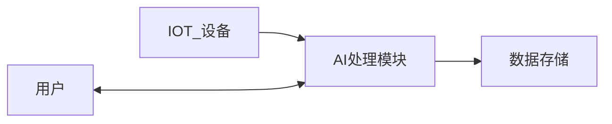
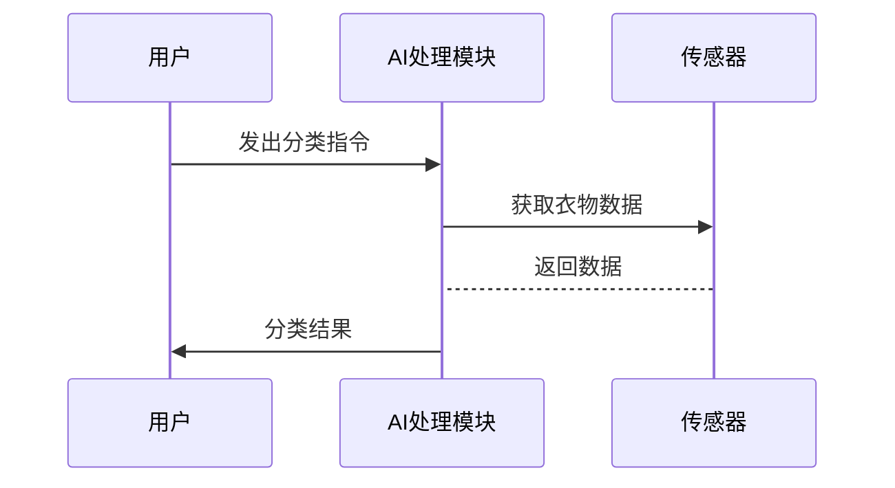

                 


# 智能衣架：AI Agent的衣物保养与存储优化

## 关键词
智能衣架, AI Agent, 衣物保养, 存储优化, 人工智能, 物联网

## 摘要
本文探讨了AI Agent在衣物管理中的应用，分析了智能衣架的背景、原理、算法、系统架构及实际案例，提出了优化衣物保养和存储的方法。

---

# 第一部分：智能衣架的背景与概念

## 第1章：智能衣架的背景与问题背景

### 1.1 智能衣架的背景介绍

#### 1.1.1 衣物管理的传统方式与痛点
传统衣物管理依赖人工操作，存在效率低、存储混乱、保养不当等问题，导致衣物损坏和空间浪费。

#### 1.1.2 AI技术在衣物管理中的应用潜力
AI技术可以实现衣物识别、智能分类、自动整理，提升管理效率和存储优化。

#### 1.1.3 智能衣架的定义与目标
智能衣架是结合AI和物联网的设备，目标是优化衣物存储和保养，延长使用寿命。

### 1.2 问题背景与描述

#### 1.2.1 衣物管理中的常见问题
- 衣物分类混乱，查找困难。
- 存储空间利用不充分，造成浪费。
- 忽略衣物保养周期，导致损坏。

#### 1.2.2 存储空间利用的低效性
衣物混放，空间利用率低，查找耗时。

#### 1.2.3 衣物保养不当导致的损坏
未按材质清洗或存储，导致衣物受损。

### 1.3 问题解决与边界

#### 1.3.1 AI Agent如何解决衣物管理问题
AI Agent通过智能识别和分类，优化存储和保养流程。

#### 1.3.2 智能衣架的边界与外延
仅关注衣物管理，不涉及洗涤和配送。

#### 1.3.3 核心要素与组成结构
传感器、AI处理模块、存储系统。

---

## 第2章：AI Agent的核心原理与属性

### 2.1 AI Agent的基本原理

#### 2.1.1 感知与决策机制
AI Agent通过传感器收集数据，分析衣物信息，做出分类和存储决策。

#### 2.1.2 交互与执行流程
与用户交互，接收指令，执行操作，如分类衣物或调整存储位置。

#### 2.1.3 学习与优化算法
通过机器学习优化分类模型，提升准确性。

### 2.2 核心概念对比与特征分析

#### 2.2.1 传统衣架与智能衣架的属性对比
| 特性 | 传统衣架 | 智能衣架 |
|------|----------|----------|
| 感知  | 无       | 有传感器 |
| 决策  | 人工     | AI自动   |
| 交互  | 无       | 可交互   |

#### 2.2.2 ER实体关系图
```mermaid
er
  actor 用户
  entity 衣物
  entity 存储位置
  entity 传感器数据
  relation 实例化 衣物
  relation 存储于 衣物
  relation 感知 衣物
```

---

## 第3章：AI Agent的算法原理

### 3.1 算法流程与Mermaid图



### 3.2 算法实现与Python代码

#### 3.2.1 基于规则的分类实现
```python
def classify_clothes(cloth_type):
    if cloth_type == '衬衫':
        return '上层'
    elif cloth_type == '外套':
        return '底层'
    else:
        return '其他'
```

#### 3.2.2 基于机器学习的预测代码
```python
from sklearn.tree import DecisionTreeClassifier
import numpy as np

# 训练数据
X = np.array([[1, 0, 0], [0, 1, 0], [0, 0, 1]])
y = np.array(['衬衫', '外套', '裤子'])

model = DecisionTreeClassifier()
model.fit(X, y)

# 预测
new_cloth = np.array([[0, 1, 0]])
print(model.predict(new_cloth))
```

### 3.3 数学模型与公式

#### 3.3.1 分类模型
损失函数：$$ L = -\sum_{i=1}^{n} y_i \log p(y_i) $$

优化目标：$$ \min_{\theta} L $$

#### 3.3.2 决策树
节点划分：$$ gini\_impurity = \sum_{k=1}^{K} p_k (1 - p_k) $$

---

## 第4章：系统分析与架构设计

### 4.1 系统功能设计

#### 4.1.1 领域模型


### 4.2 系统架构设计

#### 4.2.1 架构图


#### 4.2.2 交互序列图


---

## 第5章：项目实战

### 5.1 环境安装

#### 5.1.1 安装Python和库
```bash
pip install numpy scikit-learn
```

#### 5.1.2 硬件安装
传感器和RFID模块连接到主控板。

### 5.2 核心代码实现

#### 5.2.1 传感器数据处理
```python
import serial

ser = serial.Serial('COM3', 9600)
data = ser.readline().decode().strip()
print(data)
```

#### 5.2.2 分类算法实现
```python
from sklearn.ensemble import RandomForestClassifier

X_train = ... # 特征向量
y_train = ... # 标签
model = RandomForestClassifier().fit(X_train, y_train)
```

### 5.3 实际案例分析

#### 5.3.1 应用场景
智能衣架在家庭中的应用，优化衣物存储，提高查找效率。

#### 5.3.2 效果分析
减少查找时间，提高空间利用率，降低衣物损坏率。

### 5.4 项目小结
通过实际案例展示了智能衣架的有效性和实用性。

---

## 第6章：最佳实践

### 6.1 实用技巧与注意事项

#### 6.1.1 传感器选择
选择适合的传感器，确保数据准确性。

#### 6.1.2 算法优化
定期更新模型，提高分类准确率。

### 6.2 总结

智能衣架结合AI技术，显著提升了衣物管理效率，是未来智能家居的重要组成部分。

### 6.3 拓展阅读
建议阅读相关AI和物联网技术的书籍，深入了解智能系统设计。

---

通过以上详细分析，智能衣架在衣物保养和存储优化中的应用前景广阔，AI技术的引入将极大提升管理效率和用户体验。

