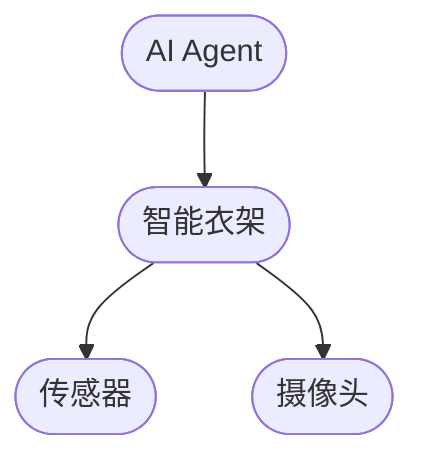
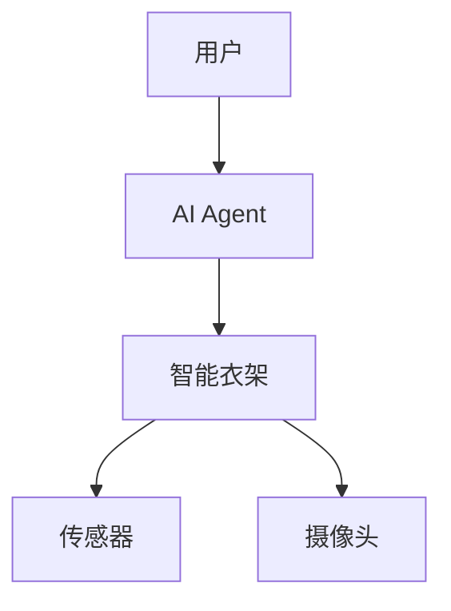
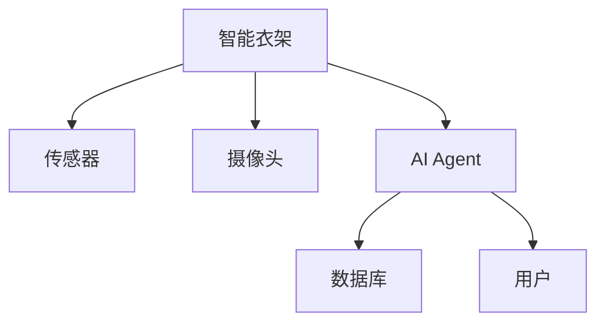

                 


# 智能衣架：AI Agent的衣物保养专家系统

## 关键词：AI Agent，衣物保养，智能衣架，算法实现，系统架构

## 摘要：智能衣架通过AI Agent技术，实现衣物的智能管理和保养。本文详细探讨其背景、核心概念、算法原理、系统架构、项目实战及最佳实践，帮助读者全面理解智能衣架的工作原理和实现过程。

---

## 第1章: 智能衣架的背景与问题背景

### 1.1 问题背景

#### 1.1.1 衣物保养的痛点
- 衣物保养是日常生活中的常见需求，但传统方法存在诸多问题，如：
  - 人们常常忘记衣物的清洗和保养时间，导致衣物损坏。
  - 缺乏专业的保养知识，容易错误使用洗涤剂或方法。
  - 衣物种类繁多，不同的材质和颜色需要不同的保养方式。

#### 1.1.2 智能衣架的出现
- 随着AI技术的发展，智能衣架应运而生，通过AI Agent技术，实现衣物的智能管理。

#### 1.1.3 问题解决的核心目标
- 提供智能化的衣物保养解决方案，帮助用户科学管理衣物，延长使用寿命。

### 1.2 问题描述

#### 1.2.1 衣物保养的主要问题
- 衣物保养涉及多个环节，包括清洗、晾晒、熨烫等，用户常常难以掌握正确的保养方法。

#### 1.2.2 用户需求分析
- 用户需要一个智能化的工具，帮助他们管理衣物的保养周期，提供保养建议，并提醒保养时间。

#### 1.2.3 智能衣架的功能定位
- 智能衣架不仅是一个普通的衣架，更是一个集成AI技术的衣物管理专家，能够感知衣物状态，提供保养建议。

### 1.3 问题解决

#### 1.3.1 AI Agent在衣物保养中的作用
- AI Agent通过感知、决策和执行，帮助用户完成衣物的智能管理。

#### 1.3.2 智能衣架的解决方案
- 智能衣架通过传感器和AI算法，实时监测衣物状态，提供个性化保养建议。

#### 1.3.3 技术实现路径
- 利用图像识别和自然语言处理技术，实现衣物的自动识别和保养建议的生成。

### 1.4 系统边界与外延

#### 1.4.1 系统边界定义
- 智能衣架系统主要关注衣物的保养管理，不涉及衣物的物理存储和配送。

#### 1.4.2 功能的边界划分
- 系统功能包括衣物识别、保养提醒、保养建议生成等。

#### 1.4.3 系统的扩展性
- 系统可扩展其他功能，如衣物分类、洗涤建议等。

---

## 第2章: 智能衣架的核心概念

### 2.1 AI Agent的基本概念

#### 2.1.1 AI Agent的定义
- AI Agent是一种智能体，能够感知环境并执行任务。

#### 2.1.2 AI Agent的分类
- 可分为简单反射Agent和基于模型的反射Agent。

#### 2.1.3 AI Agent的核心功能
- 感知、决策、执行。

### 2.2 智能衣架的系统组成

#### 2.2.1 硬件部分
- 包括传感器、摄像头等，用于感知衣物的状态。

#### 2.2.2 软件部分
- 包括图像识别算法、自然语言处理算法等。

#### 2.2.3 数据处理部分
- 包括数据存储和分析，用于生成保养建议。

### 2.3 核心概念之间的关系

#### 2.3.1 概念属性特征对比表
| 概念       | 属性       | 特征描述                           |
|------------|------------|------------------------------------|
| AI Agent   | 感知层     | 通过传感器感知环境                 |
|            | 决策层     | 基于感知数据进行决策               |
|            | 执行层     | 执行决策任务                       |
| 智能衣架   | 硬件部分   | 包括传感器、摄像头等               |
|            | 软件部分   | 包括算法实现                       |
|            | 数据处理   | 包括数据存储与分析                 |

#### 2.3.2 ER实体关系图


---

## 第3章: AI Agent的原理与实现

### 3.1 AI Agent的核心原理

#### 3.1.1 感知层
- 通过传感器和摄像头感知衣物的状态，如颜色、材质等。

#### 3.1.2 决策层
- 基于感知数据，利用算法生成保养建议。

#### 3.1.3 执行层
- 执行决策任务，如提醒用户清洗衣物。

### 3.2 AI Agent的算法实现

#### 3.2.1 感知算法
- 使用图像识别技术，通过摄像头拍摄衣物，识别衣物的颜色和材质。

#### 3.2.2 决策算法
- 利用决策树或规则引擎，根据衣物的状态生成保养建议。

#### 3.2.3 执行算法
- 通过推送通知或智能家居设备执行保养任务。

### 3.3 系统架构图



---

## 第4章: 图像识别算法

### 4.1 图像识别算法的实现

#### 4.1.1 算法选择
- 使用卷积神经网络（CNN）进行图像分类。

#### 4.1.2 算法实现步骤
1. 数据预处理：图像归一化、数据增强。
2. 模型训练：使用预训练的CNN模型，进行微调。
3. 模型推理：输入图像，输出衣物类型和颜色。

#### 4.1.3 Python代码示例
```python
import tensorflow as tf
from tensorflow.keras import layers

model = tf.keras.Sequential([
    layers.Conv2D(32, (3, 3), activation='relu', input_shape=(224, 224, 3)),
    layers.MaxPooling2D((2, 2)),
    layers.Conv2D(64, (3, 3), activation='relu'),
    layers.MaxPooling2D((2, 2)),
    layers.Flatten(),
    layers.Dense(64, activation='relu'),
    layers.Dense(10, activation='softmax')
])

model.compile(optimizer='adam', loss='sparse_categorical_crossentropy', metrics=['accuracy'])
model.fit(x_train, y_train, epochs=10, validation_data=(x_val, y_val))
```

---

## 第5章: 自然语言处理算法

### 5.1 自然语言处理算法的实现

#### 5.1.1 算法选择
- 使用预训练的BERT模型进行文本生成。

#### 5.1.2 算法实现步骤
1. 文本预处理：分词、去除停用词。
2. 模型微调：在特定的数据集上进行微调。
3. 模型推理：生成保养建议文本。

#### 5.1.3 Python代码示例
```python
from transformers import BertTokenizer, BertForSequenceToSequence

tokenizer = BertTokenizer.from_pretrained('bert-base')
model = BertForSequenceToSequence.from_pretrained('bert-base')

inputs = tokenizer("如何保养羊毛衣物", return_tensors='np')
outputs = model.generate(inputs.input_ids)
text = tokenizer.decode(outputs[0], skip_special_tokens=True)
print(text)
```

---

## 第6章: 系统分析与架构设计方案

### 6.1 系统架构设计

#### 6.1.1 系统架构图


#### 6.1.2 系统功能设计
- 感知层：衣物状态感知。
- 决策层：生成保养建议。
- 执行层：推送通知或执行任务。

---

## 第7章: 项目实战

### 7.1 环境安装

#### 7.1.1 安装Python和相关库
```bash
pip install tensorflow transformers keras
```

### 7.2 系统核心实现源代码

#### 7.2.1 图像识别部分
```python
import tensorflow as tf
from tensorflow.keras import layers

# 定义模型
model = tf.keras.Sequential([
    layers.Conv2D(32, (3, 3), activation='relu', input_shape=(224, 224, 3)),
    layers.MaxPooling2D((2, 2)),
    layers.Conv2D(64, (3, 3), activation='relu'),
    layers.MaxPooling2D((2, 2)),
    layers.Flatten(),
    layers.Dense(64, activation='relu'),
    layers.Dense(10, activation='softmax')
])

# 编译模型
model.compile(optimizer='adam', loss='sparse_categorical_crossentropy', metrics=['accuracy'])

# 训练模型
model.fit(x_train, y_train, epochs=10, validation_data=(x_val, y_val))
```

#### 7.2.2 自然语言处理部分
```python
from transformers import BertTokenizer, BertForSequenceToSequence

# 加载预训练模型和分词器
tokenizer = BertTokenizer.from_pretrained('bert-base')
model = BertForSequenceToSequence.from_pretrained('bert-base')

# 生成保养建议
inputs = tokenizer("如何保养羊毛衣物", return_tensors='np')
outputs = model.generate(inputs.input_ids)
text = tokenizer.decode(outputs[0], skip_special_tokens=True)
print(text)
```

### 7.3 案例分析

#### 7.3.1 案例一：识别白色衬衫
- 输入：白色衬衫。
- 输出：建议每周清洗，使用中性洗涤剂。

#### 7.3.2 案例二：识别羊毛大衣
- 输入：羊毛大衣。
- 输出：建议干洗，避免机洗。

---

## 第8章: 最佳实践

### 8.1 小结
- 智能衣架通过AI Agent技术，实现了衣物的智能化管理，为用户提供了便捷的保养服务。

### 8.2 注意事项
- 数据隐私保护：确保用户的衣物数据不被泄露。
- 算法优化：不断优化图像识别和自然语言处理算法，提高准确性。

### 8.3 拓展阅读
- 推荐阅读《深度学习入门》和《自然语言处理实战》。

---

## 总结
智能衣架通过AI Agent技术，实现了衣物的智能管理和保养。本文从背景、核心概念、算法原理、系统架构、项目实战和最佳实践等方面进行了详细探讨，帮助读者全面理解智能衣架的工作原理和实现过程。未来，智能衣架还有很大的发展空间，可以通过与其他智能家居设备的联动，提供更加智能化的衣物管理服务。

