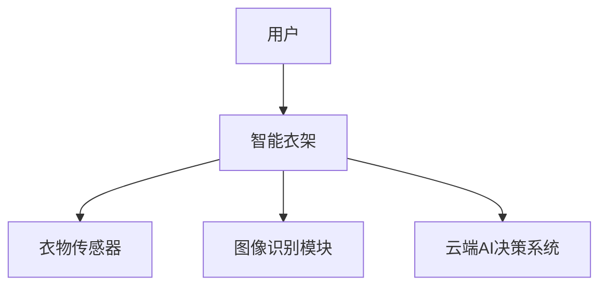
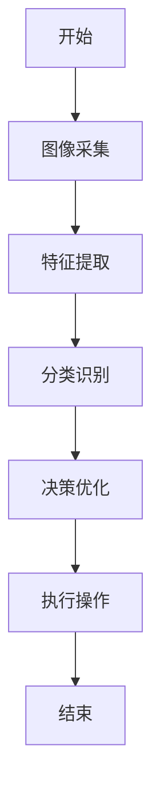
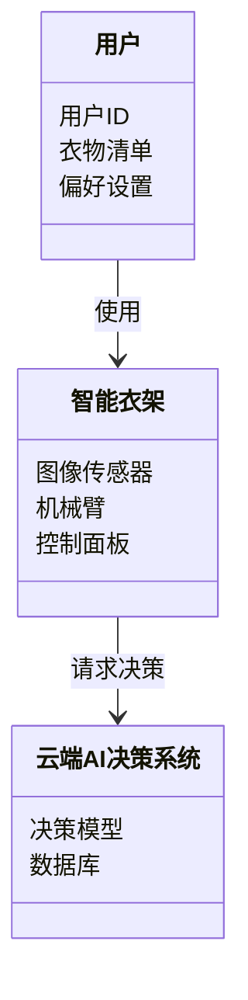
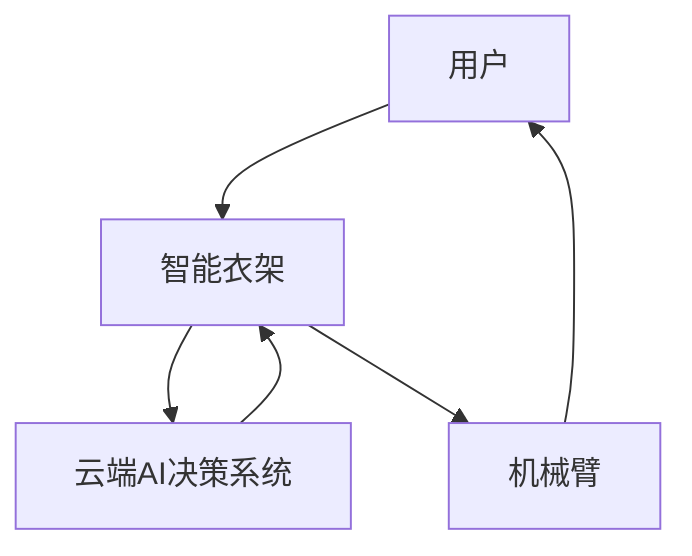
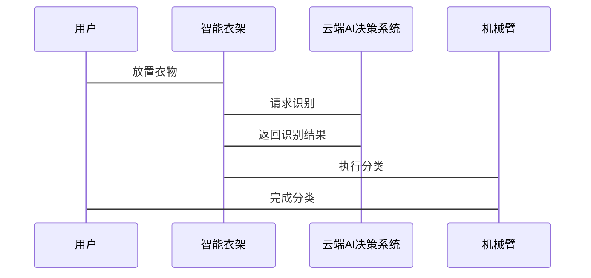

                 


# 智能衣架：AI Agent的衣物护理与除皱系统

## 关键词：AI Agent，衣物护理，除皱系统，智能衣架，多模态感知

## 摘要

随着人工智能技术的飞速发展，衣物护理和除皱技术也迎来了智能化的新时代。本文深入探讨了智能衣架系统的设计与实现，结合AI Agent技术，详细分析了其在衣物护理中的应用。从系统架构到算法原理，从项目实战到最佳实践，本文全面解析了智能衣架如何通过多模态感知、自然语言处理和决策优化算法实现智能化衣物护理与除皱功能。通过实际案例分析和系统设计，展示了AI Agent在智能衣架中的核心作用及其在现代生活中的广泛应用前景。

---

## 第一章：背景介绍与核心概念

### 1.1 问题背景

#### 1.1.1 衣物护理的重要性

衣物护理是日常生活中不可或缺的一部分，尤其是高端衣物的护理更为重要。传统的衣物护理方式依赖人工经验，效率低下且容易出错，尤其是在除皱和精准护理方面存在明显不足。

#### 1.1.2 传统衣物护理的不足

传统衣物护理主要依赖人工检查和处理，存在以下问题：

- **效率低下**：人工检查耗时长，难以满足快速节奏的现代生活需求。
- **精准度不足**：不同材质的衣物需要不同的护理方式，人工经验难以覆盖所有情况。
- **数据孤岛**：缺乏智能化的数据收集和分析，无法实现个性化护理。

#### 1.1.3 AI Agent在衣物护理中的潜力

AI Agent（智能体）通过多模态感知、实时决策和自动化执行，能够显著提升衣物护理的效率和精准度。智能衣架通过AI Agent技术，可以实现衣物的自动分类、智能除皱和个性化护理，为用户提供高效便捷的衣物管理解决方案。

---

### 1.2 问题描述

#### 1.2.1 智能衣架的功能需求

智能衣架的功能需求包括：

- **衣物识别与分类**：通过图像识别和传感器数据，自动识别衣物类型和材质。
- **智能除皱**：根据衣物特性，自动调整除皱模式和力度。
- **个性化护理建议**：基于历史数据和用户习惯，提供个性化护理建议。

#### 1.2.2 用户痛点分析

用户在衣物护理中面临的主要痛点包括：

- **效率低**：传统方式耗时长，难以快速处理大量衣物。
- **精准度低**：人工判断容易出错，导致衣物损坏。
- **缺乏智能化**：无法根据衣物特性自动调整护理方式。

#### 1.2.3 系统目标与边界

智能衣架系统的总体目标是通过AI Agent技术实现衣物的智能识别、分类、除皱和护理建议。系统的边界包括：

- **输入**：衣物图像、传感器数据和用户输入。
- **输出**：护理建议、除皱指令和系统状态。

---

### 1.3 问题解决与系统架构

#### 1.3.1 AI Agent的核心作用

AI Agent在智能衣架中的核心作用体现在以下几个方面：

- **多模态感知**：通过图像识别、传感器数据等多种方式感知衣物状态。
- **智能决策**：基于感知数据，实时优化护理策略。
- **自动化执行**：通过机械臂或执行机构完成除皱和分类操作。

#### 1.3.2 系统边界与外延

系统的边界包括：

- **输入接口**：用户输入、传感器数据。
- **输出接口**：机械臂控制、显示界面。
- **外部系统**：与智能家居系统联动，提供更全面的服务。

#### 1.3.3 概念结构与核心要素

智能衣架系统的概念结构包括：

- **感知层**：图像识别、传感器数据采集。
- **决策层**：AI算法优化、决策模型。
- **执行层**：机械臂、除皱装置。

---

## 第二章：核心概念与联系

### 2.1 AI Agent的原理与特点

#### 2.1.1 AI Agent的基本原理

AI Agent通过感知、决策和执行三个模块实现智能化功能：

1. **感知**：通过图像识别和传感器获取衣物状态数据。
2. **决策**：基于感知数据，优化护理策略。
3. **执行**：通过机械臂等装置完成护理操作。

#### 2.1.2 智能衣架中的AI Agent特性

智能衣架中的AI Agent具有以下特点：

- **实时性**：快速响应用户需求。
- **准确性**：精准识别衣物类型和状态。
- **自适应性**：根据环境变化自动调整策略。

#### 2.1.3 多模态感知与决策

多模态感知通过融合图像、声音、触觉等多种数据，提升AI Agent的感知能力。决策模块基于这些数据，优化护理策略。

---

### 2.2 核心概念对比

#### 2.2.1 传统衣物护理与AI Agent的对比

| 特性         | 传统衣物护理 | AI Agent智能衣架 |
|--------------|--------------|------------------|
| 感知方式     | 人工检查     | 图像识别+传感器  |
| 决策方式     | 经验判断     | AI算法优化       |
| 执行方式     | 手动操作     | 自动化执行       |

#### 2.2.2 系统功能对比表格

| 功能模块     | 传统方式           | AI Agent方式       |
|--------------|--------------------|--------------------|
| 衣物识别     | 人工分类           | 图像识别自动分类   |
| 除皱模式     | 经验调整           | 算法优化自动调整   |
| 护理建议     | 参考经验           | 数据驱动个性化建议 |

#### 2.2.3 系统实体关系图



---

## 第三章：算法原理与数学模型

### 3.1 AI Agent的核心算法

#### 3.1.1 多模态感知算法

多模态感知算法结合图像识别和传感器数据，提升AI Agent的感知能力。例如，使用卷积神经网络（CNN）进行图像分类。

#### 3.1.2 自然语言处理模块

自然语言处理用于解析用户的指令，例如“请将这件衬衫分类到左边”。

#### 3.1.3 决策优化算法

决策优化算法基于多模态数据，优化护理策略。例如，使用强化学习（Reinforcement Learning）调整除皱力度。

---

### 3.2 算法流程图



### 3.3 数学模型与公式

#### 3.3.1 图像分类模型

使用卷积神经网络进行图像分类，损失函数为交叉熵损失：

$$ L = -\sum_{i} y_i \log(p_i) $$

优化器使用Adam：

$$ \theta_{t+1} = \theta_t - \eta \frac{\partial L}{\partial \theta_t} $$

#### 3.3.2 决策优化模型

使用强化学习中的策略梯度方法，目标是最优化奖励函数：

$$ J = \mathbb{E}_{\tau \sim \pi} \left[ \sum_{t} r_t \right] $$

优化目标为：

$$ \nabla_\theta J = \mathbb{E}_{\tau \sim \pi} \left[ \sum_{t} \nabla_\theta \log \pi_\theta(a_t|s_t) \cdot Q(s_t, a_t) \right] $$

---

## 第四章：系统分析与架构设计方案

### 4.1 问题场景介绍

智能衣架系统需要在家庭环境中运行，用户通过智能衣架进行衣物分类和除皱操作。系统需要与智能家居系统联动，提供更全面的服务。

### 4.2 系统功能设计

#### 4.2.1 领域模型



#### 4.2.2 系统架构设计



#### 4.2.3 系统接口设计

系统接口包括：

- **用户接口**：控制面板和手机APP。
- **机械臂接口**：与机械臂通信的API。
- **传感器接口**：采集衣物状态的传感器。

#### 4.2.4 系统交互流程图



---

## 第五章：项目实战

### 5.1 环境安装

#### 5.1.1 安装Python和相关库

```bash
pip install numpy
pip install tensorflow
pip install keras
pip install opencv-python
```

#### 5.1.2 安装机械臂控制库

```bash
pip install pyserial
pip install robot-control
```

### 5.2 系统核心实现源代码

#### 5.2.1 图像识别模块

```python
import cv2
import numpy as np

def image_classification(image_path):
    # 加载预训练模型
    model = keras.models.load_model('clothes_model.h5')
    # 加载图像
    image = cv2.imread(image_path)
    image = cv2.resize(image, (224, 224))
    image = np.expand_dims(image, axis=0)
    # 预测类别
    prediction = model.predict(image)
    return prediction[0].argmax()
```

#### 5.2.2 决策优化模块

```python
import numpy as np

def decision_optimization(features):
    # 加强学习算法优化决策
    action = np.argmax(features)
    return action
```

#### 5.2.3 机械臂控制模块

```python
import serial

def control_robot(action):
    ser = serial.Serial('COM3', 9600)
    ser.write(action)
    ser.close()
```

### 5.3 实际案例分析

通过实际案例分析，展示智能衣架在不同场景下的应用。例如，用户放置一件衬衫，系统通过图像识别确定衣物类型，优化除皱策略，并通过机械臂完成分类和除皱操作。

---

## 第六章：最佳实践

### 6.1 小结

智能衣架系统通过AI Agent技术，实现了衣物的智能识别、分类和除皱功能。系统的多模态感知和强化学习算法显著提升了护理效率和精准度。

### 6.2 注意事项

- **数据隐私**：确保用户数据的安全性。
- **系统维护**：定期更新模型和维护硬件。
- **用户体验**：优化界面设计，提升用户体验。

### 6.3 拓展阅读

- 《深度学习实战》
- 《强化学习入门》
- 《机器人控制技术》

---

## 第七章：总结与展望

### 7.1 总结

智能衣架通过AI Agent技术，显著提升了衣物护理的效率和精准度。系统的多模态感知、智能决策和自动化执行能力，为用户提供了高效便捷的衣物管理解决方案。

### 7.2 展望

未来，智能衣架系统可以通过与智能家居的深度联动，提供更全面的衣物管理服务。同时，随着AI技术的不断进步，智能衣架的功能将进一步优化，用户体验将更加智能化和个性化。

---

通过本文的详细分析和实际案例，我们可以看到AI Agent在衣物护理中的巨大潜力。智能衣架不仅提升了衣物管理的效率，也为未来的智能家居生活带来了更多可能性。

