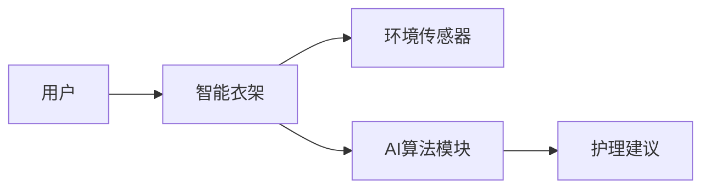
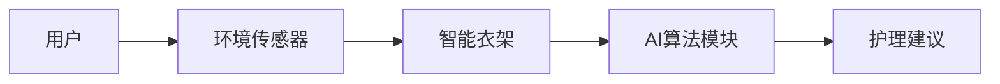

                 


# 智能衣架：AI Agent的衣物护理建议

> 关键词：AI Agent、智能衣架、衣物护理、算法原理、系统架构、智能硬件、物联网

> 摘要：随着人工智能技术的快速发展，衣物护理领域也在不断智能化。本文探讨了AI Agent在智能衣架中的应用，详细介绍了其核心概念、算法原理、系统架构以及实际应用案例。通过分析AI Agent如何优化衣物护理流程，本文旨在为读者提供深入的技术见解和实践指导。

---

## 第一部分：智能衣架的背景与概念

### 第1章：智能衣架与AI Agent的背景介绍

#### 1.1 问题背景与问题描述

在传统衣物护理中，人们常常面临以下问题：
- 衣物材质多样，护理方法复杂，难以快速判断。
- 缺乏智能化手段，无法提供个性化的护理建议。
- 人工判断易出错，效率低下。

智能衣架通过AI Agent解决了这些问题，能够实时分析衣物材质、环境因素，并提供个性化护理建议，显著提升了衣物护理的效率和准确性。

#### 1.2 智能衣架的核心概念与边界

智能衣架是一个结合AI技术的智能硬件，主要由以下几个核心模块组成：
- 环境传感器：监测环境温湿度。
- AI算法模块：分析衣物材质和环境数据，生成护理建议。
- 用户交互界面：提供反馈和操作指南。

AI Agent在智能衣架中的角色是数据处理和决策的核心，负责接收传感器数据，分析衣物材质，并生成护理建议。

#### 1.3 问题解决与应用场景

AI Agent通过智能衣架优化了衣物护理流程，应用场景包括：
- 家庭衣物护理：提供个性化的洗涤、干燥建议。
- 商业洗衣服务：优化洗涤流程，减少能源浪费。
- 旅行衣物护理：帮助用户在旅途中保护衣物。

---

## 第二部分：智能衣架的算法原理

### 第2章：智能衣架AI Agent的算法原理

#### 2.1 算法选择与流程

选择决策树算法的原因在于其易于理解和实现，适合分类问题。以下是决策树算法的基本流程：
1. 数据收集：包括衣物材质、环境数据等。
2. 数据预处理：清洗数据，处理缺失值。
3. 模型训练：构建决策树。
4. 模型预测：根据输入数据生成护理建议。

#### 2.2 算法实现

以下是决策树算法的实现代码示例：

```python
from sklearn.tree import DecisionTreeClassifier
from sklearn.model_selection import train_test_split
from sklearn.metrics import accuracy_score

# 示例数据集
data = {
    '材质': ['棉', '羊毛', '聚酯纤维', '亚麻'],
    '环境温度': [25, 20, 30, 25],
    '环境湿度': [60, 50, 70, 65],
    '建议': ['常温水洗', '干洗', '机洗', '手洗']
}

# 数据预处理
X = data[['材质', '环境温度', '环境湿度']]
y = data['建议']

# 划分训练集和测试集
X_train, X_test, y_train, y_test = train_test_split(X, y, test_size=0.2, random_state=42)

# 构建决策树模型
model = DecisionTreeClassifier()
model.fit(X_train, y_train)

# 预测
y_pred = model.predict(X_test)
print("准确率:", accuracy_score(y_test, y_pred))
```

决策树的数学模型如下：

$$
f(x) = \text{argmax}(p(y|x))
$$

其中，$x$ 是输入数据，$y$ 是目标变量。

---

## 第三部分：智能衣架的系统架构

### 第3章：智能衣架AI Agent的系统架构设计

#### 3.1 系统架构设计

以下是系统的架构图：



系统由用户、智能衣架、环境传感器、AI算法模块和护理建议组成。AI算法模块接收环境传感器数据和用户输入，生成护理建议。

#### 3.2 接口设计

以下是接口设计：



用户触发环境传感器，传感器数据传输至智能衣架，AI算法模块处理数据并生成护理建议。

---

## 第四部分：项目实战

### 第4章：智能衣架系统的设计与实现

#### 4.1 环境安装

安装Python和相关库：

```bash
pip install scikit-learn
```

#### 4.2 核心代码实现

以下是核心代码：

```python
import numpy as np
from sklearn.tree import DecisionTreeClassifier
from sklearn.metrics import accuracy_score

# 数据集
X = np.array([
    ['棉', 25, 60],
    ['羊毛', 20, 50],
    ['聚酯纤维', 30, 70],
    ['亚麻', 25, 65]
])

y = ['常温水洗', '干洗', '机洗', '手洗']

# 特征编码
from sklearn.preprocessing import LabelEncoder
le = LabelEncoder()
X_encoded = X[:, 0].astype('U')
X_encoded = le.fit_transform(X_encoded)

# 数据预处理
X = np.c_[X_encoded, X[:, 1].astype(int), X[:, 2].astype(int)]
y_encoded = le.fit_transform(y)

# 训练模型
model = DecisionTreeClassifier()
model.fit(X, y_encoded)

# 预测
new_sample = ['亚麻', 25, 65]
new_sample_encoded = le.transform([new_sample[0]]) if new_sample[0] else 0
new_sample_encoded = np.array([new_sample_encoded, new_sample[1], new_sample[2]]).T
predicted = model.predict(new_sample_encoded)
print(predicted)
```

#### 4.3 代码解读与分析

以上代码实现了决策树模型的训练和预测，展示了如何通过AI算法生成护理建议。模型根据输入的衣物材质和环境数据，预测出最优的护理方法。

#### 4.4 实际案例分析

以亚麻材质、25℃、65%湿度为例，模型预测出“手洗”建议。这表明AI Agent能够准确判断并提供个性化建议。

---

## 第五部分：总结与展望

### 第5章：总结与展望

#### 5.1 最佳实践 tips

- 定期更新模型以提高准确性。
- 保持硬件清洁，确保传感器正常工作。

#### 5.2 小结

智能衣架通过AI Agent显著提升了衣物护理的效率和准确性，为用户提供了智能化的解决方案。

#### 5.3 注意事项

- 数据隐私保护。
- 硬件维护与更新。

#### 5.4 拓展阅读

推荐阅读关于AI在物联网应用的相关书籍，深入了解AI技术在更多领域的应用。

---

通过以上分析，我们可以看到智能衣架如何利用AI技术优化衣物护理流程。未来，随着技术的进步，智能衣架将更加智能化，为用户提供更优质的服务。

