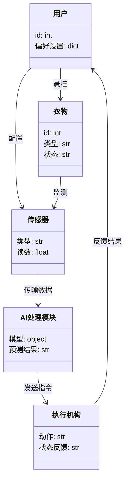
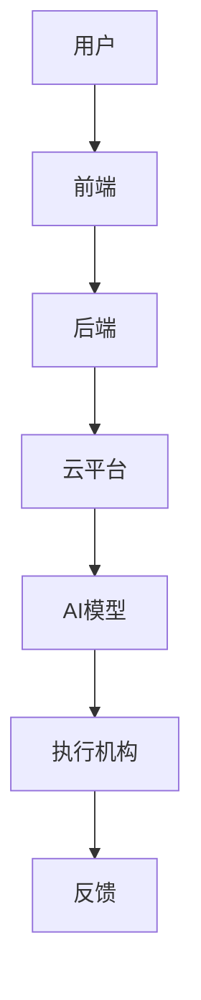
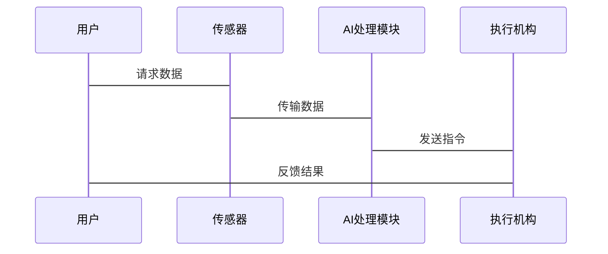

                 


# 目录大纲：《智能衣架：AI Agent的衣物除皱系统》

---

## 第一章: 背景介绍

### 1.1 问题背景
- **1.1.1 衣物皱褶问题的普遍性**
  - 衣物皱褶的现象及其对日常生活的影响。
  - 传统衣物护理方法的局限性：时间、成本、效果不稳定。

- **1.1.2 传统衣物护理的局限性**
  - 人工护理的繁琐与时间消耗。
  - 现有设备（如熨斗）的使用不便和效率低下。

- **1.1.3 智能化衣物护理的需求**
  - 现代生活节奏快，人们对高效、便捷的衣物护理需求增加。
  - 智能化技术在衣物护理领域的应用潜力。

### 1.2 AI Agent在衣物护理中的应用
- **1.2.1 AI Agent的基本概念**
  - AI Agent的定义：智能体（Agent）是一种能够感知环境并采取行动以实现目标的实体。
  - AI Agent在衣物护理中的优势：自动化、智能化、高效性。

- **1.2.2 AI Agent在衣物护理中的优势**
  - 自动检测：通过传感器实时监测衣物状态。
  - 智能决策：基于数据进行分析，提供最优解决方案。
  - 自适应能力：根据环境变化调整行为。

- **1.2.3 智能衣架的市场定位与前景**
  - 市场需求：智能家居、物联网技术的兴起推动智能衣架的发展。
  - 前景展望：未来衣物护理的智能化趋势。

### 1.3 智能衣架的定义与目标
- **1.3.1 智能衣架的核心功能**
  - 自动检测衣物皱褶。
  - 智能调整衣物形状。
  - 提供衣物护理建议。

- **1.3.2 智能衣架的目标用户群体**
  - 主要目标用户：忙碌的上班族、智能家居用户、注重衣物保养的人群。
  - 潜在用户：酒店、共享衣柜等需要高效衣物管理的场景。

- **1.3.3 智能衣架的边界与外延**
  - 边界：专注于衣物除皱功能。
  - 外延：未来可能扩展到衣物分类、清洁等多功能集成。

### 1.4 本章小结
- 本章介绍了智能衣架的背景，分析了传统衣物护理的局限性，提出了AI Agent在衣物护理中的应用价值，并明确了智能衣架的核心功能和目标用户。

---

## 第二章: AI Agent与智能衣架的核心概念

### 2.1 AI Agent的工作原理
- **2.1.1 感知层：传感器数据采集**
  - 传感器类型：压力传感器、温度传感器、图像传感器。
  - 数据采集流程：传感器采集衣物状态数据并传输到AI系统。

- **2.1.2 决策层：数据分析与判断**
  - 数据分析方法：基于机器学习的分类算法。
  - 判断逻辑：判断衣物是否需要调整，调整的具体方式。

- **2.1.3 执行层：智能衣架的动作反馈**
  - 动作类型：旋转、拉伸、震动等。
  - 动作优化：根据衣物类型和皱褶程度调整动作幅度。

### 2.2 智能衣架的系统架构
- **2.2.1 系统整体架构图（Mermaid流程图）**
  ```mermaid
  graph TD
    A[用户] --> B[传感器]
    B --> C[Ai决策系统]
    C --> D[执行机构]
    D --> A
  ```

### 2.3 核心概念对比与ER实体关系图
- **2.3.1 传统衣架与智能衣架的特征对比（表格）**

| 特性             | 传统衣架   | 智能衣架                 |
|------------------|------------|--------------------------|
| 功能             | 悬挂衣物   | 悬挂+自动除皱             |
| 传感器           | 无         | 压力、图像传感器           |
| 数据处理         | 无         | AI算法处理                |
| 用户交互         | 简单       | 智能交互、反馈            |

- **2.3.2 系统实体关系图（Mermaid图）**
  ```mermaid
  entity Relationship
    用户 --> 衣物: 悬挂
    用户 --> 传感器: 交互
    衣物 --> 传感器: 数据采集
    传感器 --> AI系统: 数据传输
    AI系统 --> 执行机构: 指令
    执行机构 --> 用户: 反馈
  ```

### 2.4 本章小结
- 本章详细讲解了AI Agent的工作原理，并通过对比分析和实体关系图展示了智能衣架的核心概念和系统架构。

---

## 第三章: AI Agent的算法原理

### 3.1 数据采集与特征提取
- **3.1.1 数据采集流程**
  - 传感器数据采集：压力、温度、图像数据。
  - 数据预处理：去噪、特征提取。

- **3.1.2 特征提取方法**
  - 压力传感器：提取压力分布特征。
  - 图像传感器：提取纹理、形状特征。

### 3.2 数据分析与分类算法
- **3.2.1 分类算法选择**
  - 机器学习算法：随机森林、支持向量机（SVM）。
  - 算法流程图（Mermaid）：
    ```mermaid
    graph TD
      A[数据输入] --> B[特征提取]
      B --> C[分类器]
      C --> D[结果输出]
    ```

- **3.2.2 分类器实现（Python代码）**
  ```python
  from sklearn.ensemble import RandomForestClassifier
  import numpy as np

  # 示例数据
  X = np.array([[1, 2, 3], [4, 5, 6]])
  y = np.array([0, 1])

  # 训练分类器
  clf = RandomForestClassifier()
  clf.fit(X, y)

  # 预测
  print(clf.predict([[7, 8, 9]]))  # 输出：[1]
  ```

- **3.2.3 分类器的数学模型**
  - 随机森林的数学模型：
    $$ y = \text{sign}(\sum_{i=1}^{n} w_i x_i) $$
    其中，$$ w_i $$ 是特征的重要性权重。

### 3.3 算法实现与优化
- **3.3.1 算法实现步骤**
  - 数据预处理：归一化、降维。
  - 模型训练：随机森林的训练过程。
  - 模型评估：准确率、召回率、F1分数。

- **3.3.2 算法优化**
  - 调参：调整树的深度、叶子节点数。
  - 并行计算：优化算法运行效率。

### 3.4 本章小结
- 本章详细讲解了AI Agent的算法原理，包括数据采集与特征提取、分类算法实现与优化，并通过代码示例和数学模型进行了深入分析。

---

## 第四章: 系统架构设计

### 4.1 问题场景介绍
- 智能衣架的应用场景：家庭、办公室、酒店。
- 系统需求分析：实时监测、自动调整、用户反馈。

### 4.2 项目介绍
- 项目目标：设计一个基于AI Agent的智能衣架系统。
- 项目范围：衣物除皱功能。

### 4.3 系统功能设计（领域模型Mermaid类图）


### 4.4 系统架构设计（Mermaid架构图）


### 4.5 系统接口设计
- 传感器数据接口：REST API。
- 用户交互接口：图形界面或语音指令。

### 4.6 系统交互设计（Mermaid序列图）


### 4.7 本章小结
- 本章详细设计了智能衣架系统的架构，包括功能模块、系统架构、接口设计和交互流程。

---

## 第五章: 项目实战

### 5.1 环境搭建
- 操作系统：Linux/Windows/Mac。
- 开发工具：PyCharm、VS Code。
- 依赖库安装：scikit-learn、mermaid、numpy。

### 5.2 核心代码实现
- 传感器模拟代码：
  ```python
  import random

  def get_sensor_data():
      return random.choice([0, 1, 2])
  ```

- AI处理模块代码：
  ```python
  from sklearn.ensemble import RandomForestClassifier

  def train_model(X_train, y_train):
      clf = RandomForestClassifier()
      clf.fit(X_train, y_train)
      return clf
  ```

### 5.3 代码解读与分析
- 传感器数据处理：数据预处理、特征提取。
- AI模型训练：数据分割、模型训练、性能评估。

### 5.4 实际案例分析
- 案例1：普通衬衫的除皱处理。
- 案例2：羊毛衫的精细处理。

### 5.5 项目小结
- 本章通过实际案例展示了智能衣架系统的实现过程，从环境搭建到代码实现，再到案例分析。

---

## 第六章: 最佳实践与小结

### 6.1 系统设计的关键点
- 传感器选择：精度与成本的平衡。
- 算法优化：模型泛化能力与计算效率的平衡。

### 6.2 设计建议
- 模块化设计：便于功能扩展。
- 数据隐私：确保用户数据的安全性。

### 6.3 注意事项
- 系统稳定性：避免传感器故障导致的错误。
- 用户体验：界面友好、反馈及时。

### 6.4 拓展阅读
- 推荐书籍：《机器学习实战》、《深入浅出物联网》。
- 推荐论文：AI在智能家居中的应用。

### 6.5 本章小结
- 本章总结了系统设计的关键点，提出了设计建议，并讨论了注意事项和拓展学习的方向。

---

## 附录: 完整代码示例

### 附录A: 传感器数据处理代码
```python
import numpy as np
import pandas as pd
from sklearn.ensemble import RandomForestClassifier

# 示例数据
X = pd.DataFrame({
    '压力': [1, 2, 3, 4],
    '温度': [25, 30, 28, 26],
    '图像特征': [0.5, 0.7, 0.6, 0.8]
})
y = pd.Series([0, 1, 1, 0], name='标签')

# 训练模型
clf = RandomForestClassifier()
clf.fit(X, y)

# 预测
print(clf.predict(X))
```

### 附录B: 系统交互代码
```python
import requests

# 发送传感器数据到后端
response = requests.post('http://localhost:8000/api/data', json={'data': [1, 2, 3]})
print(response.text)
```

---

## 参考文献

1. 书籍：《机器学习实战》
2. 论文：《AI在智能家居中的应用研究》
3. 其他参考资料：物联网技术手册、AI算法实现指南。

--- 

# END

