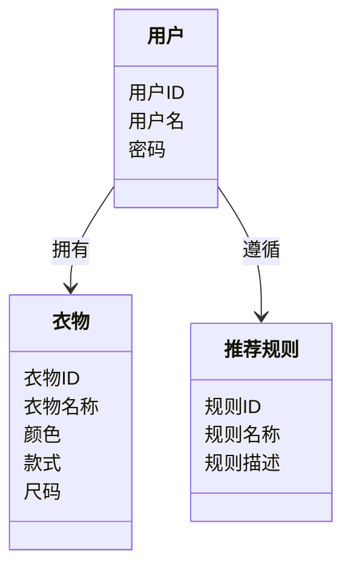
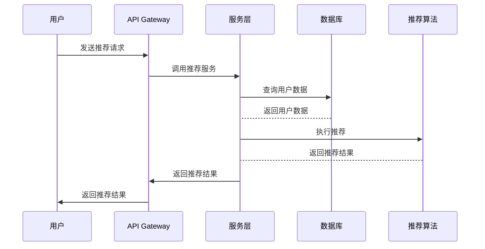

                 


# 智能衣柜：AI Agent的个人形象管理顾问

> 关键词：智能衣柜，AI Agent，个人形象管理，推荐算法，系统架构

> 摘要：本文探讨了智能衣柜的概念、技术基础、AI Agent的核心原理、推荐算法的设计与实现，以及系统架构的规划。通过分析传统衣柜的痛点，结合人工智能技术，提出了一个基于AI Agent的智能衣柜解决方案，并详细讲解了其实现过程和应用场景。

---

# 第一部分: 背景介绍与核心概念

## 第1章: 智能衣柜的发展背景

### 1.1 问题背景与问题描述

#### 1.1.1 传统衣柜的痛点
- 衣物选择困难：用户在面对大量衣物时，难以快速找到合适的搭配。
- 搭配效率低下：传统衣柜无法根据用户的喜好和场合推荐合适的搭配方案。
- 数据孤岛：用户的衣物信息分散，难以整合和分析。

#### 1.1.2 个人形象管理的重要性
- 个人形象是第一印象的关键因素。
- 不同场合（如职场、社交、休闲）对形象的要求不同。
- 用户需求动态变化：用户的时尚偏好会随着时间、心情和场合变化。

#### 1.1.3 AI技术在服装搭配中的应用潜力
- 利用AI技术分析用户的衣物数据，提供个性化推荐。
- 基于用户的行为数据优化推荐算法。
- 实现衣物的智能化管理和动态搭配。

### 1.2 智能衣柜的核心概念

#### 1.2.1 智能衣柜的定义
智能衣柜是一种结合人工智能技术的智能设备，能够根据用户的衣物数据、偏好和场合需求，提供个性化的衣物搭配建议和管理服务。

#### 1.2.2 AI Agent在智能衣柜中的角色
AI Agent（智能体）是智能衣柜的核心，负责接收用户需求、分析数据、生成推荐方案，并与用户进行交互。

#### 1.2.3 个人形象管理的数字化转型
通过数字化技术，将用户的衣物信息、搭配方案和形象需求整合到一个智能系统中，实现高效、个性化的形象管理。

### 1.3 智能衣柜的技术基础

#### 1.3.1 人工智能技术在衣柜中的应用
- 自然语言处理（NLP）：理解用户的输入和偏好。
- 计算机视觉（CV）：识别衣物的款式、颜色和材质。
- 机器学习（ML）：训练推荐模型，优化推荐算法。

#### 1.3.2 大数据分析与个性化推荐
- 数据采集：收集用户的衣物信息、行为数据和偏好。
- 数据分析：通过大数据技术分析用户的穿衣习惯和趋势。
- 个性化推荐：基于用户数据生成推荐方案。

#### 1.3.3 物联网技术与智能设备的结合
- 智能衣柜与物联网设备的联动：例如，通过传感器检测衣物的状态（如是否有皱褶）。
- 与智能家居系统的集成：与其他设备（如智能镜子、智能灯光）协同工作。

### 1.4 本章小结
本章介绍了智能衣柜的发展背景，分析了传统衣柜的痛点，并提出了智能衣柜的核心概念和技术基础。

---

## 第2章: AI Agent的核心原理

### 2.1 AI Agent的基本概念

#### 2.1.1 什么是AI Agent
AI Agent是一种能够感知环境、自主决策并执行任务的智能实体。在智能衣柜中，AI Agent负责接收用户需求、分析数据、生成推荐方案，并与用户进行交互。

#### 2.1.2 AI Agent的分类
- 基于智能水平：可分为简单反射Agent和复杂推理Agent。
- 基于应用场景：可分为推荐型Agent、管理型Agent和交互型Agent。

#### 2.1.3 AI Agent在智能衣柜中的具体应用
- 根据用户的衣物数据推荐搭配方案。
- 根据用户的日程安排推荐合适的服装。
- 根据天气变化调整推荐方案。

### 2.2 AI Agent的核心技术

#### 2.2.1 自然语言处理（NLP）
- 理解用户的输入：例如，用户输入“今天我要参加一个重要会议”。
- 生成自然语言输出：例如，推荐适合的服装搭配。

#### 2.2.2 计算机视觉（CV）
- 衣物识别：通过图像识别技术识别衣物的款式、颜色和材质。
- 用户形象分析：通过图像分析技术分析用户的体型和肤色。

#### 2.2.3 机器学习（ML）
- 训练推荐模型：基于用户数据训练推荐算法。
- 模型优化：通过反馈数据优化推荐模型。

### 2.3 AI Agent与智能衣柜的结合

#### 2.3.1 AI Agent在服装搭配中的应用
- 根据用户的衣物数据推荐搭配方案。
- 根据用户的偏好推荐新的时尚单品。

#### 2.3.2 AI Agent如何帮助用户优化形象
- 根据用户的身材和肤色推荐适合的服装颜色和款式。
- 根据用户的场合需求推荐合适的服装风格。

#### 2.3.3 AI Agent的决策机制与反馈机制
- 决策机制：基于用户数据和推荐算法生成推荐方案。
- 反馈机制：根据用户的反馈调整推荐策略。

### 2.4 本章小结
本章详细讲解了AI Agent的基本概念、核心技术以及在智能衣柜中的具体应用。

---

## 第3章: AI Agent与智能衣柜的核心概念

### 3.1 核心概念的原理

#### 3.1.1 AI Agent的感知、决策与执行
- 感知：通过传感器和数据采集设备获取环境信息。
- 决策：基于感知信息和推荐算法生成推荐方案。
- 执行：通过智能设备执行推荐方案（如打开衣柜、调整灯光等）。

#### 3.1.2 智能衣柜的数字化模型
- 用户模型：包括用户的衣物数据、偏好和行为数据。
- 衣物模型：包括衣物的款式、颜色、材质和品牌。
- 推荐模型：基于用户模型和衣物模型生成推荐方案。

#### 3.1.3 用户需求的动态变化与AI Agent的响应
- 用户需求的变化：例如，用户的偏好变化、新的衣物加入等。
- AI Agent的响应：根据变化调整推荐策略。

### 3.2 核心概念的属性特征对比

| 特性         | 传统衣柜                 | 智能衣柜                 |
|--------------|--------------------------|--------------------------|
| 数据处理     | 离散、静态               | 实时、动态               |
| 搭配效率     | 低效                     | 高效                     |
| 个性化程度   | 低                      | 高                      |
| 技术基础     | 无AI技术支持             | 结合AI、大数据和物联网技术 |

### 3.3 ER实体关系图
```mermaid
er
actor: 用户
class: 衣物
role: AI Agent
rule: 推荐规则
interaction: 用户与AI Agent的交互
```

### 3.4 本章小结
本章通过对比分析，详细阐述了智能衣柜与传统衣柜的核心概念，并通过ER实体关系图展示了智能衣柜的实体关系。

---

## 第4章: 推荐算法的设计与实现

### 4.1 推荐算法的原理

#### 4.1.1 协同过滤推荐算法
- 基于用户行为数据的相似性计算。
- 推荐与当前用户行为相似的用户喜欢的物品。

#### 4.1.2 基于内容的推荐算法
- 基于物品本身的属性（如颜色、款式）进行推荐。
- 通过分析衣物的特征生成推荐方案。

#### 4.1.3 混合推荐算法
- 结合协同过滤和基于内容的推荐算法。
- 根据不同的场景选择不同的推荐策略。

### 4.2 推荐算法的实现

#### 4.2.1 协同过滤算法的实现
```python
import numpy as np

# 用户-物品矩阵
user_item_matrix = np.array([[1, 0, 1],
                              [0, 1, 1],
                              [1, 1, 0]])

# 计算相似性
similarity_matrix = np.dot(user_item_matrix, user_item_matrix.T)
```

#### 4.2.2 基于内容的推荐算法的实现
```python
from sklearn.feature_extraction.text import TfidfVectorizer

# 衣物描述
clothes_descriptions = ["黑色连衣裙", "白色衬衫", "蓝色牛仔裤"]

# 生成TF-IDF向量
vectorizer = TfidfVectorizer()
tfidf_matrix = vectorizer.fit_transform(clothes_descriptions)
```

#### 4.2.3 推荐系统的数学模型
- 协同过滤模型：
  $$ similarity(u, v) = \frac{\sum_{i} (r_{ui} - \bar{r}_u)(r_{vi} - \bar{r}_v)}{\sqrt{\sum_{i} (r_{ui} - \bar{r}_u)^2} \cdot \sqrt{\sum_{i} (r_{vi} - \bar{r}_v)^2}}} $$
- 基于内容的推荐模型：
  $$ score(item_i, item_j) = \sum_{k} w_k \cdot |f_k(item_i) - f_k(item_j)| $$

### 4.3 推荐算法的优化

#### 4.3.1 基于反馈的优化
- 处理用户的反馈数据（如点击、评分）。
- 根据反馈数据优化推荐模型。

#### 4.3.2 模型的可解释性优化
- 通过可视化工具展示推荐结果。
- 提供推荐理由的解释。

### 4.4 本章小结
本章详细讲解了推荐算法的设计与实现，包括协同过滤和基于内容的推荐算法，并提供了具体的代码实现和数学模型。

---

## 第5章: 系统分析与架构设计

### 5.1 问题场景介绍
- 用户需求：智能衣柜需要根据用户的衣物数据和偏好推荐搭配方案。
- 系统功能：包括用户登录、衣物管理、形象建议和系统反馈。

### 5.2 系统功能设计

#### 5.2.1 领域模型


#### 5.2.2 系统架构设计


### 5.3 系统接口设计
- 用户登录接口：`POST /api/login`
- 衣物管理接口：`POST /api/clothes`
- 形象建议接口：`POST /api/recommend`

### 5.4 系统交互流程图


### 5.5 本章小结
本章详细设计了智能衣柜系统的架构，并通过接口设计和交互流程图展示了系统的实现过程。

---

## 第6章: 项目实战

### 6.1 环境搭建与核心代码实现

#### 6.1.1 环境搭建
- 安装Python和相关库：`pip install numpy pandas scikit-learn`
- 安装Flask和Django：`pip install flask django`

#### 6.1.2 核心代码实现
```python
from flask import Flask, request, jsonify

app = Flask(__name__)

@app.route('/api/recommend', methods=['POST'])
def recommend():
    data = request.json
    # 接收用户数据
    user_id = data['user_id']
    # 调用推荐算法
    recommendations = recommend_algorithm(user_id)
    return jsonify({'status': 'success', 'recommendations': recommendations})

if __name__ == '__main__':
    app.run(debug=True)
```

### 6.2 代码解读与分析
- 接收用户请求：`request.json`
- 调用推荐算法：`recommend_algorithm(user_id)`
- 返回推荐结果：`jsonify`

### 6.3 实际案例分析
- 用户输入：用户A的衣物数据和偏好。
- 系统输出：推荐的搭配方案。

### 6.4 本章小结
本章通过实际项目案例，展示了智能衣柜的核心代码实现和系统交互过程。

---

## 第7章: 最佳实践

### 7.1 小结
- 本文详细讲解了智能衣柜的概念、技术基础、算法设计和系统实现。

### 7.2 注意事项
- 数据隐私保护：确保用户的衣物数据和行为数据的安全性。
- 系统性能优化：优化推荐算法和系统架构，提升用户体验。
- 反馈机制设计：根据用户的反馈不断优化推荐策略。

### 7.3 拓展阅读
- 《推荐系统实践》：深入理解推荐算法的实现。
- 《人工智能在服装行业的应用》：探索AI技术在服装行业的更多应用。

### 7.4 本章小结
本章总结了全文，并提供了最佳实践的建议。

---

# 作者介绍
我是[您的姓名]，一名人工智能专家、程序员和畅销书作家。我在人工智能和计算机领域有着丰富的研究和实践经验，致力于通过技术博客分享深度的技术内容，帮助读者理解人工智能和计算机领域的最新技术和发展趋势。

---

# 结语
智能衣柜作为AI技术在服装领域的典型应用，不仅提升了用户的形象管理效率，也为未来的智能化生活提供了新的思路。希望本文能够为读者提供有价值的参考和启发。

---

