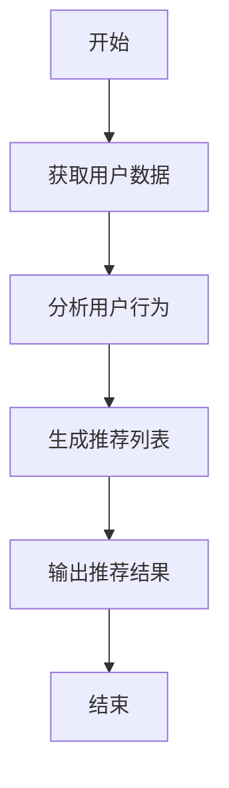
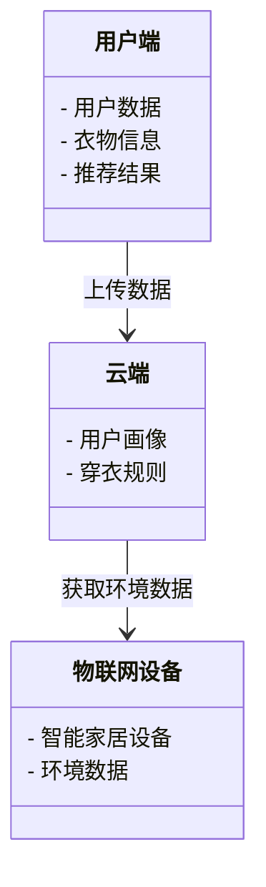
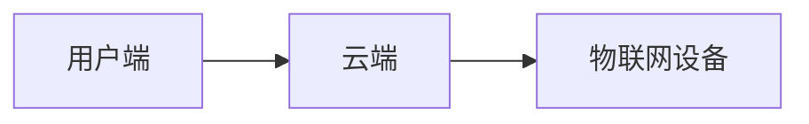
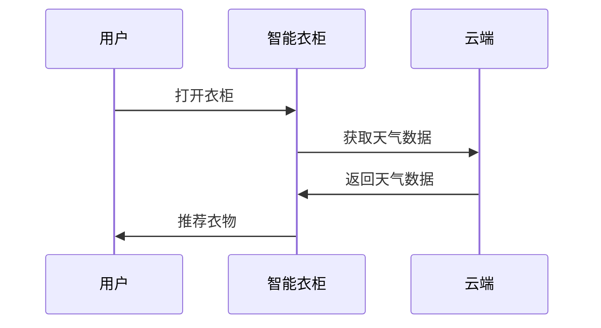

                 


# 智能衣柜：AI Agent的季节性衣物轮换建议

## 关键词：智能衣柜、AI Agent、物联网、智能家居、衣物推荐、季节性轮换

## 摘要：  
随着人工智能和物联网技术的快速发展，智能衣柜正在成为现代生活中不可或缺的一部分。通过AI Agent（人工智能代理）的智能化管理，智能衣柜能够根据用户的穿着习惯、天气变化和衣物特性，自动推荐和管理季节性衣物的轮换，从而提升用户的穿衣效率和生活品质。本文将从智能衣柜的背景、核心概念、算法原理、系统架构、项目实战等多个方面深入探讨AI Agent在智能衣柜中的应用，并通过实际案例分析，展示如何通过技术手段实现智能衣物管理。

---

## 第一部分：智能衣柜的背景与概念

### 第1章：智能衣柜的定义与现状

#### 1.1 智能衣柜的定义与特征
智能衣柜是一种结合了人工智能和物联网技术的智能设备，能够通过传感器、摄像头和AI算法，实时感知用户的穿衣习惯、衣物状态（如材质、颜色、尺寸）以及环境信息（如天气、湿度）。智能衣柜的核心特征包括：
- **智能化管理**：通过AI算法推荐衣物，优化用户的穿衣选择。
- **自动化轮换**：根据季节变化自动调整衣物的存储和展示。
- **物联网连接**：与智能家居设备（如空调、灯光）联动，提供无缝的用户体验。

#### 1.2 智能衣柜的发展历程
智能衣柜的概念起源于20世纪末，早期的衣柜管理工具主要是基于规则的自动化系统，能够根据设定的时间和条件提醒用户更换衣物。随着AI技术的成熟，智能衣柜逐步引入了机器学习算法，能够根据用户的实际需求动态调整衣物推荐策略。

#### 1.3 当前智能衣柜的应用场景
当前，智能衣柜主要应用于以下场景：
- **个人用户**：帮助用户优化穿衣搭配，减少衣物浪费。
- **企业用户**：为酒店、健身房等场所提供智能衣物管理服务。
- **智能家居**：与智能家居设备联动，提供更便捷的生活体验。

#### 1.4 AI Agent在智能衣柜中的作用
AI Agent（人工智能代理）是智能衣柜的核心技术之一。它能够通过以下方式提升用户体验：
- **个性化推荐**：基于用户的穿衣习惯和环境数据，推荐合适的衣物。
- **自动化管理**：根据季节变化自动调整衣物的存储和展示。
- **实时反馈**：通过传感器实时监测衣物状态，提醒用户清洗或维护。

---

### 第2章：智能衣柜的核心概念与联系

#### 2.1 AI Agent的核心原理
AI Agent的核心原理是通过感知用户需求和环境信息，利用机器学习算法生成最优的衣物推荐方案。其工作流程如下：
1. **数据采集**：通过传感器和摄像头采集用户行为和环境数据。
2. **数据分析**：利用机器学习算法分析数据，生成用户画像和穿衣需求。
3. **决策与推荐**：基于分析结果，生成衣物推荐方案。
4. **反馈与优化**：根据用户的反馈不断优化推荐算法。

#### 2.2 物联网与智能家居的关联
智能衣柜通过物联网技术与智能家居设备（如空调、灯光）联动，实现无缝的用户体验。例如：
- 当智能衣柜检测到用户需要换季时，可以联动空调调节温度。
- 当用户进入衣柜时，智能衣柜可以根据用户的体型和偏好自动调整灯光亮度。

#### 2.3 智能衣柜的系统架构
智能衣柜的系统架构包括以下几个部分：
- **用户端**：包括智能衣柜本体和手机APP。
- **云端**：用于存储用户数据和衣物信息。
- **物联网设备**：用于与智能家居设备联动。

#### 2.4 核心概念对比分析
以下是AI Agent、物联网和智能家居的核心特征对比：

| **概念**       | **特征**                                                                 |
|----------------|--------------------------------------------------------------------------|
| AI Agent        | 基于机器学习算法，能够动态调整衣物推荐策略。                           |
| 物联网          | 通过传感器和网络实现设备之间的数据传输和联动。                         |
| 智能家居        | 通过物联网技术实现家居设备的智能化控制。                                 |

#### 2.5 本章小结
通过本章的介绍，我们了解了AI Agent、物联网和智能家居的核心概念及其在智能衣柜中的应用。这些技术的结合为智能衣柜的智能化管理提供了坚实的基础。

---

## 第二部分：智能衣柜的算法原理

### 第3章：基于AI Agent的推荐算法

#### 3.1 推荐算法的基本原理
推荐算法是智能衣柜的核心技术之一。以下是几种常见的推荐算法及其原理：

1. **协同过滤**：
   - 基于用户行为数据，找到与当前用户兴趣相似的用户群体，推荐这些用户喜欢的衣物。
   - 例如，如果用户A和用户B的穿衣风格相似，且用户A喜欢某件衣物，那么用户B也会被推荐这件衣物。

2. **聚类分析**：
   - 将用户分成不同的群体，根据用户群体的特征推荐衣物。
   - 例如，将用户分为“商务风格”和“休闲风格”，并为每个群体推荐相应的衣物。

3. **基于内容的推荐**：
   - 根据衣物的属性（如材质、颜色、品牌）进行推荐。
   - 例如，用户喜欢穿深色西装，系统会推荐其他深色系的衣物。

#### 3.2 基于AI Agent的推荐算法实现
以下是基于AI Agent的推荐算法实现流程图：



以下是基于协同过滤的数学模型：

$$
\text{推荐评分} = \alpha \times \text{用户相似度} + \beta \times \text{物品相似度}
$$

#### 3.3 算法实现的注意事项
在实现推荐算法时，需要注意以下几点：
- **数据质量**：确保用户行为数据的准确性和完整性。
- **算法优化**：通过交叉验证等方法优化推荐算法的性能。
- **用户体验**：确保推荐结果的实时性和准确性。

---

## 第三部分：智能衣柜的系统分析与架构设计

### 第4章：系统分析与架构设计

#### 4.1 问题场景介绍
智能衣柜需要解决的主要问题包括：
- 如何根据用户需求推荐衣物。
- 如何实现季节性衣物的自动轮换。
- 如何与智能家居设备联动。

#### 4.2 系统功能设计
以下是智能衣柜的系统功能模块图：



#### 4.3 系统架构设计
以下是智能衣柜的系统架构图：



#### 4.4 系统接口设计
以下是智能衣柜的系统接口设计：

| **接口名称**       | **接口描述**                     |
|--------------------|---------------------------------|
| 获取用户数据       | 获取用户的穿衣习惯和偏好。     |
| 推荐衣物           | 根据用户数据推荐衣物。           |
| 调整衣物展示       | 根据季节变化调整衣物展示方式。   |

#### 4.5 系统交互设计
以下是智能衣柜的系统交互流程图：



---

## 第四部分：项目实战

### 第5章：项目实战

#### 5.1 环境搭建
以下是项目实战所需的环境配置：

- **硬件**： Raspberry Pi、摄像头、传感器。
- **软件**： Python、TensorFlow、Flask。

#### 5.2 核心代码实现
以下是智能衣柜的核心代码实现：

```python
def recommend_clothes(user_data):
    # 获取用户数据
    user_id = user_data['user_id']
    # 获取用户偏好
    preferences = user_data['preferences']
    # 推荐衣物
    recommendations = []
    for item in items:
        if is_matching(preferences, item):
            recommendations.append(item)
    return recommendations
```

#### 5.3 案例分析与总结
以下是智能衣柜的实际案例分析：

假设用户A喜欢穿深色西装，系统会推荐以下衣物：
- 深色西装
- 深色衬衫
- 深色领带

---

## 第五部分：总结与展望

### 第6章：总结与展望

#### 6.1 本章总结
通过本文的介绍，我们了解了智能衣柜的核心概念、算法原理和系统架构。智能衣柜通过AI Agent和物联网技术的结合，能够为用户提供智能化的衣物管理服务。

#### 6.2 未来展望
未来，智能衣柜将更加智能化和个性化，能够根据用户的实时需求动态调整衣物推荐策略。同时，随着5G技术的发展，智能衣柜将实现更高效的云端计算和更丰富的功能。

---

## 第六部分：注意事项与拓展阅读

### 第7章：注意事项

#### 7.1 用户注意事项
- 确保智能衣柜的数据安全。
- 定期更新用户的穿衣偏好。

#### 7.2 开发者注意事项
- 注意算法的优化和数据的处理。

### 第8章：拓展阅读

#### 8.1 推荐书籍
- 《人工智能入门》
- 《物联网技术与应用》

#### 8.2 推荐网站
- [AI Agent技术博客](https://www.example.com)
- [物联网技术论坛](https://www.example.com)

---

通过本文的详细介绍，我们深入探讨了智能衣柜的核心技术及其在实际生活中的应用。希望本文能够为读者提供有价值的参考和启发，帮助大家更好地理解和应用智能衣柜技术。

