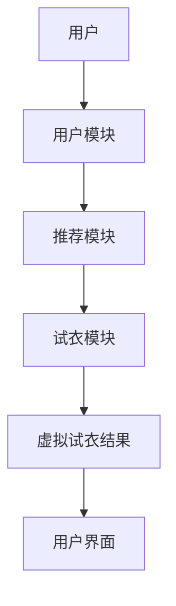

                 


# 智能衣柜：AI Agent的虚拟试衣系统

> 关键词：AI Agent，虚拟试衣系统，智能衣柜，个性化推荐，深度学习

> 摘要：本文详细介绍了AI Agent在智能衣柜中的应用，重点分析了虚拟试衣系统的实现原理及其带来的创新体验。通过结合AI技术与服装推荐系统，本文提出了一个高效的解决方案，旨在提升用户的购物体验和效率。文章从背景、概念、算法、系统架构到项目实战，全面阐述了智能衣柜的设计与实现过程，为相关领域的研究和应用提供了参考。

---

## 第一部分: 背景与核心概念

### 第1章: 智能衣柜的背景与问题背景

#### 1.1 问题背景

在服装购物领域，用户常常面临试衣麻烦、时间成本高等问题。传统衣柜无法根据用户的身材、偏好和场景需求提供个性化的试衣建议，导致用户在购买衣物时需要多次试穿，效率低下。此外，传统试衣服务依赖人工推荐，存在推荐不精准、试衣体验差等问题。

#### 1.2 智能衣柜的定义与目标

智能衣柜是一种结合人工智能技术的服装推荐系统，旨在通过AI Agent实现虚拟试衣功能，为用户提供个性化的试衣建议。其目标是通过数据采集、分析和推荐，帮助用户快速找到适合自己的衣物，提升购物体验和效率。

#### 1.3 AI Agent在智能衣柜中的作用

AI Agent（智能代理）在智能衣柜中负责数据采集、分析和推荐。它通过用户的身体数据、穿着习惯和场景需求，利用深度学习算法生成个性化的试衣方案，帮助用户快速找到合适的衣物。

### 第2章: 核心概念与联系

#### 2.1 AI Agent的核心原理

AI Agent通过数据采集、分析和推理，为用户提供智能化的服务。其核心原理包括数据处理、模型训练和结果输出三个阶段。通过分析用户的历史行为、身体数据和偏好，AI Agent能够实时生成个性化的试衣建议。

#### 2.2 虚拟试衣系统的技术实现

虚拟试衣系统通过3D建模和图像处理技术，将用户的身材数据与衣物模型进行匹配，生成虚拟试衣效果。用户可以通过虚拟试衣功能快速了解衣物的合身程度和搭配效果，从而提高购物效率。

#### 2.3 AI Agent与虚拟试衣系统的协同

AI Agent与虚拟试衣系统的协同主要体现在数据共享和功能集成上。AI Agent负责数据处理和推荐，虚拟试衣系统负责生成试衣效果。两者通过接口实现数据交互，共同为用户提供个性化的试衣体验。

---

## 第二部分: 算法原理与数学模型

### 第3章: AI Agent的算法原理

#### 3.1 算法选择与模型训练

AI Agent采用深度学习算法，基于用户的历史数据和场景需求进行模型训练。常用算法包括协同过滤、矩阵分解和神经网络模型。矩阵分解模型通过用户-物品矩阵的分解，提取用户的偏好特征和物品的属性特征，用于推荐衣物。

#### 3.2 算法实现代码

以下是AI Agent的核心算法实现代码示例：

```python
import numpy as np

def matrix_factorization(R, k, iterations=500, learning_rate=0.01):
    # 初始化矩阵
    num_users, num_items = R.shape
    P = np.random.randn(num_users, k)
    Q = np.random.randn(num_items, k)
    
    for _ in range(iterations):
        for i in range(num_users):
            for j in range(num_items):
                if R[i, j] > 0:
                    # 计算预测值
                    predict = np.dot(P[i], Q[j])
                    error = R[i, j] - predict
                    
                    # 更新P和Q
                    P[i] += learning_rate * error * Q[j]
                    Q[j] += learning_rate * error * P[i]
        learning_rate *= 0.95
    return P, Q

# 示例数据
R = np.array([[4,3,0],
              [5,1,0],
              [0,0,2],
              [0,0,3],
              [0,2,0]])

P, Q = matrix_factorization(R, k=2)
```

#### 3.3 算法的数学模型

矩阵分解模型的数学公式如下：

$$ R = P \times Q $$

其中，$R$ 是用户-物品评分矩阵，$P$ 是用户因子矩阵，$Q$ 是物品因子矩阵。矩阵分解的目标是通过优化模型参数，使得预测值与实际值的误差最小。

### 第4章: 数学模型与公式

#### 4.1 核心公式推导

协同过滤算法的目标是最小化预测值与实际值的平方误差：

$$ \text{MSE} = \frac{1}{n} \sum_{i=1}^{n} (R_{ij} - \hat{R_{ij}})^2 $$

其中，$R_{ij}$ 是用户$i$对物品$j$的实际评分，$\hat{R_{ij}}$ 是模型预测的评分。

#### 4.2 模型优化方法

深度学习模型通过反向传播算法优化参数，公式如下：

$$ \theta_{t+1} = \theta_t - \eta \cdot \nabla J(\theta_t) $$

其中，$\theta$ 是模型参数，$\eta$ 是学习率，$J(\theta_t)$ 是损失函数。

---

## 第三部分: 系统分析与架构设计

### 第5章: 系统分析与架构设计

#### 5.1 问题场景分析

智能衣柜系统需要解决以下问题：
- 用户数据采集与管理
- 个性化推荐算法设计
- 虚拟试衣功能实现
- 系统性能优化

#### 5.2 系统架构设计

系统架构分为以下几个模块：
- **用户模块**：负责用户数据的采集和管理。
- **试衣模块**：通过3D建模生成虚拟试衣效果。
- **推荐模块**：基于用户数据和场景需求，生成个性化推荐。

系统架构图如下：



---

## 第四部分: 项目实战

### 第6章: 项目实战

#### 6.1 环境安装与配置

需要安装以下工具和库：
- Python 3.6+
- NumPy
- Pandas
- scikit-learn
- TensorFlow

#### 6.2 核心代码实现

以下是虚拟试衣系统的实现代码示例：

```python
import numpy as np
import tensorflow as tf

# 定义模型
class Virtual_Try_On:
    def __init__(self):
        self.model = self.build_model()
    
    def build_model(self):
        model = tf.keras.Sequential()
        model.add(tf.keras.layers.Conv2D(32, (3,3), activation='relu', input_shape=(256, 256, 3)))
        model.add(tf.keras.layers.MaxPooling2D(pool_size=(2,2)))
        model.add(tf.keras.layers.Conv2D(64, (3,3), activation='relu'))
        model.add(tf.keras.layers.MaxPooling2D(pool_size=(2,2)))
        model.add(tf.keras.layers.Flatten())
        model.add(tf.keras.layers.Dense(128, activation='relu'))
        model.add(tf.keras.layers.Dense(2, activation='sigmoid'))
        model.compile(optimizer='adam', loss='binary_crossentropy', metrics=['accuracy'])
        return model

    def train(self, x_train, y_train):
        self.model.fit(x_train, y_train, epochs=10, batch_size=32)
```

#### 6.3 案例分析与优化

通过实际案例分析，我们可以看到，AI Agent和虚拟试衣系统的结合显著提高了用户的试衣效率和推荐精准度。进一步优化的方向包括提升模型的泛化能力和优化系统的交互体验。

---

## 第五部分: 最佳实践与总结

### 第7章: 最佳实践

#### 7.1 小结

本文详细介绍了AI Agent在智能衣柜中的应用，通过虚拟试衣系统的实现，为用户提供了个性化的试衣体验。

#### 7.2 注意事项

在实际应用中，需要注意数据隐私保护和系统性能优化。

#### 7.3 拓展阅读

建议读者进一步学习深度学习和推荐系统相关知识，以更好地理解智能衣柜的实现原理。

---

通过本文的阐述，我们可以看到，AI Agent和虚拟试衣系统的结合为服装推荐领域带来了新的可能性。未来，随着技术的不断进步，智能衣柜将为用户提供更加智能化和个性化的服务。

