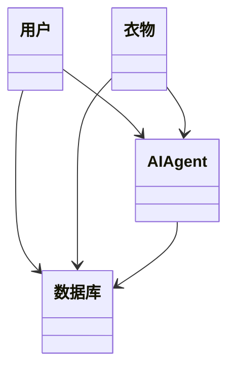
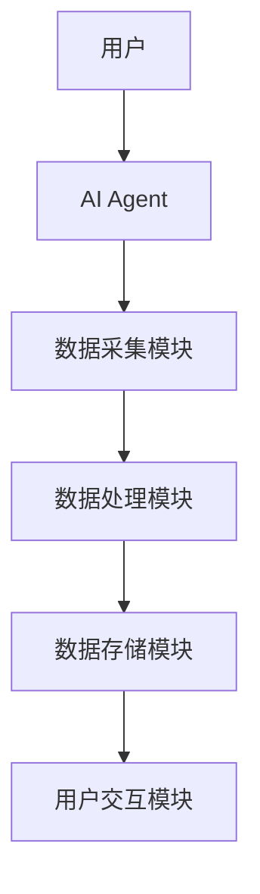
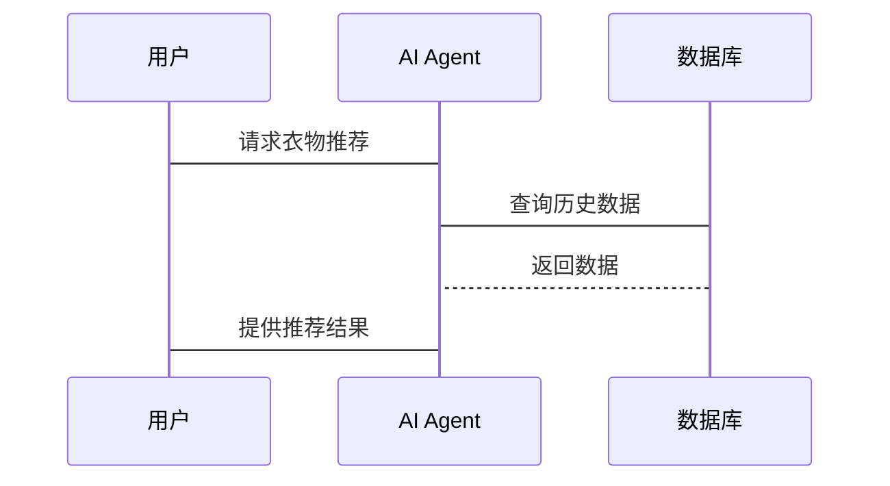

                 

# 智能衣柜：AI Agent的衣物保养建议

> **关键词**：智能衣柜、AI Agent、衣物保养、推荐算法、系统架构

> **摘要**：本文深入探讨了智能衣柜与AI Agent的结合，详细介绍了智能衣柜的核心功能、算法原理、系统架构、项目实战以及最佳实践。通过分析AI Agent在衣物保养中的应用场景，结合具体的算法实现和系统设计，为读者提供全面的技术指导和实践参考。

---

## 第一章: 智能衣柜与AI Agent概述

### 1.1 智能衣柜的概念与背景

#### 1.1.1 传统衣柜的局限性
传统衣柜在衣物管理方面存在诸多问题，例如：
- **空间利用不足**：衣物混杂堆放，导致空间浪费。
- **管理效率低下**：用户难以快速找到所需衣物。
- **保养不当**：不同材质的衣物需要不同的保养方式，但用户往往难以掌握。

#### 1.1.2 智能衣柜的定义与特点
智能衣柜是一种结合物联网和人工智能技术的智能设备，能够通过传感器和AI算法实现衣物的智能管理。其特点包括：
- **智能化管理**：通过传感器感知衣物状态，自动分类和推荐。
- **个性化服务**：根据用户习惯和偏好，提供定制化建议。
- **远程控制**：通过手机APP或其他终端设备远程操作。

#### 1.1.3 AI Agent在智能衣柜中的作用
AI Agent（智能代理）在智能衣柜中的作用主要体现在：
- **数据采集**：通过传感器采集衣物的材质、颜色、品牌等信息。
- **数据分析**：利用机器学习算法对数据进行分析，生成推荐和保养建议。
- **用户交互**：通过自然语言处理技术与用户进行对话，提供实时建议。

### 1.2 智能衣柜的发展背景

#### 1.2.1 物联网技术的进步
物联网技术的发展使得智能设备能够实时采集和传输数据，为智能衣柜的实现提供了技术基础。

#### 1.2.2 人工智能技术的成熟
深度学习和自然语言处理技术的进步，使得AI Agent能够更准确地理解和满足用户需求。

#### 1.2.3 消费者需求的变化
现代消费者对个性化、智能化和便捷化的追求，推动了智能衣柜的市场需求。

### 1.3 智能衣柜的市场现状

#### 1.3.1 市场规模分析
随着智能家居市场的快速发展，智能衣柜的市场规模呈现快速增长趋势。

#### 1.3.2 用户需求调研
通过对用户的调研发现，用户对衣物分类、保养建议和搭配推荐功能需求较高。

#### 1.3.3 竞争格局分析
目前市场上的智能衣柜产品主要集中在高端市场，竞争较为激烈。

## 第二章: AI Agent在智能衣柜中的核心功能

### 2.1 AI Agent的基本概念

#### 2.1.1 AI Agent的定义
AI Agent是一种能够感知环境、自主决策并执行任务的智能体。

#### 2.1.2 AI Agent的核心功能
AI Agent的核心功能包括数据采集、数据分析、用户交互和决策执行。

#### 2.1.3 AI Agent与智能衣柜的结合
通过AI Agent，智能衣柜能够实现衣物的智能化管理和个性化服务。

### 2.2 AI Agent在智能衣柜中的应用场景

#### 2.2.1 衣物分类与管理
AI Agent通过传感器和图像识别技术，自动分类衣物并存储到相应的区域。

#### 2.2.2 衣物保养建议
AI Agent根据衣物的材质和使用频率，提供清洗、晾晒和存储建议。

#### 2.2.3 衣物搭配推荐
AI Agent基于用户的穿衣风格和场合需求，推荐合适的衣物搭配。

### 2.3 AI Agent的核心算法

#### 2.3.1 基于规则的决策算法
通过预设规则，AI Agent能够快速做出决策。

#### 2.3.2 基于机器学习的推荐算法
利用协同过滤和深度学习算法，AI Agent能够提供个性化的推荐服务。

#### 2.3.3 基于自然语言处理的交互算法
通过自然语言处理技术，AI Agent能够与用户进行自然的对话交互。

## 第三章: 智能衣柜的算法原理

### 3.1 基于机器学习的衣物推荐算法

#### 3.1.1 协同过滤推荐算法

##### 3.1.1.1 基于用户的协同过滤
基于用户的协同过滤算法通过分析用户的相似性，推荐用户可能感兴趣的衣物。

##### 3.1.1.2 基于物品的协同过滤
基于物品的协同过滤算法通过分析衣物的相似性，推荐用户可能感兴趣的衣物。

##### 3.1.1.3 混合推荐算法
混合推荐算法结合基于用户的协同过滤和基于物品的协同过滤，提高推荐的准确性和多样性。

#### 3.1.2 基于深度学习的衣物识别算法

##### 3.1.2.1 CNN在衣物识别中的应用
使用卷积神经网络（CNN）对衣物图像进行分类和识别。

##### 3.1.2.2 RNN在衣物搭配中的应用
使用循环神经网络（RNN）对衣物搭配进行预测和推荐。

##### 3.1.2.3 图神经网络在衣物关联中的应用
使用图神经网络（GNN）分析衣物之间的关联关系，提高推荐的准确性。

#### 3.1.3 算法实现与优化

##### 3.1.3.1 算法实现流程
1. 数据采集与预处理
2. 模型训练与优化
3. 推荐结果生成与输出

##### 3.1.3.2 算法优化策略
1. 参数调整
2. 模型压缩
3. 并行计算

##### 3.1.3.3 算法性能评估
1. 准确率
2. 召回率
3. F1值

### 3.2 算法实现与优化

#### 3.2.1 算法实现流程
1. 数据采集与预处理
2. 模型训练与优化
3. 推荐结果生成与输出

#### 3.2.2 算法优化策略
1. 参数调整
2. 模型压缩
3. 并行计算

#### 3.2.3 算法性能评估
1. 准确率
2. 召回率
3. F1值

---

## 第四章: 智能衣柜的系统架构

### 4.1 系统功能模块划分

#### 4.1.1 数据采集模块
负责采集衣物的材质、颜色、品牌等信息。

#### 4.1.2 数据处理模块
对采集到的数据进行清洗、转换和存储。

#### 4.1.3 数据存储模块
将处理后的数据存储到数据库中，供后续分析使用。

#### 4.1.4 用户交互模块
通过APP或语音助手与用户进行交互，提供推荐和建议。

### 4.2 系统架构设计

#### 4.2.1 问题场景介绍
通过具体的使用场景，介绍系统架构的设计需求。

#### 4.2.2 项目介绍
简要介绍项目的背景、目标和主要功能。

#### 4.2.3 系统功能设计（领域模型）

#### 4.2.4 系统架构设计

#### 4.2.5 系统接口设计
定义系统各模块之间的接口，确保模块间的通信和数据交换。

#### 4.2.6 系统交互设计

### 4.3 系统实现与优化

#### 4.3.1 环境安装
介绍开发环境的搭建，包括编程语言、框架和工具的安装。

#### 4.3.2 系统核心实现源代码
提供关键代码片段，解释代码的功能和实现逻辑。

#### 4.3.3 代码应用解读与分析
分析代码的实现细节，解释如何通过代码实现系统功能。

#### 4.3.4 实际案例分析
通过具体案例，展示系统在实际应用中的表现和效果。

#### 4.3.5 项目小结
总结项目的主要成果和经验教训。

---

## 第五章: 智能衣柜的最佳实践

### 5.1 使用建议
为用户提供使用智能衣柜的实用建议，包括如何优化使用体验和提高系统性能。

### 5.2 维护注意事项
介绍系统维护的注意事项，确保系统的长期稳定运行。

### 5.3 未来趋势
展望智能衣柜的发展趋势，预测未来的技术创新和应用场景。

---

## 第六章: 附录

### 6.1 术语表
解释文章中涉及的专业术语，帮助读者理解相关内容。

### 6.2 参考文献
列出文章中引用的文献和资料，方便读者进一步查阅。

---

通过以上目录结构和内容安排，我们可以清晰地看到智能衣柜与AI Agent结合的实现过程，从概念到算法，从系统设计到项目实战，再到最佳实践，为读者提供了一套完整的技术解决方案。

