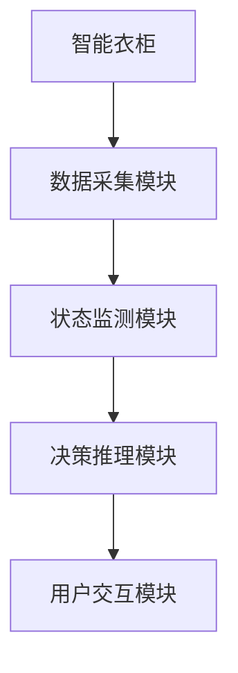

                 


# 智能衣柜：AI Agent的衣物保养提醒

> 关键词：智能衣柜，AI Agent，衣物保养，机器学习，自然语言处理，系统架构

> 摘要：本文详细探讨了AI Agent在智能衣柜中的应用，特别是在衣物保养提醒方面的功能。通过分析AI Agent的核心原理、算法实现和系统架构，本文为读者提供了从理论到实践的全面解读。通过实际案例和项目实战，展示了如何利用AI技术提升衣物管理的智能化水平。

---

## 第一部分: 智能衣柜与AI Agent的背景与概述

### 第1章: 智能衣柜与AI Agent概述

#### 1.1 智能衣柜的定义与背景

智能衣柜是一种结合了物联网（IoT）和人工智能（AI）技术的智能服装存储解决方案。它通过传感器、摄像头和AI算法，能够自动识别衣物的种类、品牌、颜色和材质，并根据用户的使用习惯和天气情况，提供智能化的衣物管理服务。

- **定义**：智能衣柜不仅仅是一个存储衣物的柜子，而是一个能够感知、分析和决策的智能系统。
- **背景**：随着智能家居的普及，用户对衣物管理的智能化需求日益增长。传统衣柜无法满足用户对衣物保养、搭配和存储的多样化需求。

#### 1.2 AI Agent在智能衣柜中的作用

AI Agent（智能代理）是一种能够感知环境、理解用户需求并执行任务的智能系统。在智能衣柜中，AI Agent主要用于以下功能：
- **衣物识别与分类**：通过图像识别技术，自动识别衣物的类型和品牌。
- **衣物状态监测**：检测衣物的磨损情况，提醒用户及时保养。
- **保养建议**：根据衣物的材质和使用环境，提供个性化的保养建议。

#### 1.3 衣物保养提醒的必要性

传统衣物保养存在以下问题：
- **遗忘**：用户常常忘记衣物的清洗和保养时间。
- **不及时**：衣物在长时间使用后才进行保养，可能导致损坏。
- **复杂性**：不同材质的衣物需要不同的保养方法，用户难以掌握。

AI Agent通过实时监测和提醒，能够有效解决这些问题，延长衣物的使用寿命。

---

### 第2章: AI Agent的基本概念与技术背景

#### 2.1 AI Agent的核心原理

AI Agent的核心原理包括以下三个部分：
1. **感知环境**：通过传感器和摄像头获取环境数据。
2. **分析数据**：利用机器学习算法对数据进行分析和分类。
3. **执行任务**：根据分析结果，执行相应的任务（如发送提醒、调整存储条件）。

#### 2.2 AI Agent的关键技术

- **机器学习算法**：用于衣物识别和分类。
- **自然语言处理（NLP）**：用于与用户的交互和理解用户的指令。
- **传感器技术**：用于监测衣物的状态和环境条件。

---

## 第二部分: AI Agent的核心概念与原理

### 第3章: 衣物保养提醒系统的算法原理

#### 3.1 基于规则的推理

基于规则的推理是一种简单的AI推理方法，适用于衣物保养提醒的初步判断。例如：
- **规则1**：如果衣物是棉质的，且已经使用了10次，提醒用户清洗。
- **规则2**：如果衣物有明显的磨损，提醒用户进行专业清洗。

#### 3.2 基于机器学习的推理

基于机器学习的推理能够处理更复杂的问题。例如，使用决策树算法对衣物的使用频率和磨损情况进行分类。

**决策树算法示例**：
```python
# 示例代码：决策树算法用于衣物使用频率分类
from sklearn.tree import DecisionTreeClassifier
import pandas as pd

# 数据加载与预处理
data = pd.read_csv('clothing_usage.csv')
X = data[['usage_count', 'days_since_last_use']]
y = data['status']

# 模型训练
model = DecisionTreeClassifier()
model.fit(X, y)

# 预测
new_data = [[15, 7], [10, 3]]
predictions = model.predict(new_data)
print(predictions)
```

#### 3.3 自然语言处理技术

自然语言处理技术用于解析用户的指令和反馈。例如，当用户说“我今天穿这件衬衫”，AI Agent会识别出衬衫的类型和品牌，并更新其使用记录。

---

## 第三部分: 系统分析与架构设计

### 第4章: 系统功能设计

#### 4.1 系统功能模块

智能衣柜系统主要包括以下功能模块：
- **数据采集模块**：通过传感器和摄像头采集衣物信息。
- **状态监测模块**：监测衣物的使用频率和磨损情况。
- **决策推理模块**：根据采集的数据，生成保养建议。
- **用户交互模块**：与用户进行交互，接收指令并反馈结果。

#### 4.2 系统架构设计

**系统架构图**：


---

## 第四部分: 项目实战

### 第5章: 项目实战与代码实现

#### 5.1 环境安装

安装所需的库：
```bash
pip install tensorflow scikit-learn matplotlib
```

#### 5.2 核心代码实现

**衣物识别与分类代码**：
```python
# 示例代码：使用卷积神经网络（CNN）进行衣物分类
import tensorflow as tf
from tensorflow.keras import layers

# 数据加载与预处理
train_dataset = tf.keras.utils.image_dataset_from_directory(
    'clothing_dataset', labels='inferred', label_mode='categorical',
    batch_size=32, image_size=(128, 128)
)

# 模型构建
model = tf.keras.Sequential([
    layers.Conv2D(32, (3,3), activation='relu', input_shape=(128, 128, 3)),
    layers.MaxPooling2D((2,2)),
    layers.Conv2D(64, (3,3), activation='relu'),
    layers.MaxPooling2D((2,2)),
    layers.Flatten(),
    layers.Dense(128, activation='relu'),
    layers.Dense(10, activation='softmax')
])

# 模型训练
model.compile(optimizer='adam', loss='categorical_crossentropy', metrics=['accuracy'])
model.fit(train_dataset, epochs=10)
```

---

## 第五部分: 总结与展望

### 第6章: 总结与展望

#### 6.1 系统总结

智能衣柜通过AI Agent实现了衣物的智能化管理，能够有效解决衣物保养中的痛点问题。其核心优势包括：
- **自动化管理**：无需用户手动记录衣物的使用情况。
- **精准提醒**：根据衣物的材质和使用频率提供个性化的保养建议。
- **节能环保**：通过合理安排衣物的使用和清洗时间，减少资源浪费。

#### 6.2 未来展望

未来，智能衣柜还可以进一步优化以下方面：
- **多设备联动**：与洗衣机、烘干机等家电联动，实现衣物的自动清洗和烘干。
- **更智能化的交互**：通过语音助手实现更自然的交互方式。
- **数据隐私保护**：加强用户数据的隐私保护，确保用户的隐私安全。

---

通过本文的详细分析和实战演示，读者可以全面了解AI Agent在智能衣柜中的应用，以及衣物保养提醒系统的实现过程。希望本文能够为相关领域的研究和实践提供有价值的参考。

