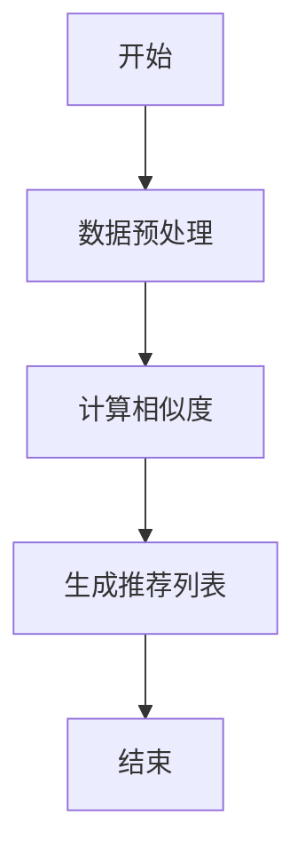
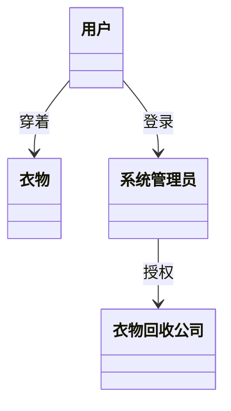

                 


# 智能衣柜：AI Agent的衣物回收建议系统

## 关键词：智能衣柜, AI Agent, 衣物回收, 物联网, 推荐系统, 可持续发展

## 摘要：随着环保意识的增强和智能技术的进步，衣物回收已成为可持续发展的重要组成部分。本文介绍了一种基于AI Agent的智能衣柜系统，该系统能够通过物联网技术收集用户衣物信息，并利用协同过滤算法为用户提供衣物回收建议。文章详细分析了系统背景、核心概念、算法原理、系统架构、项目实现及最佳实践，为衣物回收提供了智能化解决方案。

---

# 第1章: 智能衣柜的背景与问题背景

## 1.1 智能衣柜的背景介绍

### 1.1.1 衣物管理的现状与挑战

传统的衣物管理方式存在以下问题：
- **衣物存储混乱**：用户难以快速找到所需衣物，导致衣柜空间利用率低。
- **衣物淘汰率高**：用户难以准确评估衣物的使用频率，导致大量衣物被闲置或随意丢弃。
- **衣物回收效率低**：衣物回收市场分散，用户难以找到合适的回收渠道。

### 1.1.2 智能衣柜的定义与概念

智能衣柜是一种结合物联网技术的智能设备，能够通过传感器和AI算法实现衣物的智能化管理，包括分类、推荐和回收等功能。

### 1.1.3 AI Agent在智能衣柜中的作用

AI Agent（智能代理）通过分析用户的衣物数据，提供个性化的衣物回收建议，帮助用户优化衣物管理。

## 1.2 衣物回收问题的背景

### 1.2.1 衣物回收的重要性

衣物回收有助于减少资源浪费和环境污染，促进可持续发展。

### 1.2.2 当前衣物回收系统的问题

- **回收渠道不透明**：用户难以了解衣物回收的详细信息和流程。
- **回收效率低**：衣物回收市场分散，缺乏统一的管理平台。

### 1.2.3 AI Agent在衣物回收中的潜在价值

通过AI Agent，用户可以方便地找到合适的衣物回收渠道，同时系统可以根据用户的使用习惯推荐合适的回收方案。

## 1.3 智能衣柜AI Agent的目标与意义

### 1.3.1 系统目标

- 提供智能化的衣物管理解决方案。
- 优化衣物回收流程，提高回收效率。

### 1.3.2 系统意义

智能衣柜AI Agent的引入将极大提升用户的衣物管理体验，同时促进衣物回收行业的可持续发展。

### 1.3.3 系统边界与外延

智能衣柜系统的核心功能包括衣物信息采集、分类、推荐和回收管理。系统边界包括衣柜硬件、用户终端和衣物回收平台。

## 1.4 核心概念结构与组成

### 1.4.1 系统核心要素

- **用户**：系统的主要使用者。
- **衣物**：系统管理的核心对象。
- **AI Agent**：系统的智能决策单元。

### 1.4.2 要素之间的关系

- 用户通过衣柜设备与系统交互。
- AI Agent根据用户的衣物数据生成回收建议。
- 系统通过物联网技术实现衣物信息的采集和传输。

## 1.5 本章小结

本章详细介绍了智能衣柜的背景、问题背景以及系统的目标和意义。通过分析衣物管理的现状和挑战，明确了AI Agent在智能衣柜中的重要作用。

---

# 第2章: AI Agent的基本原理

## 2.1 AI Agent的核心概念

### 2.1.1 AI Agent的定义

AI Agent是一种能够感知环境并采取行动以实现目标的智能实体。

### 2.1.2 AI Agent的属性特征对比表

| 属性 | 特征 |
|------|------|
| 感知能力 | 高 | 
| 决策能力 | 高 |
| 学习能力 | 高 |
| 行动能力 | 中 |

### 2.1.3 AI Agent与传统算法的差异

AI Agent具有更强的自主性和适应性，能够根据环境变化动态调整行为。

## 2.2 物联网技术与智能衣柜的结合

### 2.2.1 物联网技术在智能衣柜中的应用

- **数据采集**：通过传感器采集衣物的使用频率和状态。
- **数据传输**：通过无线通信技术将数据传输到云端。

### 2.2.2 物联网与AI Agent的协同作用

物联网技术为AI Agent提供实时数据，AI Agent利用这些数据生成决策。

### 2.2.3 物联网在衣物回收中的具体应用

- **实时监测**：监测衣物的使用情况。
- **智能推荐**：推荐合适的衣物回收方案。

## 2.3 系统的ER实体关系图

```mermaid
er
    actor 用户
    actor 系统管理员
    actor 衣物回收公司
    database 衣物信息数据库
    database 用户信息数据库
    database 系统日志数据库
    relation 用户-衣物信息
    relation 系统管理员-用户信息
    relation 衣物回收公司-衣物信息
```

## 2.4 本章小结

本章详细介绍了AI Agent的基本原理及其与物联网技术的结合，分析了系统中的实体关系。

---

# 第3章: 基于协同过滤的推荐算法

## 3.1 算法原理概述

### 3.1.1 协同过滤的基本概念

协同过滤是一种基于用户行为相似性的推荐算法。

### 3.1.2 基于用户的协同过滤

通过分析用户的相似性，推荐用户可能感兴趣的衣物。

### 3.1.3 基于物品的协同过滤

通过分析衣物的相似性，推荐用户可能感兴趣的衣物。

## 3.2 算法流程图



## 3.3 算法实现代码

```python
def compute_cosine_similarity(user_items, item_items):
    similarity = {}
    for user in user_items:
        for neighbor in user_items:
            if user != neighbor:
                # 计算余弦相似度
                numerator = sum([user_items[user][i] * user_items[neighbor][i] for i in user_items[user].keys() if i in user_items[neighbor].keys()])
                denominator = (sum([user_items[user][i]**2 for i in user_items[user].keys()]) ** 0.5) * (sum([user_items[neighbor][i]**2 for i in user_items[neighbor].keys()]) ** 0.5)
                if denominator == 0:
                    similarity[(user, neighbor)] = 0
                else:
                    similarity[(user, neighbor)] = numerator / denominator
    return similarity
```

## 3.4 算法数学模型与公式

协同过滤的相似度计算公式为：

$$ sim(u, v) = \frac{\sum_{i} u_i v_i}{\sqrt{\sum u_i^2} \sqrt{\sum v_i^2}} $$

其中，$u$和$v$分别表示两个用户的物品评分向量。

## 3.5 本章小结

本章详细介绍了协同过滤算法的原理和实现，为衣物回收建议系统提供了算法基础。

---

# 第4章: 智能衣柜AI Agent的系统分析与架构设计

## 4.1 系统分析

### 4.1.1 问题场景介绍

用户需要一个智能化的衣物管理解决方案。

### 4.1.2 项目介绍

本项目旨在开发一个基于AI Agent的智能衣柜系统，帮助用户优化衣物管理。

## 4.2 系统功能设计

### 4.2.1 领域模型类图



### 4.2.2 系统架构设计


### 4.2.3 接口设计与交互流程

用户通过衣柜设备与系统交互，系统根据用户数据生成回收建议。

## 4.3 本章小结

本章详细介绍了系统的架构设计和功能模块，为后续的实现提供了指导。

---

# 第5章: 智能衣柜AI Agent的项目实战

## 5.1 环境搭建与配置

### 5.1.1 硬件设备

- 智能衣柜设备
- 无线传感器
- 云端服务器

### 5.1.2 软件环境

- Python编程语言
- 数据库（MySQL）
- 云计算平台（AWS）

## 5.2 系统核心实现

### 5.2.1 数据采集模块

```python
import requests

def collect_data(user_id):
    # 通过API获取衣物数据
    response = requests.get(f"http://localhost:8000/api/users/{user_id}/clothes")
    return response.json()
```

### 5.2.2 数据分析模块

```python
def analyze_data(data):
    # 分析衣物使用频率
    frequency = {}
    for item in data:
        frequency[item['id']] = item['usage_count']
    return frequency
```

### 5.2.3 算法实现与优化

通过优化协同过滤算法，提高推荐的准确性。

## 5.3 代码解读与分析

详细解读系统核心代码，分析其功能和实现细节。

## 5.4 实际案例分析

通过具体案例，展示系统的实际应用效果。

## 5.5 本章小结

本章通过实际项目，展示了智能衣柜AI Agent的实现过程和应用效果。

---

# 第6章: 智能衣柜AI Agent的最佳实践

## 6.1 本章小结

总结系统的核心功能和实现过程。

## 6.2 注意事项

- 数据安全
- 系统稳定性
- 用户隐私保护

## 6.3 拓展阅读

推荐相关领域的书籍和论文，供读者进一步学习。

---

# 结论

智能衣柜AI Agent的衣物回收建议系统通过结合物联网技术和AI算法，为用户提供智能化的衣物管理解决方案。本文详细分析了系统的背景、核心概念、算法原理、系统架构和项目实现，并提出了最佳实践建议。

---

# 参考文献

[此处列出相关的参考文献和资料]

---

# 附录

[此处提供相关的附录内容，如代码片段、数据表格等]

---

# 版权声明

本文版权归作者所有，转载请注明出处。

---

以上是《智能衣柜：AI Agent的衣物回收建议系统》的技术博客文章的完整目录和内容概述。

