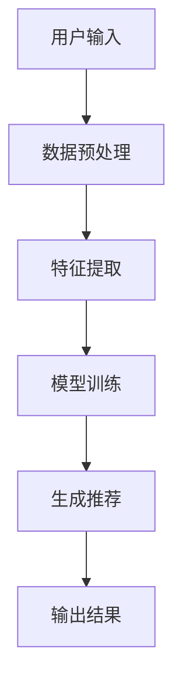
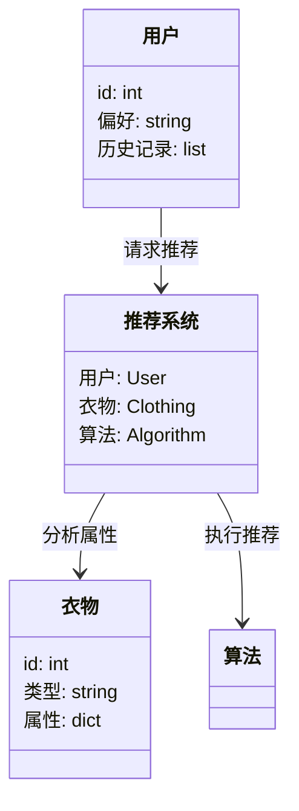
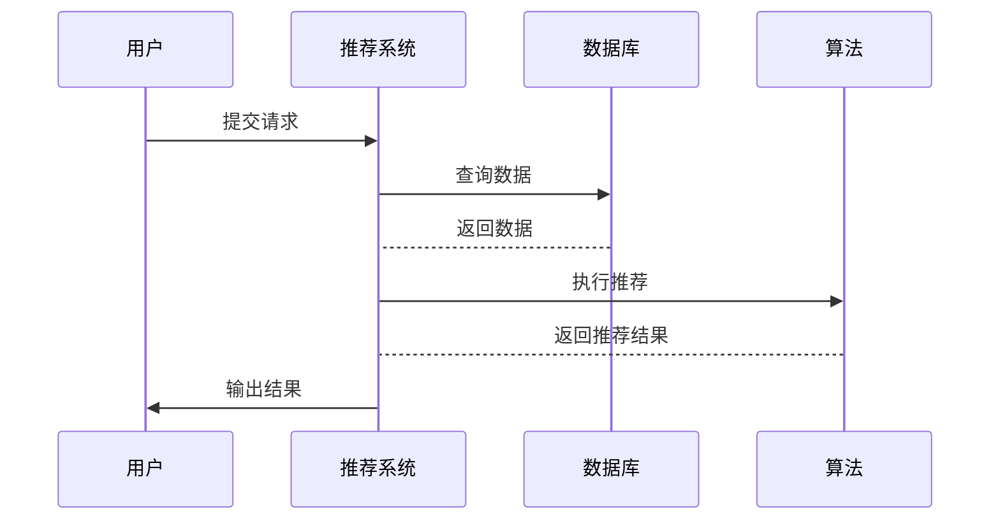

                 


# 智能衣柜：AI Agent的衣物搭配推荐

## 关键词：AI Agent, 智能衣柜, 衣物搭配推荐, 人工智能, 物联网, 大数据分析

## 摘要：本文深入探讨了智能衣柜的概念、技术基础、算法原理和系统架构，结合实际案例分析，详细讲解了如何利用AI Agent实现个性化的衣物搭配推荐。通过系统分析和项目实战，为读者提供了一套完整的解决方案。

---

# 第一部分: 智能衣柜的背景与现状

## 第1章: 智能衣柜的背景与现状

### 1.1 智能衣柜的概念与背景
#### 1.1.1 衣物搭配推荐的背景
在现代快节奏的生活中，用户每天面临选择衣物的挑战。如何快速找到合适的搭配，提升穿衣效率，成为一个重要的需求。衣物搭配推荐系统应运而生，它利用人工智能技术，帮助用户在短时间内找到合适的搭配方案。

#### 1.1.2 智能衣柜的发展现状
随着人工智能和物联网技术的快速发展，智能衣柜逐渐从概念走向实际应用。当前市场上的智能衣柜主要通过传感器和AI算法，实现衣物的分类、存储和推荐功能。然而，现有的系统在个性化推荐和用户体验方面仍有提升空间。

#### 1.1.3 AI Agent在智能衣柜中的作用
AI Agent（智能代理）在智能衣柜中扮演着核心角色。它能够根据用户的偏好、天气情况和场合需求，实时推荐衣物搭配方案。AI Agent不仅能够处理大量数据，还能通过学习用户的穿衣习惯，提供更加个性化的服务。

### 1.2 衣物搭配推荐的核心问题
#### 1.2.1 衣物搭配的基本原则
衣物搭配需要遵循一定的原则，如颜色协调、风格统一、场合匹配等。这些原则为AI Agent提供了推荐的基础规则。

#### 1.2.2 用户需求分析
用户的需求多种多样，包括日常穿搭、职场着装、休闲外出等。AI Agent需要根据用户的使用场景和偏好，提供相应的搭配建议。

#### 1.2.3 智能衣柜的目标与边界
智能衣柜的目标是通过AI技术，实现衣物的智能化管理和推荐。其边界包括数据采集、推荐算法、用户交互等模块，确保系统功能的完整性和实用性。

### 1.3 智能衣柜的技术基础
#### 1.3.1 人工智能技术的发展
人工智能技术为智能衣柜提供了强大的技术支持，包括自然语言处理、计算机视觉和机器学习等。

#### 1.3.2 物联网技术的应用
物联网技术使得智能衣柜能够与智能家居设备无缝连接，实现衣物的智能化管理。

#### 1.3.3 大数据分析的重要性
大数据分析是智能衣柜的核心能力之一，通过对用户行为和衣物数据的分析，为推荐系统提供精准的支持。

### 1.4 本章小结
本章详细介绍了智能衣柜的背景、核心问题和技术基础，为后续章节的分析奠定了基础。

---

# 第二部分: 智能衣柜的核心概念与联系

## 第2章: AI Agent与衣物搭配推荐系统

### 2.1 AI Agent的基本概念
#### 2.1.1 AI Agent的定义
AI Agent是一种智能实体，能够感知环境、自主决策并执行任务。在智能衣柜中，AI Agent负责接收用户的输入、分析数据并生成推荐结果。

#### 2.1.2 AI Agent的核心特征
AI Agent具有感知能力、学习能力、推理能力和自适应能力。这些特征使其能够根据用户的实时需求，提供个性化的衣物搭配建议。

#### 2.1.3 AI Agent与传统推荐系统的区别
与传统推荐系统相比，AI Agent具有更强的自主性和适应性。它能够通过与用户的交互，动态调整推荐策略，提供更加精准的服务。

### 2.2 衣物搭配推荐系统的属性特征对比
| 属性 | 描述 |
|------|------|
| 数据来源 | 用户行为数据、历史搭配数据、天气数据 |
| 推荐策略 | 协同过滤、基于内容的推荐、混合推荐 |
| 交互方式 | 图形界面、语音交互、手势交互 |
| 个性化程度 | 高度个性化 |

### 2.3 智能衣柜的ER实体关系图

```mermaid
er
actor: 用户
agent: AI推荐系统
clothing: 衣物
preference: 用户偏好
interaction: 交互记录

actor -|> preference: 提供偏好信息
actor -|> interaction: 记录交互行为
agent -|> clothing: 分析衣物信息
agent -|> interaction: 分析交互记录
agent --> actor: 提供推荐结果
```

### 2.4 本章小结
本章通过对比和分析，明确了AI Agent在智能衣柜中的核心作用，并通过ER实体关系图展示了系统各模块之间的关系。

---

# 第三部分: 智能衣柜的算法原理

## 第3章: 衣物搭配推荐算法

### 3.1 协同过滤算法
#### 3.1.1 基于用户的协同过滤
基于用户的协同过滤算法通过分析用户的相似性，推荐相似用户的喜欢的衣物。这种方法能够捕捉用户的偏好，但计算复杂度较高。

#### 3.1.2 基于物品的协同过滤
基于物品的协同过滤算法通过分析衣物之间的相似性，推荐用户可能喜欢的衣物。这种方法计算效率较高，适合大规模数据。

#### 3.1.3 混合协同过滤
混合协同过滤算法结合了基于用户和基于物品的协同过滤，能够同时考虑用户和衣物的特征，提供更加精准的推荐。

### 3.2 聚类分析算法
#### 3.2.1 衣物聚类
衣物聚类算法通过分析衣物的特征，将其分为不同的类别。这种方法能够帮助用户快速找到合适的衣物搭配。

#### 3.2.2 用户聚类
用户聚类算法通过分析用户的特征，将其分为不同的群体。这种方法能够帮助系统为不同类型的用户提供个性化的推荐。

#### 3.2.3 聚类结果的应用
聚类分析结果可以用于推荐系统的优化，例如为特定用户群体推荐特定类型的衣物。

### 3.3 深度学习模型
#### 3.3.1 基于神经网络的推荐
基于神经网络的推荐模型能够通过大量的数据训练，学习衣物和用户的特征，生成精准的推荐结果。

#### 3.3.2 深度学习的优势
深度学习模型具有强大的特征学习能力，能够捕捉衣物和用户之间的复杂关系，提供更加个性化的推荐。

#### 3.3.3 深度学习的挑战
深度学习模型需要大量的数据和计算资源，同时模型的解释性较差，这些是实际应用中需要克服的挑战。

### 3.4 算法流程图



### 3.5 本章小结
本章详细介绍了智能衣柜中常用的推荐算法，包括协同过滤、聚类分析和深度学习模型，并通过流程图展示了算法的整体流程。

---

# 第四部分: 智能衣柜的系统分析与架构设计

## 第4章: 系统分析与架构设计

### 4.1 问题场景介绍
智能衣柜系统需要解决的问题包括：衣物分类、推荐算法优化、用户交互设计等。

### 4.2 系统功能设计
#### 4.2.1 领域模型类图


#### 4.2.2 系统架构设计


#### 4.2.3 系统接口设计
系统接口包括用户输入接口、数据采集接口、推荐结果输出接口等。

#### 4.2.4 系统交互流程图


### 4.3 本章小结
本章通过系统分析和架构设计，明确了智能衣柜的实现路径和关键模块之间的关系。

---

# 第五部分: 智能衣柜的项目实战

## 第5章: 项目实战

### 5.1 环境安装
#### 5.1.1 安装Python
安装Python 3.8及以上版本，确保环境支持深度学习库。

#### 5.1.2 安装依赖库
安装numpy、pandas、scikit-learn等机器学习库。

#### 5.1.3 安装深度学习框架
选择TensorFlow或PyTorch，安装最新版本。

### 5.2 系统核心实现
#### 5.2.1 数据预处理
编写代码对衣物数据进行清洗和特征提取。

#### 5.2.2 模型训练
训练协同过滤、聚类分析和深度学习模型。

#### 5.2.3 推荐系统实现
根据用户输入，调用推荐模型生成推荐结果。

### 5.3 代码实现与解读
#### 5.3.1 协同过滤算法实现
```python
import numpy as np
from sklearn.metrics.pairwise import cosine_similarity

# 用户-物品评分矩阵
ratings = np.array([[4, 3, 0], [2, 0, 4], [1, 5, 2]])

# 计算余弦相似度
similarity = cosine_similarity(ratings.T)
```

#### 5.3.2 深度学习模型实现
```python
import tensorflow as tf
from tensorflow.keras import layers

# 定义模型
model = tf.keras.Sequential([
    layers.Dense(64, activation='relu'),
    layers.Dense(1, activation='sigmoid')
])

# 编译模型
model.compile(optimizer='adam', loss='binary_crossentropy', metrics=['accuracy'])
```

### 5.4 项目小结
本章通过实际项目，详细讲解了智能衣柜系统的实现过程，包括环境搭建、数据处理、模型训练和推荐系统开发。

---

# 第六部分: 智能衣柜的总结与展望

## 第6章: 总结与展望

### 6.1 最佳实践 tips
- 数据质量是推荐系统的核心，确保数据的完整性和准确性。
- 在实际应用中，结合多种推荐算法，提升推荐的准确性和用户体验。

### 6.2 本章小结
通过本章的总结，读者可以对智能衣柜的整体架构和技术实现有一个清晰的认识。

### 6.3 注意事项
- 注意数据隐私保护，确保用户数据的安全性。
- 在实际应用中，考虑系统的可扩展性和可维护性。

### 6.4 拓展阅读
建议读者阅读《推荐系统实战》和《深度学习入门》等书籍，进一步提升技术能力。

---

通过以上章节的详细讲解，读者可以系统地了解智能衣柜的技术实现过程，并掌握AI Agent在衣物搭配推荐中的应用。

