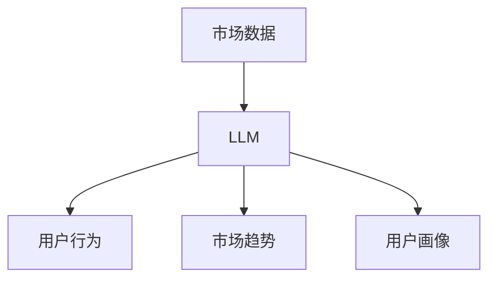
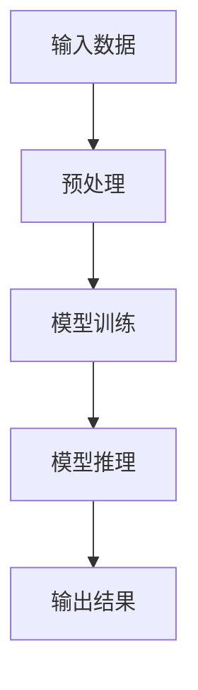
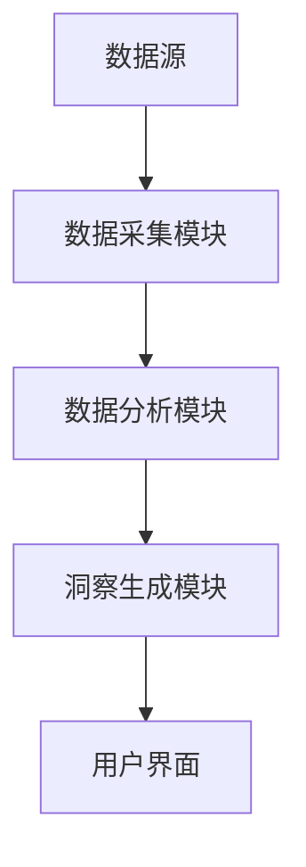

                 


# 《智能调研 AI Agent：LLM 辅助市场分析与用户洞察》

---

## 关键词：
- AI Agent
- LLM
- 市场分析
- 用户洞察
- 人工智能
- 自然语言处理

---

## 摘要：
随着人工智能技术的快速发展，大语言模型（LLM）在市场分析与用户洞察领域的应用日益广泛。本文将深入探讨智能调研 AI Agent 的核心概念、算法原理、系统设计与实现，结合实际案例分析，展示如何通过 LLM 辅助市场分析与用户洞察。文章内容涵盖背景介绍、核心原理、系统架构、项目实战及最佳实践，为读者提供全面的技术解读。

---

# 第一部分: 智能调研 AI Agent 背景与概述

## 第1章: 智能调研 AI Agent 的概念与背景

### 1.1 问题背景与问题描述

#### 1.1.1 市场调研与用户洞察的传统方法
传统的市场调研与用户洞察方法主要依赖于问卷调查、焦点小组、深度访谈等方式。这些方法虽然能够获取一定的数据，但存在以下问题：
- 数据收集成本高、周期长。
- 数据分析依赖人工经验，主观性强。
- 数据洞察不够精准，难以捕捉用户深层次需求。

#### 1.1.2 传统方法的局限性与挑战
随着市场竞争的加剧，企业需要更快、更准确地获取市场信息和用户反馈。传统方法的局限性主要体现在：
- 数据量有限，难以覆盖全市场。
- 数据分析依赖人工经验，难以规模化。
- 数据洞察不够深入，难以支持决策。

#### 1.1.3 AI 技术如何解决这些问题
人工智能技术，特别是大语言模型（LLM），能够通过自动化数据处理和分析，快速提取市场信息和用户洞察。AI Agent 可以实时分析海量数据，提供精准的市场趋势和用户画像，从而帮助企业做出更高效的决策。

---

### 1.2 智能调研 AI Agent 的定义与目标

#### 1.2.1 AI Agent 的核心概念
AI Agent 是一种能够感知环境、执行任务并做出决策的智能体。在市场调研与用户洞察场景中，AI Agent 通过与用户交互或分析数据，提供市场分析与用户洞察服务。

#### 1.2.2 LLM 在智能调研中的作用
大语言模型（LLM）通过自然语言处理技术，能够理解、生成和分析文本数据。在市场调研中，LLM 可以帮助分析用户反馈、识别市场趋势、生成洞察报告。

#### 1.2.3 智能调研的目标与应用场景
智能调研的目标是通过 AI 技术提升市场分析与用户洞察的效率和准确性。应用场景包括：
- 实时数据分析与洞察。
- 用户画像与行为分析。
- 市场趋势预测与竞争分析。

---

### 1.3 问题解决与边界外延

#### 1.3.1 智能调研的解决方案框架
智能调研 AI Agent 的解决方案框架包括：
1. 数据采集与预处理。
2. 数据分析与模型训练。
3. 洞察生成与可视化。

#### 1.3.2 解决方案的边界与限制
智能调研 AI Agent 的边界包括：
- 数据来源的限制。
- 模型的准确性和泛化能力。
- 用户隐私与数据安全。

#### 1.3.3 相关概念的对比与联系
智能调研 AI Agent 与其他技术的对比：
- 对比传统市场调研：效率高、成本低、覆盖面广。
- 对比其他 AI 技术：专注于市场分析与用户洞察。

---

## 第2章: LLM 辅助市场分析与用户洞察的核心要素

### 2.1 核心概念与原理

#### 2.1.1 大语言模型（LLM）的基本原理
大语言模型通过深度学习技术训练而成，能够理解上下文、生成文本、回答问题。LLM 的核心是其庞大的参数量和强大的语言理解能力。

#### 2.1.2 LLM 在市场分析中的应用
LLM 可以用于：
- 数据清洗与预处理。
- 文本分类与主题分析。
- 情感分析与用户反馈挖掘。

#### 2.1.3 LLM 在用户洞察中的优势
LLM 的优势包括：
- 高效性：快速处理大量文本数据。
- 精准性：基于上下文理解，提供准确的分析结果。

### 2.2 核心概念对比与联系

#### 2.2.1 LLM 与其他 AI 技术的对比
- 对比传统机器学习：LLM 的数据处理能力更强。
- 对比图像识别：LLM 更擅长文本分析。

#### 2.2.2 市场分析与用户洞察的对比
市场分析关注整体趋势，用户洞察关注个体行为。两者相辅相成，共同帮助企业制定精准的市场策略。

#### 2.2.3 LLM 在不同场景中的应用对比
- 在市场调研中的应用：数据驱动。
- 在用户洞察中的应用：行为驱动。

### 2.3 核心概念的 ER 实体关系图



---

# 第二部分: LLM 辅助市场分析与用户洞察的核心原理

## 第3章: LLM 的算法原理与流程

### 3.1 LLM 的核心算法流程



---

### 3.2 LLM 的数学模型与公式

#### 3.2.1 语言模型的数学基础
语言模型的目标是通过概率分布来预测下一个词的概率。常见的模型包括 n-gram 和转换器模型（如 Transformer）。

#### 3.2.2 概率论基础
- 贝叶斯定理：用于条件概率的计算。
  $$ P(A|B) = \frac{P(B|A)P(A)}{P(B)} $$
- 马尔可夫假设：假设当前词只依赖于前几个词。

#### 3.2.3 信息论基础
- 信息熵：衡量数据的不确定性。
  $$ H(X) = -\sum_{x} P(x)\log P(x) $$

---

### 3.3 LLM 的代码实现与分析

#### 3.3.1 预处理代码
```python
def preprocess_data(data):
    # 数据清洗
    data_cleaned = data.replace(r'\W+', ' ', regex=True)
    # 分词
    tokens = data_cleaned.split()
    return tokens
```

#### 3.3.2 模型训练代码
```python
def train_model(tokens):
    # 初始化模型参数
    params = {'vocab_size': len(set(tokens))}
    # 模型训练
    model = LLM(params)
    model.train(tokens, epochs=100)
    return model
```

---

### 3.4 LLM 的实际应用与案例分析

#### 3.4.1 案例背景
某电商公司希望分析用户评论，提取情感倾向和关键词。

#### 3.4.2 数据分析流程
1. 数据清洗与分词。
2. 情感分析模型训练。
3. 关键词提取与主题分析。

---

## 第4章: LLM 辅助市场分析与用户洞察的系统设计

### 4.1 系统分析与架构设计

#### 4.1.1 问题场景介绍
系统需要支持实时数据分析与用户洞察生成。

#### 4.1.2 系统功能设计
- 数据采集模块：负责数据的获取与预处理。
- 数据分析模块：负责模型训练与推理。
- 洞察生成模块：负责结果的可视化与报告生成。

#### 4.1.3 系统架构设计



---

### 4.2 项目实战与代码实现

#### 4.2.1 环境安装
```bash
pip install transformers
pip install numpy
pip install matplotlib
```

#### 4.2.2 核心代码实现

```python
from transformers import LLM

def main():
    # 数据加载
    data = open('comments.txt').read()
    # 数据预处理
    tokens = preprocess_data(data)
    # 模型训练
    model = train_model(tokens)
    # 情感分析
    sentiment = model.predict_sentiment(tokens)
    # 关键词提取
    keywords = model.extract_keywords(tokens, top_k=5)
    # 可视化
    visualize(sentiment, keywords)
```

---

## 第5章: 总结与展望

### 5.1 核心内容总结
- LLM 在市场分析与用户洞察中的应用价值。
- 智能调研 AI Agent 的核心技术和实现框架。

### 5.2 未来展望
- 模型的优化与改进。
- 新技术的融合与应用。

### 5.3 小结
通过 LLM 辅助市场分析与用户洞察，企业可以更高效地获取市场信息和用户需求，从而制定更精准的市场策略。

---

## 结语
智能调研 AI Agent 的应用标志着市场分析与用户洞察进入了一个新的阶段。通过 LLM 技术，企业能够快速、准确地获取市场信息和用户洞察，为决策提供强有力的支持。未来，随着 AI 技术的不断发展，智能调研 AI Agent 将在更多领域发挥重要作用。

