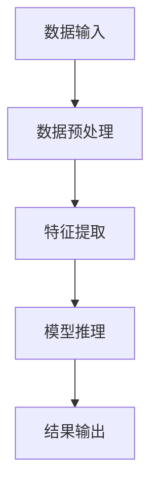
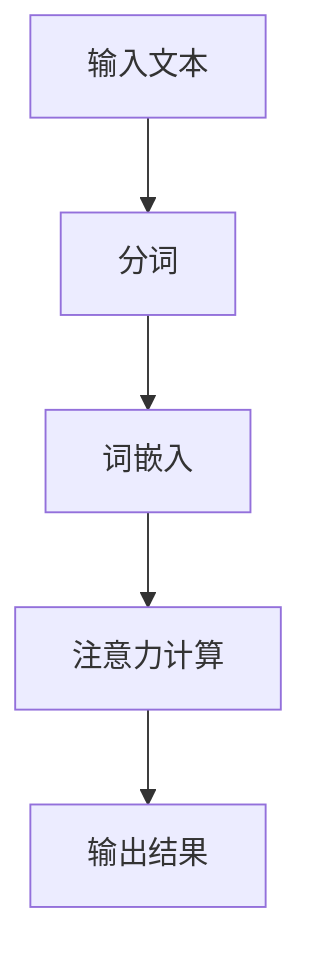
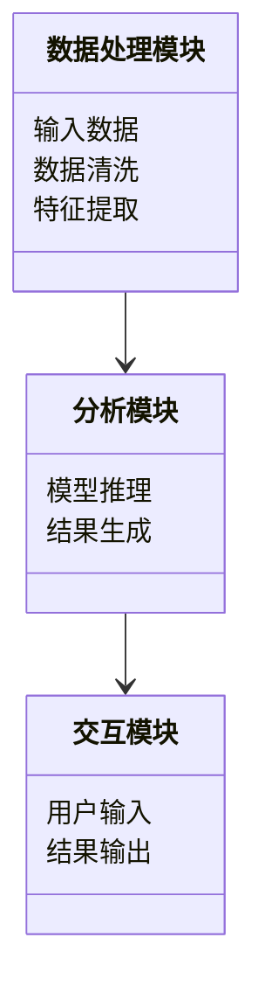

                 


```markdown
# 智能财务分析 AI Agent：LLM 在企业财务管理中的应用

> 关键词：智能财务分析，AI Agent，LLM，企业财务管理，大语言模型

> 摘要：随着人工智能技术的快速发展，大语言模型（LLM）在企业财务管理中的应用越来越广泛。本文将深入探讨智能财务分析 AI Agent 的核心概念、算法原理、系统架构以及实际应用，帮助读者理解如何利用 LLM 提升企业财务管理水平。

---

## 第一部分: 智能财务分析 AI Agent 的背景与核心概念

### 第1章: 智能财务分析的背景与需求

#### 1.1 传统财务分析的局限性
- **问题背景**：传统财务分析依赖人工操作，效率低且易出错。
- **问题描述**：企业财务数据繁多，人工处理难以高效准确。
- **问题解决**：引入 AI 技术，特别是大语言模型（LLM），提升财务分析效率和准确性。
- **边界与外延**：AI Agent 仅处理财务分析，不涉及企业其他管理领域。

#### 1.2 企业财务管理中的痛点
- 数据处理复杂性
- 分析耗时且易错
- 预测和决策依赖经验

#### 1.3 AI 技术在财务分析中的潜在价值
- 自动化处理数据
- 高效生成报告
- 准确预测和决策

#### 1.4 AI Agent 的核心要素
- 数据处理能力
- 分析与决策能力
- 交互能力



### 第2章: AI Agent 在企业财务管理中的应用前景

#### 2.1 AI Agent 的定义与特点
- **定义**：AI Agent 是一种能够自主决策并执行任务的智能体。
- **特点**：自主性、反应性、目标导向、学习能力。

#### 2.2 LLM 在财务分析中的具体应用
- **财务报告生成**：自动生成财务报表和分析报告。
- **财务数据预测**：预测收入、支出等关键指标。
- **财务风险评估**：识别潜在风险并提出防范措施。
- **财务决策支持**：提供数据支持和决策建议。

#### 2.3 LLM 的优势
- 处理大量数据
- 快速生成结果
- 提供深度分析

---

## 第二部分: LLM 的算法原理与实现

### 第3章: LLM 的算法原理

#### 3.1 LLM 的基本原理
- 基于大规模数据训练
- 采用自注意力机制
- 生成式输出

#### 3.2 注意力机制


#### 3.3 模型训练过程
- **预训练**：使用大规模数据进行无监督学习。
- **微调**：在特定任务上进行有监督微调。

#### 3.4 损失函数
$$ \text{损失函数} = -\sum_{i=1}^{n} \log P(w_i | w_{<i}) $$
其中，$w_i$ 表示第 i 个词。

---

## 第三部分: 系统分析与架构设计

### 第4章: 系统分析与架构设计

#### 4.1 系统功能设计
- 数据处理模块
- 分析模块
- 交互模块



#### 4.2 系统架构设计
```mermaid
graph TD
    Client[客户端] --> API Gateway[网关]
    API Gateway --> Service1[服务1]
    Service1 --> Service2[服务2]
    Service2 --> Database[数据库]
```

#### 4.3 系统接口设计
- 输入接口：财务数据、用户指令
- 输出接口：分析结果、报告生成

#### 4.4 交互流程
```mermaid
sequenceDiagram
    用户 --> 系统：输入数据
    系统 --> 用户：返回分析结果
```

---

## 第四部分: 项目实战

### 第5章: 项目实战

#### 5.1 环境安装
- 安装 Python 和相关库（如 TensorFlow、Keras）

#### 5.2 核心代码实现
```python
import tensorflow as tf
from tensorflow.keras.layers import Input, Dense, Dropout
from tensorflow.keras.models import Model

# 输入层
input_layer = Input(shape=(100,))
# 隐藏层
hidden_layer = Dense(64, activation='relu')(input_layer)
hidden_layer = Dropout(0.5)(hidden_layer)
# 输出层
output_layer = Dense(1, activation='sigmoid')(hidden_layer)

# 模型定义
model = Model(inputs=input_layer, outputs=output_layer)
model.compile(optimizer='adam', loss='binary_crossentropy', metrics=['accuracy'])
```

#### 5.3 案例分析与解读
- 数据预处理
- 模型训练
- 结果分析

---

## 第五部分: 总结与展望

### 第6章: 总结与展望

#### 6.1 总结
- AI Agent 在企业财务管理中的巨大潜力
- LLM 的核心作用

#### 6.2 展望
- 更加智能化的财务分析工具
- 多模态 AI Agent 的发展

#### 6.3 最佳实践 tips
- 数据质量至关重要
- 模型需要持续优化
- 保持对新技术的关注

---

> 参考文献：[此处列出相关文献]

---

通过以上结构，您可以根据需要进一步扩展每个章节的内容，深入探讨具体的技术细节和应用场景。
```

