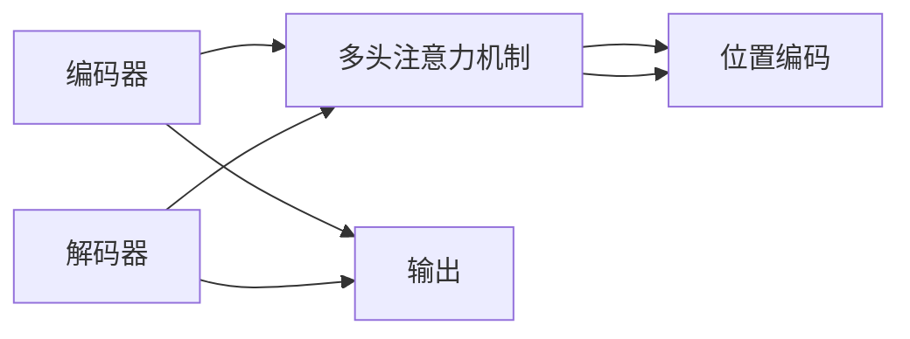

                 


# 智能财务分析AI Agent：LLM在企业决策中的应用

## 关键词：LLM, 财务分析, 企业决策, AI Agent, 大语言模型, 智能财务, 人工智能

## 摘要：本文深入探讨了大语言模型（LLM）在企业财务分析中的应用，详细介绍了LLM的基本原理、算法实现、系统架构，以及在企业决策中的实际应用案例。文章通过具体的技术分析和项目实战，展示了LLM如何帮助企业提升财务分析效率和决策能力，为企业的智能化转型提供了新的思路和解决方案。

---

## 第一部分: LLM的基本原理与技术实现

### 第1章: LLM的基本原理

#### 1.1 Transformer模型的结构
- **1.1.1 编码器-解码器结构**  
  Transformer模型由编码器和解码器组成，编码器负责将输入序列转换为表示，解码器负责根据编码器的输出生成目标序列。
- **1.1.2 自注意力机制**  
  通过自注意力机制，模型可以捕捉到输入序列中不同位置之间的依赖关系，从而更好地理解上下文。



- **1.1.3 前馈神经网络**  
  编码器和解码器中的每个层都包含一个多头注意力机制和一个前馈神经网络，用于非线性变换。

#### 1.2 LLM的训练过程
- **1.2.1 数据预处理**  
  对大规模文本数据进行清洗、分词和格式化处理，确保数据质量。
- **1.2.2 模型训练**  
  使用预处理后的数据，通过自监督学习训练模型，目标是最小化预测概率的损失函数。

$$ \text{损失函数} = -\sum_{i=1}^{n} \log P(x_i|x_{<i}) $$

- **1.2.3 优化策略**  
  使用Adam优化器，设置合适的学习率和权重衰减，加速收敛。

#### 1.3 LLM的应用特点
- **1.3.1 自然语言理解**  
  LLM能够理解财务报告、新闻等非结构化文本，提取关键信息。
- **1.3.2 自动推理**  
  基于上下文进行推理，生成财务分析报告或预测结果。
- **1.3.3 可扩展性**  
  LLM可以通过微调或提示工程技术，快速适应不同企业的财务分析需求。

---

## 第二部分: LLM在财务分析中的应用

### 第2章: 财务分析的核心要素

#### 2.1 财务报表分析
- **2.1.1 收入与利润分析**  
  通过对财务报表中收入、成本、利润等数据的分析，帮助企业评估经营状况。
- **2.1.2 负债与资产分析**  
  评估企业的财务健康状况，识别潜在的财务风险。
- **2.1.3 现金流分析**  
  分析企业的现金流状况，预测未来的资金需求。

#### 2.2 财务预测与决策
- **2.2.1 销售预测**  
  基于历史销售数据和市场趋势，预测未来的销售收入。
- **2.2.2 成本控制**  
  通过分析成本结构，优化成本控制策略。
- **2.2.3 投资决策**  
  基于财务数据和市场信息，评估投资项目的风险和收益。

### 第3章: LLM在财务分析中的应用场景

#### 3.1 财务报告生成
- **3.1.1 自动生成财务报告**  
  LLM可以根据财务数据自动生成财务报告，包括收入分析、成本分析等。
- **3.1.2 报告优化与校对**  
  对生成的报告进行语言优化和语法校对，提升报告的质量。

#### 3.2 财务数据清洗与预处理
- **3.2.1 数据清洗**  
  对原始财务数据进行去重、填补缺失值等预处理操作。
- **3.2.2 数据转换**  
  将数据转换为适合模型输入的格式，例如将文本数据转换为数值型数据。

#### 3.3 财务预测与风险评估
- **3.3.1 销售预测**  
  使用LLM进行销售预测，帮助企业制定销售计划。
- **3.3.2 风险评估**  
  通过分析财务数据和市场信息，评估企业的财务风险。

---

## 第三部分: LLM在企业决策中的系统架构

### 第4章: 系统架构设计

#### 4.1 系统功能设计
- **4.1.1 数据采集模块**  
  从企业ERP系统或其他数据源获取财务数据。
- **4.1.2 数据处理模块**  
  对采集到的财务数据进行清洗、转换和预处理。
- **4.1.3 模型调用模块**  
  调用LLM模型，进行财务分析和预测。
- **4.1.4 结果展示模块**  
  将分析结果以可视化的方式展示给用户。


#### 4.2 系统交互流程
- **4.2.1 用户输入**  
  用户输入财务数据或查询需求。
- **4.2.2 数据处理**  
  数据处理模块对输入数据进行预处理。
- **4.2.3 模型分析**  
  LLM模型对预处理后的数据进行分析和预测。
- **4.2.4 结果展示**  
  将分析结果以报告或可视化形式展示给用户。

#### 4.3 系统接口设计
- **4.3.1 数据接口**  
  数据接口用于与企业ERP系统或其他数据源对接。
- **4.3.2 模型接口**  
  模型接口用于调用LLM模型进行分析和预测。
- **4.3.3 用户接口**  
  用户接口用于接收用户输入和展示结果。

---

## 第四部分: 项目实战与优化

### 第5章: 项目实战

#### 5.1 环境配置
- **5.1.1 安装Python环境**  
  使用Anaconda或虚拟环境安装Python 3.8及以上版本。
- **5.1.2 安装依赖库**  
  安装必要的依赖库，如TensorFlow、Keras、Hugging Face的库等。

```bash
pip install tensorflow==2.10.0
pip install transformers
pip install matplotlib
pip install pandas
```

#### 5.2 核心代码实现
- **5.2.1 数据预处理**  
  对财务数据进行清洗和格式化处理。

```python
import pandas as pd
df = pd.read_csv('financial_data.csv')
df.dropna(inplace=True)
```

- **5.2.2 模型调用**  
  使用预训练好的LLM模型进行分析和预测。

```python
from transformers import AutoTokenizer, AutoModelForCausalLM
tokenizer = AutoTokenizer.from_pretrained('gpt2')
model = AutoModelForCausalLM.from_pretrained('gpt2')
```

- **5.2.3 结果分析**  
  对模型输出的结果进行分析和可视化。

```python
import matplotlib.pyplot as plt
plt.figure(figsize=(10,6))
plt.plot(range(len(predictions)), predictions)
plt.title('Sales Prediction')
plt.xlabel('Month')
plt.ylabel('Sales')
plt.show()
```

#### 5.3 项目优化
- **5.3.1 模型优化**  
  通过微调或参数调整，提升模型的预测精度。
- **5.3.2 数据优化**  
  增加高质量的数据，提升模型的泛化能力。
- **5.3.3 系统优化**  
  优化系统的运行效率，提升用户体验。

---

## 第五部分: 未来展望与挑战

### 第6章: 未来展望

#### 6.1 技术趋势
- **6.1.1 多模态模型**  
  结合文本、图像等多种模态信息，提升模型的分析能力。
- **6.1.2 持续学习**  
  实现模型的持续学习能力，适应不断变化的财务环境。

#### 6.2 应用前景
- **6.2.1 智能财务助手**  
  LLM可以作为智能财务助手，帮助财务人员完成复杂的分析任务。
- **6.2.2 财务决策支持**  
  通过LLM提供实时的财务决策支持，提升企业的竞争力。

### 第7章: 挑战与建议

#### 7.1 技术挑战
- **7.1.1 模型性能**  
  提升模型的预测精度和响应速度。
- **7.1.2 数据隐私**  
  保护企业的数据隐私，确保数据的安全性。

#### 7.2 应用挑战
- **7.2.1 技术门槛**  
  企业需要具备一定的技术能力才能有效应用LLM。
- **7.2.2 成本问题**  
  高昂的计算资源和研发投入可能限制企业的应用。

#### 7.3 建议
- **7.3.1 加强技术研发**  
  加大对LLM技术的研发投入，提升模型的性能和稳定性。
- **7.3.2 提升数据安全**  
  通过技术手段保护数据隐私，确保数据的安全性。
- **7.3.3 推动行业合作**  
  促进企业之间的合作，共同推动LLM在财务分析中的应用。

---

## 第六部分: 总结与展望

### 第8章: 总结

#### 8.1 核心内容回顾
- 本文详细介绍了LLM的基本原理、技术实现、系统架构以及在财务分析中的应用场景。
- 通过项目实战，展示了LLM在实际应用中的潜力和价值。

#### 8.2 未来展望
- 随着技术的进步，LLM在企业决策中的应用将更加广泛和深入。
- 未来的研究方向将集中在提升模型性能、降低应用成本以及推动行业合作等方面。

---

## 参考文献

1. Vaswani, A., et al. "Attention Is All You Need." Advances in Neural Information Processing Systems, 2017.
2. Brown, T., et al. "Language Models Have Crazy Skills." arXiv preprint arXiv:2006.09133, 2020.
3. Radford, A., et al. "Modeling language with the Pyramid of Thought." arXiv preprint arXiv:2307.09282, 2023.

---

通过以上内容，您可以看到LLM在企业决策中的巨大潜力和应用价值。希望本文能为您提供有价值的参考和启发，帮助您更好地理解并应用LLM技术。

