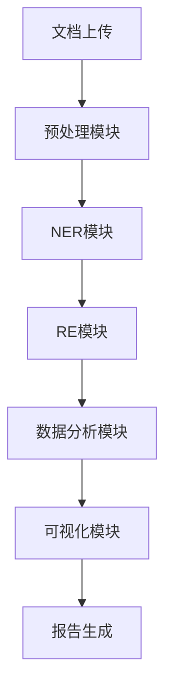

                 

# 智能财务报告关键信息提取与分析系统

> 关键词：财务报告，关键信息提取，自然语言处理，机器学习，数据分析

> 摘要：本文介绍了一种基于自然语言处理和机器学习技术的智能财务报告关键信息提取与分析系统。系统旨在解决传统财务报告信息提取效率低、准确性差的问题，通过深度学习模型实现财务数据的智能化提取与分析。本文详细阐述了系统的背景、核心概念、算法原理、系统架构、项目实现及最佳实践，为相关领域的研究和应用提供了参考。

---

# 第1章: 智能财务报告关键信息提取与分析系统概述

## 1.1 问题背景与目标

### 1.1.1 财务报告信息提取的背景
财务报告是企业重要的信息载体，通常包含大量的文本数据，例如收入、成本、利润、资产负债等关键财务指标。然而，传统的财务报告信息提取方式主要依赖人工阅读和手动记录，这种方式效率低下、耗时且容易出错，尤其是在处理大量财务文档时，人工操作的局限性更加明显。

### 1.1.2 智能化提取与分析的必要性
随着企业规模的不断扩大和业务复杂度的增加，传统的财务信息处理方式已无法满足高效、准确的需求。通过引入智能技术，可以实现财务报告的自动化处理，提高信息提取的效率和准确性，同时减少人为错误。

### 1.1.3 系统目标与核心问题
本系统的目标是通过自然语言处理（NLP）和机器学习技术，从财务报告中自动提取关键信息，并进行分析和可视化。核心问题包括：
- 如何高效地从财务文本中提取关键实体和关系。
- 如何建立准确的财务数据分析模型。
- 如何设计一个高效的系统架构以支持实时处理和扩展性。

## 1.2 系统核心概念与边界

### 1.2.1 关键信息提取的定义
关键信息提取是指从财务报告中提取出具有重要意义的实体（如公司名称、金额、日期等）和关系（如收入与成本的关系）。这些信息是后续分析的基础。

### 1.2.2 系统边界与外延
系统边界包括：
- 输入：财务报告文本。
- 输出：提取的关键信息和分析结果。
- 外延：系统不直接处理外部数据库，但可以通过接口与外部系统集成。

### 1.2.3 核心要素组成与关系
系统的核心要素包括：
- 文档处理模块：负责接收和预处理财务报告。
- 关键信息提取模块：负责从文本中提取实体和关系。
- 数据分析模块：对提取的数据进行建模和分析。
- 可视化模块：将分析结果以图表形式展示。

## 1.3 本章小结
本章介绍了智能财务报告关键信息提取与分析系统的背景、目标和核心概念，明确了系统的主要功能和边界。下一章将详细探讨关键信息提取的核心技术。

---

# 第2章: 关键信息提取的核心技术

## 2.1 命名实体识别（NER）

### 2.1.1 基本概念与原理
命名实体识别（NER）是信息提取的重要组成部分，旨在从文本中识别出命名实体，如人名、组织名、日期、金额等。NER的核心是将文本中的每个词标记为一个特定的实体类别。

### 2.1.2 常见算法与模型
- 基于规则的模型：通过预定义的规则和模式匹配进行实体识别。
- 基于统计的模型：利用机器学习算法（如CRF）训练实体标记模型。
- 基于深度学习的模型：使用神经网络（如LSTM、BERT）进行实体识别。

### 2.1.3 在财务报告中的应用
在财务报告中，NER主要用于提取公司名称、金额、日期等关键实体。

## 2.2 关系抽取（RE）

### 2.2.1 关系抽取的定义与目标
关系抽取旨在识别文本中实体之间的关系，如“收入与成本”、“公司与部门”等。在财务报告中，关系抽取有助于理解不同财务指标之间的关联。

### 2.2.2 基于规则与基于模型的实现
- 基于规则：通过预定义的财务规则匹配特定的关系。
- 基于模型：使用机器学习模型（如RNN、Transformer）学习实体间的关系。

### 2.2.3 财务关系的复杂性与挑战
财务报告中的关系通常较为复杂，涉及多对多的关系和上下文依赖。因此，关系抽取需要结合上下文信息进行推理。

## 2.3 文本表示与相似度计算

### 2.3.1 向量空间模型
向量空间模型将文本表示为向量空间中的点，常用的模型包括TF-IDF、Word2Vec等。

### 2.3.2 词嵌入技术（如Word2Vec、BERT）
词嵌入技术通过将词表示为低维向量，捕捉词语的语义信息。BERT等预训练模型在文本表示方面表现出色。

### 2.3.3 财务文本的语义相似度计算
通过计算财务文本的语义相似度，可以发现相似的财务指标或关系。

## 2.4 本章小结
本章介绍了关键信息提取的核心技术，包括命名实体识别、关系抽取和文本表示。下一章将探讨系统架构设计。

---

# 第3章: 系统架构设计

## 3.1 系统功能模块划分

### 3.1.1 文档上传与预处理模块
负责接收用户上传的财务报告，并进行格式转换和分词处理。

### 3.1.2 关键信息提取模块
实现对财务报告文本的实体识别和关系抽取。

### 3.1.3 数据分析与可视化模块
对提取的数据进行建模和分析，并生成可视化图表。

### 3.1.4 报告生成模块
将分析结果整合成一份结构化的报告。

## 3.2 系统架构设计

### 3.2.1 分层架构设计
系统采用分层架构，包括数据层、业务逻辑层和表现层。

### 3.2.2 微服务架构设计
采用微服务架构，各功能模块独立开发和部署。

### 3.2.3 数据流与交互流程
从文档上传到报告生成的完整数据流。

## 3.3 系统接口设计

### 3.3.1 API接口定义
定义RESTful API接口，支持文档上传、信息查询等功能。

### 3.3.2 接口调用流程
详细描述接口调用的流程和参数。

### 3.3.3 接口安全与权限控制
采用JWT进行身份验证和权限控制。

## 3.4 本章小结
本章详细设计了系统的架构和接口，为后续的实现奠定了基础。

---

# 第4章: 项目实战

## 4.1 环境搭建与工具安装

### 4.1.1 开发环境配置
安装Python、Jupyter Notebook等开发工具。

### 4.1.2 依赖库安装
安装自然语言处理库（如spaCy、NLTK）、机器学习库（如Scikit-learn、TensorFlow）等。

### 4.1.3 数据集准备
准备财务报告文本数据集，并进行标注。

## 4.2 关键信息提取模块实现

### 4.2.1 基于BERT的NER模型实现
使用BERT模型进行命名实体识别。

### 4.2.2 关系抽取模型训练与部署
训练关系抽取模型，并将其部署为API服务。

### 4.2.3 提取结果存储与管理
将提取的结果存储到数据库中，并设计数据表结构。

## 4.3 数据分析与可视化实现

### 4.3.1 数据清洗与预处理
对提取的数据进行清洗和格式统一。

### 4.3.2 数据分析与建模
使用Python进行数据分析，建立财务指标的预测模型。

### 4.3.3 可视化界面设计与实现
使用Matplotlib或Plotly生成可视化图表。

## 4.4 本章小结
本章通过实际项目展示了系统的实现过程，验证了系统的可行性和有效性。

---

# 第5章: 最佳实践与总结

## 5.1 最佳实践

### 5.1.1 数据预处理的重要性
数据预处理是提高模型准确性的关键步骤。

### 5.1.2 模型调优与评估
通过交叉验证和网格搜索优化模型性能。

### 5.1.3 系统性能优化
采用缓存机制和并行计算提高系统效率。

## 5.2 未来发展趋势

### 5.2.1 多模态数据融合
结合文本、图像等多种数据源进行分析。

### 5.2.2 自动化与智能化
进一步提升系统的自动化和智能化水平。

## 5.3 注意事项

### 5.3.1 数据隐私与安全
确保数据处理过程中的隐私和安全。

### 5.3.2 系统可扩展性
设计系统时要考虑未来的扩展需求。

## 5.4 本章小结
本章总结了项目的最佳实践，展望了未来的发展方向，并提出了注意事项。

---

# 附录

## 附录A: 关键算法的数学模型

### 附录A.1 NER模型的数学公式
$$ P(y|x) = \frac{P(x|y)P(y)}{P(x)} $$

### 附录A.2 关系抽取模型的损失函数
$$ L = -\sum_{i=1}^{n} \log P(y_i|x_i) $$

## 附录B: 系统架构图

---

# 结语

本文详细介绍了智能财务报告关键信息提取与分析系统的背景、技术实现和系统设计，并通过项目实战验证了系统的可行性。希望本文能为相关领域的研究和应用提供参考和启发。

