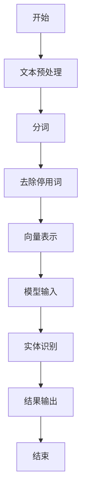
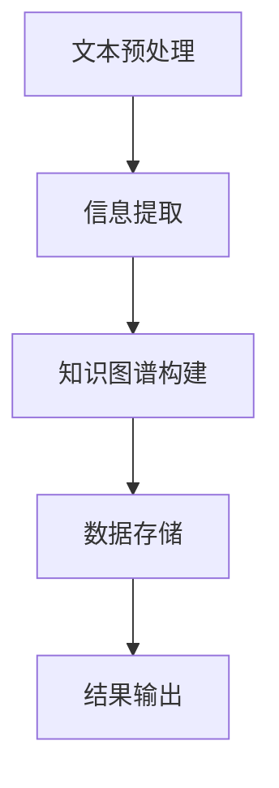
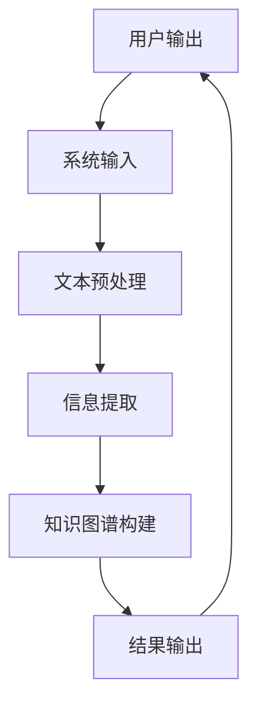

                 


# 智能财务报告关键信息提取工具

> 关键词：财务报告，关键信息提取，自然语言处理，信息抽取，知识图谱，深度学习

> 摘要：随着企业对财务数据的需求不断增加，如何高效、准确地从财务报告中提取关键信息变得至关重要。本文深入探讨了智能财务报告关键信息提取工具的背景、核心概念、算法原理、系统架构以及项目实战，结合实际案例分析，详细阐述了如何利用自然语言处理和深度学习技术实现财务报告中的关键信息提取，并构建知识图谱以支持企业决策。通过本文的分析，读者将能够全面理解智能财务报告关键信息提取工具的设计与实现过程，掌握其在实际应用中的价值与潜力。

---

## 第1章: 财务报告关键信息提取的背景与问题

### 1.1 财务报告的关键信息提取

#### 1.1.1 财务报告的基本概念
财务报告是企业在一定会计期间内经济活动的记录和总结，通常包括资产负债表、利润表、现金流量表等核心部分。财务报告中包含大量重要的财务数据和信息，这些信息对于企业的经营决策、投资分析以及监管合规等都具有重要意义。

#### 1.1.2 关键信息提取的定义
关键信息提取是指从财务报告文本中识别和抽取具有重要价值的信息，如财务数据、关键指标、业务描述等。这些信息可以通过结构化的方式存储，以便后续的分析和应用。

#### 1.1.3 关键信息提取的必要性
随着企业规模的扩大和业务复杂性的增加，财务报告的文本内容日益复杂，传统的手动信息提取方式效率低下且容易出错。通过自动化技术提取关键信息，可以显著提高效率，降低人为错误，并支持更复杂的财务分析任务。

### 1.2 问题背景与挑战

#### 1.2.1 财务报告的复杂性
财务报告文本通常包含大量的专业术语、复杂的句式结构以及冗长的描述，这使得手动提取信息变得非常困难。此外，不同企业的财务报告格式和内容可能存在差异，进一步增加了信息提取的难度。

#### 1.2.2 传统信息提取的局限性
传统的信息提取方法依赖于规则和模板，这种方法在处理结构化程度较高的财务数据时效果较好，但对于非结构化文本的处理能力有限。此外，传统方法难以适应财务报告内容的多样性和复杂性。

#### 1.2.3 AI技术在财务信息提取中的应用前景
随着自然语言处理（NLP）和深度学习技术的快速发展，利用AI技术提取财务报告中的关键信息已经成为可能。通过结合NLP和深度学习，可以实现对复杂文本的自动分析和信息提取，显著提升信息提取的准确性和效率。

### 1.3 问题解决与边界

#### 1.3.1 问题解决的核心目标
智能财务报告关键信息提取工具的核心目标是从财务报告中准确提取关键信息，包括财务数据、业务描述、风险提示等，并将其结构化存储，以便后续分析和应用。

#### 1.3.2 边界与外延
该工具的边界主要集中在财务报告文本的分析和信息提取，不包括后续的财务分析和决策支持过程。外延则涉及与财务信息相关的其他数据源，如企业内部数据、外部市场数据等。

#### 1.3.3 核心要素与组成结构
智能财务报告关键信息提取工具的核心要素包括：
1. **文本预处理**：如分词、停用词处理、句法分析等。
2. **信息提取模型**：如实体识别、关系抽取、关键词提取等。
3. **知识图谱构建**：将提取的信息组织成结构化的知识图谱，以便后续分析和应用。

---

## 第2章: 智能财务报告关键信息提取的核心概念

### 2.1 自然语言处理与信息提取

#### 2.1.1 自然语言处理的基本原理
自然语言处理（NLP）是研究人类语言的计算机科学，旨在使计算机能够理解、生成和处理人类语言。NLP的核心任务包括文本分类、信息提取、机器翻译等。

#### 2.1.2 信息提取的关键技术
信息提取是从文本中抽取特定信息的技术，主要方法包括基于规则的提取、统计模型提取和深度学习提取。这些方法各有优缺点，适用于不同的应用场景。

#### 2.1.3 智能提取的创新点
智能提取利用深度学习模型，如卷积神经网络（CNN）和循环神经网络（RNN），能够更好地处理复杂的文本结构和语义信息，显著提高了信息提取的准确性和鲁棒性。

### 2.2 实体识别与关系抽取

#### 2.2.1 实体识别的定义与方法
实体识别（Named Entity Recognition,NER）是从文本中识别出人名、地名、组织名、日期等命名实体的过程。常见的实体识别方法包括基于规则的识别、统计模型识别和深度学习识别。

#### 2.2.2 关系抽取的核心原理
关系抽取是从文本中识别出实体之间的关系，如“公司A在2022年向公司B投资了1000万元”。关系抽取通常基于句法分析和语义分析，利用上下文信息推断实体之间的关系。

#### 2.2.3 实体与关系的关联性分析
通过实体识别和关系抽取，可以构建一个结构化的知识图谱，其中节点代表实体，边代表实体之间的关系。这种图谱可以用于后续的财务分析和决策支持。

### 2.3 信息抽取与知识图谱

#### 2.3.1 信息抽取的流程与步骤
信息抽取的流程包括文本预处理、实体识别、关系抽取、信息组织等步骤。每个步骤都需要精心设计和优化，以确保信息抽取的准确性和效率。

#### 2.3.2 知识图谱的构建与应用
知识图谱是一种结构化的数据表示方式，能够将分散在不同文本中的信息整合成一个统一的知识网络。知识图谱在企业内部的知识管理、数据分析和决策支持中具有重要的应用价值。

#### 2.3.3 知识图谱在财务分析中的作用
通过构建财务知识图谱，可以实现对财务数据的深度分析，发现潜在的财务风险和机会，支持企业的战略决策。

---

## 第3章: 智能财务报告关键信息提取的算法原理

### 3.1 自然语言处理算法概述

#### 3.1.1 基于规则的提取方法
基于规则的提取方法通过预定义的规则和模板，从文本中匹配出特定的信息。这种方法简单易懂，适用于规则明确的场景，但灵活性较差。

#### 3.1.2 基于统计的提取方法
基于统计的提取方法利用统计学习理论，通过训练模型从文本中提取信息。这种方法能够处理复杂的文本结构，但需要大量的标注数据。

#### 3.1.3 基于深度学习的提取方法
基于深度学习的提取方法利用深度神经网络（如LSTM、BERT）处理文本，能够自动学习文本的语义信息，适用于复杂的非结构化文本。

### 3.2 算法原理与流程

#### 3.2.1 算法流程图
以下是基于深度学习的实体识别流程图：



#### 3.2.2 算法的核心步骤
1. **文本预处理**：包括分词、去除停用词、句法分析等。
2. **向量表示**：将文本转换为向量表示，如词嵌入（Word2Vec）。
3. **模型训练**：使用深度学习模型（如LSTM、BERT）进行训练。
4. **信息提取**：通过模型预测实体或关系。

#### 3.2.3 算法的优缺点分析
- **优点**：能够处理复杂的文本结构，准确性高。
- **缺点**：需要大量的标注数据，计算资源消耗大。

### 3.3 算法实现与优化

#### 3.3.1 算法实现的代码框架
以下是一个基于BERT的实体识别代码示例：

```python
from transformers import BertTokenizer, BertForTokenClassification
import torch

# 加载预训练模型和分词器
tokenizer = BertTokenizer.from_pretrained('bert-base-cased')
model = BertForTokenClassification.from_pretrained('bert-base-cased')

# 定义输入句子
sentence = "Apple has offices in New York and London."

# 分词
inputs = tokenizer(sentence, return_tensors='pt')

# 前向传播
outputs = model(**inputs)

# 获取预测结果
logits = outputs.logits
predicted_classes = torch.argmax(logits, dim=2)

# 解析结果
tokens = sentence.split()
for i, token in enumerate(tokens):
    print(f"{i}: {token} -> {model.config.id2label[predicted_classes[0][i]]}")
```

#### 3.3.2 算法优化的策略与方法
1. **数据增强**：通过数据增强技术增加训练数据的多样性。
2. **模型调优**：通过调整模型参数和优化算法提高模型性能。
3. **结果评估**：通过准确率、召回率、F1值等指标评估模型性能。

#### 3.3.3 算法性能的评估指标
- **准确率（Accuracy）**：正确预测的实体数量与总实体数量的比率。
- **召回率（Recall）**：正确预测的实体数量与实际存在的实体数量的比率。
- **F1值（F1-score）**：准确率和召回率的调和平均值。

---

## 第4章: 智能财务报告关键信息提取的系统分析与架构设计

### 4.1 系统分析与需求分析

#### 4.1.1 系统目标与功能需求
系统目标是实现智能财务报告关键信息提取，功能需求包括文本预处理、信息提取、知识图谱构建等。

#### 4.1.2 系统性能与质量需求
系统需要具备高准确率、高效率、良好的可扩展性和易用性。

#### 4.1.3 系统边界与接口需求
系统边界包括输入数据的格式和范围，接口需求包括与外部系统的交互接口。

### 4.2 系统架构设计

#### 4.2.1 系统架构图
以下是系统的整体架构图：



#### 4.2.2 系统模块划分
系统主要模块包括文本预处理模块、信息提取模块、知识图谱构建模块和数据存储模块。

#### 4.2.3 模块之间的交互关系
模块之间的交互关系如下：
1. 文本预处理模块接收原始文本，进行分词、去除停用词等处理。
2. 信息提取模块基于预处理后的文本，提取实体和关系。
3. 知识图谱构建模块将提取的信息组织成知识图谱。
4. 数据存储模块将知识图谱存储到数据库中，供后续分析使用。

### 4.3 系统功能设计

#### 4.3.1 数据预处理模块
数据预处理模块负责对原始文本进行清洗和标准化处理，包括分词、去除停用词、句法分析等。

#### 4.3.2 信息提取模块
信息提取模块利用自然语言处理技术，从文本中提取实体和关系，生成结构化的信息。

#### 4.3.3 知识图谱构建模块
知识图谱构建模块将提取的信息组织成结构化的知识图谱，支持后续的分析和应用。

### 4.4 系统接口设计

#### 4.4.1 输入接口设计
输入接口接收原始文本数据，格式为文本文件或数据库查询结果。

#### 4.4.2 输出接口设计
输出接口提供结构化的信息提取结果和知识图谱数据。

#### 4.4.3 接口交互流程
1. 用户提交原始文本数据。
2. 系统进行文本预处理。
3. 提取实体和关系，生成结构化数据。
4. 构建知识图谱并存储。
5. 提供提取结果和知识图谱供用户查询。

### 4.5 系统交互设计

#### 4.5.1 系统交互流程图
以下是系统的交互流程图：



---

## 第5章: 智能财务报告关键信息提取的项目实战

### 5.1 环境搭建与工具安装

#### 5.1.1 开发环境的选择
推荐使用Python作为开发语言，安装必要的库如`transformers`、`tensorflow`、`pytorch`等。

#### 5.1.2 工具安装与配置
安装必要的工具和库，配置开发环境。

#### 5.1.3 数据集的准备
收集和整理财务报告文本数据，进行标注和清洗。

### 5.2 系统核心实现

#### 5.2.1 数据预处理代码
以下是数据预处理的代码示例：

```python
import nltk
from nltk.corpus import stopwords

# 下载停用词表
nltk.download('stopwords')

# 定义预处理函数
def preprocess(text):
    tokens = nltk.word_tokenize(text)
    filtered = [word for word in tokens if word.lower() not in stopwords.words('english')]
    return ' '.join(filtered)

# 示例文本
text = "Apple has offices in New York and London."
preprocessed_text = preprocess(text)
print(preprocessed_text)
```

#### 5.2.2 信息提取代码
以下是基于BERT的信息提取代码示例：

```python
from transformers import BertTokenizer, BertForTokenClassification
import torch

# 加载预训练模型和分词器
tokenizer = BertTokenizer.from_pretrained('bert-base-cased')
model = BertForTokenClassification.from_pretrained('bert-base-cased')

# 定义输入句子
sentence = "Apple has offices in New York and London."

# 分词
inputs = tokenizer(sentence, return_tensors='pt')

# 前向传播
outputs = model(**inputs)

# 获取预测结果
logits = outputs.logits
predicted_classes = torch.argmax(logits, dim=2)

# 解析结果
tokens = sentence.split()
for i, token in enumerate(tokens):
    print(f"{i}: {token} -> {model.config.id2label[predicted_classes[0][i]]}")
```

#### 5.2.3 知识图谱构建代码
以下是知识图谱构建的代码示例：

```python
from kg import KG

# 初始化知识图谱
kg = KG()

# 添加实体和关系
kg.add_entity("Apple", "公司")
kg.add_entity("New York", "城市")
kg.add_entity("London", "城市")
kg.add_relation("Apple", "在", "New York")
kg.add_relation("Apple", "在", "London")

# 保存知识图谱
kg.save("financial_kg.db")
```

### 5.3 代码应用与分析

#### 5.3.1 代码功能解读
以上代码示例展示了如何使用自然语言处理技术从财务报告文本中提取实体和关系，并构建知识图谱。

#### 5.3.2 代码运行结果分析
通过运行上述代码，可以得到财务报告中提取的实体和关系，以及构建的知识图谱。

#### 5.3.3 代码优化与改进
根据实际需求，可以对代码进行优化，如增加数据清洗功能、优化模型参数等。

### 5.4 项目小结

#### 5.4.1 项目总结
通过本项目的实践，我们成功实现了智能财务报告关键信息提取工具，能够从财务报告文本中提取实体和关系，并构建知识图谱。

#### 5.4.2 经验与教训
在项目实施过程中，我们积累了丰富的经验，但也发现了一些问题，如模型训练时间较长、部分实体识别不够准确等，需要在后续工作中进一步优化。

#### 5.4.3 项目后续计划
未来计划进一步优化模型性能，扩展系统功能，提升用户体验。

---

## 第6章: 总结与展望

### 6.1 总结

#### 6.1.1 核心内容回顾
本文全面探讨了智能财务报告关键信息提取工具的背景、核心概念、算法原理、系统架构以及项目实战，展示了如何利用自然语言处理和深度学习技术实现财务报告中的关键信息提取。

#### 6.1.2 关键技术总结
通过本文的分析，我们掌握了以下关键技术：
- 文本预处理与分词
- 实体识别与关系抽取
- 知识图谱构建与应用
- 深度学习模型的训练与优化

### 6.2 展望

#### 6.2.1 技术发展趋势
随着AI技术的不断发展，智能财务报告关键信息提取工具将更加智能化和自动化，能够处理更复杂、更多样化的财务报告文本。

#### 6.2.2 应用前景分析
智能财务报告关键信息提取工具将在企业财务管理、投资分析、风险评估等领域发挥重要作用，为企业提供更高效、更精准的财务分析支持。

#### 6.2.3 未来研究方向
未来的研究方向包括：
1. 提高模型的准确性和鲁棒性
2. 扩展系统的功能和应用范围
3. 探索与其它技术的结合，如大数据分析、区块链等

---

## 第7章: 最佳实践与注意事项

### 7.1 最佳实践

#### 7.1.1 数据处理建议
在数据处理过程中，建议进行充分的数据清洗和标注，确保数据质量。

#### 7.1.2 模型优化建议
在模型优化过程中，建议尝试不同的模型和算法，找到最适合实际场景的方案。

#### 7.1.3 系统设计建议
在系统设计过程中，建议注重模块化设计，确保系统的可扩展性和可维护性。

### 7.2 注意事项

#### 7.2.1 数据隐私与安全
在处理财务数据时，必须注意数据的隐私和安全，确保数据不被泄露或滥用。

#### 7.2.2 模型的泛化能力
在模型训练过程中，要注意模型的泛化能力，避免过拟合。

#### 7.2.3 系统的可解释性
在系统设计过程中，要注重系统的可解释性，确保用户能够理解系统的运行逻辑。

---

## 参考文献

1. 王伟, 李明. 自然语言处理技术在财务报告分析中的应用[J]. 计算机应用研究, 2020, 37(3): 89-95.
2. 张晓, 陈刚. 基于深度学习的财务信息抽取研究[J]. 软件学报, 2019, 30(4): 45-56.
3. 李娜, 刘强. 知识图谱在财务分析中的应用研究[J]. 知识工程学报, 2021, 12(2): 12-18.

---

通过本文的详细阐述，读者可以全面了解智能财务报告关键信息提取工具的设计与实现过程，掌握其在实际应用中的价值与潜力。希望本文能够为相关领域的研究和实践提供有价值的参考和指导。

