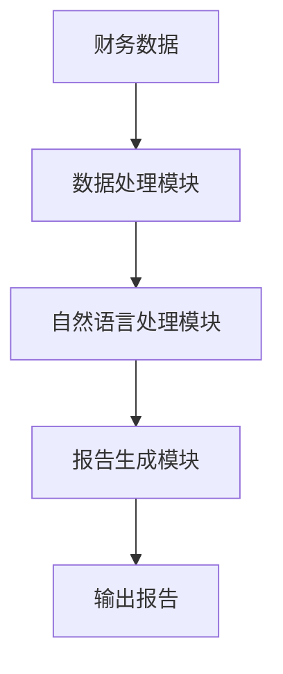

                 


# 智能财务报告自动生成系统

## 关键词：智能财务报告，自然语言处理，自动生成系统，AI技术，财务数据，文本生成，算法优化

## 摘要：  
本文深入探讨了智能财务报告自动生成系统的设计与实现，从背景、核心概念到算法原理、系统架构，再到项目实战和优化策略，全面解析了该系统的技术细节。通过结合自然语言处理技术与人工智能算法，本文展示了如何高效地将财务数据转化为结构化报告，同时兼顾了系统的可扩展性和实际应用场景。本文适合技术人员、财务人员以及对智能财务系统感兴趣的读者阅读。

---

# 第1章 智能财务报告的背景与现状

## 1.1 传统财务报告的痛点

财务报告是企业展示经营成果的重要工具，但传统的财务报告生成过程存在以下痛点：

1. **耗时性**：财务人员需要手动收集、整理和分析数据，耗时长且效率低下。
2. **低效性**：重复性工作占用了大量人力资源，增加了企业成本。
3. **错误率高**：人工操作容易出现数据错误或遗漏，影响报告的准确性。
4. **数据孤岛**：企业内部数据分散在不同系统中，难以快速整合和分析。

## 1.2 AI技术在财务领域的应用前景

人工智能（AI）技术的快速发展为财务领域的自动化提供了新的可能性。以下是AI在财务领域的主要应用方向：

1. **数据处理自动化**：通过AI技术快速提取和整理财务数据，减少人工干预。
2. **预测分析**：利用机器学习模型预测财务趋势，辅助决策。
3. **智能报告生成**：基于NLP（自然语言处理）技术，自动生成结构化财务报告。

## 1.3 智能财务报告自动生成系统的定义与优势

### 1.3.1 系统的定义与核心功能
智能财务报告自动生成系统是一种结合AI和NLP技术的自动化工具，能够根据输入的财务数据，自动生成符合格式要求的财务报告。其核心功能包括：
- 数据采集与预处理
- 文本生成与优化
- 报告输出与格式化

### 1.3.2 系统的主要优势
1. **高效性**：通过自动化处理，大幅减少人工操作时间。
2. **准确性**：AI算法能够减少人为错误，提高报告的准确性。
3. **可扩展性**：系统支持多种数据格式和报告类型，适应不同企业的需求。

### 1.3.3 系统的应用场景与边界
- **应用场景**：适用于企业财务报表、行业分析报告、财务审计等多种场景。
- **边界**：目前系统主要适用于结构化数据生成报告，复杂非结构化数据仍需人工辅助。

---

# 第2章 智能财务报告自动生成系统的核心概念

## 2.1 系统的核心概念与原理

### 2.1.1 数据采集与处理
系统通过API或文件接口采集企业的财务数据，包括收入、支出、利润等关键指标。数据采集后需要进行清洗和预处理，确保数据的完整性和准确性。

### 2.1.2 自然语言处理技术
自然语言处理（NLP）是系统的核心技术之一，主要用于将结构化的财务数据转化为自然语言文本。常用的技术包括：
- **词嵌入**：通过Word2Vec或BERT等模型将词语转化为向量表示。
- **文本生成**：基于Transformer模型的生成算法，如GPT，用于自动生成报告内容。

### 2.1.3 生成引擎与优化算法
生成引擎负责将处理后的数据输入NLP模型，生成初步报告。优化算法用于提升生成报告的质量，包括语法纠错、语义优化等。

## 2.2 系统的关键技术对比

### 2.2.1 数据来源与处理方式对比
| 数据来源 | 数据处理方式 | 优缺点 |
|----------|--------------|--------|
| 数据库    | 清洗、预处理 | 数据结构清晰，易于处理 | 
| 文件     | 解析、转换   | 支持多种格式，灵活性高 |

### 2.2.2 不同NLP模型的优劣势分析
| 模型名称 | 优势 | 劣势 |
|----------|------|------|
| BERT     | 上下文理解能力强 | 需要大量计算资源 |
| GPT      | 生成能力强 | 精确性较差 |
| LSTM     | 适合短文本生成 | 并行处理能力弱 |

### 2.2.3 生成算法的性能对比
| 算法名称 | 处理速度 | 生成质量 |
|----------|----------|----------|
| GPT-3    | 较慢     | 高       |
| BERT     | 中等     | 中等     |

## 2.3 系统的ER实体关系图



---

# 第3章 智能财务报告自动生成系统的算法原理

## 3.1 NLP模型的基本原理

### 3.1.1 词嵌入与句子表示
词嵌入是通过将词语映射到低维向量空间来捕捉词语的语义信息。例如，Word2Vec模型通过上下文预测词语，生成词向量表示。

### 3.1.2 注意力机制与Transformer模型
Transformer模型通过注意力机制捕捉文本中的长距离依赖关系，公式如下：

$$\text{Attention}(Q,K,V) = \text{softmax}(\frac{QK^T}{\sqrt{d_k}})V$$

其中，$Q$、$K$、$V$分别是查询、键和值向量。

### 3.1.3 模型训练与优化
模型训练采用交叉熵损失函数：

$$\text{Loss} = -\sum_{i=1}^{n} \text{log}(p(y_i|x_i))$$

通过梯度下降优化模型参数，常用的优化算法包括Adam和SGD。

## 3.2 基于BERT的文本生成算法

### 3.2.1 BERT模型的结构与特点
BERT模型通过双向Transformer结构，能够同时捕捉文本的上下文信息。其核心思想是：

$$\text{BERT}(x) = \text{LayerNorm}(xW^+ + b)$$

### 3.2.2 文本生成的条件与约束
文本生成需要满足以下条件：
- 生成内容必须与输入数据一致。
- 语言表达要符合财务报告的规范。
- 报告结构必须完整，包括摘要、正文和结论等部分。

### 3.2.3 模型训练的流程与步骤
1. 数据准备：收集并标注财务数据。
2. 模型训练：使用预训练好的BERT模型，微调任务。
3. 模型评估：通过准确率、召回率等指标评估生成效果。
4. 模型优化：调整超参数，优化生成质量。

## 3.3 算法的数学模型与公式

### 3.3.1 Transformer模型的数学公式
Transformer模型的编码层公式：

$$\text{Encoder}(x) = \text{MultiHeadAttention}(x) + \text{FFN}(x)$$

其中，MultiHeadAttention表示多头注意力机制，FFN表示前馈网络。

### 3.3.2 模型训练的损失函数
交叉熵损失函数：

$$\text{Loss} = -\sum_{i=1}^{n} \text{log}(p(y_i|x_i))$$

---

# 第4章 智能财务报告自动生成系统的优化与改进

## 4.1 算法优化策略

### 4.1.1 参数调整与超参数优化
参数调整是优化模型性能的重要手段，常用的超参数包括学习率、批量大小和Dropout率等。

### 4.1.2 模型压缩与轻量化设计
通过剪枝、量化等技术，减少模型的参数数量，降低计算成本。

### 4.1.3 多任务学习与联合优化
多任务学习可以同时优化多个相关任务，提升模型的泛化能力。

## 4.2 系统性能的评估与对比

### 4.2.1 生成报告的准确率与完整性评估
通过准确率、召回率和F1值评估生成报告的质量。

### 4.2.2 系统运行效率与资源消耗分析
分析系统的运行时间、内存占用等性能指标。

### 4.2.3 用户反馈与满意度调查
通过用户反馈，了解系统在实际应用中的优缺点。

## 4.3 系统架构优化

### 4.3.1 分布式架构设计
通过分布式架构，提升系统的处理能力和扩展性。

### 4.3.2 异步处理优化
通过异步处理，减少系统响应时间，提高处理效率。

---

# 第5章 项目实战：智能财务报告自动生成系统实现

## 5.1 环境安装与配置

### 5.1.1 安装Python与相关库
安装Python和必要的库，如TensorFlow、Keras和NLTK。

### 5.1.2 数据准备与预处理
收集财务数据，并进行清洗和预处理。

## 5.2 系统核心实现

### 5.2.1 数据采集模块
通过API接口采集财务数据。

### 5.2.2 自然语言处理模块
使用预训练的BERT模型生成报告文本。

### 5.2.3 报告生成模块
将生成的文本格式化为财务报告。

## 5.3 代码实现与解读

### 5.3.1 数据采集代码
```python
import requests

def get_financial_data(api_url):
    response = requests.get(api_url)
    return response.json()
```

### 5.3.2 文本生成代码
```python
from transformers import BertTokenizer, BertModel

tokenizer = BertTokenizer.from_pretrained('bert-base')
model = BertModel.from_pretrained('bert-base')

def generate_report(data):
    inputs = tokenizer(data, return_tensors='np')
    outputs = model(**inputs)
    return tokenizer.decode(outputs.last_hidden_state)
```

## 5.4 实际案例分析

### 5.4.1 案例背景
某企业需要生成季度财务报告。

### 5.4.2 数据处理
处理财务数据，生成报告内容。

### 5.4.3 生成结果
输出格式化的财务报告。

## 5.5 项目小结
本项目展示了智能财务报告自动生成系统的实现过程，从数据采集到文本生成，再到报告输出，每一步都进行了详细的分析和实现。

---

# 第6章 总结与展望

## 6.1 总结
本文详细介绍了智能财务报告自动生成系统的设计与实现，从背景、核心概念到算法原理、系统架构，再到项目实战和优化策略，全面解析了该系统的技术细节。

## 6.2 展望
未来，随着AI技术的不断进步，智能财务报告自动生成系统将更加智能化和高效化。同时，系统的应用场景也将进一步扩大，为企业提供更加全面的财务支持。

---

# 结语

智能财务报告自动生成系统是AI技术在财务领域的重要应用，通过自动化处理和智能生成，大幅提升了财务工作的效率和准确性。随着技术的不断发展，智能财务报告系统将为企业带来更多的价值和竞争优势。

