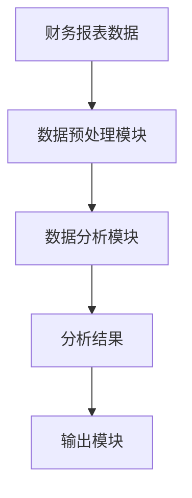
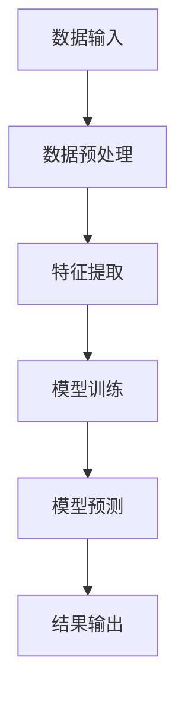
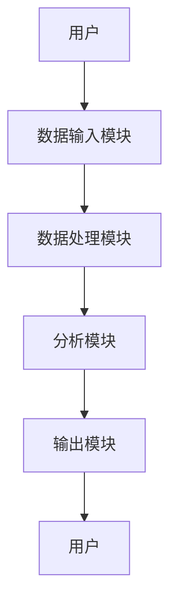

                 


# 《智能财务报表分析器》

## 关键词：智能财务报表分析器, 人工智能, 财务分析, 自然语言处理, 机器学习, 深度学习, 数据分析

## 摘要：  
《智能财务报表分析器》一书深入探讨了如何利用人工智能技术实现财务报表的智能化分析。通过对传统财务分析方法的局限性进行分析，本书提出了基于自然语言处理、机器学习和深度学习的智能财务报表分析器的设计与实现方法。书中详细讲解了智能财务报表分析器的核心概念、算法原理、系统架构设计以及实际项目案例，旨在为读者提供一个全面且系统的指导，帮助他们理解和掌握智能财务报表分析的技术与实践。

---

# 第一章: 财务报表分析的智能化背景

## 1.1 财务报表分析的重要性  
### 1.1.1 财务报表的基本概念与作用  
财务报表是企业财务状况、经营成果和现金流量的全面反映，是企业管理决策的重要依据。  
$$ 财务报表包括资产负债表、利润表和现金流量表。$$  

### 1.1.2 传统财务报表分析的局限性  
传统的财务报表分析依赖人工操作，存在效率低、易出错、难以处理大规模数据等问题。  

### 1.1.3 智能化分析的必要性  
随着企业数据量的爆炸式增长，传统方法已无法满足现代企业的分析需求，引入人工智能技术势在必行。  

## 1.2 智能财务报表分析器的定义与目标  
### 1.2.1 智能财务报表分析器的定义  
智能财务报表分析器是一种基于人工智能技术的工具，能够自动解析财务报表、提取关键信息并生成分析结果。  

### 1.2.2 智能化分析的核心目标  
- 自动化处理：减少人工操作，提高效率。  
- 高精度：利用机器学习算法，提高分析准确性。  
- 深度洞察：挖掘数据背后的趋势和规律，提供决策支持。  

## 1.3 人工智能技术在财务分析中的应用前景  
### 1.3.1 人工智能技术的基本概念  
人工智能（AI）是模拟人类智能的计算机系统，包括学习、推理和自适应能力。  

### 1.3.2 人工智能在财务分析中的优势  
- 处理大规模数据能力强。  
- 能够发现数据中的隐含规律。  
- 可以实时更新和优化分析结果。  

### 1.3.3 智能财务报表分析器的应用场景  
- 企业内部财务分析。  
- 投资者决策支持。  
- 金融监管与合规分析。  

## 1.4 本书的结构与内容安排  
### 1.4.1 书籍的章节安排  
- 第1章：背景与概述。  
- 第2章：核心概念与原理。  
- 第3章：算法原理与实现。  
- 第4章：系统架构设计。  
- 第5章：项目实战与案例分析。  
- 第6章：总结与展望。  

### 1.4.2 核心概念与技术的讲解  
本书将详细讲解智能财务报表分析器的核心概念、算法原理和系统架构设计。  

### 1.4.3 实战案例与项目实现  
通过实际案例，展示如何将理论应用于实践，帮助读者掌握智能财务报表分析器的实现方法。  

## 1.5 本章小结  
本章介绍了财务报表分析的智能化背景，阐述了智能财务报表分析器的定义、目标及其在人工智能技术中的应用前景，为后续章节的学习奠定了基础。

---

# 第二章: 智能财务报表分析器的核心概念与原理

## 2.1 智能财务报表分析器的组成与结构  
### 2.1.1 数据输入模块  
智能财务报表分析器需要处理多种格式的财务报表数据，如PDF、Excel等。  

### 2.1.2 数据处理模块  
对输入的财务报表数据进行清洗、转换和预处理，确保数据的准确性和一致性。  

### 2.1.3 分析模块  
利用自然语言处理（NLP）和机器学习算法，对数据进行深度分析。  

### 2.1.4 输出模块  
生成分析结果并输出，包括文本报告、可视化图表等。  

## 2.2 智能财务报表分析器的核心概念  
### 2.2.1 自然语言处理（NLP）  
NLP技术用于理解和解析财务报表中的文本信息，如会计科目名称、财务术语等。  

### 2.2.2 机器学习（ML）  
机器学习算法用于训练模型，识别财务数据中的模式和趋势。  

### 2.2.3 深度学习（DL）  
深度学习技术用于处理复杂的财务数据结构，提取高层次特征。  

## 2.3 智能财务报表分析器的原理与流程  
### 2.3.1 数据预处理  
对财务报表数据进行清洗、标准化和格式化处理。  

### 2.3.2 数据分析  
利用NLP和机器学习算法对数据进行分类、聚类和预测。  

### 2.3.3 结果输出  
将分析结果以文本、图表等形式呈现给用户。  

## 2.4 核心概念与联系  
### 2.4.1 核心概念的对比与总结  
| 技术 | 描述 | 应用场景 |  
|------|------|----------|  
| NLP  | 自然语言处理 | 解析财务报表文本 |  
| ML   | 机器学习 | 分类、预测 |  
| DL   | 深度学习 | 复杂特征提取 |  

### 2.4.2 实体关系图（ER图）  


## 2.5 本章小结  
本章详细介绍了智能财务报表分析器的核心概念与原理，包括数据输入、处理、分析和输出模块的组成，以及NLP、ML和DL技术在分析过程中的应用。

---

# 第三章: 智能财务报表分析器的算法原理与实现

## 3.1 算法原理概述  
### 3.1.1 自然语言处理（NLP）算法  
- 分词：将财务报表文本分割成词语或短语。  
- 词性标注：识别词语的词性（名词、动词等）。  
- 句法分析：分析句子的语法结构。  

### 3.1.2 机器学习算法  
- 支持向量机（SVM）：用于分类任务。  
- 随机森林（Random Forest）：用于特征选择和分类。  

### 3.1.3 深度学习算法  
- 卷积神经网络（CNN）：用于文本特征提取。  
- 循环神经网络（RNN）：用于处理序列数据。  

## 3.2 算法实现步骤  
### 3.2.1 数据预处理  
```python
import pandas as pd
data = pd.read_csv('financial_report.csv')
data = data.dropna()
```

### 3.2.2 模型训练  
```python
from sklearn.model_selection import train_test_split
from sklearn.svm import SVC

X_train, X_test, y_train, y_test = train_test_split(data.drop('label', axis=1), data['label'], test_size=0.2)
model = SVC()
model.fit(X_train, y_train)
```

### 3.2.3 模型评估  
```python
from sklearn.metrics import accuracy_score

y_pred = model.predict(X_test)
print('Accuracy:', accuracy_score(y_test, y_pred))
```

## 3.3 算法流程图  


## 3.4 本章小结  
本章详细讲解了智能财务报表分析器的算法原理与实现，包括NLP、ML和DL算法的实现步骤和流程图。

---

# 第四章: 智能财务报表分析器的系统架构设计

## 4.1 系统架构概述  
### 4.1.1 模块划分  
- 数据输入模块：接收财务报表数据。  
- 数据处理模块：清洗和预处理数据。  
- 分析模块：执行数据分析任务。  
- 输出模块：生成并展示分析结果。  

### 4.1.2 系统功能设计  
- 数据上传：支持多种格式的财务报表数据上传。  
- 数据分析：提供多种分析功能，如趋势分析、风险评估等。  
- 结果展示：以可视化图表和文本报告的形式展示分析结果。  

## 4.2 系统架构设计  
### 4.2.1 系统架构图  


### 4.2.2 功能模块设计  


## 4.3 系统接口设计  
### 4.3.1 数据接口  
- 输入接口：支持多种格式的财务报表数据。  
- 输出接口：提供分析结果的文本和图表输出。  

### 4.3.2 API设计  
- 提供RESTful API，方便其他系统调用分析结果。  

## 4.4 本章小结  
本章详细介绍了智能财务报表分析器的系统架构设计，包括模块划分、功能设计和接口设计等内容。

---

# 第五章: 智能财务报表分析器的项目实战与案例分析

## 5.1 项目实战  
### 5.1.1 环境配置  
- 安装Python和相关库（如Pandas、Scikit-learn、TensorFlow）。  

### 5.1.2 数据准备  
```python
import pandas as pd
data = pd.read_csv('financial_report.csv')
```

### 5.1.3 代码实现  
```python
from sklearn.model_selection import train_test_split
from sklearn.svm import SVC

X_train, X_test, y_train, y_test = train_test_split(data.drop('label', axis=1), data['label'], test_size=0.2)
model = SVC()
model.fit(X_train, y_train)
```

## 5.2 案例分析  
### 5.2.1 案例背景  
某企业需要分析其过去三年的财务报表，识别财务风险。  

### 5.2.2 数据分析  
利用智能财务报表分析器，识别出企业的应收账款风险较高。  

### 5.2.3 结果展示  
生成可视化图表和文本报告，展示分析结果。  

## 5.3 项目总结  
### 5.3.1 项目小结  
通过项目实战，验证了智能财务报表分析器的有效性和实用性。  

### 5.3.2 实践中的注意事项  
- 数据质量对分析结果影响重大，需确保数据的准确性和完整性。  
- 模型选择需根据具体场景和数据特点进行优化。  

## 5.4 本章小结  
本章通过实际案例，展示了智能财务报表分析器的项目实战过程，包括环境配置、数据准备、代码实现和结果展示。

---

# 第六章: 智能财务报表分析器的总结与展望

## 6.1 总结  
### 6.1.1 核心内容回顾  
智能财务报表分析器是一种基于人工智能技术的工具，能够自动化处理财务报表数据，提供高效的分析结果。  

### 6.1.2 本书的贡献  
本书详细讲解了智能财务报表分析器的核心概念、算法原理和系统架构设计，并通过实际案例展示了其应用价值。  

## 6.2 未来展望  
### 6.2.1 技术发展趋势  
随着AI技术的不断进步，智能财务报表分析器的功能将更加智能化和自动化。  

### 6.2.2 应用场景扩展  
未来，智能财务报表分析器将在金融监管、投资决策等领域发挥更大的作用。  

## 6.3 最佳实践与注意事项  
### 6.3.1 实践中的注意事项  
- 数据隐私保护：确保财务数据的安全性和隐私性。  
- 模型优化：根据实际需求不断优化模型性能。  

### 6.3.2 小结  
智能财务报表分析器的实现和应用，将为企业财务管理带来革命性的变化，值得进一步深入研究和实践。

## 6.4 本章小结  
本章总结了智能财务报表分析器的核心内容和未来发展方向，并提出了实践中的注意事项。

---

# 附录: 参考文献与拓展阅读

- 《机器学习实战》  
- 《深度学习入门：基于Python的理论与实现》  
- 《自然语言处理入门：基于Python和TensorFlow》  
- 相关学术论文和研究报告

---

通过以上目录大纲，我们可以看到《智能财务报表分析器》一书从背景、原理、实现到实战，全面而系统地介绍了智能财务报表分析器的设计与应用。读者可以通过本书掌握智能财务报表分析的核心技术，并将其应用于实际工作中。

