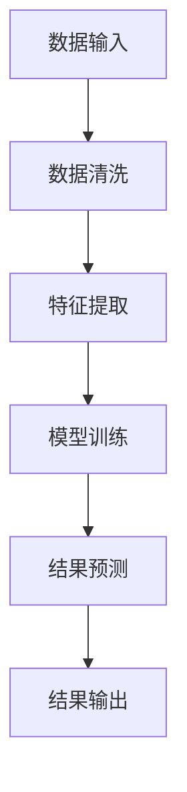
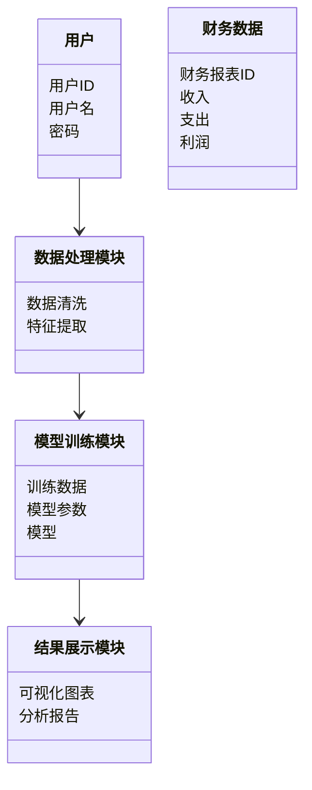
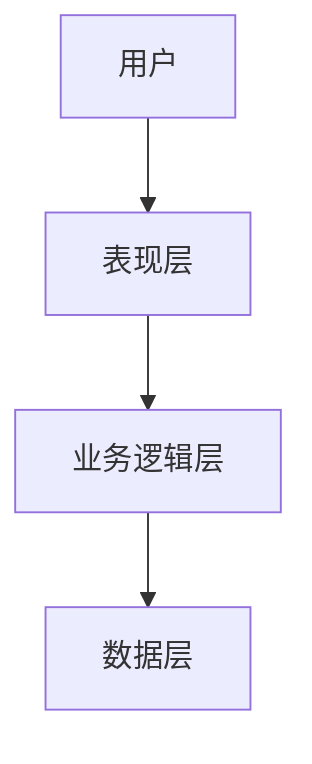
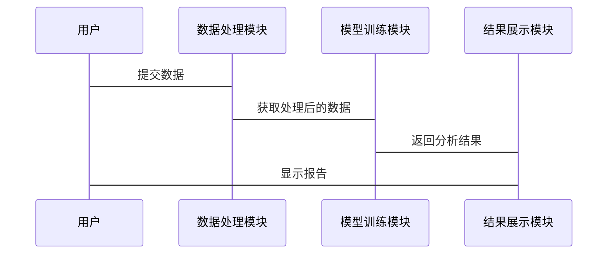

                 


# 智能财务报表比较分析系统

## 第三章: 智能财务报表比较分析的算法原理

### 3.1 算法原理概述

智能财务报表比较分析系统的核心在于利用数据挖掘和机器学习算法对财务数据进行自动化分析。本节将详细讲解算法的原理和实现步骤，包括数据预处理、特征提取、模型训练等关键环节。

#### 3.1.1 数据预处理与清洗

在分析财务数据之前，通常需要对数据进行预处理，以确保数据的完整性和准确性。这包括处理缺失值、异常值以及数据格式统一等步骤。

##### 示例代码：
```python
import pandas as pd
import numpy as np

# 加载数据
df = pd.read_csv('financial_data.csv')

# 处理缺失值
df.dropna(inplace=True)

# 处理异常值（例如，使用z-score方法）
z_scores = (df - df.mean()).abs() / df.std()
df = df[(z_scores < 3).all(axis=1)]
```

#### 3.1.2 特征提取与选择

从财务数据中提取有效的特征是提高模型性能的关键。常用的特征提取方法包括主成分分析（PCA）和特征重要性分析（如随机森林中的特征重要性）。

##### 示例代码：
```python
from sklearn.decomposition import PCA
from sklearn.ensemble import RandomForestClassifier

# 使用随机森林提取特征重要性
model = RandomForestClassifier()
model.fit(df_features, df_labels)
importances = model.feature_importances_

# 选择重要性较高的特征
selected_features = df_features.columns[importances > np.mean(importances)]
df_features_selected = df_features[selected_features]
```

#### 3.1.3 模型训练与优化

选择合适的机器学习算法（如支持向量机、神经网络等）进行模型训练，并通过交叉验证优化模型参数。

##### 示例代码：
```python
from sklearn.svm import SVC
from sklearn.model_selection import GridSearchCV

# 参数调优
param_grid = {'C': [1, 10, 100], 'gamma': [0.1, 0.01, 0.001]}
grid_search = GridSearchCV(SVC(), param_grid, cv=5)
grid_search.fit(df_features_selected, df_labels)
best_model = grid_search.best_estimator_
```

### 3.2 算法流程图

以下是一个简化的算法流程图，展示了从数据输入到结果输出的主要步骤：



### 3.3 数学模型与公式

在智能财务分析中，常用的数学模型包括线性回归、支持向量机等。以下是一个简单的线性回归模型：

$$ y = \beta_0 + \beta_1 x_1 + \beta_2 x_2 + ... + \beta_n x_n + \epsilon $$

其中，$y$ 是目标变量，$x_i$ 是自变量，$\beta_i$ 是回归系数，$\epsilon$ 是误差项。

### 第四章: 系统架构设计

#### 4.1 问题场景介绍

智能财务报表比较分析系统需要处理大量的财务数据，因此需要一个高效、稳定的架构设计。系统需要支持多用户同时访问，保证数据的安全性和完整性。

#### 4.2 系统功能设计

系统的功能模块包括数据采集、数据处理、模型训练、结果展示等。以下是系统的领域模型：



#### 4.3 系统架构设计

系统的整体架构采用分层设计，包括数据层、业务逻辑层和表现层。



#### 4.4 接口设计

系统需要提供API接口，供其他模块调用。以下是接口设计：



### 第五章: 项目实战

#### 5.1 环境安装

安装所需的库：

```bash
pip install pandas scikit-learn matplotlib
```

#### 5.2 核心代码实现

以下是系统的实现代码：

```python
import pandas as pd
from sklearn import preprocessing, svm
from sklearn.model_selection import train_test_split
from sklearn.metrics import accuracy_score
import matplotlib.pyplot as plt

# 加载数据
df = pd.read_csv('financial_data.csv')

# 数据预处理
X = df.drop('target', axis=1)
y = df['target']

# 标准化处理
X_scaled = preprocessing.StandardScaler().fit_transform(X)

# 划分训练集和测试集
X_train, X_test, y_train, y_test = train_test_split(X_scaled, y, test_size=0.2)

# 模型训练
model = svm.SVC()
model.fit(X_train, y_train)

# 预测与评估
y_pred = model.predict(X_test)
print("Accuracy:", accuracy_score(y_test, y_pred))

# 可视化结果
plt.figure(figsize=(10, 6))
plt.scatter(X_test[:, 0], X_test[:, 1], c=y_pred, cmap='viridis')
plt.title('Prediction Results')
plt.show()
```

#### 5.3 案例分析

以某公司财务数据为例，分析其收入、支出和利润的变化趋势，并预测未来的财务状况。

### 第六章: 优化与扩展

#### 6.1 系统优化

优化算法性能，例如使用并行计算加速模型训练。

#### 6.2 功能扩展

增加更多的分析维度，如时间序列分析、风险评估等。

#### 6.3 性能提升

通过缓存机制减少重复计算，提高系统的响应速度。

### 第七章: 总结与展望

智能财务报表比较分析系统通过智能化技术显著提高了财务分析的效率和准确性。未来，随着技术的进步，系统将更加智能化和自动化，为企业提供更强大的决策支持。

---

**关键词：** 智能财务报表、比较分析、数据挖掘、机器学习、系统架构

**摘要：** 本文介绍了一种基于智能技术的财务报表比较分析系统，详细阐述了系统的背景、核心概念、算法原理、系统架构、项目实战以及优化与扩展。通过数据挖掘和机器学习算法，该系统能够高效地进行财务数据分析，为企业提供有力的决策支持。

