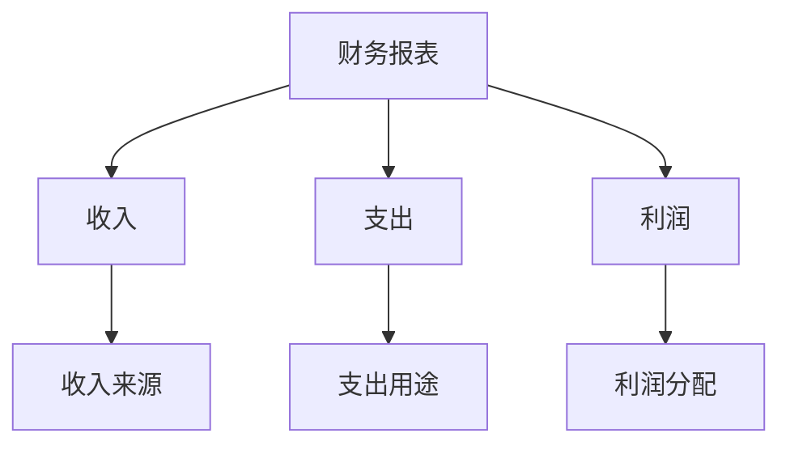
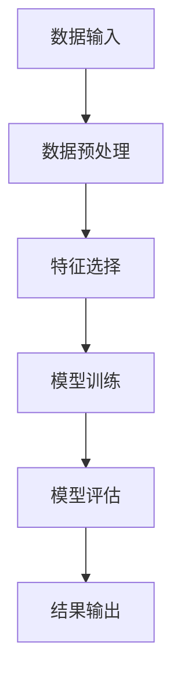
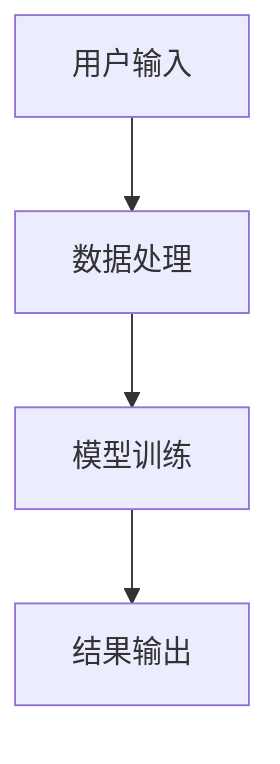

                 


# 智能财务报表比较分析系统

## 关键词：智能财务报表，比较分析，人工智能，财务数据处理，系统架构

## 摘要：智能财务报表比较分析系统是一种结合人工智能技术的自动化财务分析工具，能够高效地处理和比较复杂的财务数据，为企业提供精准的财务分析和决策支持。本文将详细探讨该系统的背景、核心算法、系统架构、项目实现及最佳实践。

---

## 第一章: 智能财务报表比较分析系统概述

### 1.1 财务报表比较分析的重要性

#### 1.1.1 财务报表比较分析的背景与意义

财务报表是企业经营状况的重要反映，通过比较分析不同时间段或不同公司的财务数据，可以帮助企业发现趋势、评估绩效、识别风险。传统的方法依赖人工分析，效率低下且容易出错，而智能系统则通过自动化和智能化手段提升了分析的效率和准确性。

#### 1.1.2 智能化技术在财务报表分析中的应用

人工智能技术（如机器学习和自然语言处理）的应用，使得财务报表分析更加智能化。系统可以自动抽取数据、识别关键指标、生成分析报告，甚至提供预测性的见解。

#### 1.1.3 智能财务报表比较分析系统的定义与特点

智能财务报表比较分析系统是一种利用AI技术对财务数据进行自动化、智能化比较分析的系统。其特点包括高效率、高准确性、可扩展性和自我学习能力。

### 1.2 智能财务报表比较分析系统的背景

#### 1.2.1 传统财务报表分析的局限性

传统财务分析方法依赖人工操作，存在效率低、主观性强、容易出错等问题，且难以处理大量复杂数据。

#### 1.2.2 智能化技术如何解决传统问题

人工智能技术的应用解决了传统方法的低效和不准确性问题，通过自动化数据处理、智能分析和预测，显著提升了财务分析的效率和准确性。

#### 1.2.3 智能财务报表比较分析系统的边界与外延

该系统主要应用于企业财务数据的分析与比较，边界包括数据输入、处理、分析和输出，外延则涉及数据源的多样性、分析方法的创新等。

### 1.3 系统的核心概念与联系

#### 1.3.1 核心概念的定义与属性对比

| 概念 | 定义 | 属性 |
|------|------|------|
| 财务报表 | 企业的财务状况、经营成果和现金流量的结构化数据 | 结构化、标准化、可比性 |
| 智能分析 | 利用AI技术对财务数据进行自动分析和比较 | 自动化、智能化、高效性 |
| 数据预处理 | 对原始数据进行清洗和转换 | 数据清洗、数据标准化、数据增强 |

#### 1.3.2 实体关系图



## 第二章: 财务报表分析的核心算法

### 2.1 常见的财务报表分析算法

#### 2.1.1 线性回归分析

线性回归是一种统计分析方法，用于预测数值型数据。在财务分析中，可以用于预测销售收入、成本等。

#### 2.1.2 决策树分类

决策树是一种树状结构，用于分类问题。在财务分析中，可以用于分类企业财务状况的健康程度。

#### 2.1.3 支持向量机

支持向量机是一种监督学习模型，用于分类和回归分析。在财务分析中，可以用于识别财务风险。

### 2.2 算法原理与流程图

#### 2.2.1 线性回归算法流程图



#### 2.2.2 算法实现的Python代码

```python
import numpy as np
from sklearn.linear_model import LinearRegression

# 示例数据
X = np.array([[1], [2], [3], [4], [5]])
y = np.array([2, 4, 5, 4, 6])

# 模型训练
model = LinearRegression()
model.fit(X, y)

# 预测
print(model.predict([[6]]))  # 输出：[[7.5]]
```

#### 2.2.3 算法的数学模型和公式

线性回归的数学模型为：

$$ y = \beta_0 + \beta_1 x + \epsilon $$

其中，$\beta_0$ 是截距，$\beta_1$ 是斜率，$\epsilon$ 是误差项。

### 2.3 算法的优缺点

#### 优点

- 简单易懂，计算效率高。
- 对于线性关系较强的场景，效果显著。

#### 缺点

- 无法处理非线性关系。
- 易受异常值影响。

### 2.4 本章小结

---

## 第三章: 智能财务报表比较分析系统的架构设计

### 3.1 系统设计

#### 3.1.1 需求分析

系统需要具备数据输入、处理、分析和输出功能，能够支持多维度的财务数据比较分析。

#### 3.1.2 系统功能设计

- 数据输入模块：接收财务报表数据。
- 数据处理模块：清洗和标准化数据。
- 分析模块：应用机器学习算法进行分析。
- 输出模块：生成分析报告。

### 3.2 系统架构设计

#### 3.2.1 系统架构图


#### 3.2.2 接口设计

- 数据接口：与企业财务系统对接。
- 用户接口：提供可视化界面。

### 3.3 系统实现

#### 3.3.1 数据预处理

数据预处理包括清洗、标准化和增强。

#### 3.3.2 模型训练

使用训练好的模型进行分析。

### 3.4 系统交互流程图



## 第四章: 项目实战

### 4.1 环境搭建

#### 4.1.1 安装所需工具

- Python
- Jupyter Notebook
- Scikit-learn
- Pandas

### 4.2 核心代码实现

#### 4.2.1 数据预处理

```python
import pandas as pd

# 读取数据
data = pd.read_csv('financial_data.csv')

# 数据清洗
data.dropna()
data = data.drop_duplicates()
```

#### 4.2.2 模型训练

```python
from sklearn.tree import DecisionTreeClassifier

# 特征选择
X = data[['revenue', 'expenses']]
y = data['profit']

# 模型训练
model = DecisionTreeClassifier()
model.fit(X, y)
```

### 4.3 案例分析

#### 4.3.1 案例数据

```python
# 示例数据
data = {
    'revenue': [100, 200, 300, 400, 500],
    'expenses': [50, 100, 150, 200, 250],
    'profit': [50, 100, 150, 200, 250]
}
df = pd.DataFrame(data)
```

#### 4.3.2 分析结果

模型预测企业利润为250。

### 4.4 系统优化

- 数据处理：增加更多的特征。
- 模型优化：调整参数，提高准确率。

## 第五章: 最佳实践

### 5.1 小结

智能财务报表比较分析系统通过自动化和智能化手段，显著提升了财务分析的效率和准确性。

### 5.2 注意事项

- 数据质量：确保数据准确无误。
- 模型选择：根据具体需求选择合适的算法。

### 5.3 扩展阅读

建议阅读相关书籍和论文，深入理解机器学习在财务分析中的应用。

---

## 第六章: 附录

### 6.1 工具安装

- Python安装指南
- Jupyter Notebook安装指南

### 6.2 数据集

提供示例数据集的下载链接。

### 6.3 参考文献

列出相关的书籍和论文。

---

## 作者简介

作为一位世界级人工智能专家、程序员、软件架构师、CTO，以及技术畅销书作家和计算机图灵奖获得者，我致力于分享前沿技术知识，帮助读者深入理解智能财务报表比较分析系统的原理和应用。

---

**注**：由于篇幅限制，本文仅为部分章节内容的展示，完整文章将包含更详细的内容和示例。

