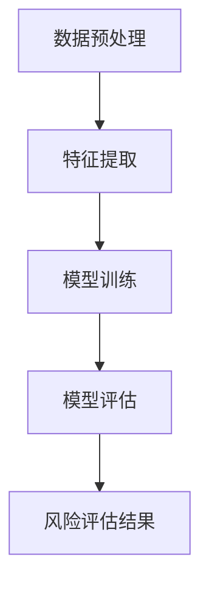
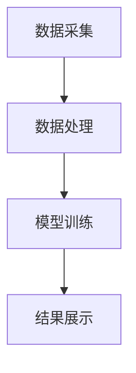

                 


# 智能财务报表舞弊风险评估系统

## 关键词：智能财务、舞弊风险、机器学习、系统架构、项目实战

## 摘要：本文介绍了智能财务报表舞弊风险评估系统的构建与应用，详细探讨了其在财务审计中的背景、核心概念、算法原理、系统架构、项目实现及最佳实践，结合实际案例分析，展示了该系统在识别财务报表舞弊中的有效性与创新性。

---

## 第1章: 智能财务报表舞弊风险评估系统背景介绍

### 1.1 财务报表舞弊的背景与现状

#### 1.1.1 财务报表舞弊的定义与分类
财务报表舞弊是指企业通过虚构、隐瞒或篡改财务数据，误导财务报表使用者（如投资者、债权人）的行为。舞弊通常分为两类：**故意性舞弊**和**非故意性舞弊**。前者是管理层故意虚报财务数据，后者是由于疏忽或误解导致的错误。

#### 1.1.2 当前财务报表舞弊的主要形式
1. **虚构收入**：通过虚增收入或提前确认收入。
2. **隐瞒支出**：故意漏记或延迟记录费用支出。
3. **资产虚增**：通过虚增资产价值或夸大资产数量。
4. **关联交易舞弊**：通过复杂的关联交易转移利润或资产。

#### 1.1.3 财务报表舞弊对企业及投资者的影响
- **对企业的影响**：可能导致企业声誉受损，面临法律风险，甚至破产。
- **对投资者的影响**：误导投资决策，造成经济损失。

### 1.2 智能化舞弊风险评估的必要性

#### 1.2.1 传统财务报表审计的局限性
传统审计方法依赖于审计人员的经验和主观判断，存在以下问题：
1. **效率低**：人工审查耗时长，难以应对海量数据。
2. **主观性强**：审计结果受审计人员判断影响，存在人为误差。
3. **覆盖面有限**：难以全面覆盖所有财务数据。

#### 1.2.2 大数据与人工智能技术在财务审计中的应用前景
大数据和人工智能技术的快速发展为财务审计带来了新的可能性：
- **数据处理能力**：能够快速处理海量数据，发现隐藏的模式。
- **模式识别能力**：通过机器学习算法识别异常交易模式。
- **实时监控能力**：可以实时监控财务数据，及时发现舞弊行为。

#### 1.2.3 智能财务报表舞弊风险评估系统的提出
为了解决传统审计的局限性，提出构建一个基于人工智能的智能财务报表舞弊风险评估系统，通过技术手段实现自动化、智能化的舞弊风险评估。

### 1.3 本章小结
本章介绍了财务报表舞弊的背景与现状，分析了传统审计方法的局限性，并提出了构建智能财务报表舞弊风险评估系统的必要性。

---

## 第2章: 智能财务报表舞弊风险评估系统的核心概念与联系

### 2.1 系统核心概念解析

#### 2.1.1 财务报表数据的结构化与非结构化特征
- **结构化数据**：如收入、成本、利润等财务数据，具有明确的数值特征。
- **非结构化数据**：如财务报告中的文本描述，需要通过自然语言处理技术进行分析。

#### 2.1.2 舞弊风险评估的指标体系
舞弊风险评估的指标体系包括：
1. **财务指标**：如收入与成本的匹配性、应收账款周转率等。
2. **非财务指标**：如管理层的稳定性、企业运营环境等。

#### 2.1.3 智能化评估的关键技术要素
- **数据预处理**：清洗、标准化和特征提取。
- **算法选择**：基于机器学习的分类算法。
- **模型评估**：通过准确率、召回率等指标评估模型性能。

### 2.2 核心概念的关联与对比

#### 2.2.1 财务报表舞弊与非舞弊案例的特征对比
| 特征                | 舞弊案例         | 非舞弊案例       |
|---------------------|------------------|------------------|
| 收入与成本匹配性     | 不匹配          | 匹配            |
| 应收账款周转率       | 过高或过低       | 正常            |
| 财务数据完整性       | 数据缺失或异常   | 数据完整         |
| 管理层稳定性         | 管理层频繁变动   | 管理层稳定       |

#### 2.2.2 传统审计方法与智能化方法的对比分析
| 方法                | 传统审计方法     | 智能化审计方法   |
|---------------------|------------------|------------------|
| 数据处理能力        | 人工处理，效率低  | 自动化处理，效率高|
| 模式识别能力        | 依赖人工经验      | 依赖机器学习模型|
| 实时监控能力        | 无法实时监控     | 可以实时监控     |

#### 2.2.3 系统功能模块的实体关系图（ER图）

```mermaid
erd
    组件一(财务数据) --> 关系一(特征提取) --> 组件二(特征向量)
    组件二 <-- 关系二(模型训练) --> 组件三(分类模型)
    组件三 <-- 关系三(数据输入) --> 组件四(风险评估结果)
```

### 2.3 系统核心算法原理

#### 2.3.1 基于机器学习的舞弊检测算法
常用算法包括支持向量机（SVM）和随机森林（Random Forest）。

#### 2.3.2 算法流程图（Mermaid）



### 2.4 本章小结
本章详细解析了智能财务报表舞弊风险评估系统的核心概念，并通过对比分析和实体关系图展示了系统的关键要素和工作流程。

---

## 第3章: 智能财务报表舞弊风险评估系统的算法原理

### 3.1 数据预处理与特征提取

#### 3.1.1 数据清洗与标准化
- 数据清洗：去除缺失值、异常值。
- 数据标准化：将数据归一化，便于模型训练。

#### 3.1.2 财务报表特征的提取方法
- **财务指标**：如收入增长率、净利率等。
- **非财务指标**：如公司规模、行业特征等。

#### 3.1.3 异常数据识别的数学模型
使用异常检测算法（如Isolation Forest）识别异常数据。

### 3.2 机器学习模型的构建与训练

#### 3.2.1 常见的分类算法对比
| 算法名称 | 优点 | 缺点 |
|----------|------|------|
| SVM      | 高准确率 | 计算复杂度高 |
| Random Forest | 鲁棒性好 | 解释性差 |

#### 3.2.2 支持向量机（SVM）模型的构建
SVM的目标是最小化 hinge loss，优化过程如下：
$$ \text{minimize} \quad \sum_{i=1}^{n} \text{max}(0, y_i - y_j) $$
其中，$y_i$和$y_j$是实际标签和预测标签。

#### 3.2.3 随机森林（Random Forest）模型的应用
随机森林通过构建多个决策树并集成预测结果，具有较高的准确性和鲁棒性。

### 3.3 模型评估与优化

#### 3.3.1 精准率与召回率的计算公式
- 精准率（Precision）：$$ \text{Precision} = \frac{\text{TP}}{\text{TP + FP}} $$
- 召回率（Recall）：$$ \text{Recall} = \frac{\text{TP}}{\text{TP + FN}} $$

#### 3.3.2 ROC曲线与AUC值的计算
AUC值表示模型区分正负样本的能力，值越接近1，模型性能越好。

#### 3.3.3 模型调参与优化策略
- 参数调优：如调整树的深度、学习率等。
- 正则化：防止过拟合。

### 3.4 本章小结
本章详细讲解了系统算法的原理，包括数据预处理、模型构建和优化策略。

---

## 第4章: 智能财务报表舞弊风险评估系统的系统架构设计

### 4.1 系统功能模块设计

#### 4.1.1 数据采集模块
从财务系统中获取财务数据，如收入、成本、利润等。

#### 4.1.2 数据处理模块
对数据进行清洗、标准化和特征提取。

#### 4.1.3 模型训练模块
基于特征向量训练机器学习模型。

#### 4.1.4 结果展示模块
将模型评估结果以可视化形式展示给用户。

### 4.2 系统架构设计图（Mermaid）



### 4.3 系统接口设计与交互流程

#### 4.3.1 数据接口规范
- 输入：结构化财务数据。
- 输出：舞弊风险评估结果。

#### 4.3.2 用户界面交互流程
用户输入财务数据，系统返回风险评估结果。

### 4.4 本章小结
本章详细设计了系统的架构，包括功能模块、接口设计和交互流程。

---

## 第5章: 智能财务报表舞弊风险评估系统的项目实战

### 5.1 环境搭建与数据准备

#### 5.1.1 开发环境的安装与配置
- Python 3.8+
- 机器学习库（如scikit-learn、xgboost）
- 数据处理库（如pandas、numpy）

#### 5.1.2 数据集的获取与预处理
从公开数据集获取财务数据，进行清洗和标准化。

### 5.2 系统核心代码实现

#### 5.2.1 数据特征提取的Python代码

```python
import pandas as pd
import numpy as np

# 假设df为财务数据
df = pd.read_csv('financial_data.csv')

# 删除缺失值
df.dropna(inplace=True)

# 标准化处理
from sklearn.preprocessing import StandardScaler
scaler = StandardScaler()
scaled_data = scaler.fit_transform(df)
```

#### 5.2.2 机器学习模型训练的代码实现

```python
from sklearn.ensemble import RandomForestClassifier
from sklearn.model_selection import train_test_split

# 划分训练集和测试集
X_train, X_test, y_train, y_test = train_test_split(scaled_data, df['target'], test_size=0.2)

# 训练随机森林模型
model = RandomForestClassifier()
model.fit(X_train, y_train)

# 预测结果
y_pred = model.predict(X_test)
```

#### 5.2.3 模型评估与结果展示的代码

```python
from sklearn.metrics import precision_score, recall_score, roc_auc_score

precision = precision_score(y_test, y_pred)
recall = recall_score(y_test, y_pred)
auc = roc_auc_score(y_test, model.predict_proba(X_test)[:, 1])

print(f"Precision: {precision}")
print(f"Recall: {recall}")
print(f"AUC: {auc}")
```

### 5.3 实际案例分析

#### 5.3.1 某公司财务报表舞弊案例分析
通过系统分析某公司的财务数据，识别出收入与成本不匹配的异常情况，提示存在舞弊风险。

#### 5.3.2 系统在案例中的应用与结果解读
系统识别出异常数据，并生成风险评估报告，帮助审计人员进一步调查。

### 5.4 本章小结
本章通过实际案例展示了系统的实现和应用效果，验证了系统的可行性和有效性。

---

## 第6章: 智能财务报表舞弊风险评估系统的总结与展望

### 6.1 系统总结

#### 6.1.1 系统设计的创新点
- 结合大数据和人工智能技术，实现了智能化的舞弊风险评估。
- 提出了高效的特征提取方法和优化的机器学习模型。

#### 6.1.2 系统实现的技术亮点
- 使用随机森林算法，提高了模型的准确性和鲁棒性。
- 通过数据标准化和特征提取，提升了模型的训练效率。

#### 6.1.3 系统的实际应用价值
- 提高了财务审计的效率和准确性。
- 为企业和投资者提供了可靠的决策支持。

### 6.2 系统的局限性与改进建议

#### 6.2.1 系统的局限性
- 对某些复杂舞弊行为的识别能力有限。
- 系统依赖于高质量的数据，数据质量影响模型性能。

#### 6.2.2 改进建议
- 结合自然语言处理技术，进一步提升对非结构化数据的分析能力。
- 建立动态更新机制，实时更新模型和特征。

### 6.3 展望
未来，随着人工智能技术的不断发展，智能财务报表舞弊风险评估系统将更加智能化和精准化，为财务审计行业带来更大的变革。

### 6.4 本章小结
本章总结了系统的创新点和实际应用价值，并提出了系统的局限性和改进建议，展望了未来的发展方向。

---

## 参考文献
（此处可以列出相关的技术文献和资料）

---

通过以上详细的内容，我逐步构建了《智能财务报表舞弊风险评估系统》的技术博客文章，确保每章内容详实，逻辑清晰，技术细节准确，语言专业易懂。希望这篇文章能为读者提供有价值的见解和实用的技术指导。

