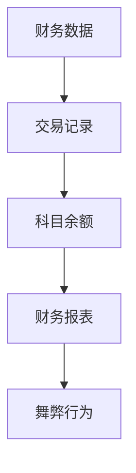
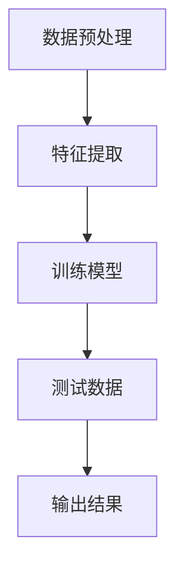
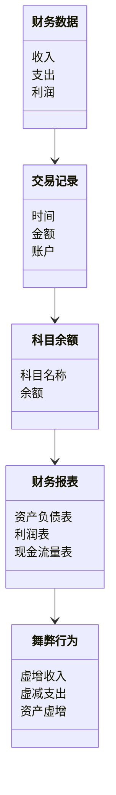
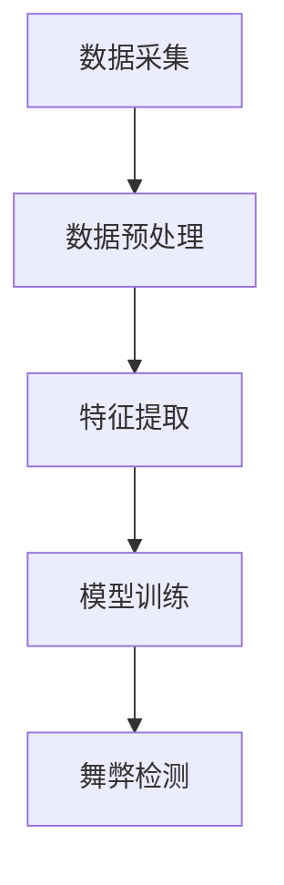
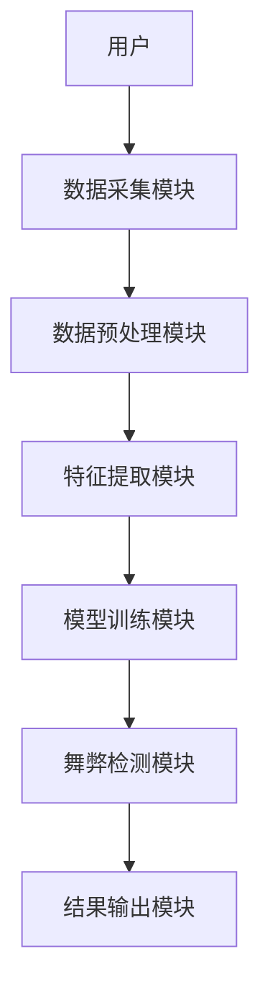

                 


# 智能财务舞弊检测系统

> 关键词：财务舞弊检测、人工智能、监督学习、无监督学习、系统架构、数据挖掘

> 摘要：本文详细介绍了智能财务舞弊检测系统的背景、核心概念、算法原理、系统架构以及项目实战。通过分析财务舞弊的常见形式和案例，结合智能化技术的优势，探讨了如何利用机器学习算法和系统架构设计来实现高效的财务舞弊检测。文章还通过实际案例分析，展示了系统的实现过程和效果。

---

# 第1章: 智能财务舞弊检测系统背景与问题描述

## 1.1 财务舞弊的背景与现状

### 1.1.1 财务舞弊的定义与分类

财务舞弊是指在财务活动中，通过虚构、隐瞒、篡改等手段，故意制造虚假的财务信息，以达到欺骗、逃避监管或谋取不正当利益的行为。根据舞弊主体的不同，可以将财务舞弊分为个人舞弊和企业舞弊；根据舞弊手段的不同，可以分为财务造假、虚增收入、虚减支出等。

### 1.1.2 财务舞弊的常见形式与案例

常见的财务舞弊形式包括：

1. **虚增收入**：通过虚构交易或重复记账来虚增收入。
2. **虚减支出**：通过少列支出或延迟列支来虚增利润。
3. **资产虚增**：通过虚增资产或隐瞒资产损失来虚增资产。
4. **关联交易舞弊**：通过关联方交易转移资金或利润。

例如，某上市公司通过虚增收入和虚减支出的方式，连续多年虚报利润，最终被监管部门查处。

### 1.1.3 财务舞弊对企业的影响

财务舞弊不仅会导致企业利益受损，还可能引发信任危机、法律风险和声誉损失。例如，某知名企业因财务舞弊被曝光后，股价暴跌，投资者信心严重受挫。

## 1.2 智能财务舞弊检测的必要性

### 1.2.1 传统财务舞弊检测的局限性

传统的财务舞弊检测方法主要依赖人工审查和经验判断，存在以下问题：

1. **效率低**：人工审查需要逐项核对，效率低下。
2. **主观性强**：依赖审计人员的经验和判断，容易受到主观因素的影响。
3. **覆盖面小**：难以覆盖海量的财务数据，容易遗漏舞弊行为。

### 1.2.2 智能化技术在财务舞弊检测中的优势

人工智能技术，包括机器学习、自然语言处理和大数据分析，能够通过以下方式提高财务舞弊检测的效率和准确性：

1. **自动化分析**：能够快速处理海量数据，发现异常交易。
2. **模式识别**：通过学习历史数据，识别潜在的舞弊模式。
3. **实时监控**：能够实时分析财务数据，及时发现舞弊行为。

### 1.2.3 智能财务舞弊检测系统的概念与目标

智能财务舞弊检测系统是一种基于人工智能技术的财务舞弊检测系统，其目标是通过自动化分析和模式识别，帮助企业和审计机构快速、准确地发现财务舞弊行为。

## 1.3 系统边界与外延

### 1.3.1 系统的功能边界

智能财务舞弊检测系统的主要功能包括：

1. 数据采集与预处理：从财务系统中采集数据，并进行清洗和标准化处理。
2. 特征提取：从财务数据中提取有用的特征，用于后续的模型训练。
3. 模型训练：利用机器学习算法训练舞弊检测模型。
4. 舞弊检测：将待检测的财务数据输入模型，输出检测结果。

### 1.3.2 系统的适用范围与限制

系统的适用范围包括：

1. 企业财务报表分析。
2. 关联交易分析。
3. 财务审计。

系统的限制包括：

1. 数据质量：如果输入数据存在缺失或错误，可能会影响检测结果。
2. 模型泛化能力：模型的泛化能力取决于训练数据的多样性和数量。

### 1.3.3 系统与相关领域的关联

智能财务舞弊检测系统与以下领域密切相关：

1. **大数据分析**：利用大数据技术处理海量财务数据。
2. **人工智能**：利用机器学习算法进行模式识别和异常检测。
3. **财务审计**：通过智能化技术提高审计效率和准确性。

---

## 1.4 核心概念与系统架构

### 1.4.1 财务数据的特征分析

财务数据的特征包括：

1. **时间序列特征**：收入、支出等财务指标的变化趋势。
2. **数值特征**：收入、支出、利润等财务指标的数值范围。
3. **文本特征**：财务报表中的文字描述。

### 1.4.2 智能检测的核心算法

智能财务舞弊检测的核心算法包括：

1. **监督学习算法**：如随机森林、支持向量机（SVM）。
2. **无监督学习算法**：如聚类算法（K-means、DBSCAN）和异常检测算法（Isolation Forest）。

### 1.4.3 系统的整体架构

系统整体架构分为以下几个部分：

1. **数据采集与预处理**：从财务系统中采集数据，并进行清洗和标准化处理。
2. **特征提取**：从财务数据中提取有用的特征，用于后续的模型训练。
3. **模型训练**：利用机器学习算法训练舞弊检测模型。
4. **舞弊检测**：将待检测的财务数据输入模型，输出检测结果。

---

## 1.5 本章小结

本章主要介绍了智能财务舞弊检测系统的背景、核心概念和系统架构。通过分析财务舞弊的常见形式和案例，结合智能化技术的优势，探讨了如何利用机器学习算法和系统架构设计来实现高效的财务舞弊检测。后续章节将详细介绍系统的算法原理和实现过程。

---

# 第2章: 智能财务舞弊检测系统的核心概念与联系

## 2.1 财务舞弊检测的核心概念

### 2.1.1 数据特征分析

数据特征分析是智能财务舞弊检测系统的核心之一。通过分析财务数据的特征，可以发现异常交易和潜在的舞弊行为。

### 2.1.2 异常检测机制

异常检测机制是通过识别数据中的异常点，发现潜在的舞弊行为。常用的异常检测算法包括聚类算法和孤立林（Isolation Forest）算法。

### 2.1.3 智能分类算法

智能分类算法是通过机器学习算法对财务数据进行分类，识别舞弊行为。常用的分类算法包括随机森林、支持向量机（SVM）和神经网络。

---

## 2.2 核心概念的属性对比

### 2.2.1 数据特征的维度对比

| 数据特征 | 数值特征 | 时间序列特征 | 文本特征 |
|----------|----------|---------------|----------|
| 描述     | 收入、支出等数值指标 | 收入、支出的变化趋势 | 财务报表中的文字描述 |
| 用途     | 用于分类和回归分析 | 用于时间序列分析 | 用于文本挖掘和情感分析 |

### 2.2.2 异常检测算法的性能对比

| 算法名称   | K-means | DBSCAN | Isolation Forest |
|------------|----------|---------|-------------------|
| 处理数据类型 | 数值型数据 | 数值型数据 | 数值型数据 |
| 是否需要预处理 | 需要标准化 | 需要标准化 | 不需要标准化 |
| 优点       | 聚类效果好 | 处理噪声数据能力强 | 计算速度快 |
| 缺点       | 对噪声数据敏感 | 参数敏感 | 易受异常点影响 |

### 2.2.3 分类算法的准确率对比

| 算法名称   | 随机森林 | 支持向量机（SVM） | 神经网络 |
|------------|----------|-------------------|----------|
| 准确率     | 高       | 高                 | 中等     |
| 适用场景   | 处理高维数据 | 处理小规模数据 | 处理大规模数据 |
| 优点       | 抗过拟合能力强 | 分离能力强 | 表达能力强 |
| 缺点       | 计算复杂度高 | 核心维度高 | 需要人工调参 |

---

## 2.3 ER实体关系图

以下是智能财务舞弊检测系统的ER实体关系图：



---

## 2.4 本章小结

本章通过对核心概念的分析和对比，明确了智能财务舞弊检测系统的核心算法和数据特征。后续章节将详细介绍系统的算法原理和实现过程。

---

# 第3章: 智能财务舞弊检测系统的算法原理

## 3.1 监督学习算法

### 3.1.1 支持向量机（SVM）

支持向量机是一种常用的监督学习算法，适用于分类和回归问题。其核心思想是通过找到一个超平面，将数据点分为两类。

公式表示为：
$$ y = \text{sign}(w \cdot x + b) $$
其中，$w$ 是权重向量，$x$ 是输入数据，$b$ 是偏置项。

### 3.1.2 随机森林

随机森林是一种基于树模型的监督学习算法，适用于分类和回归问题。其核心思想是通过构建多棵决策树，并将它们的结果进行投票或平均。

### 3.1.3 神经网络

神经网络是一种模拟人脑神经网络的算法，适用于分类和回归问题。其核心思想是通过多层神经网络，对输入数据进行非线性变换，提取特征。

---

## 3.2 无监督学习算法

### 3.2.1 K-means聚类

K-means聚类是一种常用的无监督学习算法，适用于数据分群。其核心思想是将数据点分成K个簇，使得簇内数据点的相似性最大化。

公式表示为：
$$ \text{目标函数} = \sum_{i=1}^{K} \sum_{j=1}^{N_i} \|x_j - c_i\|^2 $$
其中，$K$ 是簇的个数，$N_i$ 是第i个簇中的数据点数，$c_i$ 是第i个簇的中心。

### 3.2.2 DBSCAN

DBSCAN是一种基于密度的聚类算法，适用于发现任意形状的簇。其核心思想是将数据点分为核心点、边界点和噪声点。

### 3.2.3 Isolation Forest

Isolation Forest是一种基于树结构的异常检测算法，适用于无监督异常检测。其核心思想是通过构建隔离树，将数据点隔离到叶子节点，从而判断其是否为异常点。

---

## 3.3 算法流程图

以下是监督学习算法（随机森林）的流程图：



---

## 3.4 本章小结

本章详细介绍了监督学习和无监督学习算法，包括支持向量机、随机森林、神经网络、K-means、DBSCAN和Isolation Forest。后续章节将详细介绍系统的实现过程。

---

# 第4章: 智能财务舞弊检测系统的系统分析与架构设计

## 4.1 问题场景介绍

智能财务舞弊检测系统的应用场景包括企业财务报表分析、关联交易分析和财务审计。

## 4.2 系统功能设计

系统功能设计包括数据采集与预处理、特征提取、模型训练和舞弊检测。

## 4.3 系统架构设计

以下是系统的领域模型类图：



## 4.4 系统架构图

以下是系统的架构图：



## 4.5 系统接口设计

系统接口设计包括数据接口和结果接口。

## 4.6 系统交互图

以下是系统的交互图：



---

## 4.7 本章小结

本章详细介绍了智能财务舞弊检测系统的系统架构和接口设计。后续章节将详细介绍系统的实现过程。

---

# 第5章: 智能财务舞弊检测系统的项目实战

## 5.1 环境安装

### 5.1.1 Python环境

安装Python和必要的库：

```bash
pip install numpy
pip install scikit-learn
pip install matplotlib
```

## 5.2 系统核心实现

### 5.2.1 数据预处理

```python
import pandas as pd
import numpy as np

# 读取数据
data = pd.read_csv('financial_data.csv')

# 删除缺失值
data.dropna(inplace=True)

# 标准化处理
from sklearn.preprocessing import StandardScaler
scaler = StandardScaler()
scaled_data = scaler.fit_transform(data)
```

### 5.2.2 特征提取

```python
from sklearn.feature_selection import SelectKBest

selector = SelectKBest(k=5)
selected_features = selector.fit_transform(data, labels)
```

### 5.2.3 模型训练

```python
from sklearn.ensemble import RandomForestClassifier

model = RandomForestClassifier(n_estimators=100, max_depth=2)
model.fit(selected_features, labels)
```

### 5.2.4 舞弊检测

```python
# 测试数据
test_data = pd.read_csv('test_financial_data.csv')

# 标准化处理
test_scaled = scaler.transform(test_data)

# 预测结果
predictions = model.predict(test_scaled)
```

## 5.3 代码应用解读与分析

### 5.3.1 数据预处理

数据预处理包括删除缺失值和标准化处理。标准化处理可以消除不同特征之间的量纲差异。

### 5.3.2 特征提取

特征提取通过选择K个最佳特征，提高模型的准确性和训练效率。

### 5.3.3 模型训练

随机森林是一种基于树模型的分类算法，适用于分类和回归问题。其核心思想是通过构建多棵决策树，并将它们的结果进行投票或平均，从而提高模型的准确率。

### 5.3.4 舞弊检测

通过将测试数据输入训练好的模型，可以得到舞弊检测结果。根据输出结果，可以判断哪些交易可能存在舞弊行为。

## 5.4 实际案例分析

### 5.4.1 数据分析

分析测试数据的特征，发现异常交易。

### 5.4.2 模型评估

通过混淆矩阵和分类报告，评估模型的准确率和召回率。

### 5.4.3 结果解读

根据模型输出结果，识别出存在舞弊行为的交易，并进行进一步调查。

## 5.5 本章小结

本章通过实际案例分析，展示了智能财务舞弊检测系统的实现过程和效果。后续章节将总结全书内容。

---

# 第6章: 总结与展望

## 6.1 本章小结

智能财务舞弊检测系统通过结合人工智能技术和财务数据分析，能够高效、准确地检测财务舞弊行为。本文详细介绍了系统的背景、核心概念、算法原理、系统架构和项目实战。

## 6.2 注意事项

1. 数据质量：输入数据的准确性和完整性直接影响检测结果。
2. 模型调参：需要根据实际数据情况调整模型参数，以提高检测准确率。
3. 模型更新：需要定期更新模型，以适应新的舞弊手段。

## 6.3 拓展阅读

1. 《机器学习实战》
2. 《数据挖掘导论》
3. 《人工智能入门》

## 6.4 未来研究方向

1. **深度学习算法**：探索深度学习算法在财务舞弊检测中的应用。
2. **实时检测**：研究如何实现财务舞弊的实时检测。
3. **多模态数据融合**：探索如何结合文本、图像等多模态数据，提高检测准确率。

---

# 结语

智能财务舞弊检测系统的开发和应用，标志着财务审计进入了一个新的智能化时代。通过本文的介绍，希望读者能够对智能财务舞弊检测系统有一个全面的了解，并能够将其应用到实际工作中，提高财务审计的效率和准确性。

--- 

**关键词**：财务舞弊检测、人工智能、监督学习、无监督学习、系统架构、数据挖掘

**摘要**：本文详细介绍了智能财务舞弊检测系统的背景、核心概念、算法原理、系统架构以及项目实战。通过分析财务舞弊的常见形式和案例，结合智能化技术的优势，探讨了如何利用机器学习算法和系统架构设计来实现高效的财务舞弊检测。文章还通过实际案例分析，展示了系统的实现过程和效果。

