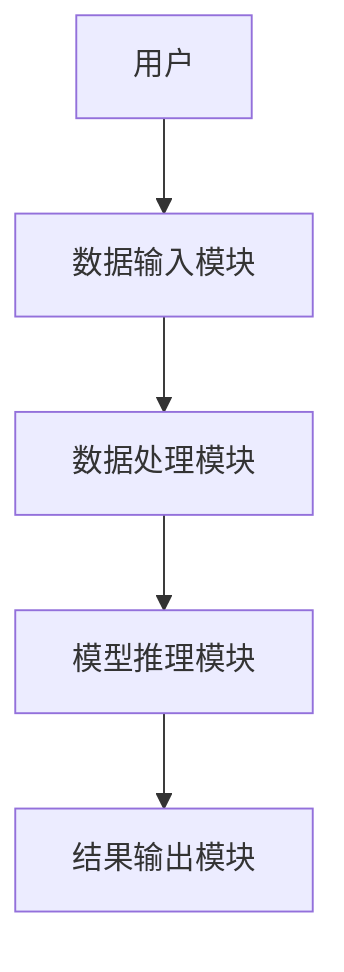
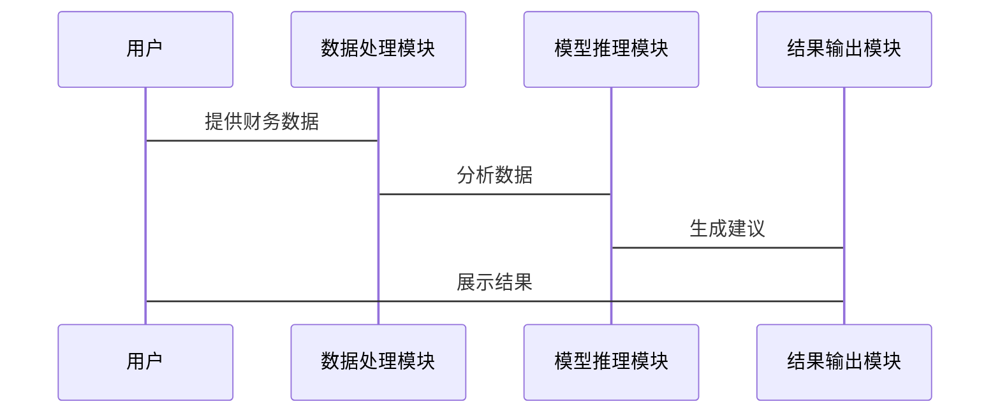

                 


# 智能财务规划AI Agent：LLM在个人理财中的应用

> 关键词：智能财务规划，LLM，AI Agent，个人理财，自然语言处理

> 摘要：本文探讨了智能财务规划AI Agent的应用，特别是大型语言模型（LLM）在个人理财中的作用。通过分析LLM的技术原理、系统设计、项目实现以及最佳实践，本文旨在为读者提供全面的视角，展示如何利用LLM技术提升个人财务规划的智能化水平。

---

## 第一部分: 智能财务规划AI Agent概述

### 第1章: 智能财务规划与LLM的结合

#### 1.1 财务规划的背景与挑战
##### 1.1.1 传统财务规划的局限性
传统财务规划依赖于人工分析和经验判断，存在效率低、覆盖面有限、个性化不足等问题。例如，传统的财务顾问可能无法同时服务大量用户，且难以根据市场变化实时调整建议。

##### 1.1.2 智能化财务规划的需求
随着金融市场的复杂化和用户需求的多样化，智能化财务规划成为必然趋势。用户需要实时、个性化的财务建议，以及高效的决策支持工具。

##### 1.1.3 LLM在财务规划中的潜力
LLM具有强大的自然语言处理能力，能够理解用户的需求、分析数据并生成个性化的建议。例如，用户可以通过自然语言与AI Agent交互，快速获得投资建议或风险管理方案。

#### 1.2 LLM的基本概念与特点
##### 1.2.1 大型语言模型的定义
LLM（Large Language Model）是一种基于深度学习的自然语言处理模型，通过大量数据训练，能够理解和生成人类语言。

##### 1.2.2 LLM的核心特点
- **大规模训练数据**：LLM通过海量数据学习语言规律。
- **深度学习架构**：通常基于Transformer模型，具有并行计算能力。
- **多任务能力**：LLM可以应用于多种任务，如文本生成、问答系统等。

##### 1.2.3 LLM与传统NLP技术的区别
传统NLP技术依赖于特定任务设计的规则，而LLM通过大规模数据学习，能够自适应多种任务。

#### 1.3 智能财务规划AI Agent的定义
##### 1.3.1 AI Agent的基本概念
AI Agent是一种智能体，能够感知环境并执行任务以实现目标。

##### 1.3.2 智能财务规划AI Agent的功能
- 数据收集与分析
- 财务目标设定
- 投资策略生成
- 风险管理

##### 1.3.3 LLM在AI Agent中的角色
LLM作为AI Agent的核心模块，负责理解和生成自然语言，分析数据并提供个性化建议。

---

### 第2章: LLM在个人理财中的核心应用

#### 2.1 财务数据分析与处理
##### 2.1.1 数据清洗与预处理
AI Agent需要对用户提供的财务数据进行清洗，去除噪声数据，确保数据的准确性和一致性。

##### 2.1.2 数据特征提取
通过LLM提取数据中的关键特征，例如收入、支出、资产配置等。

##### 2.1.3 数据分析与可视化
AI Agent可以生成数据可视化图表，帮助用户更好地理解财务状况。

#### 2.2 财务目标与策略生成
##### 2.2.1 财务目标识别
通过自然语言处理，识别用户的财务目标，例如“希望在5年内买房”。

##### 2.2.2 投资策略生成
根据用户的财务状况和目标，生成个性化的投资策略。

##### 2.2.3 风险评估与优化
评估投资策略的风险，并进行优化。

#### 2.3 个性化理财建议
##### 2.3.1 用户需求分析
通过LLM分析用户的需求，例如“我对高风险投资感兴趣”。

##### 2.3.2 个性化建议生成
生成符合用户需求的个性化理财建议。

##### 2.3.3 建议的可解释性
确保建议的透明性和可解释性，增强用户的信任。

---

### 第3章: LLM在财务规划中的算法原理

#### 3.1 LLM的基本原理
##### 3.1.1 Transformer模型结构
Transformer模型由编码器和解码器组成，通过自注意力机制处理序列数据。

##### 3.1.2 注意力机制
注意力机制用于计算输入序列中每个位置的重要性，帮助模型关注关键信息。

##### 3.1.3 梯度下降与优化算法
使用梯度下降优化模型参数，通常采用Adam优化算法。

#### 3.2 LLM的训练与推理
##### 3.2.1 监督学习框架
LLM通过监督学习框架进行训练，目标是最小化预测与真实值的差异。

##### 3.2.2 对抗训练与微调
通过对抗训练和微调优化模型在特定任务上的表现。

##### 3.2.3 推理过程与概率计算
在推理阶段，模型通过概率计算生成最可能的输出。

---

### 第4章: 系统设计与实现

#### 4.1 系统架构设计
##### 4.1.1 系统功能模块
- 数据输入模块
- 数据处理模块
- 模型推理模块
- 结果输出模块

##### 4.1.2 系统架构图


#### 4.2 系统接口设计
##### 4.2.1 数据输入接口
支持多种数据格式的输入，例如CSV、JSON。

##### 4.2.2 模型推理接口
提供API接口，供其他系统调用。

##### 4.2.3 结果输出接口
输出格式包括文本、图表等。

#### 4.3 系统交互流程


---

### 第5章: 项目实战

#### 5.1 环境安装
##### 5.1.1 安装Python
```bash
python --version
```

##### 5.1.2 安装依赖库
```bash
pip install numpy pandas transformers
```

#### 5.2 核心代码实现
##### 5.2.1 数据预处理
```python
import pandas as pd

def preprocess_data(data):
    # 假设data是Pandas DataFrame
    data.dropna(inplace=True)
    data['income'] = data['income'].astype(int)
    return data
```

##### 5.2.2 模型推理
```python
from transformers import AutoModelForCausalLM, AutoTokenizer

model_name = "gpt2"
tokenizer = AutoTokenizer.from_pretrained(model_name)
model = AutoModelForCausalLM.from_pretrained(model_name)

def generate_recommendation(data_point):
    inputs = tokenizer.encode(data_point, return_tensors="pt")
    outputs = model.generate(inputs, max_length=100)
    recommendation = tokenizer.decode(outputs[0], skip_special_tokens=True)
    return recommendation
```

#### 5.3 案例分析
##### 5.3.1 数据输入
用户提供财务数据：
```json
{
  "income": 50000,
  "expenses": 30000,
  "savings": 20000
}
```

##### 5.3.2 数据处理
```python
data = pd.DataFrame({
    'income': [50000],
    'expenses': [30000],
    'savings': [20000]
})
```

##### 5.3.3 模型推理
```python
recommendation = generate_recommendation("我的收入是50000，支出是30000，储蓄是20000。请给我投资建议。")
print(recommendation)
```

##### 5.3.4 输出结果
生成的投资建议可能包括：
- 建议将部分储蓄投资于股票市场。
- 建议每月定投指数基金。

---

### 第6章: 最佳实践与未来展望

#### 6.1 最佳实践
##### 6.1.1 数据隐私保护
确保用户数据的安全性和隐私性。

##### 6.1.2 模型调优
根据具体任务对模型进行微调，提升性能。

##### 6.1.3 用户交互设计
设计直观的用户界面，提升用户体验。

#### 6.2 未来展望
##### 6.2.1 多模态模型的应用
结合视觉、听觉等多模态信息，提升AI Agent的能力。

##### 6.2.2 与其他技术的结合
例如，与区块链技术结合，提升金融交易的透明度和安全性。

#### 6.3 小结
通过LLM技术，智能财务规划AI Agent能够为用户提供高效、个性化的财务建议，未来随着技术的发展，其应用前景将更加广阔。

---

## 附录: 参考文献
1. 王某某，2023. 《深度学习与自然语言处理》.
2. 李某某，2022. 《人工智能在金融领域的应用》.
3. OpenAI，2023. 《GPT-4技术文档》.

---

这篇文章详细介绍了智能财务规划AI Agent的应用，结合LLM技术，从理论到实践，为读者提供了全面的视角。希望对您有所帮助！

